<!-- _class: lead -->

# アーキテクチャ入門

アプリケーションをよりよい構造で実現するための選択を行えるようになる
体系的な知識を用いて、アプリケーションの設計を行うためのアプローチを知る

---

## この講座の目的

- アーキテクチャとは何かを理解する
  - アーキテクチャの定義
- モデリングを通してアーキテクチャを考えられるようになる
- アーキテクチャスタイル・パターンに関して理解を深める

---

## アーキテクチャとは何か？

- 業界全体として画一的な定義はない

> アーキテクチャとは（それが何であれ）重要なものだ。
> Ralph Johnson(xp の権威、design pattern の共同著者)

- とはいえ、よく引用される定義は知っておくといい

- [IEEE 1471](https://ja.wikipedia.org/wiki/IEEE_1471)による定義

> システムの構成要素、それら相互や環境との関係性、及び x その設計と発展をガイドする原則を包含するシステムの基本的組織化

- 書籍「ソフトウェアアーキテクチャの基礎」による定義

  - 以下の組み合わせで考えられるもの
    - アーキテクチャ特性: ( -ility) 機能に直接関連しないが必要となる特性
    - 構造(structure): 使用する要素と要素間の関係、アーキテクチャスタイル
    - 設計指針: 望ましいアプローチとガイドの提供
    - アーキテクチャ決定: システムを構築する際のルール

- 狭義的な定義としては、システムの構造（要素と関係性）
- 広義的には、システムの全体最適に関わるすべてのもの

---

## なぜアーキテクチャが重要なのか？

- 複数の要求と制約を調整した全体としての最適解、そのための指針として
- 指針なく、それぞれの機能を有機的に繋いでいくことはできず、運用コストが増す、機能しない、パフォーマンス劣化等の体験の悪化につながる
- 最近では CI/CD や IaC の普及により、インフラについてもコード化でき、アプリケーション/インフラ共にアーキテクチャを扱うことができるようになってきている
  - アプリケーション・インフラの境界なくアーキテクチャ全体で最適化できていないと競争力が失われる
- すべてはトレードオフ
  - 銀の弾丸はない
  - リスクリワード、コストパフォーマンス、機能性と信頼性、最適化と犠牲、自動化と手動運用、学習曲線など

## どこまでがアーキテクチャでどこまでが設計なのか？

どこまでがアーキテクトが担当する範囲で、どこまでが設計開発者が担当する範囲か？

- 境界を作ると失敗する。境界はない。
- コーディングに影響する設計がアーキテクチャに影響を与え、またアーキテクチャがコーディングに影響を与える
- どこまでいっても仮説検証プロセスを繰り返すことが重要。互いにフィードバックを受け、改善を繰り返す

## 技術の幅と深さ

- わかっていること(understand)
- わからないとわかっていること(know but not understand)
- わからないとわかっていないこと(don't know)

技術の深さがあるということは、わかっていることが多いということ
技術の幅があるということは、わからないが知っていることが多いということ

アーキテクチャに求められるのは、技術の幅

## どのように策定していくのか？

- モデリングを行い、モデルを通してアーキテクチャを策定する

### モデルとは？

- 現実の複雑な事象を単純化して表現するためのもの

  - モデルを作成することで、複雑な事象を理解しやすくする
  - すべてを表現するものはモデルとは言えない（必要な情報を抽出して検討できなければ意味がない）

- view と viewpoint

  - view: モデルの一部を表現するもの
  - viewpoint: view を作成するための視点

以下のようなモデルを作成し、開発者や関係者と共有し、ウォークスルーを行い思考錯誤することで、アーキテクチャを策定していく

- ユースケース図

  - ユーザーとシステム間のやり取りを表現する
  - 下記はシンプルな EC サイトのユースケース図の例

    

- システムコンテキスト

  - システムとその周辺環境を表現する

  

- コンポーネントモデル（コンポーネントビュー）

  - システムを構成するコンポーネントとその関係性を表現する
  - コンポーネント間の依存関係が表現される
  - 論理的な機能の分割と、それらの関係性が表現される

  

- オペレーショナルモデル（オペレーショナルビュー）

  - コンポーネントの物理的な配置や通信経路を表現する
  - システムの構成、通信経路が表現される

  

- クラス図

  - クラスとクラス間の関係を表現する
  - 静的な関係性が表現される

  

- シーケンス図

  - オブジェクト間のメッセージのやり取りを表現する
  - 動的な関係性が表現される

  

## アーキテクチャ特性

- ドメインに依らない、設計に関する考慮事項を明らかにするもの
- 設計の構造的な側面に影響を与えるもの
- アプリケーションの成功に不可欠か重要なもの

> “アプリケーションは、大量のアーキテクチャ特性をサポートすることもできる。しかし、そうすべきではない。アーキテクチャ特性をサポートすればするほど、設計が複雑になるからだ。したがって、アーキテクトの重要な仕事は、可能な限り多くのアーキテクチャ特性をサポートすることではなく、一握りのアーキテクチャ特性を選びとることにある。”
> 抜粋: ソフトウェアアーキテクチャの基礎

### アーキテクチャの運用特性

- 可用性(Availability): システムがどの程度利用可能な状態を維持できるか
- 継続性(Continuity): 障害復旧能力
- 回復性(Recoverability): 障害時にどれだけ早く正常な状態に戻せるか
<!-- 停電やハードウェア障害が発生しても動作可能か -->
- 信頼性(Reliability): 障害後に正常な処理を行うことができるようにするか
<!-- 停電やハードウェア障害が発生しても動作可能か、その後復旧できるか -->
- 堅牢性(Robustness): エラーに対する耐性
<!-- 停電やハードウェア障害が発生しても、その後正常に運用できるか -->
- 堅牢性(Robustness): エラーに対する耐性
<!-- 停電やハードウェア障害が発生しても、その後正常に運用できるか -->
- パフォーマンス(Performance): システムがどの程度の性能を発揮できるか

### アーキテクチャの構造特性

- 拡張性(Extensibility): システムに新しい機能を追加することがどの程度容易か
- 再利用性(Reusability): システムの機能を他のシステムで再利用することがどの程度容易か
- 保守性(Maintainability): システムをどの程度容易に保守できるか
- 移植性(Portability): システムを他の環境に移植することがどの程度容易か
- 構成容易性(Configurability): システムを構成する要素がどの程度容易に組み合わせられるか
- ローカライゼーション(Localizability): システムを他の言語や地域に対応させることがどの程度容易か

### アーキテクチャの横断的特性

- セキュリティ(Security): システムがどの程度セキュアか
- ユーザビリティ(Usability): システムがどの程度使いやすいか
- 認証(Authentication): システムがどの程度認証を行うか
- 合法性(Legality): システムがどの程度法的に適合しているか
- プライバシー(Privacy): システムがどの程度プライバシーを保護しているか
- アクセシビリティ(Accessibility): システムがどの程度アクセスしやすいか
- サポート容易性(Supportability): システムがどの程度サポートしやすいか

### アーキテクチャ特性を明らかにする

- 要件からアーキテクチャ特性を抽出する
- 最初から明らかにされていることもあるが、要件から必要なアーキテクチャ特性を抽出する必要がある
- どのアーキテクチャ特性を重視するかは、そのシステムの目的や要件、制約による

---

### アーキテクチャスタイル

- アーキテクチャスタイルとは

  - アーキテクチャの構造を表現するためのパターン
  - デザインパターンと同じように、頻出の構造を表現するために名付けられている
  - まざまなアーキテクチャ特性をカバーする、コンポーネント同士の名付けられた関係を説明する

- コンポーネント: システムを構成する要素、デプロイの最小単位
  - コンポーネントが分割されている = アーキテクチャ特性も独立できる = 独自のリリースサイクルとスケーリング等が可能になる

### モノリシックアーキテクチャと分散アーキテクチャ

完璧な分類法はないものの、アーキテクチャスタイルは大きく**モノリシック**（すべてのコードが単一のデプロイメントユニットで構成されている）と**分散型**（リモートアクセスプロトコルを介して接続された複数のデプロイメントユニットで構成されている）の 2 種類に分類できる。

- モノリシックアーキテクチャ

  - レイヤードアーキテクチャ
  - パイプラインアーキテクチャ
  - マイクロカーネルアーキテクチャ

- 分散アーキテクチャのパターン

  - サービスベースアーキテクチャ(ハイブリッド)
  - イベント駆動アーキテクチャ
  - サービス指向アーキテクチャ
  - マイクロサービスアーキテクチャ

- 分散アーキテクチャの方がアーキテクチャ特性を独立して扱うことができるため柔軟になるが、大いなる誤信がある。アーキテクチャ特性を同一に扱ってもよい場合、モノリシックアーキテクチャを選択するとよい。

- 分散アーキテクチャの誤信
  - ネットワークは信頼できない
    - 切断されることがある
    - ローカル呼び出しに比べ圧倒的に遅い
    - 帯域制限がある
    - 安全ではない（悪質なクライアントアクセスが発生しうる）
    - 転送コストがかかる
    - トポロジーは変化する
  - 分散ロギング
    - トレースの難易度が上がる
  - 分散トランザクション
    - トランザクションの整合性は保証されない(ACID トランザクションが保証されない)
      - Atomicity: 原子性　トランザクションは完全に成功するか、完全に失敗するか
      - Consistency: 一貫性　トランザクションはデータベースの制約を維持する
      - Isolation: トランザクションは他のトランザクションに影響を与えない
      - Durability: トランザクションが完了すると、その結果は永続的である
    - データの整合性は**結果整合性**による担保となる
      - 複数の操作を行った結果、一時的に整合性が保たれない状態が発生することがあるが、結果的に整合性が保たれることを担保する
      - 保証イベント等により、不整合となった状態を調整する
        - たとえば、注文と在庫の整合性が取れない場合、在庫がない場合は注文をキャンセルする等
  - コントラクトのメンテナンスとバージョン管理
    - コントラクト: クライアントとサービスの双方が合意した動作やデータの形式、インターフェースのこと。
    - サービスやシステムがことなるチーム・部門が所有すると調整の難易度が高くなる
    - バージョン管理・廃止の問題が発生する

---

## 設計指針

- 設計指針とは

  - アーキテクチャを策定する際のガイドライン
  - 設計の方針、アプローチ、原則
  - 設計の方向性を示すもの

- 設計指針の例

  - レイヤードアーキテクチャの適用の指針
    - 各レイヤーの責務の明確化、実装例の提供

### 効果的なチームにするために、アーキテクトが行うこと

- チームの生産性を高められることが、卓越したアーキテクトに求められる能力の一つ

- アーキテクトは、システム上の様々な制約を提供する

  - 制約について、正しいレベルの知識・ガイダンスとサポートを提供する

- 制約がきつすぎる: コントロールフリーク アーキテクト

  - 開発プロセスのあらゆる面において、コントロールを取ろうとする
  - 結果的に、開発者からプログラミングスキルを奪うことに繋がる
  - 束縛的な環境に対し、開発者の離脱を招く

- 制約が緩すぎる: ハンズオフ アーキテクト
  - 決定がほぼなされていない。
  - 実質的なアーキテクトの作業は、開発者に任せられている
  - アーキテクトのフリをするのは簡単ということでもある

### ちょうどいい制約とガイドラインの提供

- チームに適切な制約と境界を作り出す
- 適切な制約と境界は、チームの自己組織化の度合いによって異なる(**エラスティック・リーダーシップ**)

- 主に 5 つの要因に応じて、どの程度アーキテクトがコントロールすべきかを決定する

- チームの親しさ: メンバー同士がどの程度お互いをよく知っているか
  - 親しさが高いほど、自己組織化されていく
- チームサイズ: より大きければ大きいほど、コントロールが必要。
  - 4 以下: 小さい、5-9: 中規模、10 以上: 大きい
- 全体的な経験
  - シニアメンバーの割合、ビジネスドメインに対する成熟度
- プロジェクトの複雑さ
  - ドメイン/技術
- プロジェクトの期間
  - 長いほどコントロールが難しい（ただし、あまりに短い場合も同様）

### チームの警告サイン

- プロセスロス

  - チームメンバーの潜在能力の合計に対して、実際の生産性との差
  - 主にコミュニケーションコスト（人月の神話）によるもの
  - CI/CD での自動化、IaC での自動化、コードレビュー、ペアプログラミング等の開発プロセスの改善
  - リポジトリのマージコンフリクトが頻繁に発生する場合、開発領域の適切な作業分担やコードの分割により低減

- 多元的無知

  - 内心では否定していることに対して、自分が何かを見落としているのだろうと考え、全員が同意してしまう現象
  - 人数が多くなるほど、この現象が発生しやすくなる

- 責任の分散
  - 小さな対応や、誰かが助けを求めている状況下でにおいて「だれかが対応するだろう」という考えにより放置される状況

## ADR (Architecture Decision Record: アーキテクチャ上の決定)

- アーキテクチャ上の重要な決定を文書化する

  - アーキテクチャ上の重要な決定とは - 以下に影響を与えるもの
    - 構造
    - 非機能特性
    - 依存関係
    - インターフェース
    - 構築手法

- なぜ文書化するのか？
  - 指針としての利用
  - 前提・関連情報の記録
  - 妥当性をステークホルダーに効果的に伝える
  - アーキテクチャ決定に関するアンチパターンを防ぐ

> [!TIP]
> アンチパターン: 初めは良いアイデアであるが、実際には問題を引き起こすような設計パターン。ネガティブな結果を生む、繰り返されるプロセス

#### アーキテクチャ決定のアンチパターン

アーキテクチャ決定に関わらずドキュメント運用に通ずる。

1. 資産防御アンチパターン

- 選択を間違えることを恐れ、決定を避ける、または遅らせてしまうパターン
  - 重要な決定を避けることで、新しい問題は生じないが、既存の問題が解決されない。結果としてさまざまな複合的な問題が発生し、より解決が難しくなる
- 対策: 重要な決定は避けられないが、最終責任時点まで遅らせるようにする
  - 正当であるかどうかを開発者と密に連携し、妥当性の検証を進める
  - より情報が得られた段階で問題やリスクの対応を行い、決定内容に反映する

2. グラウンドホッグデーアンチパターン

- ある決定が下された理由がわからずに、同じ議論を繰り返してしまうパターン
  - 根拠の明示がないため発生する
- 対策: 根拠を示す
  - 技術的、ビジネス的な理由の両側面を示すことが大切
    - 例えばモノリシック → 分散アーキテクチャに分解するタスクの場合、リファクタにかかる開発コスト、運用コスト、市場への価値提供の観点からの理由を示す

3. メール駆動アーキテクチャアンチパターン

- アーキテクチャ決定が忘れ去られたり、知らない人が出てくるアンチパターン
  - メールや口頭でのやり取りのみで決定が行われ、文書化されないことで発生
- 対策: ADR を作成する
  - 決定の背景、理由、影響を文書化することで、決定の根拠を共有し、後から参照できるようにする

### ADR の構成

以下のような構成で文書化する。バージョン管理ツールにより、文書 ID（文書名に連番を加えるような形で構わない）の発行と変更履歴を管理することができると望ましい。
markdown のような簡素な形式で記述することが一般的。

- タイトル
- ステータス
  - 提案済み/承認済み/破棄済み
    - 提案済みの決定は、承認されるまで変更され続ける
- コンテキスト（背景情報）
- 決定内容
- 影響
- コンプライアンス
  - 決定内容が遵守されているかを確認するための条件
- 備考（レファレンスや担当者等）

## アーキテクチャスタイルの詳細

### レイヤードアーキテクチャ

最も一般的なアーキテクチャスタイルの 1 つ。

シンプルさ・親しみやす・コストの低さから、ほとんどのアプリケーションのデファクトスタンダードとなっている。

システムを設計する組織にとって、ユーザーインターフェイス（UI）チーム、バックエンドチーム、データベース管理チーム（DBA）などがいるような、伝統的な組織構造とレイヤードアーキテクチャの各層にうまくフィットしており、多くのビジネスアプリケーションにとって自然な選択となる

### トポロジー

- レイヤードアーキテクチャの各レイヤーには、アーキテクチャにおける特定の役割と責務がある。
  - プレゼンテーション層: ユーザーインターフェイスとバックエンドとの通信ロジック
  - ビジネス層: リクエストに関連した特定のビジネスルールの実行
  - 永続化層: データベースとの通信、オブジェクトと RDB のインピーダンスミスマッチの解決
- アーキテクチャの各レイヤーは、特定のビジネス要求を満たすために必要な作業を抽象化している。たとえば、プレゼンテーション層は、顧客データをどのように取得するかを知っている必要はない。特定の形式で画面に表示するだけでいい。同様に、ビジネス層は顧客データをどのような形式で画面に表示するか、あるいは顧客データがどこから来たかを気にする必要はない。ビジネス層は、永続化層からデータを取得し、そのデータに対してビジネスロジック（値の計算やデータの集約など）を実行し、その情報をプレゼンテーション層に渡すだけでいい（**関心の分離**）
- 物理的なトポロジー（デプロイメント）の分割にはバリエーションが存在する。

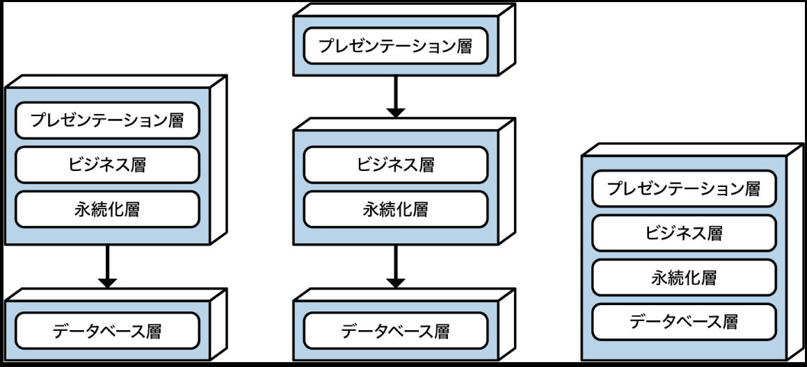

### 層の分離

層の分離: レイヤー間のコントラクトが変更されないように、あるレイヤーの変更を他のレイヤーのコンポーネントに影響させないという考え方

> プレゼンテーション層が永続化層に直接アクセスできてしまうと、永続化層への変更は、ビジネス層とプレゼンテーション層の両方に影響を与え、コンポーネント間の層が相互依存性を持つ非常に緊密に結合されたアプリケーションを生成する。
> この種のアーキテクチャは、変更が困難で高コストなだけでなく、非常に脆い。

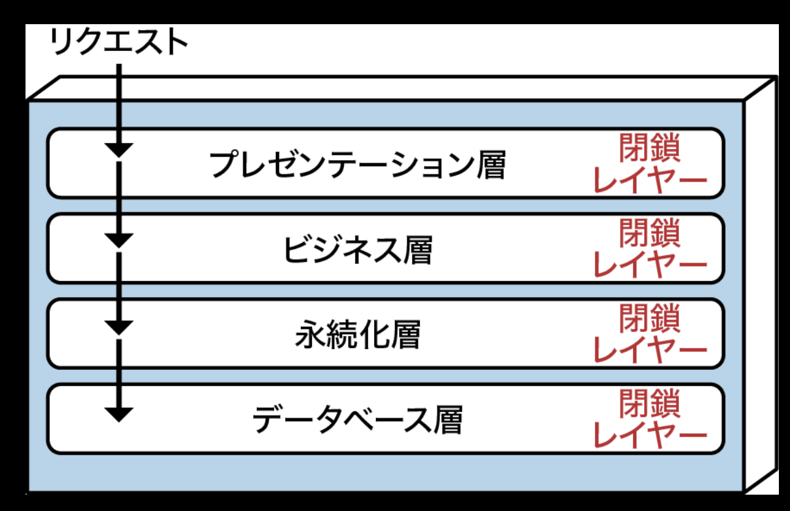

### 層の追加

開放レイヤーと閉鎖レイヤーの概念を活用することは、アーキテクチャレイヤーとリクエストフローの関係を定義するのに役立つ。また、開発者に、アーキテクチャ内のさまざまなレイヤーのアクセス制限を理解するために必要な情報とガイダンスも提供する。アーキテクチャ内のどのレイヤーが開放レイヤーで、どのレイヤーが閉鎖レイヤーか（そしてその理由）を文書化したり、適切に伝えたりすることに失敗すると、テスト、保守、デプロイが非常に困難な、緊密に結合された脆弱なアーキテクチャになってしまう。

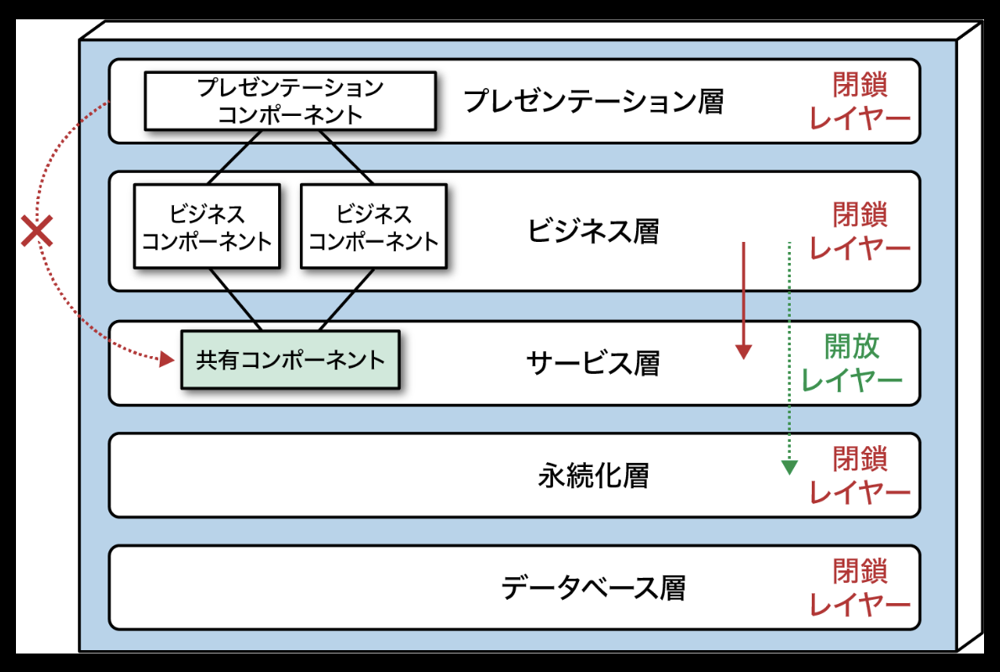

### その他の考慮事項

- どのアーキテクチャスタイルを使用するかの確証がまだ得られていない場合には、レイヤードアーキテクチャがほとんどのアプリケーションにとっての最適な出発点となる。これは、多くのマイクロサービスの取り組みにおいて、マイクロサービスが正しい選択であるかどうかをアーキテクトが判断している中で開発を開始しなければならない場合に、よく取られるアプローチでもある。しかし、このアプローチを採用する際は、再利用を最小限に抑え、オブジェクト階層（継承ツリーの深さ）をかなり浅くして、適度なモジュール性を維持するようにしよう。そうしておくことで、後で別のアーキテクチャスタイルへと移行するのが容易になる。

## パイプラインアーキテクチャ

bash/zsh などのシェルスクリプト、または CI/CD ツールのようなパイプラインによって慣れ親しまれているアーキテクチャスタイル
関数型プログラミングの考え方にも類似性があり、データの流れを定義することで、アプリケーションの構造を表現する

### トポロジー

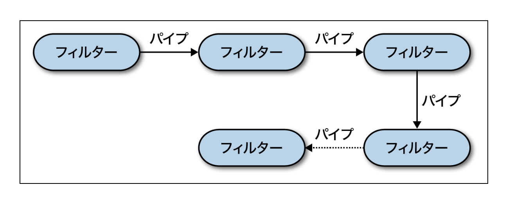

#### パイプ

- パイプはフィルター間の通信チャンネルを形成する。
- パフォーマンス上の理由から、パイプは一般に（ブロードキャストではなく）一方向かつポイントツーポイントとなり、あるソースからの入力を他のソースに出力する
- パイプを通るペイロードはどんなデータ形式であっても構わないが、高パフォーマンスを実現するために、よりデータ量の少ない形式が好まれる

#### フィルター

- フィルターは自己完結型で、他のフィルターからは独立しており、一般にステートレスな要素
- 複合タスクは複数のフィルターの組み合わせで形成される
- 次の 4 種類のフィルターがある
  - プロデューサー
    - 開始点となる。出力のみを行う。ソースとも呼ばれる
  - トランスフォーマー
    - 入力を受け付け、オプションでデータの一部、またはすべてを変換する
    - 関数型言語的には、map 関数に相当
  - テスター
    - 入力を受け、1 つ以上の基準について検査し、オプションで検査に基づく出力を生成する
    - 関数型言語的には、filter 関数に相当
  - コンシューマー
    - パイプラインの終点となる。永続化データを出力したり、データを表示したりする

**パイプとフィルターそれぞれの一方向性とシンプルさは、構成の再利用を促す**

## 事例

- EDI ツール
- ETL ツール
- デプロイメントパイプライン
- ノーコード/ローコード開発ツール

- パイプラインアーキテクチャは、アプリケーションロジックをフィルター（プロデューサー、テスター、トランスフォーマー、コンシューマー）に分割しているため、技術によって分割されたアーキテクチャといえる

- パイプラインアーキテクチャは通常モノリシックデプロイメントとして実装されているため、アーキテクチャ量子は 1 つとなる。
- モジュール性と組み合わさったシンプルさと全体的なコストが、パイプラインアーキテクチャの主な強み
- アーキテクチャ上のモジュール性は、さまざまな種類のフィルターとアダプターの間で関心事を分離することで達成される。これらのフィルターは、他のフィルターに影響を与えることなく、変更や置き換えが可能

## マイクロカーネルアーキテクチャ

コアシステムとプラグインの 2 つのコンポーネントで構成される比較的シンプルなモノリシックアーキテクチャ
プラグインは、コアシステムの機能を拡張するために追加される。実装は主にコアシステムとプラグインの間のインターフェースを通じて行われる(DI など)

基本

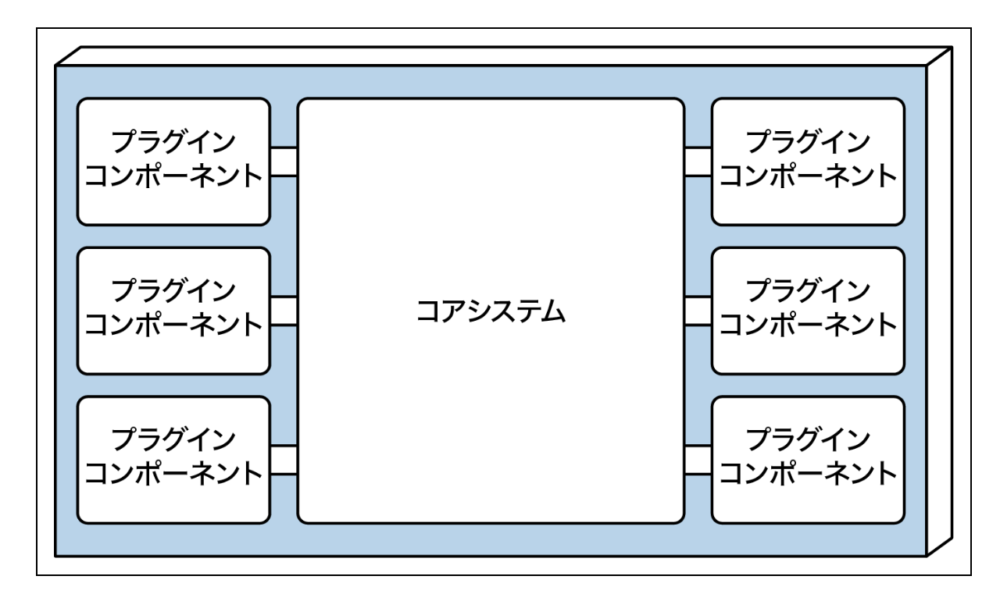

### トポロジー

様々なバリエーションが存在

フロントエンドの分離

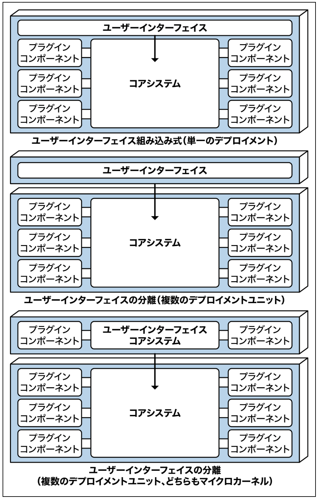

データストアの分離

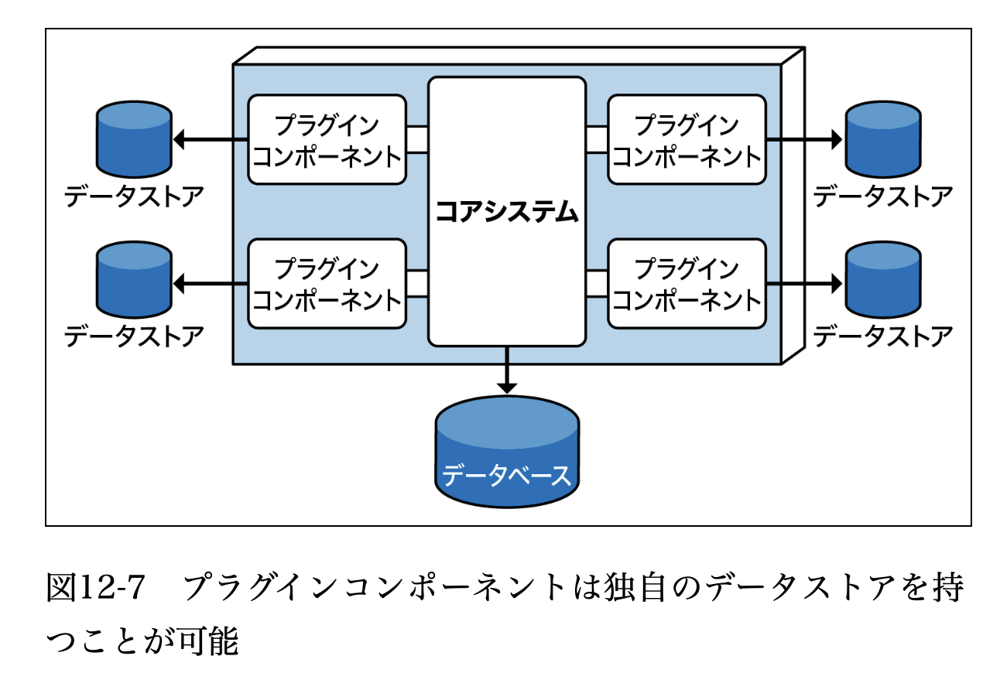

## 事例

- Jira
- Eclipse
- Vivual Studio Code
- ブラウザ(プラグイン)
- Redmine

## サービスベースアーキテクチャ

- モノリスとマイクロサービスのハイブリッド
- 柔軟性の高さから、最も実用的なアーキテクチャスタイルの 1 つと考えられている
- サービスベースアーキテクチャは分散アーキテクチャだが、マイクロサービスやイベント駆動アーキテクチャなどの分散アーキテクチャのような複雑さやコストはない

### トポロジー

#### 基本

- 個別にデプロイされた荒い粒度の（ドメイン）サービスを持つ
  - サービスごとにインスタンス数は単一でも複数でもよい。耐障害性(Durability)やスケーラビリティなどを考慮してサービスごとに設計できる
  - 一般的に、サービスは荒い粒度のドメインサービスとなることが多く、レイヤードアーキテクチャで構成されることが多い

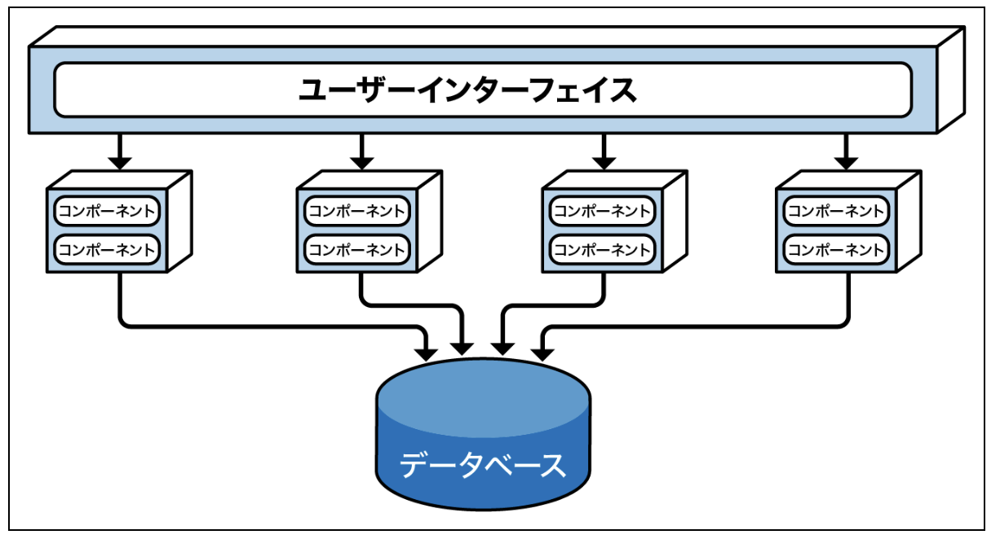

#### サービスとユーザーインターフェースの分離

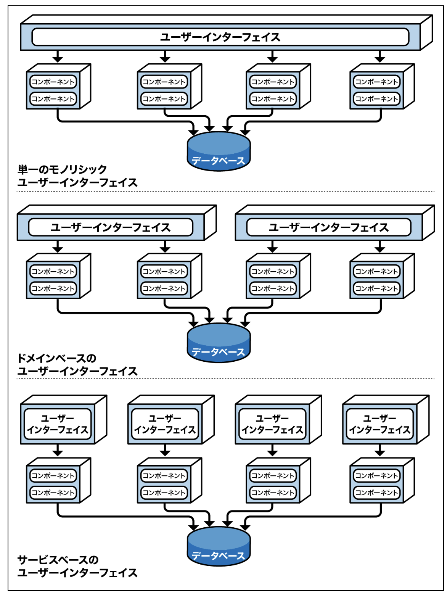

- 単一のユーザーインターフェースが複数のサービスを呼び出すことができる
- 単一のユーザーインターフェースが単一のサービスを呼び出す構成でも良い

#### データベースの分離

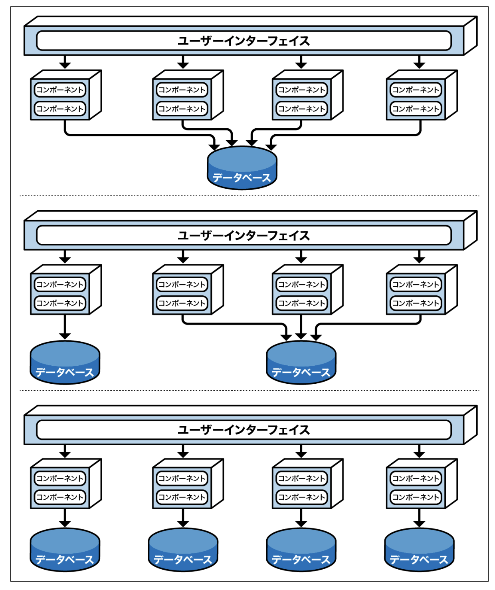

- 一般的に単一のデータベースを共有している

  - モノリシック同様に ACID トランザクションを保証でき、SQL での結合が可能
  - 一方で、データベースのスキーマ変更が全体に影響を与えるため、変更の難易度が高い傾向にある
  - ドメインサービスごとに異なるデータベースを持つことも可能。データベースでの結合を減らし、変更容易性を高めることができる
    - その反面、サービス間の ACID トランザクションが保証されない。データ整合性の担保が不要となるような分割における制約を設けるか、結果整合性を担保する必要による複雑性を考慮する必要がある

- ユーザーインターフェースとサービスの間にリバースプロキシやゲートウェイからなる API 層の追加可能

  - 共通の横断的な関心を持つ機能提供が可能（メトリクス、ロギング(監査要件)、認証・認可、API バージョン、I/F 管理、ドキュメント管理など）
  - ユーザーインターフェースから切り離されているため、ユーザーインターフェースの変更がサービスに影響を与えない
    

- #### データベース分離の戦略

- サービスベースアーキテクチャでは、複数のサービスが単一のデータベースを共有するため ACID トランザクションを保証可能な一方、テーブルスキーマ
  の変更は全サービスに対して影響を与え、変更と調整はコストのかかる作業となる
- データベースのスキーマを表現する共有ライブラリ(エンティティ・リポジトリ)を使用することでコードベースでの影響を吸収することが可能
  - すべてのサービスに対して、ライブラリ更新後のデプロイが必要
  - データの整合性は保証されないためマイグレーションやデータの整合性を担保する調整が必要
  - 単一の共有ライブラリを使用する場合、管理は容易だが、変更の影響範囲は全体に及ぶ

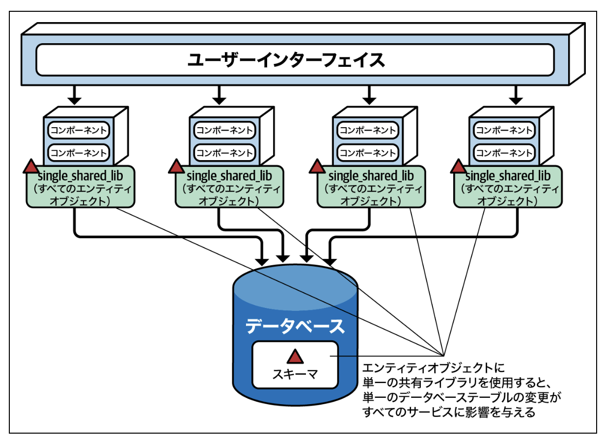

- この影響範囲を限定するため、特定の論理ドメインごとのライブラリを作成することも可能
- 変更容易性、モジュール性、信頼性などを高めるため
  - データベースの変更をより適切に制御するため、明確なデータドメインを維持しながら、データベース内の論理的な分割を可能な限り細かく維持すること
  - 適切な論理分割（

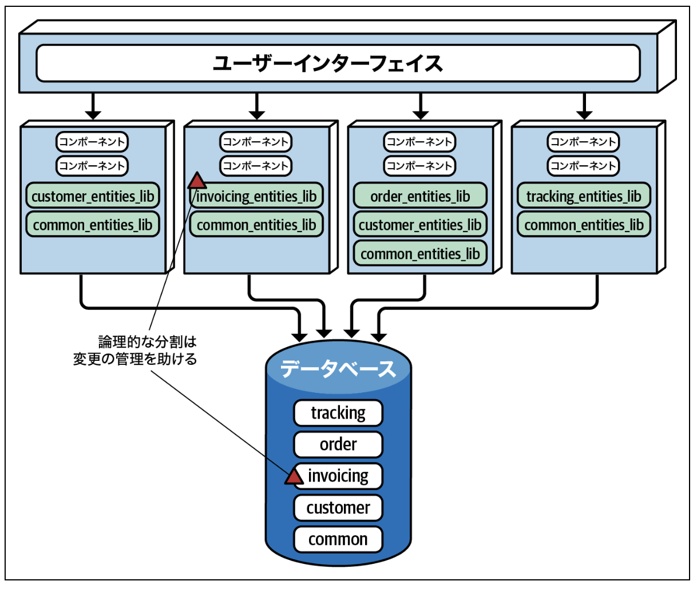

### 構成例

### まとめ

- サービスベースアーキテクチャは、ドメインによって分割されたアーキテクチャである
- ドメインサービスの粒度が比較的荒いことによって、データベースを共有し、ACID トランザクションを保証できる(ほとんどの場合、トランザクションは特定のドメインに範囲付けされる)。これによって分散アーキテクチャの複雑さを回避しつつ、モノリシックアーキテクチャの柔軟性を維持できる
- サービスの粒度が細かくなると、結果整合性による担保（オーケストレーションまたはコレオグラフィ）が必要となる

# イベント駆動アーキテクチャ

- 高度にスケーラブルで高パフォーマンスなアプリケーションを 実現するために用いられる分散非同期型のアーキテクチャスタイル
- 適応性に優れており、小規模なアプリケーションにも大規模で複雑なアプリケーションにも用 いることが可能
- 非同期的にイベントを受信して処理する、分 離されたイベント処理コンポーネントで構成
- 単体でも他のアーキテクチャスタイル(イベント駆動マイクロ サービスアーキテクチャなど)に組み込む形でも使用できる

### リクエストベースモデルとイベントベースモデル

- リクエストベースモデル

  - ある種のアクションを実行するためのシステムへのリクエストがリクエストオーケストレーターへと送られる
    - リクエストオーケストレーターは一般的にはユーザーインターフェイスとなるが、API 層やエンタープライズ
      サービスバスとして実装することもできる
  - リクエストオーケストレーターの役割は、リクエスト
    をさまざまなリクエストプロセッサーに一義的かつ同期的に導くこと
  - データベースの情報を取得・更新して、リクエストを処理する

  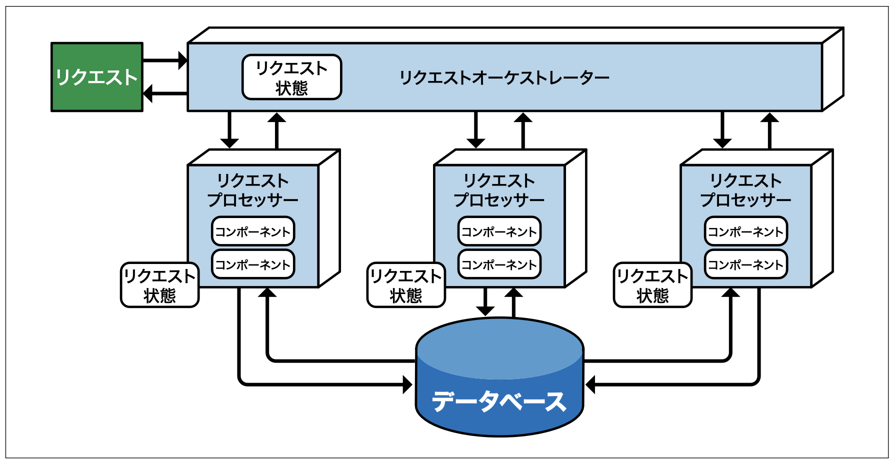

- イベントベースモデル
  - 特定の状況に反応し、そのイベントに基づいてアクションを実施する
    - イベントベースモデルの例としては、オンラインオークションでの特定商品への入札が挙げられる。入札はシステムに対するリクエストではなく、現在の希望価格が発表された後に発生
      するイベントだ。システムは、同じタイミングで受け取った他の入札と比較して現在の最高入札者
      を決定するために、このイベントに対応しなければならない。

### トポロジー

- 二つの主要なトポロジー
  - **ブローカー**
    
    - 中央のイベントメディエーターが存在しない
      - 軽量メッセージブローカーを介して、チェーン状のブロードキャスト方式でイベント処理を分散させる
      - 比較的単純なイベント処理を持ち、中央のイベントオーケストレーション・調整を必要としない場合に便利である
    - ４つの主要なコンポーネント
      - 開始イベント
        - イベントフロー全体を開始する最初のイベント
        - イベントブローカのイベントチャネルに送られる
        - メディエーターがないため、単一のイベントプロセッサーがイベントブローカーから開始イベントを受け取ることになる
      - イベントブローカー
        - イベントをイベントプロセッサーへ配信する
        - 一般的にフェデレーション（複数のドメインベースのクラスタ化されたインスタンス）されている
        - 一般的に fire and forget のブロードキャスティング → pub/sub 型のメッセージングモデルが採用される
      - イベントプロセッサー
        - イベントに関連する特定タスクを実行
        - 必要に応じて、処理イベントを作成
      - 処理イベント
        - イベントプロセッサーによって作成された処理
        - 誰も待ち受けていないイベントであっても、処理イベントは発行する方がいいとされる
    - 例: 書籍の購入
      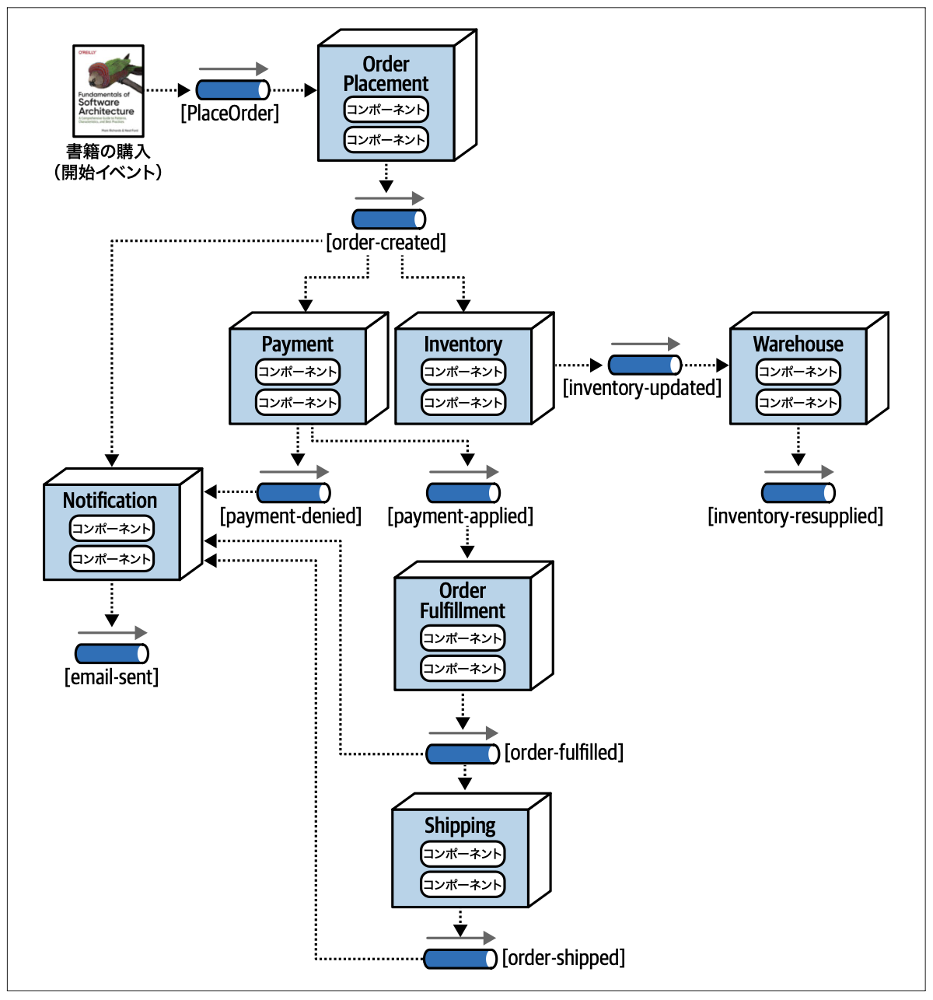
    - パフォーマンス・応答性・スケーラビリティに優れているが、開始イベントに関連したワークフロー全体を管理できない。
      - 取引全体の終了を知る術がない
      - 障害を認識できない。エラーハンドリングができず、トランザクションが必要な処理では不整合を許容してしまう（例:在庫がなくても在庫を減らす処理だけを実行してしまう)
  - **メディエーター**
    - メディエーター=仲介者
    - ブローカートポロジーの欠点を補う
    - イベントメディエーターは、複数のイベントプロセッサーの調整を必要とするイベントを開始するためのワークフローを制御
    - ブローカートポロジーとは異なり、メディエータートポロジー内のイベントプロセッサーは、自分が何をしたかをシステムの残りの部分には伝えない。
      - 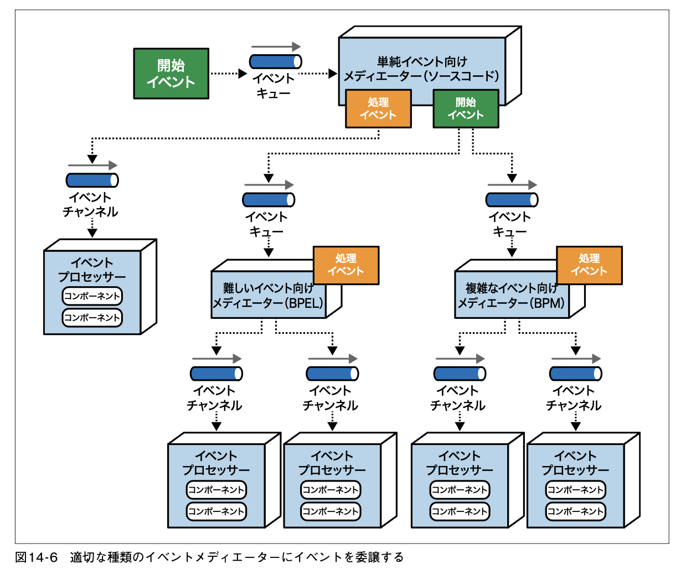
        - BPEL: Business Process Execution Language (BPEL) などのワークフローエンジンを使用して、イベントのフローを制御する
        - BPM: ビジネスプロセス管理（BPM）ツールを使用して、イベントのフローを制御する
    - 例: 書籍の購入
      - 注文イベントを発行、注文イベントは完了をメディエーターに通知
      - メディエーターは次の step に進み、同時並行可能な通知・決済・在庫引当イベントを発行
        - 各イベントはそれぞれのプロセッサーによって処理され、メディエーターに完了を通知
        - メディエータはどれかでエラーが発生した際、例外処理を行うことが可能
      - 以下略
        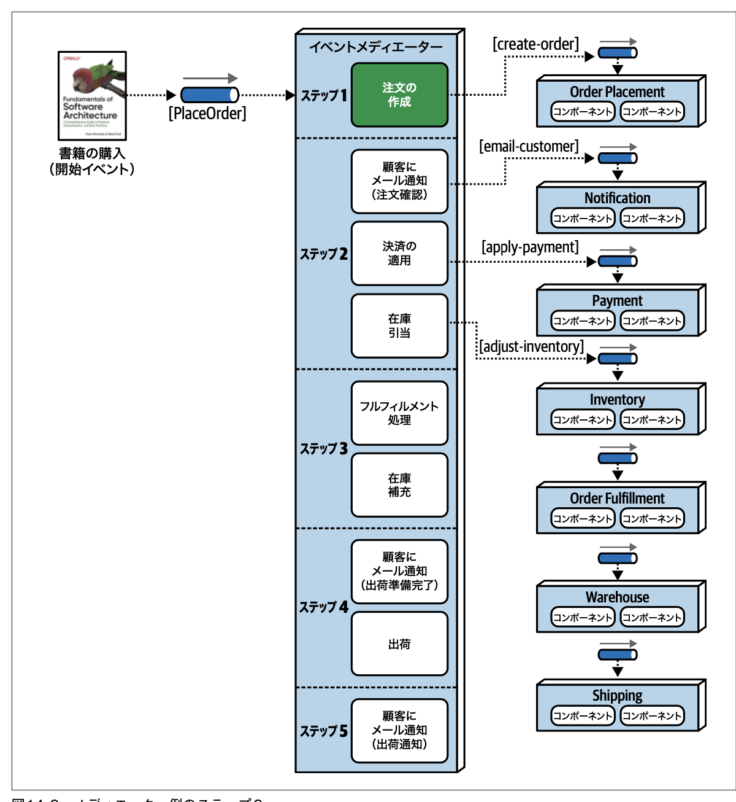
    - ブローカートポロジーと比較した際の、イベントの意味の違い
      - ブローカートポロジー: イベントは、**すでに起こったこと(イベント)**となる -> 無視可能
      - メディエータートポロジー: イベントは、**起こるべきこと(コマンド)**となる -> 無視できない -　トレードオフ
      - メリット
        - ワークフロー制御が可能
        - エラー処理が可能
        - データの一貫性の担保が可能 など
      - デメリット
        - イベントプロセッサーとの結合度が高い
        - スケーラビリティが低い
        - パフォーマンスの低下
        - 耐障害性の低下
        - 複雑なモデリング

### 非同期処理

- 応答性
  - ユーザーが何かしらのアクションをした際、すぐにユーザーに応答することができる
  - パフォーマンスの向上にはキャッシュや並行実行（スケーラビリティの向上）などが必要
    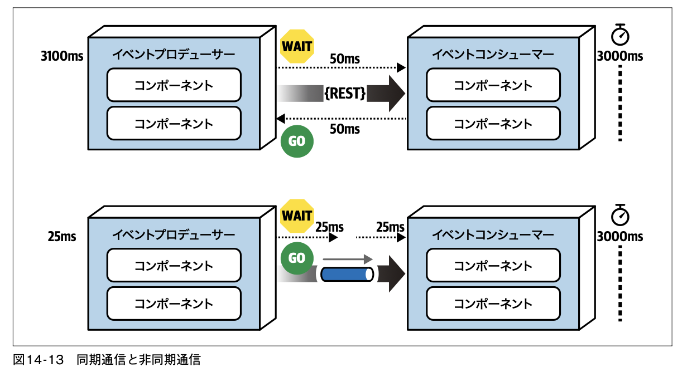
- 非同期処理において問題となるのは例外処理

### ワークフローイベントパターン

- イベントコンシューマーがイベントの処理になんらかの要因で失敗した場合、ワークフロープロセッサーにイベントを発行する
- ワークフロープロセッサーは、問題を解決するための適切なアクションを実行する
  - 機械的に解決可能であれば、再度イベントコンシューマーが再実行可能なイベントを発行する
  - 人間の介入が必要であれば、人間に通知を行う

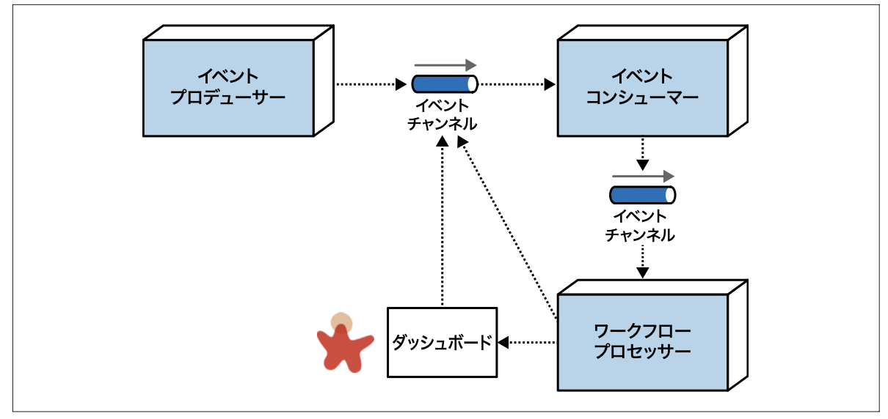

- ただし、処理するイベントの順序に依存がある場合は、一時的なキューに貯めるなどの対応が必要

### データロス

- 非同期処理においては、データロスが発生する可能性がある

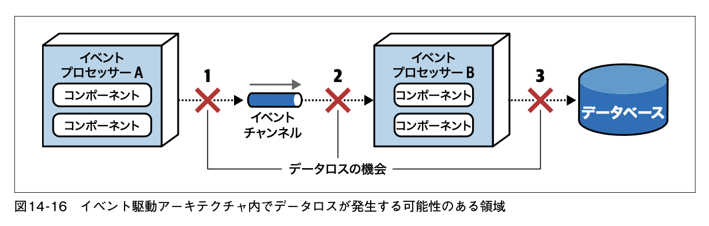

1. イベントが届かない場合

- 同期送信にする
  - メッセージブローカはインメモリだけでなく、物理的な領域にもメッセージを保存し、データロスを防ぐ
  - イベントプロデューサーにレスポンスが届かなかった場合に、再送信を行う
    - ただし、重複処理の問題に対応するため、メッセージ ID を付与してリクエストを送信することで重複を防ぐ

2. イベントプロセッサーがダウンし、メッセージが届かない

- クライアント応答モード
  - 通常、メッセージブローカーは一度キューから取り出したメッセージは削除してしまう
  - 各クライアントへの配信を保証（詳細略）

3. データストアへの書き込みが失敗した場合

- LPS(Last Participant Support)という機能を活用すると、処理が完了してメッセージが永続化されたことを確認して、永続化された キューからメッセージを削除することもできる

##　リクエスト・リプライ

- 擬似同期通信
- 完全に処理が終了するまで待つ必要がある場合に使用

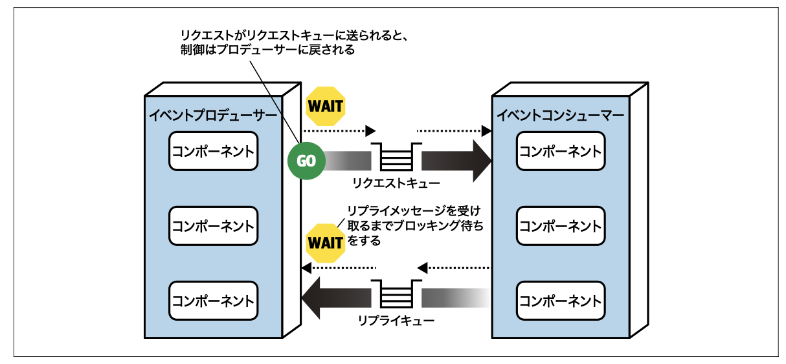

相関 ID を使用して、リクエストとレスポンスを関連付ける

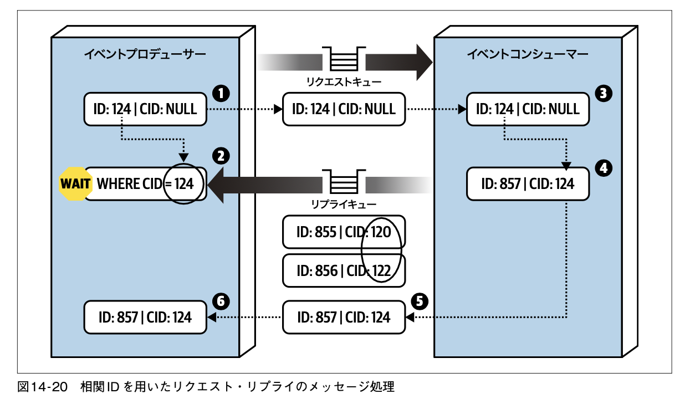

# スペースベースアーキテクチャ

- スペースベースアーキテクチャはデータをメモリ内に保持して処理する
- Hazelcast、Apache Ignite、Oracle Coherence などが実装製品例
- 高可用性、高スケーラビリティ、高パフォーマンスを提供するアーキテクチャ

- 従来のトポロジーでは
  - Web サーバーは比較的容易に水平スケーリングできるが、バックエンドのデータベースがボトルネックになる
  - リレーショナルデータベースは読み書きの同時実行数に制約がある
  - 多数の同時アクセスでデータベース接続がひっ迫する

## トポロジー

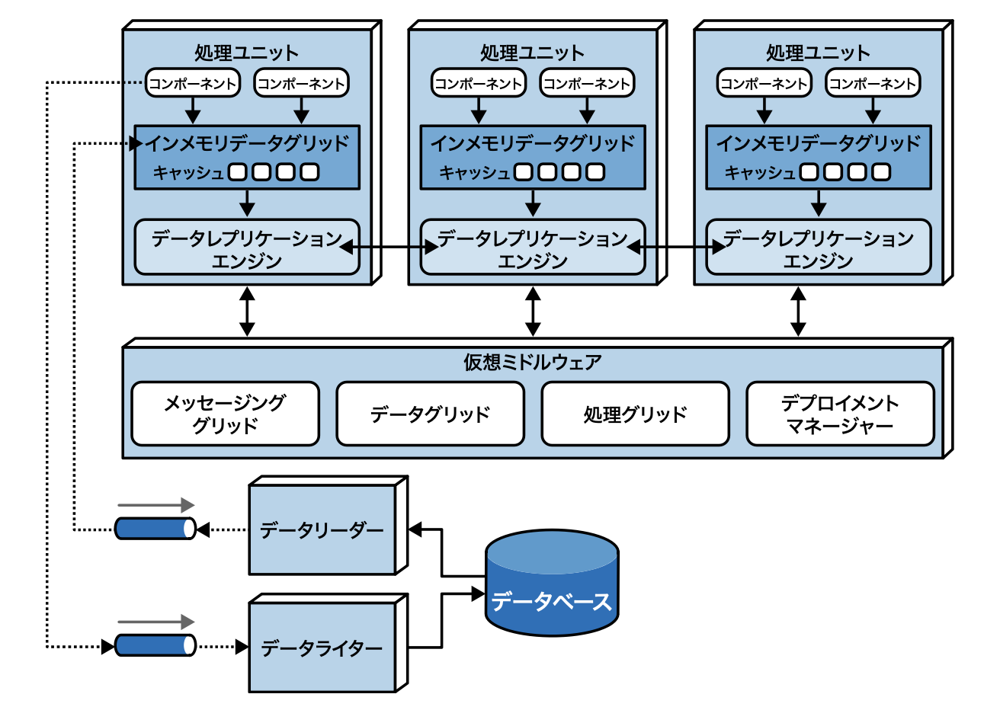

### 1. 処理ユニット（Processing Unit）

- **概要**: アプリケーションのビジネスロジックを実行する単位
- **機能**:
  - 特定のビジネス機能に関するロジックを実装
  - インメモリデータへのアクセスと更新
  - イベント駆動の処理を実行
- **特徴**:
  - ステートレスまたはステートフルで実装可能
  - 水平方向に簡単にスケーリング可能
  - フェイルオーバー機能を内蔵

## 2. 仮想ミドルウェア（Virtual Middleware）

- **概要**: システム全体の中核となるコンポーネント
- **機能**:
  - データの格納と取得の管理
  - インメモリデータグリッドの制御
  - メッセージング機能の提供
  - レプリケーションポリシーの実装
- **例**: Hazelcast、Apache Ignite、Oracle Coherence などの製品がこの役割を担う
- **特徴**: クラスタ内のすべてのサーバー間でデータの一貫性を維持

### 2.1. メッセージンググリッド（Messaging Grid）

- **概要**: 分散コンポーネント間の通信を管理
- **機能**:
  - イベント通知
  - 非同期メッセージング
  - パブリッシュ-サブスクライブモデルの実装
- **特徴**:

  - 高スループットの通信
  - 信頼性の高いメッセージ配信
  - 障害耐性

  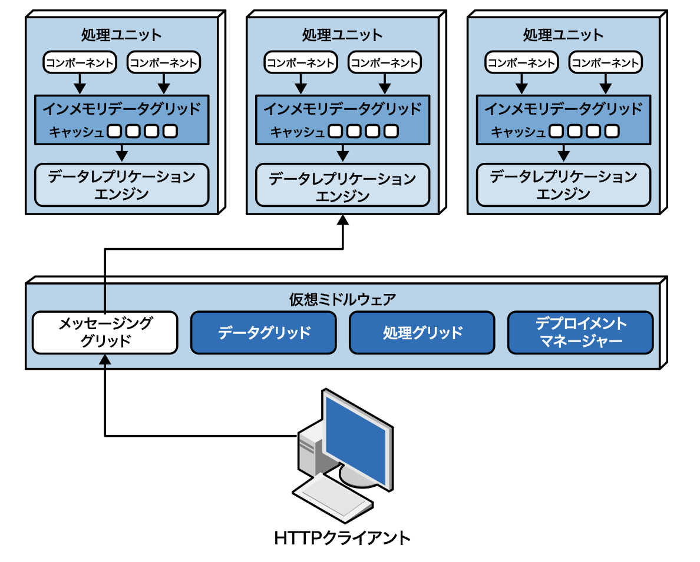

## 2.2. データグリッド（Data Grid）

- **概要**: インメモリデータの分散格納を管理
- **機能**:
  - データの分散と複製
  - キャッシュ管理
  - データアクセスの抽象化
- **特徴**:

  - キー・バリュー形式でのデータアクセス
  - データの自動パーティショニング
  - 複製戦略の実装

  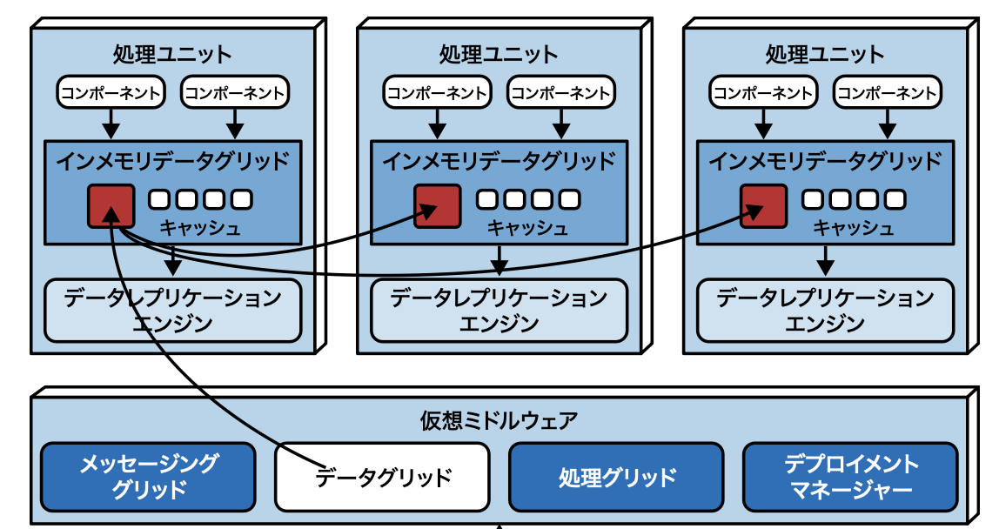

## 2.3. 処理グリッド（Processing Grid）

- **概要**: 並列処理を実行するための枠組み
- **機能**:
  - タスクの分散と実行
  - 結果の集計
  - 負荷分散
- **特徴**:

  - MapReduce のようなパラダイムをサポート
  - 処理の動的スケーリング

  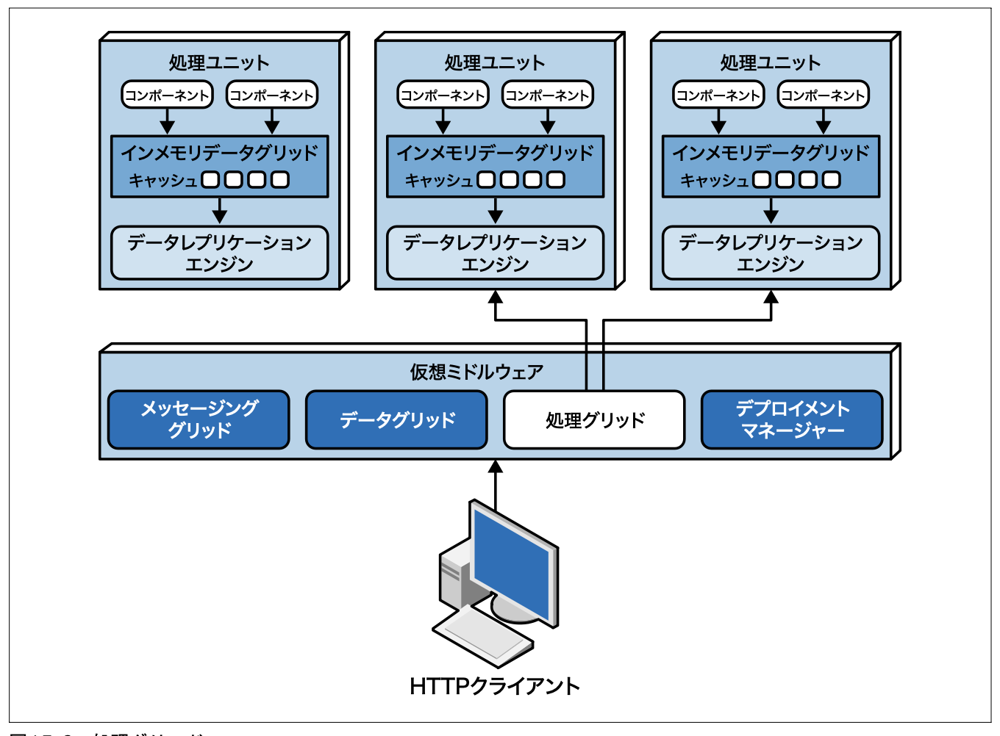

## 2.4. デプロイマネージャ（Deployment Manager）

- **概要**: システムコンポーネントの展開と管理
- **機能**:
  - コンポーネントの自動デプロイ
  - バージョン管理
  - 実行時の構成変更
- **特徴**:
  - ゼロダウンタイムデプロイメント
  - フェイルオーバー管理
  - スケーリング操作のオーケストレーション

## 3. データパンプ（Data Pump）

- **概要**: バックエンドデータストアからインメモリデータグリッドへの初期データロードを担当
- **機能**:
  - システム起動時の初期データロード
  - 大量データの効率的な転送
  - データ変換やフィルタリング
- **特徴**:

  - 高速なデータロードのための最適化機構
  - バックエンドシステムへの負荷を最小限に抑える

  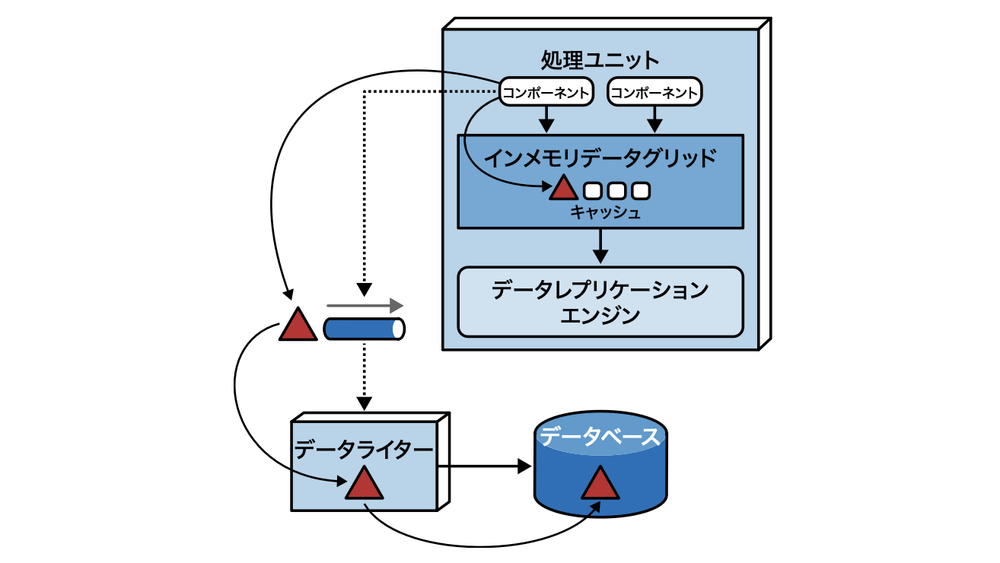

## 4. データライター（Data Writer）

- **概要**: インメモリデータからバックエンドデータストアへの永続化を担当
- **機能**:
  - 更新されたデータの定期的な永続化
  - トランザクション整合性の維持
  - 障害発生時のデータ保全
- **特徴**:

  - 非同期書き込みによるパフォーマンス最適化
  - バッチ処理による効率化

  - 様々なトポロジーが存在

  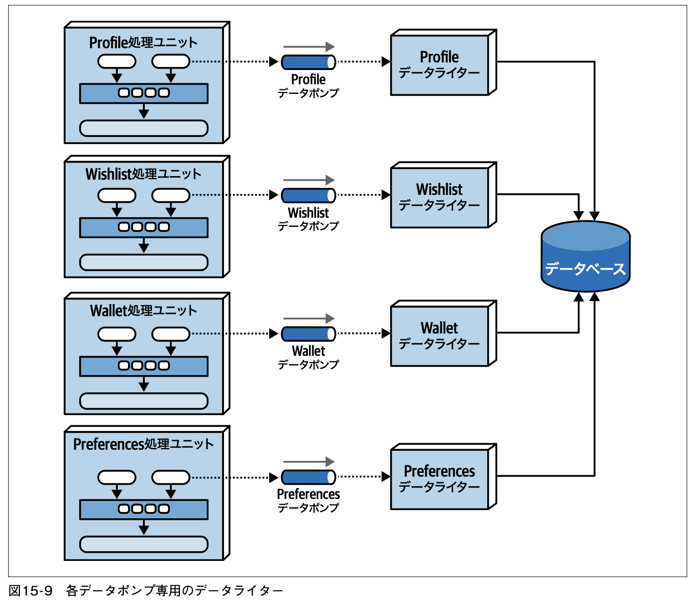

## 5. データリーダー（Data Reader）

- **概要**: オンデマンドでバックエンドデータストアからデータを取得
- **機能**:
  - キャッシュミス時のデータ読み込み
  - 必要に応じたデータの更新
- **特徴**:

  - 効率的なクエリ実行
  - 遅延ロード機能

  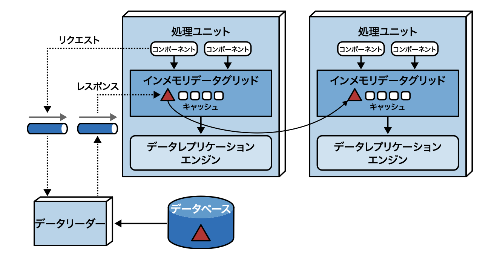

### データ衝突

スペースベースアーキテクチャでは、複数のノードが同じデータに対して同時に更新操作を行う可能性があるため、データ衝突（コンフリクト）が発生する可能性があります。これらの衝突をどのように検出し解決するかは、システムの整合性と信頼性に直接影響します。

#### データ衝突が発生するシナリオ

1. **同時更新**:

   - 異なるノードが同じデータ項目を同時に更新しようとした場合
   - 例: 顧客 A の残高を 2 つの別々のトランザクションが同時に更新しようとする

2. **ネットワーク分断時**:

   - ネットワークの問題で一時的にノード間の通信が途絶えた場合
   - 分断されたノードグループがそれぞれ独自にデータを更新してしまう

3. **レプリケーション遅延**:
   - データの複製が完了する前に別の更新が行われた場合
   - 例: ノード 1 でのデータ更新がノード 2 に反映される前に、ノード 2 で同じデータが更新される

#### 衝突検出メカニズム

1. **バージョン管理（Versioning）**:

   - 各データ項目にバージョン番号やタイムスタンプを付与
   - 更新時にバージョンチェックを行い、期待されるバージョンと一致しない場合は衝突と判断

2. **ベクトルクロック**:

   - 分散システムでの論理時計として機能
   - 各ノードがデータ項目ごとに更新履歴を追跡
   - 複数の更新操作間の因果関係を判断できる

3. **チェックサム比較**:
   - データの整合性を検証するためのハッシュ値の利用
   - 予期しないハッシュ値の不一致が検出された場合に衝突と判断

#### 衝突解決戦略

1. **最後の書き込みが優先（Last-Write-Wins）**:

   - タイムスタンプが最も新しい更新を採用
   - 実装が簡単だが、古い更新による重要な変更が失われる可能性がある

2. **楽観的並行制御（Optimistic Concurrency Control）**:

   - 更新前にバージョンチェックを行い、期待値と一致しない場合は更新を拒否
   - アプリケーションレベルで再試行ロジックが必要

3. **マージ戦略**:

   - 衝突するデータ更新を自動的または手動でマージ
   - 例: 買い物かごへの追加操作は両方の変更を統合可能

4. **カスタム衝突解決ロジック**:

   - ビジネスルールに基づいた特定の解決戦略
   - 例: 銀行残高の更新では特定の計算ルールを適用

5. **イベントソーシング**:
   - データの状態ではなく変更イベントを記録
   - 衝突時にイベントの再生順序を調整して正しい最終状態を計算

#### 実装上の考慮事項

1. **一貫性モデルの選択**:

   - 強い一貫性: すべてのノードが同じデータを同時に見ることを保証（性能コストが高い）
   - 結果整合性: 一時的な不整合を許容し、最終的には一貫した状態に収束

2. **ロックメカニズム**:

   - 分散ロック: 更新前に特定のデータに対するロックを取得
   - 楽観的ロック: ロックを使わず、バージョンチェックで衝突を検出

3. **衝突通知と例外処理**:

   - アプリケーションに衝突を通知する方法
   - 自動再試行ポリシーの実装

4. **データパーティショニング戦略**:
   - 適切なパーティショニングで同一データへの同時アクセスを減らす
   - 関連データを同じパーティションに配置して整合性を確保

### メリットとデメリット

- メリット

  - 高いスケーラビリティ：
    - インメモリデータグリッドによる水平スケーリングが容易
  - 高いパフォーマンス：
    - データベースアクセスのボトルネックを回避
  - 優れた耐障害性：
    - データが複数のサーバーに複製されるため、単一障害点がない
    - サーバー障害時も自動的にデータ整合性を維持
  - 動的なスケーリング：
    - 実行時にノードの追加・削除が可能
    - 需要に応じた柔軟なリソース調整が可能
  - データの一貫性：
    - レプリケーション機能により複数サーバー間でデータ一貫性を確保

- デメリット
  - 複雑さ：
    - 設計・実装・運用がすべて複雑
  - 高いメモリコスト：
    - 大量のメモリを必要とするためハードウェアコストが高い
  - 展開性（デプロイ容易性）の低さ：
    - システム全体の構成が複雑でデプロイが難しい
  - テスト容易性の低さ：
    - 分散システムのテストは複雑で時間がかかる
    - 障害シナリオの完全なテストが困難
  - 学習曲線が急：
    - 新しい開発者の参入障壁が高い
  - 既存システムからの移行コスト：
    - 従来のアーキテクチャからの移行は大規模な改修が必要
    - 段階的移行が難しい場合がある

### 参考文献

- 1 から始める IT アーキテクチャ構築入門

- ソフトウェアアーキテクチャの基礎
