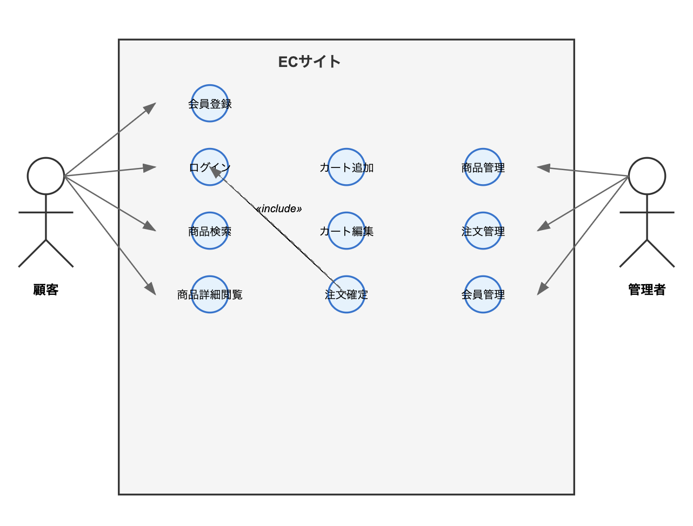
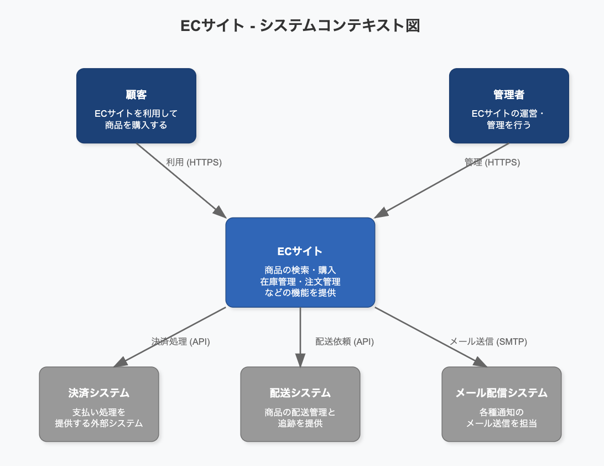
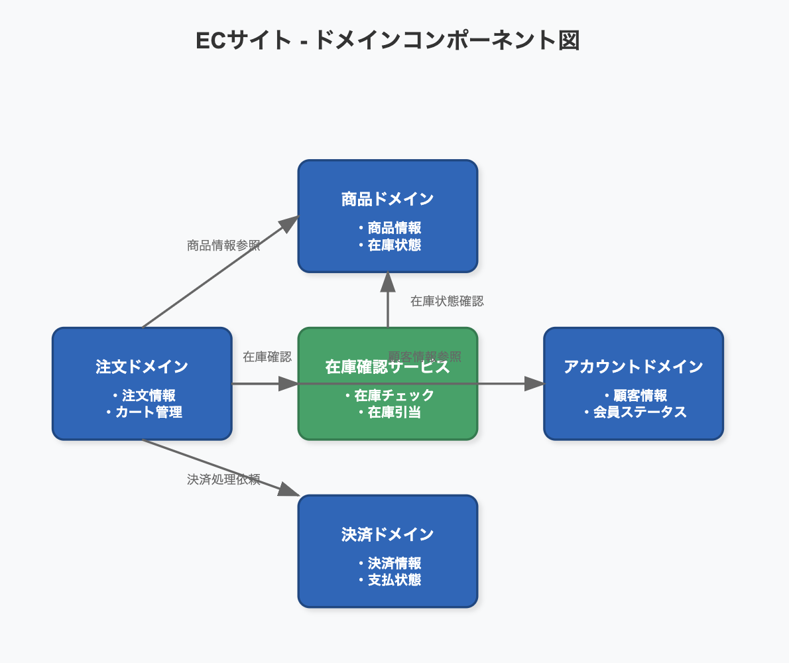
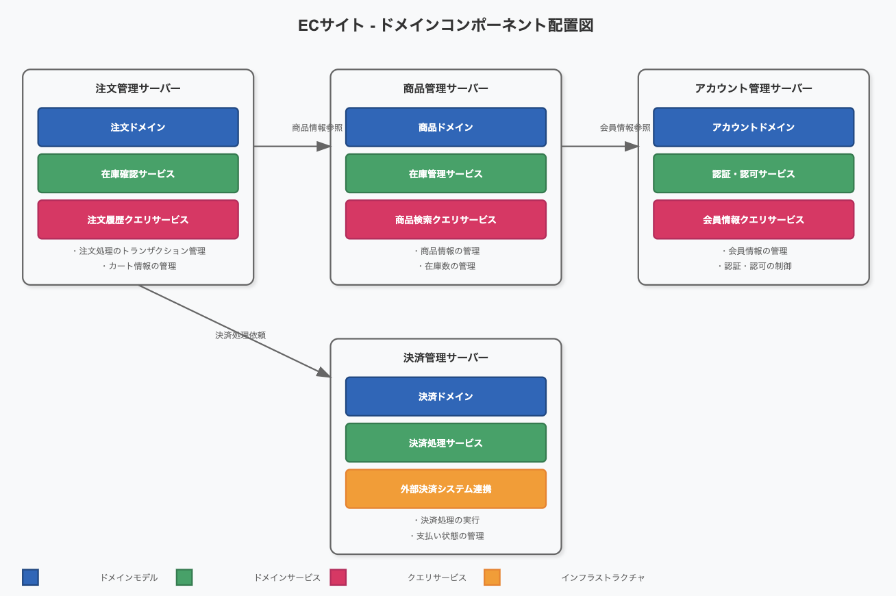
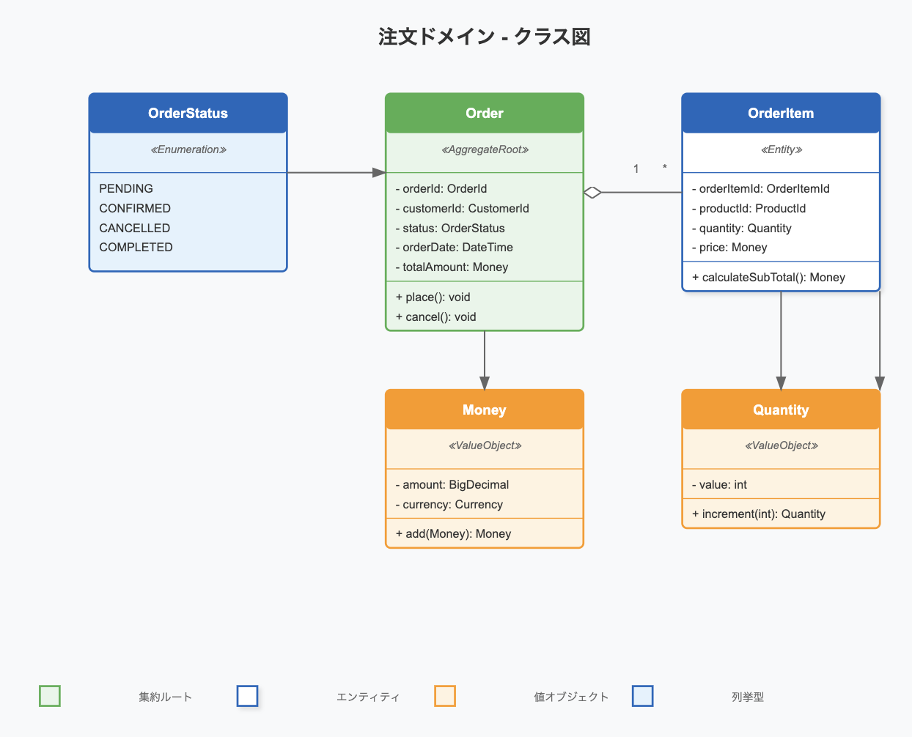
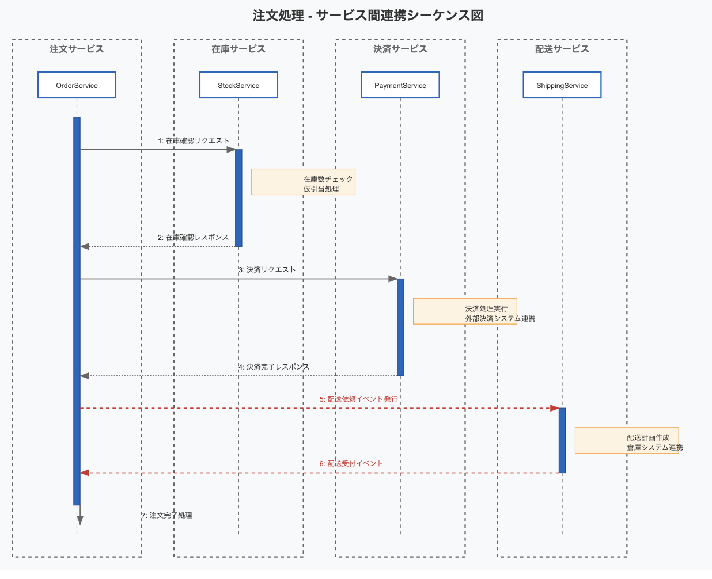

<!-- _class: lead -->

# アーキテクチャ入門

アプリケーションをよりよい構造で実現するための選択を行えるようになる
体系的な知識を用いて、アプリケーションの設計を行うためのアプローチを知る

---

## この講座の目的

- アーキテクチャとは何かを理解する
  - アーキテクチャの定義
- モデリングを通してアーキテクチャを考えられるようになる
- アーキテクチャスタイル・パターンに関して理解を深める

---

## アーキテクチャとは何か？

- 業界全体として画一的な定義はない

> アーキテクチャとは（それが何であれ）重要なものだ。
> Ralph Johnson(xp の権威、design pattern の共同著者)

- とはいえ、よく引用される定義は知っておくといい

- [IEEE 1471](https://ja.wikipedia.org/wiki/IEEE_1471)による定義

> システムの構成要素、それら相互や環境との関係性、及び x その設計と発展をガイドする原則を包含するシステムの基本的組織化

- 書籍「ソフトウェアアーキテクチャの基礎」による定義

  - 以下の組み合わせで考えられるもの
    - アーキテクチャ特性: ( -ility) 機能に直接関連しないが必要となる特性
    - 構造(structure): 使用する要素と要素間の関係、アーキテクチャスタイル
    - 設計指針: 望ましいアプローチとガイドの提供
    - アーキテクチャ決定: システムを構築する際のルール

- 狭義的な定義としては、システムの構造（要素と関係性）
- 広義的には、システムの全体最適に関わるすべてのもの

---

## なぜアーキテクチャが重要なのか？

- 複数の要求と制約を調整した全体としての最適解、そのための指針として
- 指針なく、それぞれの機能を有機的に繋いでいくことはできず、運用コストが増す、機能しない、パフォーマンス劣化等の体験の悪化につながる
- 最近では CI/CD や IaC の普及により、インフラについてもコード化でき、アプリケーション/インフラ共にアーキテクチャを扱うことができるようになってきている
  - アプリケーション・インフラの境界なくアーキテクチャ全体で最適化できていないと競争力が失われる
- すべてはトレードオフ
  - 銀の弾丸はない
  - リスクリワード、コストパフォーマンス、機能性と信頼性、最適化と犠牲、自動化と手動運用、学習曲線など

## どこまでがアーキテクチャでどこまでが設計なのか？

どこまでがアーキテクトが担当する範囲で、どこまでが設計開発者が担当する範囲か？

- 境界を作ると失敗する。境界はない。
- コーディングに影響する設計がアーキテクチャに影響を与え、またアーキテクチャがコーディングに影響を与える
- どこまでいっても仮説検証プロセスを繰り返すことが重要。互いにフィードバックを受け、改善を繰り返す

## 技術の幅と深さ

- わかっていること(understand)
- わからないとわかっていること(know but not understand)
- わからないとわかっていないこと(don't know)

技術の深さがあるということは、わかっていることが多いということ
技術の幅があるということは、わからないが知っていることが多いということ

アーキテクチャに求められるのは、技術の幅

## どのように策定していくのか？

- モデリングを行い、モデルを通してアーキテクチャを策定する

### モデルとは？

- 現実の複雑な事象を単純化して表現するためのもの

  - モデルを作成することで、複雑な事象を理解しやすくする
  - すべてを表現するものはモデルとは言えない（必要な情報を抽出して検討できなければ意味がない）

- view と viewpoint

  - view: モデルの一部を表現するもの
  - viewpoint: view を作成するための視点

以下のようなモデルを作成し、開発者や関係者と共有し、ウォークスルーを行い思考錯誤することで、アーキテクチャを策定していく

- ユースケース図

  - ユーザーとシステム間のやり取りを表現する
  - 下記はシンプルな EC サイトのユースケース図の例

    

- システムコンテキスト

  - システムとその周辺環境を表現する

  

- コンポーネントモデル（コンポーネントビュー）

  - システムを構成するコンポーネントとその関係性を表現する
  - コンポーネント間の依存関係が表現される
  - 論理的な機能の分割と、それらの関係性が表現される

  

- オペレーショナルモデル（オペレーショナルビュー）

  - コンポーネントの物理的な配置や通信経路を表現する
  - システムの構成、通信経路が表現される

  

- クラス図

  - クラスとクラス間の関係を表現する
  - 静的な関係性が表現される

  

- シーケンス図

  - オブジェクト間のメッセージのやり取りを表現する
  - 動的な関係性が表現される

  

## アーキテクチャ特性

- ドメインに依らない、設計に関する考慮事項を明らかにするもの
- 設計の構造的な側面に影響を与えるもの
- アプリケーションの成功に不可欠か重要なもの

> “アプリケーションは、大量のアーキテクチャ特性をサポートすることもできる。しかし、そうすべきではない。アーキテクチャ特性をサポートすればするほど、設計が複雑になるからだ。したがって、アーキテクトの重要な仕事は、可能な限り多くのアーキテクチャ特性をサポートすることではなく、一握りのアーキテクチャ特性を選びとることにある。”
> 抜粋: ソフトウェアアーキテクチャの基礎

### アーキテクチャの運用特性

- 可用性(Availability): システムがどの程度利用可能な状態を維持できるか
- 継続性(Continuity): 障害復旧能力
- 回復性(Recoverability): 障害時にどれだけ早く正常な状態に戻せるか
<!-- 停電やハードウェア障害が発生しても動作可能か -->
- 信頼性(Reliability): 障害後に正常な処理を行うことができるようにするか
<!-- 停電やハードウェア障害が発生しても動作可能か、その後復旧できるか -->
- 堅牢性(Robustness): エラーに対する耐性
<!-- 停電やハードウェア障害が発生しても、その後正常に運用できるか -->
- 堅牢性(Robustness): エラーに対する耐性
<!-- 停電やハードウェア障害が発生しても、その後正常に運用できるか -->
- パフォーマンス(Performance): システムがどの程度の性能を発揮できるか

### アーキテクチャの構造特性

- 拡張性(Extensibility): システムに新しい機能を追加することがどの程度容易か
- 再利用性(Reusability): システムの機能を他のシステムで再利用することがどの程度容易か
- 保守性(Maintainability): システムをどの程度容易に保守できるか
- 移植性(Portability): システムを他の環境に移植することがどの程度容易か
- 構成容易性(Configurability): システムを構成する要素がどの程度容易に組み合わせられるか
- ローカライゼーション(Localizability): システムを他の言語や地域に対応させることがどの程度容易か

### アーキテクチャの横断的特性

- セキュリティ(Security): システムがどの程度セキュアか
- ユーザビリティ(Usability): システムがどの程度使いやすいか
- 認証(Authentication): システムがどの程度認証を行うか
- 合法性(Legality): システムがどの程度法的に適合しているか
- プライバシー(Privacy): システムがどの程度プライバシーを保護しているか
- アクセシビリティ(Accessibility): システムがどの程度アクセスしやすいか
- サポート容易性(Supportability): システムがどの程度サポートしやすいか

### アーキテクチャ特性を明らかにする

- 要件からアーキテクチャ特性を抽出する
- 最初から明らかにされていることもあるが、要件から必要なアーキテクチャ特性を抽出する必要がある
- どのアーキテクチャ特性を重視するかは、そのシステムの目的や要件、制約による

---

### アーキテクチャスタイル

- アーキテクチャスタイルとは

  - アーキテクチャの構造を表現するためのパターン
  - デザインパターンと同じように、頻出の構造を表現するために名付けられている
  - まざまなアーキテクチャ特性をカバーする、コンポーネント同士の名付けられた関係を説明する

- コンポーネント: システムを構成する要素、デプロイの最小単位
  - コンポーネントが分割されている = アーキテクチャ特性も独立できる = 独自のリリースサイクルとスケーリング等が可能になる

### モノリシックアーキテクチャと分散アーキテクチャ

完璧な分類法はないものの、アーキテクチャスタイルは大きく**モノリシック**（すべてのコードが単一のデプロイメントユニットで構成されている）と**分散型**（リモートアクセスプロトコルを介して接続された複数のデプロイメントユニットで構成されている）の 2 種類に分類できる。

- モノリシックアーキテクチャ

  - レイヤードアーキテクチャ
  - パイプラインアーキテクチャ
  - マイクロカーネルアーキテクチャ

- 分散アーキテクチャのパターン

  - サービスベースアーキテクチャ(ハイブリッド)
  - イベント駆動アーキテクチャ
  - サービス指向アーキテクチャ
  - マイクロサービスアーキテクチャ

- 分散アーキテクチャの方がアーキテクチャ特性を独立して扱うことができるため柔軟になるが、大いなる誤信がある。アーキテクチャ特性を同一に扱ってもよい場合、モノリシックアーキテクチャを選択するとよい。

- 分散アーキテクチャの誤信
  - ネットワークは信頼できない
    - 切断されることがある
    - ローカル呼び出しに比べ圧倒的に遅い
    - 帯域制限がある
    - 安全ではない（悪質なクライアントアクセスが発生しうる）
    - 転送コストがかかる
    - トポロジーは変化する
  - 分散ロギング
    - トレースの難易度が上がる
  - 分散トランザクション
    - トランザクションの整合性は保証されない(ACID トランザクションが保証されない)
      - Atomicity: 原子性　トランザクションは完全に成功するか、完全に失敗するか
      - Consistency: 一貫性　トランザクションはデータベースの制約を維持する
      - Isolation: トランザクションは他のトランザクションに影響を与えない
      - Durability: トランザクションが完了すると、その結果は永続的である
    - データの整合性は**結果整合性**による担保となる
      - 複数の操作を行った結果、一時的に整合性が保たれない状態が発生することがあるが、結果的に整合性が保たれることを担保する
      - 保証イベント等により、不整合となった状態を調整する
        - たとえば、注文と在庫の整合性が取れない場合、在庫がない場合は注文をキャンセルする等
  - コントラクトのメンテナンスとバージョン管理
    - コントラクト: クライアントとサービスの双方が合意した動作やデータの形式、インターフェースのこと。
    - サービスやシステムがことなるチーム・部門が所有すると調整の難易度が高くなる
    - バージョン管理・廃止の問題が発生する

---

## 設計指針

- 設計指針とは

  - アーキテクチャを策定する際のガイドライン
  - 設計の方針、アプローチ、原則
  - 設計の方向性を示すもの

- 設計指針の例

  - レイヤードアーキテクチャの適用の指針
    - 各レイヤーの責務の明確化、実装例の提供

### 効果的なチームにするために、アーキテクトが行うこと

- チームの生産性を高められることが、卓越したアーキテクトに求められる能力の一つ

- アーキテクトは、システム上の様々な制約を提供する

  - 制約について、正しいレベルの知識・ガイダンスとサポートを提供する

- 制約がきつすぎる: コントロールフリーク アーキテクト

  - 開発プロセスのあらゆる面において、コントロールを取ろうとする
  - 結果的に、開発者からプログラミングスキルを奪うことに繋がる
  - 束縛的な環境に対し、開発者の離脱を招く

- 制約が緩すぎる: ハンズオフ アーキテクト
  - 決定がほぼなされていない。
  - 実質的なアーキテクトの作業は、開発者に任せられている
  - アーキテクトのフリをするのは簡単ということでもある

### ちょうどいい制約とガイドラインの提供

- チームに適切な制約と境界を作り出す
- 適切な制約と境界は、チームの自己組織化の度合いによって異なる(**エラスティック・リーダーシップ**)

- 主に 5 つの要因に応じて、どの程度アーキテクトがコントロールすべきかを決定する

- チームの親しさ: メンバー同士がどの程度お互いをよく知っているか
  - 親しさが高いほど、自己組織化されていく
- チームサイズ: より大きければ大きいほど、コントロールが必要。
  - 4 以下: 小さい、5-9: 中規模、10 以上: 大きい
- 全体的な経験
  - シニアメンバーの割合、ビジネスドメインに対する成熟度
- プロジェクトの複雑さ
  - ドメイン/技術
- プロジェクトの期間
  - 長いほどコントロールが難しい（ただし、あまりに短い場合も同様）

### チームの警告サイン

- プロセスロス

  - チームメンバーの潜在能力の合計に対して、実際の生産性との差
  - 主にコミュニケーションコスト（人月の神話）によるもの
  - CI/CD での自動化、IaC での自動化、コードレビュー、ペアプログラミング等の開発プロセスの改善
  - リポジトリのマージコンフリクトが頻繁に発生する場合、開発領域の適切な作業分担やコードの分割により低減

- 多元的無知

  - 内心では否定していることに対して、自分が何かを見落としているのだろうと考え、全員が同意してしまう現象
  - 人数が多くなるほど、この現象が発生しやすくなる

- 責任の分散
  - 小さな対応や、誰かが助けを求めている状況下でにおいて「だれかが対応するだろう」という考えにより放置される状況

## ADR (Architecture Decision Record: アーキテクチャ上の決定)

-

### 参考文献

1 から始める IT アーキテクチャ構築入門

- 複数の構成要素と要素間の関係の定義
  = 要求を全体最適させる指針、複数の要求と制約を調整した全体としての最適解

- アーキテクチャ策定の流れ
