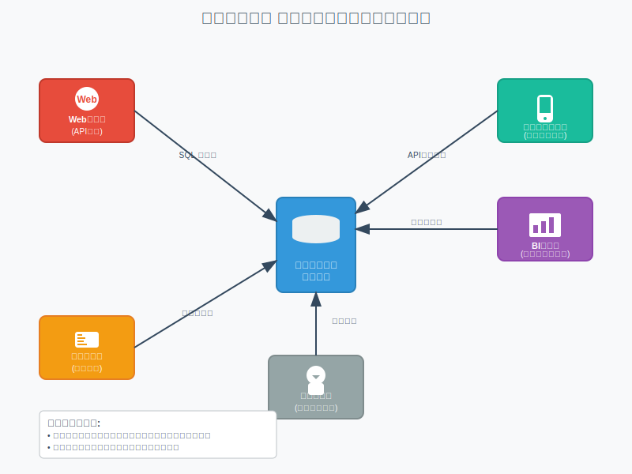
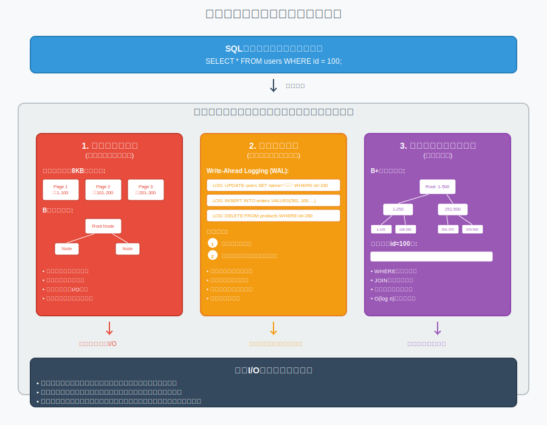
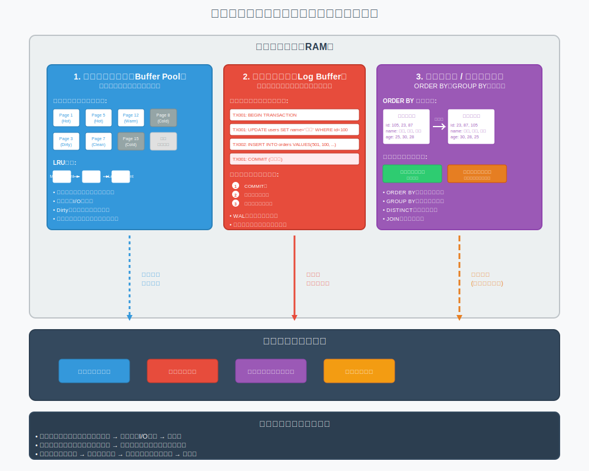
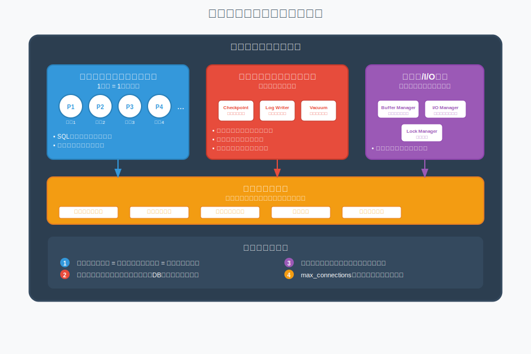
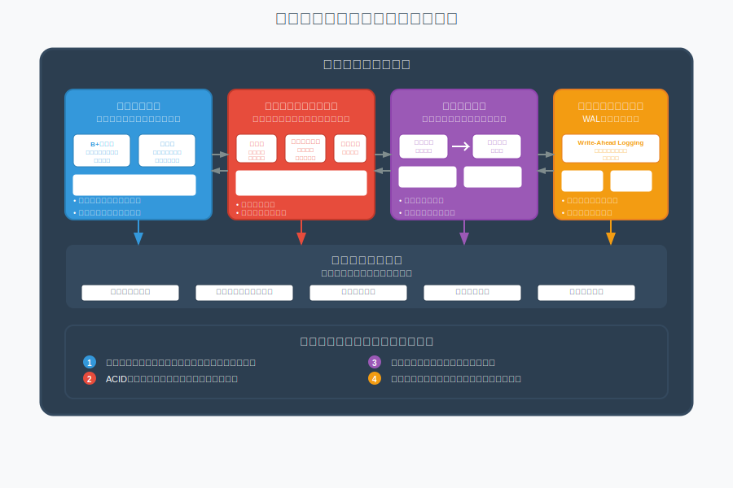

# 3 リレーショナルデータベース基本アーキテクチャ

## 1 導入・全体像
### なぜRDBMSの仕組み・構造を知るべきか？

- **パフォーマンスの問題を理解し、改善できるようになるため**  
  - 「なぜデータベースが遅くなるのか？」  
  - 「どうして検索が遅いのか？」  
- **障害時の対応や復旧がスムーズになるため**  
  - ログファイルやトランザクション管理の役割がわかると復旧がイメージしやすい  
- **開発者としてDBを深く理解し、適切な設計や運用ができるようになるため**

---

### 具体的なイメージ

- **SQLを実行すると、DBは裏側で様々な処理をしている**  
- その処理の中には、メモリ管理やデータファイル・ログファイルの読み書きなどがある  
- これらの構造を理解すると、ボトルネックの特定やトラブルシューティングがしやすくなる  

---

### 今日の講義で目指すこと

- RDBMSの「全体の流れ」と「構成要素」を理解し  
- それぞれの役割をイメージできるようになること  

## 2. クライアント・サーバーモデル

### データベースはクライアント・サーバーモデルで動作している

- **クライアント**  
  アプリケーションやBIツールなど、SQLを発行する側

- **サーバー（RDBMS）**  
  SQLを受け取り、解析・実行し、結果を返す側

---

### 処理の基本的な流れ

1. クライアントがSQLクエリを送信  
2. サーバーがSQLを解析・最適化・実行  
3. 必要に応じてメモリやストレージにアクセス  
4. 実行結果をクライアントに返却  

---

### 図で見る基本構成  

- クライアントは1台だけとは限らない（Webアプリ、バッチ、分析ツールなどが同時接続）  
- サーバーはリクエストを並列処理するよう設計されている  

---

### コネクション管理の基本

- 通信は通常 **TCP/IP**  
- 同時接続数には上限がある（DB設定やOSの制限に依存）  
- Webアプリなどは**接続プール**（Connection Pool）を使って効率的に接続を使い回す

---

### 理解しておくべきポイント

- SQLが届かない・結果が遅いとき、**どこで詰まっているか**を見極めるための基本  
- パフォーマンスチューニング、障害対応、接続制限回避などの土台になる知識

## 3. データベースの物理構造

### データベースの実体は「ファイル」

- RDBMSの中身はすべてファイルとしてディスク上に存在する  
- 主に3つのファイルに分類される

---

### 主なファイル構成

1. **データファイル**  
   - テーブルの実データを格納  
   - ページ単位（例：8KB）で読み書きされる  
   - Bツリー構造で保持されることが多い（InnoDBなど）

2. **ログファイル（トランザクションログ）**  
   - 更新履歴やロールバック情報を記録  
   - クラッシュ時の復旧に使用される  
   - Write-Ahead Logging（WAL）の概念が使われる

3. **インデックスファイル**  
   - 検索やソートを高速化するための構造  
   - B+ツリーやハッシュ構造などが使われる  
   - データファイルとは別管理されることが多い

---

### 図で見る物理構造  

- データベースは複数のファイルによって構成されている  
- 書き込み順序や整合性維持にそれぞれが役割を果たす

---

### なぜこの構造を知るべきか？

- パフォーマンスチューニング（IO削減、インデックス最適化）  
- 障害時のデータ復旧、ログの確認・再生  
- ストレージ使用量の見積もりや管理

## 4. メモリ構造とバッファ管理

### RDBMSにおけるメモリの役割

- ディスクアクセスは遅いため、**メモリ上での処理を最大化することが重要**
- RDBMSは独自のキャッシュやバッファ管理機構を持つ

---

### 主なメモリ領域の構成

1. **バッファプール（Buffer Pool）**
   - ディスク上のデータページをキャッシュ  
   - 読み取り・書き込みどちらにも使用される  
   - LRUなどのアルゴリズムで管理

2. **ログバッファ（Log Buffer）**
   - ログファイルへの書き込み前に一時的に保持  
   - トランザクションの整合性維持に関与

3. **ソート領域 / 一時作業領域**
   - ORDER BY、GROUP BYなどに使う一時的なメモリ領域  
   - 不足するとディスクにスワップされパフォーマンス悪化

---

### 図で見るメモリ構造とバッファ管理  

- ディスクとメモリの間をバッファが仲介  
- できるだけディスクI/Oを減らすのがRDBMSの基本設計思想

---

### なぜこの構造を知るべきか？

- パフォーマンス問題の多くは**メモリ不足 or キャッシュミス**に起因  
- バッファヒット率やフラッシュタイミングを理解することでチューニングしやすくなる

## 5. プロセス構造と接続管理

### RDBMSはプロセスやスレッドで動いている

- 各接続やリクエストは、**内部のプロセスまたはスレッド**が処理する  
- 実装方式はDBごとに異なる（PostgreSQLはマルチプロセス型、MySQLはマルチスレッド型）

---

### 主なプロセス構成

1. **クライアント接続プロセス／スレッド**
   - 各クライアントのリクエストを処理  
   - 通常、1接続＝1プロセス（またはスレッド）

2. **バックグラウンドプロセス**
   - チェックポイント、ログ書き込み、バキュームなどを非同期に実行  
   - 安定運用・性能維持のために不可欠

3. **メモリ／I/O専用プロセス**
   - データの読み書き、フラッシュ、キャッシュ管理を担う

---

### 図で見るプロセス構成と接続  

- 接続が増えるとプロセスやスレッドが増える  
- 同時接続数はサーバーのリソースに大きく影響する

---

### 接続管理の仕組み

- RDBMSは接続ごとにセッション状態を保持  
- 同時接続数の上限があり、接続数過多は性能劣化や拒否の原因に  
- Webアプリでは**接続プール**を活用して制御するのが一般的

---

### なぜこの構造を知るべきか？

- パフォーマンス問題や**接続枯渇**の原因を特定できる  
- リソース使用量や並列性に関するチューニング判断がしやすくなる

## 6. ストレージエンジンの仕組み

---

### ストレージエンジンとは？

- データの**読み書きや管理を実際に担うモジュール**  
- RDBMSの中心的な役割を果たす  
- RDBMSによっては複数のストレージエンジンを切り替えて使える（例：MySQL）

---

### 主な機能・責任

- テーブル・インデックスの物理構造管理（B+ツリー、ヒープなど）  
- トランザクション処理（ロック、ロールバック、コミット）  
- データの永続化（ディスクへの書き込み）  
- クラッシュリカバリと整合性維持（WALなど）

---

### 代表的なストレージエンジンの比較（例：MySQL）

| エンジン | 特徴                              | トランザクション | インデックス |
|---------|-----------------------------------|------------------|--------------|
| InnoDB  | デフォルト、ACID準拠              | ○                | B+ツリー     |
| MyISAM  | 軽量・高速だが障害耐性に弱い       | ×                | B+ツリー     |
| MEMORY | メモリ上に一時的にデータ保持        | ×                | ハッシュ     |

---

### 図で見るストレージエンジンの構造  

- ストレージエンジンは、SQL層の下に位置し、実データ操作を担っている  
- 複数のファイル・メモリ・ログとの連携を行っている

---

### なぜこの構造を知るべきか？

- ストレージエンジンによって、**性能・耐障害性・機能性が大きく異なる**  
- 適切なエンジン選択が、プロジェクト全体の信頼性・保守性に直結する
