# リレーショナルデータベース基本アーキテクチャ - 導入・全体像

# 3.1 はじめに

リレーショナルデータベース管理システム（RDBMS）は、現代のビジネスアプリケーションの中核を担う重要な技術です。Web サービス、基幹システム、モバイルアプリケーションなど、あらゆるシステムの背後でデータの永続化と管理を担っています。

しかし、多くの開発者や運用担当者は、RDBMSを「ブラックボックス」として扱い、その内部構造について深く理解することなく使用しているのが現状です。本セッションでは、RDBMSの内部アーキテクチャを体系的に理解することで、より効果的なデータベース設計と運用を実現することを目指します。

## なぜアーキテクチャを理解する必要があるのか

### パフォーマンスの最適化
データベースの内部動作を理解することで、インデックス設計、クエリ最適化、リソース配分などが効果的に行えるようになります。

### トラブルシューティング
問題発生時にボトルネックを特定し、ロック待機やパフォーマンス劣化の原因を迅速に分析できます。

### 適切な設計判断
テーブル設計、ストレージエンジンの選択、レプリケーション構成など、根拠に基づいた設計が可能になります。

# 3.2 RDBMSアーキテクチャの全体像

RDBMSは大きく分けて以下の層から構成されています：

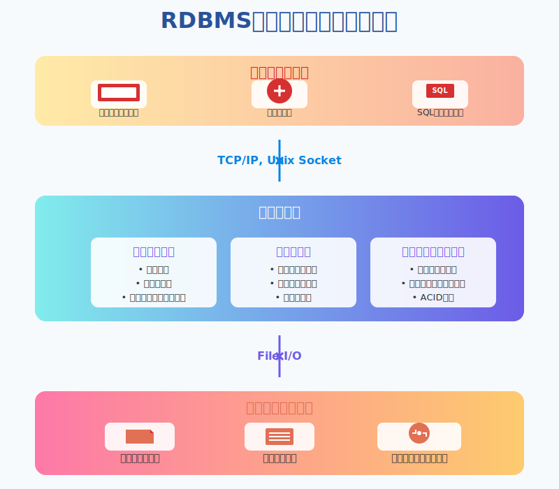

### クライアント層
- **アプリケーション**: ビジネスロジックを実装し、SQLを発行する
- **管理ツール**: phpMyAdmin、pgAdmin、MySQL Workbenchなどの GUI ツール
- **コマンドラインツール**: mysql、psql などの CLI ツール

これらのクライアントは、ネットワークプロトコル（TCP/IP）やローカル接続（Unix Socket）を通じてデータベースサーバーと通信します。

## サーバー層

サーバー層は、RDBMSの中核となる部分で、以下の3つの主要コンポーネントで構成されています：

### プロセス構造
- **接続管理**: クライアントからの接続要求を受け付け、認証を行う
- **クエリ処理**: SQLの解析、最適化、実行計画の作成と実行
- **バックグラウンド処理**: チェックポイント、統計情報更新、ログのフラッシュなど

### メモリ構造
- **バッファプール**: 頻繁にアクセスされるデータページをメモリ上にキャッシュ
- **各種キャッシュ**: クエリキャッシュ、メタデータキャッシュなど
- **ソート領域**: ORDER BY や GROUP BY 操作で使用される一時的な作業領域

### ストレージエンジン
- **データアクセス**: 物理的なデータの読み書きを管理
- **トランザクション管理**: ACID特性を保証するための制御
- **ロック管理**: 同時実行制御のための各種ロック機構

## 物理ストレージ層

データの永続化を担う層で、以下のファイルで構成されます：

- **データファイル**: テーブルの実データとインデックスを格納
- **ログファイル**: トランザクションの変更履歴を記録（REDOログ、UNDOログ）
- **インデックスファイル**: 高速検索のためのB-Tree構造などのインデックス情報

## 各層の相互作用

1. クライアントがSQL文を送信
2. サーバー層のプロセス構造がSQL文を受け取り、解析・最適化
3. メモリ構造のバッファプールを確認し、必要なデータがキャッシュされているか確認
4. キャッシュにない場合は、ストレージエンジンを通じて物理ストレージ層からデータを読み込み
5. 処理結果をクライアントに返送

このような階層構造により、RDBMSは高速なデータアクセスと信頼性の高いデータ管理を実現しています。


# 3.3 クライアント・サーバーモデル

## クライアントとサーバーの役割分担

RDBMSは典型的なクライアント・サーバーアーキテクチャを採用しています。この設計により、複数のクライアントが同一のデータベースに同時にアクセスすることが可能になります。

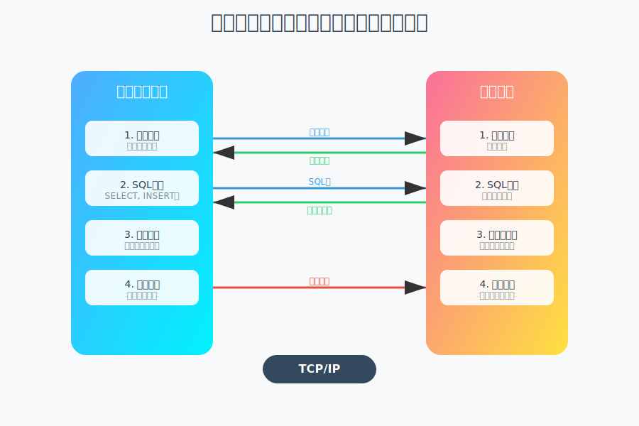

### クライアントの役割
- **接続の確立と維持**: データベースサーバーへの接続を管理
- **SQL文の生成と送信**: アプリケーションロジックに基づいてSQL文を作成
- **結果セットの処理**: サーバーから返されたデータを適切に処理
- **エラーハンドリング**: 接続エラーやSQL実行エラーの処理

### サーバーの役割
- **接続の受付と認証**: クライアントからの接続要求を処理し、認証を実施
- **SQL文の解析と実行**: 受信したSQL文を解析し、最適な実行計画で処理
- **トランザクション管理**: ACID特性を保証しながら複数のトランザクションを管理
- **リソース管理**: メモリ、CPU、I/Oリソースの効率的な配分
- **同時実行制御**: 複数クライアントからの同時アクセスを適切に制御

##  通信プロトコル（TCP/IP）

データベースへの接続には、主に以下の通信方式が使用されます：

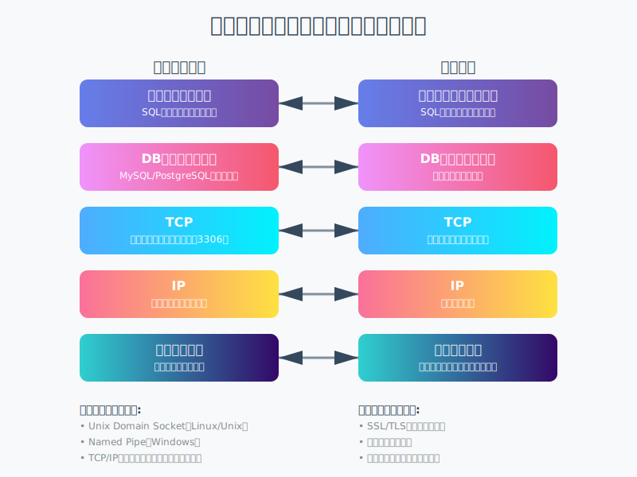

### ネットワーク接続（TCP/IP）
- **標準的な接続方法**: 最も一般的な接続方式
- **ポート番号**: MySQL（3306）、PostgreSQL（5432）、Oracle（1521）など
- **暗号化**: SSL/TLSによる通信の暗号化をサポート
- **ファイアウォール**: 適切な設定により外部からのアクセスを制御

### ローカル接続
- **Unix Domain Socket**: 同一マシン内での高速通信（Linux/Unix環境）
- **Named Pipe**: Windows環境でのローカル接続
- **共有メモリ**: 一部のデータベースで利用可能な最速の接続方式

## 接続の種類と特徴

### 永続的接続（Persistent Connection）
- 一度確立した接続を維持し続ける
- 接続確立のオーバーヘッドを削減
- リソース消費が大きい

### 非永続的接続（Non-persistent Connection）
- 必要な時にのみ接続を確立
- 処理完了後は即座に切断
- リソース効率は良いが、接続オーバーヘッドが発生

##  コネクションプーリングの概念

コネクションプーリングは、データベースにおける複数クライアントの同時接続を効率的に管理するための重要な技術です。

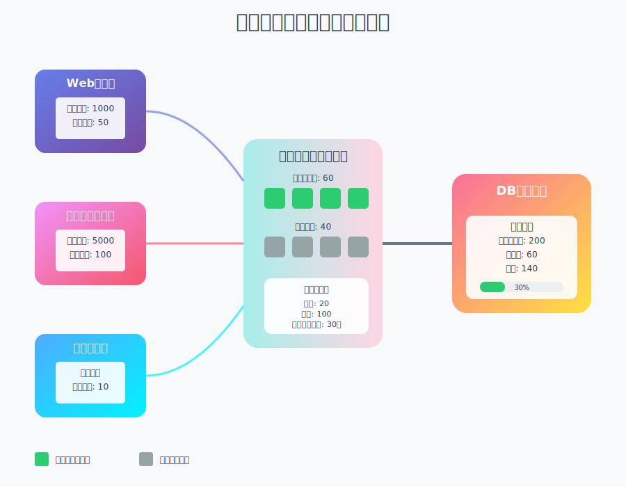

### 基本的な仕組み
1. **事前接続**: アプリケーション起動時に複数の接続を事前に確立
2. **接続の再利用**: 使用済み接続をプールに戻し、別のリクエストで再利用
3. **動的管理**: 負荷に応じて接続数を動的に調整

### 主要なパラメータ
- **最小接続数（Min Pool Size）**: 常に維持する最小接続数
- **最大接続数（Max Pool Size）**: プール内の最大接続数
- **接続タイムアウト**: 未使用接続の破棄までの時間
- **待機タイムアウト**: 接続取得待ちの最大時間

### メリット
- **パフォーマンス向上**: 接続確立のオーバーヘッドを削減
- **リソース効率**: 接続数を適切に制御し、サーバーリソースを保護
- **スケーラビリティ**: 大量の同時接続要求に対応可能

### 実装例
- **アプリケーションレベル**: HikariCP（Java）、pgBouncer（PostgreSQL）
- **ミドルウェアレベル**: ProxySQL（MySQL）、PgPool-II（PostgreSQL）
- **フレームワーク組み込み**: 各種Webフレームワークに標準搭載


# 3.4 データベースの物理構造

## データファイル

### テーブルスペースとデータファイルの関係

データベースの物理的な記憶領域は、**テーブルスペース**と**データファイル**という概念で管理されています。

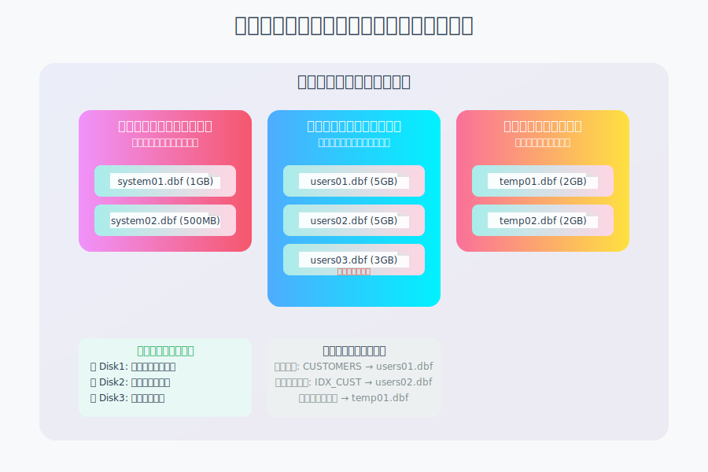

#### テーブルスペースとは
テーブルスペースは、データベースオブジェクト（テーブル、インデックスなど）を論理的にグループ化する単位です。これにより、データの管理と配置を柔軟に制御できます。

- **システムテーブルスペース**: データベースのメタデータや管理情報を格納
- **ユーザーテーブルスペース**: アプリケーションのテーブルやインデックスを格納
- **一時テーブルスペース**: ソート処理や一時的な作業領域として使用
- **UNDOテーブルスペース**: トランザクションのロールバック情報を格納

#### データファイルの役割
各テーブルスペースは、1つ以上の物理的なデータファイルで構成されます。

```
テーブルスペース（論理）
    ├── データファイル1（物理）
    ├── データファイル2（物理）
    └── データファイル3（物理）
```

**主な特徴**：
- テーブルスペースの容量が不足した場合、新しいデータファイルを追加可能
- データファイルは自動拡張設定により、必要に応じてサイズを増加
- 異なるディスクにデータファイルを配置することで、I/O負荷を分散

### ページ/ブロックの概念

データファイル内部は、**ページ**（PostgreSQL,MYSQL）または**ブロック**（Oracle）と呼ばれる固定サイズの単位で管理されています。

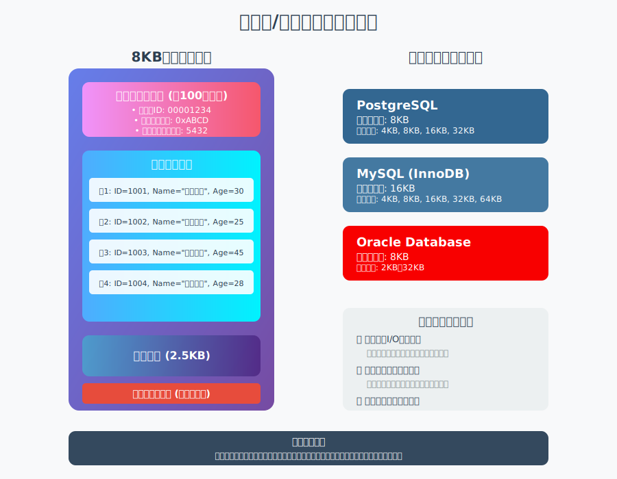

#### ページ/ブロックの構造
一般的なページサイズ：
- **PostgreSQL**: 8KB（デフォルト）
- **MySQL (InnoDB)**: 16KB（デフォルト）
- **Oracle**: 2KB〜32KB（設定可能）

各ページは以下の要素で構成されます：

1. **ページヘッダー**: ページの管理情報（ページ番号、チェックサム、空き領域情報など）
2. **行データ領域**: 実際のテーブルレコードを格納
3. **空き領域**: 新しいレコードの挿入用スペース
4. **行ディレクトリ**: ページ内の各行の位置情報

#### なぜページ/ブロック単位なのか
- **I/O効率**: ディスクI/Oは固定サイズで行うことで効率化
- **バッファ管理**: メモリ上でのキャッシュ管理が簡潔に
- **同時実行制御**: ロックの単位としても利用可能

### エクステントによる領域管理

**エクステント**は、連続した複数のページ/ブロックをまとめた単位で、効率的な領域管理を実現します。

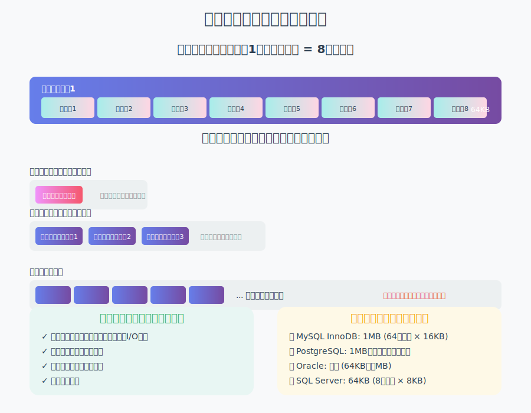

#### エクステントの仕組み
```
エクステント（64KB = 8ページ × 8KB）
├── ページ1
├── ページ2
├── ページ3
├── ページ4
├── ページ5
├── ページ6
├── ページ7
└── ページ8
```

#### エクステント管理のメリット

1. **領域割り当ての効率化**
   - テーブルが成長する際、エクステント単位で領域を確保
   - 頻繁な領域割り当て処理を削減

2. **断片化の抑制**
   - 連続した領域を確保することで、シーケンシャルアクセスが高速
   - ランダムI/Oの削減

3. **管理オーバーヘッドの削減**
   - 個々のページではなく、エクステント単位で管理情報を保持
   - メタデータのサイズを削減

#### 統一エクステントと混合エクステント

- **統一エクステント**: 単一のオブジェクト（テーブル）専用
- **混合エクステント**: 複数の小さなオブジェクトで共有（初期段階）

テーブルが成長すると、混合エクステントから統一エクステントへ移行し、パフォーマンスが向上します。

### 実装による違い

#### MySQL (InnoDB)
- **セグメント**: テーブルごとにデータセグメントとインデックスセグメントを管理
- **エクステントサイズ**: 1MB（64ページ × 16KB）
- **.ibd ファイル**: テーブルごとに個別のデータファイル（file-per-table モード）

#### PostgreSQL
- **ファイルセグメント**: 1GBごとにファイルを分割
- **可視性マップ**: 各ページのVACUUM状態を追跡
- **フリースペースマップ**: 各ページの空き領域を記録

#### Oracle
- **セグメント**: テーブル、インデックス、UNDOなどのオブジェクト単位
- **エクステント割り当て**: 自動（AUTOALLOCATE）または統一（UNIFORM）
- **ASM**: 自動ストレージ管理による高度な領域管理

## ログファイル

### トランザクションログ（WAL）の仕組み

**WAL（Write-Ahead Logging）**　は、データベースの耐障害性を保証する重要な仕組みです。すべての変更は、実際のデータファイルに書き込まれる前に、まずログファイルに記録されます。

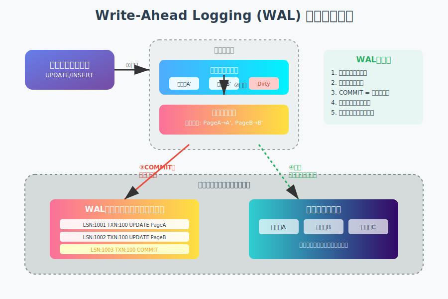

#### WALの基本原則

1. **ログ先行書き込み**: データページへの変更前に、必ずログに記録
2. **順次書き込み**: ログは追記型で順次書き込むため高速
3. **クラッシュリカバリ**: 障害時はログから一貫性のある状態に復旧

#### WAL動作の流れ

```
1. トランザクション開始
2. データ変更操作（UPDATE/INSERT/DELETE）
3. 変更内容をログバッファに記録
4. COMMIT時にログをディスクに書き込み（fsync）
5. 後でデータファイルに反映（チェックポイント）
```

### REDOログとUNDOログの違い

データベースシステムは、異なる目的で2種類のログを管理します。

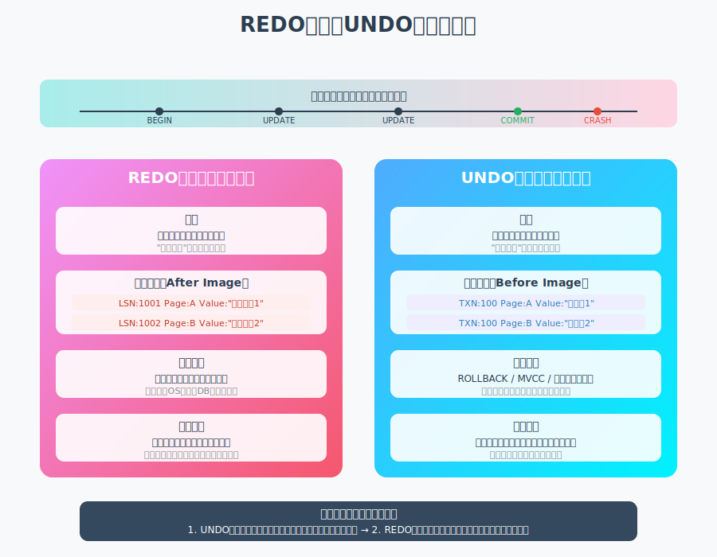

#### REDOログ
- **目的**: コミット済みトランザクションの変更を再実行（前進復旧）
- **内容**: 変更後の値（After Image）
- **使用場面**: システムクラッシュ後の復旧
- **保持期間**: アーカイブまたは循環利用

#### UNDOログ
- **目的**: 未コミットトランザクションの取り消し（後退復旧）
- **内容**: 変更前の値（Before Image）
- **使用場面**: ロールバック、MVCC（多版同時実行制御）
- **保持期間**: トランザクション完了後、一定期間保持

#### 製品別の実装
- **MySQL (InnoDB)**: REDOログ（iblog）とUNDOログ（ibdata/undo tablespace）を分離
- **PostgreSQL**: WALに両方の情報を統合、pg_wal/ディレクトリに格納
- **Oracle**: REDOログとUNDOセグメントを別々に管理

### チェックポイントの役割

チェックポイントは、メモリ上の変更をディスクに確実に書き込むタイミングを制御する仕組みです。

#### チェックポイントの目的

1. **リカバリ時間の短縮**: 再実行が必要なログ量を制限
2. **ログファイルの再利用**: 不要になったログ領域を解放
3. **データの永続化**: メモリ上の変更を確実にディスクに反映

#### チェックポイント処理の流れ

1. チェックポイント開始をログに記録
2. ダーティページ（変更されたページ）をディスクに書き込み
3. チェックポイント完了をログに記録
4. 古いログファイルを削除または再利用可能に

#### チェックポイントのトリガー
- **時間ベース**: 一定時間経過（例：5分ごと）
- **ログ量ベース**: WALが一定サイズに到達
- **手動実行**: 管理者によるCHECKPOINTコマンド
- **シャットダウン時**: 正常停止時に自動実行

## インデックスファイル

### B-Tree構造の基本

B-Tree（Balanced Tree）は、データベースで最も広く使用されるインデックス構造です。

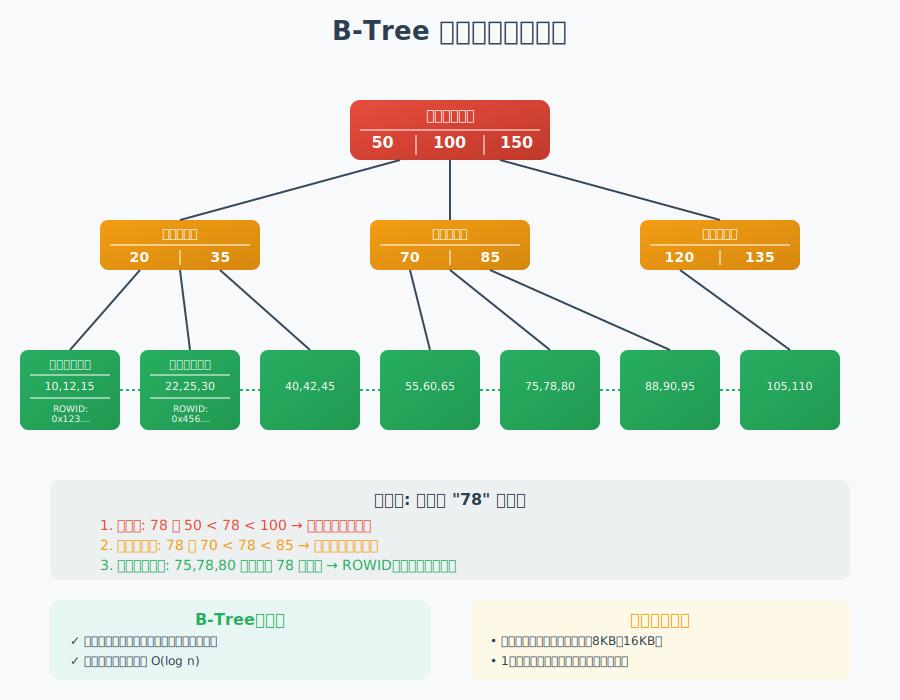

#### B-Treeの特徴

1. **バランス木構造**: すべてのリーフノードが同じ深さ
2. **ノードの分割と結合**: 動的にサイズ調整
3. **順序付きアクセス**: 範囲検索が効率的
4. **予測可能な性能**: O(log n)の検索時間

#### B-Treeの構成要素

- **ルートノード**: ツリーの最上位ノード
- **内部ノード**: 他のノードへのポインタを保持
- **リーフノード**: 実際のデータまたはデータへのポインタ
- **キー値**: ソート済みの検索キー

#### B-Treeの操作
- **検索**: ルートから開始し、キー値を比較しながら下降
- **挿入**: 適切なリーフノードを見つけて挿入、必要に応じて分割
- **削除**: キーを削除し、必要に応じてノードを結合

### インデックスとデータファイルの関係

インデックスは、データファイルへの高速アクセスを提供する補助的な構造です。

#### インデックスエントリの構成
```
インデックスエントリ = キー値 + ポインタ
- キー値: インデックス対象の列の値
- ポインタ: データの物理的位置（ROWID、ページID + オフセット）
```

#### インデックススキャンの流れ
1. インデックスのルートページから開始
2. キー値を比較しながらツリーを下降
3. リーフページで目的のエントリを発見
4. ポインタを使用してデータページにアクセス
5. 実際のレコードを取得

### クラスタ化インデックスと非クラスタ化インデックス

データベースシステムは、データの物理的な配置方法により2種類のインデックスを提供します。

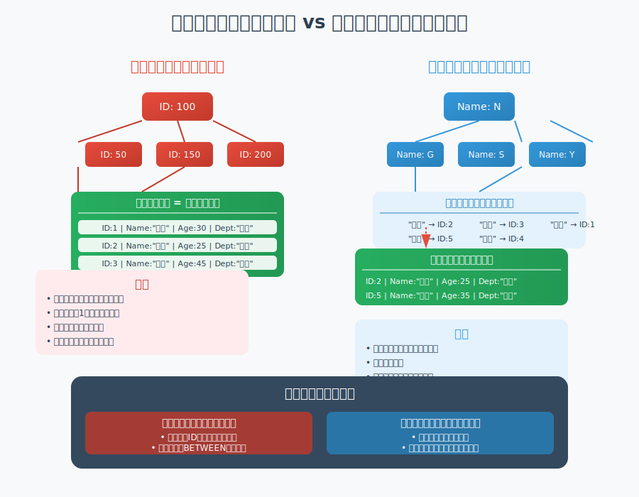

#### クラスタ化インデックス
- **特徴**: データ行がインデックスキーの順序で物理的に並ぶ
- **制限**: テーブルごとに1つのみ作成可能
- **利点**: 
  - 範囲検索が非常に高速
  - インデックスとデータが一体化
  - 追加のI/Oが不要
- **欠点**:
  - 挿入時の再配置コスト
  - 他のインデックスがクラスタ化インデックスに依存

#### 非クラスタ化インデックス
- **特徴**: インデックスとデータが別々に存在
- **制限**: 複数作成可能
- **利点**:
  - 柔軟なインデックス設計
  - データの物理配置に影響なし
  - カバリングインデックスの作成可能
- **欠点**:
  - データアクセスに追加I/Oが必要
  - インデックスサイズが大きくなる可能性

#### 製品別の実装
- **MySQL (InnoDB)**: 主キーが自動的にクラスタ化インデックス
- **PostgreSQL**: クラスタ化インデックスなし（CLUSTERコマンドで疑似的に実現）
- **SQL Server**: 明示的にクラスタ化/非クラスタ化を指定
- **Oracle**: IOT（Index-Organized Table）でクラスタ化を実現