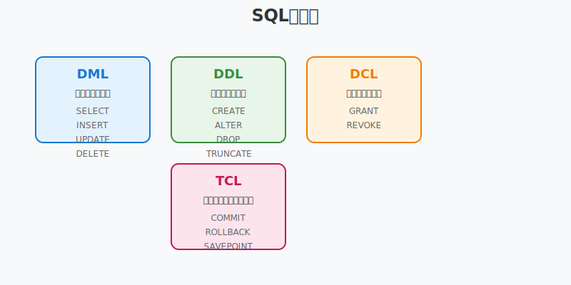
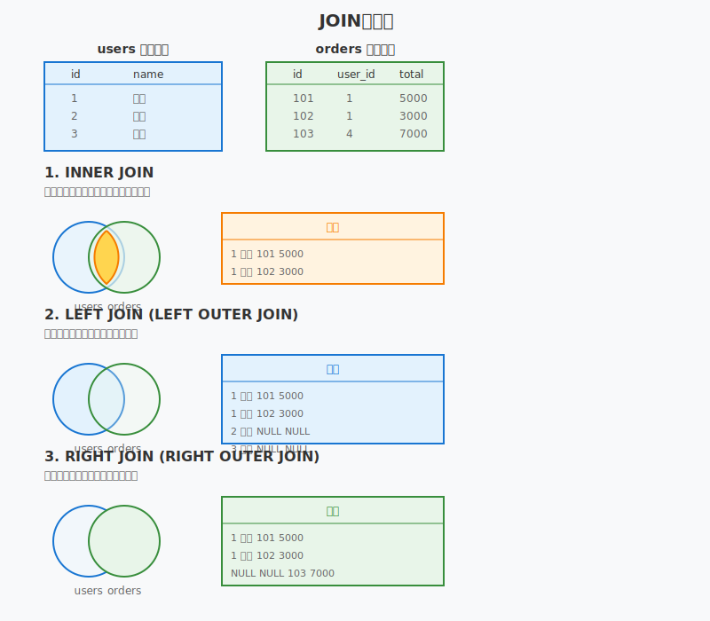

# 第 4 章：SQL 基礎

## 4.1 SQL の基本構文

SQL（Structured Query Language）は、リレーショナルデータベースを操作するための標準的な言語です。SQL は大きく分けて以下の種類があります：

- **DML（Data Manipulation Language）**: データの操作
- **DDL（Data Definition Language）**: データベース構造の定義
- **DCL（Data Control Language）**: アクセス権限の制御
- **TCL（Transaction Control Language）**: トランザクションの制御



### SQL の基本的な文法規則

1. **大文字・小文字の区別**: SQL キーワードは大文字・小文字を区別しません（ただし、データは区別される場合があります）
2. **文の終端**: セミコロン（;）で文を終了します
3. **コメント**:
   - 単一行コメント: `-- コメント`
   - 複数行コメント: `/* コメント */`
4. **識別子**: テーブル名やカラム名は、予約語と区別するために`""`や` `` `で囲むことができます

## 4.2 データ操作言語（DML）

### SELECT 文

SELECT 文は、データベースからデータを取得するための最も基本的なコマンドです。

````sql
-- 基本構文
SELECT カラム名1, カラム名2, ...
FROM テーブル名
WHERE 条件
ORDER BY カラム名 [ASC|DESC];
```#### SELECT文の実践例

```sql
-- 全カラムを取得
SELECT * FROM users;

-- 特定のカラムを取得
SELECT name, email FROM users;

-- 条件付き検索
SELECT * FROM users WHERE age >= 20;

-- 複数条件（AND/OR）
SELECT * FROM users
WHERE age >= 20 AND city = '東京';

-- パターンマッチング（LIKE）
SELECT * FROM users
WHERE name LIKE '田%';  -- 田で始まる名前

-- NULL値の検索
SELECT * FROM users
WHERE phone IS NULL;

-- 並び替え
SELECT * FROM users
ORDER BY age DESC, name ASC;

-- 件数制限
SELECT * FROM users
LIMIT 10;
````

### INSERT 文

INSERT 文は、テーブルに新しいデータを追加するために使用します。

```sql
-- 基本構文（全カラムに値を指定）
INSERT INTO テーブル名
VALUES (値1, 値2, ...);

-- カラムを指定してINSERT
INSERT INTO テーブル名 (カラム1, カラム2, ...)
VALUES (値1, 値2, ...);

-- 複数行を一度にINSERT
INSERT INTO テーブル名 (カラム1, カラム2)
VALUES
  (値1-1, 値1-2),
  (値2-1, 値2-2),
  (値3-1, 値3-2);
```

### UPDATE 文

UPDATE 文は、既存のデータを更新するために使用します。

```sql
-- 基本構文
UPDATE テーブル名
SET カラム1 = 値1, カラム2 = 値2, ...
WHERE 条件;

-- 実践例
UPDATE users
SET age = age + 1
WHERE birthday = CURRENT_DATE;

-- 複数カラムの更新
UPDATE products
SET price = price * 1.1,
    updated_at = NOW()
WHERE category = '食品';
```

### DELETE 文

DELETE 文は、テーブルからデータを削除するために使用します。

```sql
-- 基本構文
DELETE FROM テーブル名
WHERE 条件;

-- 実践例
DELETE FROM users
WHERE last_login < '2023-01-01';

-- 全データ削除（注意！）
DELETE FROM テーブル名;
```

⚠️ **注意**: WHERE 句を忘れると全データが削除されるため、必ず条件を確認してから実行してください。

## 4.3 データ定義言語（DDL）

### CREATE TABLE 文

```sql

-- 基本的なテーブル作成
CREATE TABLE users (
id INTEGER PRIMARY KEY AUTOINCREMENT,
username VARCHAR(50) NOT NULL UNIQUE,
email VARCHAR(100) NOT NULL UNIQUE,
password_hash VARCHAR(255) NOT NULL,
created_at TIMESTAMP DEFAULT CURRENT_TIMESTAMP,
is_active BOOLEAN DEFAULT TRUE
);

-- 外部キー制約を含むテーブル
CREATE TABLE orders (
id INTEGER PRIMARY KEY AUTOINCREMENT,
user_id INTEGER NOT NULL,
total_amount DECIMAL(10,2) NOT NULL,
order_date TIMESTAMP DEFAULT CURRENT_TIMESTAMP,
FOREIGN KEY (user_id) REFERENCES users(id)
);

-- インデックスの作成
CREATE INDEX idx_users_email ON users(email);
CREATE INDEX idx_orders_user_date ON orders(user_id, order_date);

```

### ALTER TABLE 文

既存のテーブル構造を変更するために使用します。

```sql
-- カラムの追加
ALTER TABLE users
ADD COLUMN phone VARCHAR(20);

-- カラムの変更（データベースによって構文が異なる）
-- MySQL
ALTER TABLE users
MODIFY COLUMN phone VARCHAR(30);

-- PostgreSQL
ALTER TABLE users
ALTER COLUMN phone TYPE VARCHAR(30);

-- カラムの削除
ALTER TABLE users
DROP COLUMN phone;

-- 制約の追加
ALTER TABLE users
ADD CONSTRAINT unique_email UNIQUE (email);

-- 制約の削除
ALTER TABLE users
DROP CONSTRAINT unique_email;
```

### DROP 文

データベースオブジェクトを削除するために使用します。

```sql
-- テーブルの削除
DROP TABLE IF EXISTS temp_users;

-- インデックスの削除
DROP INDEX idx_users_email;

-- ビューの削除
DROP VIEW IF EXISTS active_users_view;
```

## 4.4 結合（JOIN）の理解

JOIN は、複数のテーブルからデータを結合して取得するための重要な機能です。



### JOIN の実践例

```sql
-- INNER JOIN：両方のテーブルに存在するデータのみ
SELECT u.name, o.order_date, o.total_amount
FROM users u
INNER JOIN orders o ON u.id = o.user_id;

-- LEFT JOIN：左側のテーブルのすべてのデータ
SELECT u.name, COUNT(o.id) as order_count
FROM users u
LEFT JOIN orders o ON u.id = o.user_id
GROUP BY u.id, u.name;

-- 複数テーブルのJOIN
SELECT
    u.name,
    o.order_date,
    p.product_name,
    oi.quantity
FROM users u
INNER JOIN orders o ON u.id = o.user_id
INNER JOIN order_items oi ON o.id = oi.order_id
INNER JOIN products p ON oi.product_id = p.id
WHERE o.order_date >= '2024-01-01';

-- SELF JOIN：同じテーブル同士の結合
SELECT
    e1.name as employee_name,
    e2.name as manager_name
FROM employees e1
LEFT JOIN employees e2 ON e1.manager_id = e2.id;
```

## 4.5 集約関数とグループ化

集約関数は、複数の行から単一の値を計算するために使用されます。

### 集約関数の実践例

```sql
-- 基本的な集約関数
SELECT
    COUNT(*) as total_users,           -- 行数
    COUNT(DISTINCT city) as cities,    -- 重複を除いた数
    SUM(purchase_amount) as total,     -- 合計
    AVG(age) as average_age,           -- 平均
    MAX(created_at) as newest,         -- 最大値
    MIN(created_at) as oldest          -- 最小値
FROM users;

-- GROUP BYを使った集計
SELECT
    category,
    COUNT(*) as product_count,
    AVG(price) as avg_price,
    MIN(price) as min_price,
    MAX(price) as max_price
FROM products
GROUP BY category
ORDER BY avg_price DESC;

-- HAVINGによる集計結果のフィルタリング
SELECT
    user_id,
    COUNT(*) as order_count,
    SUM(total_amount) as total_spent
FROM orders
GROUP BY user_id
HAVING COUNT(*) >= 5           -- 5回以上注文したユーザー
   AND SUM(total_amount) > 10000;  -- 合計1万円以上

-- 複数カラムでのグループ化
SELECT
    YEAR(order_date) as year,
    MONTH(order_date) as month,
    category,
    SUM(quantity * price) as revenue
FROM order_items oi
JOIN products p ON oi.product_id = p.id
JOIN orders o ON oi.order_id = o.id
GROUP BY YEAR(order_date), MONTH(order_date), category
ORDER BY year, month, revenue DESC;

-- ウィンドウ関数（分析関数）の例
SELECT
    name,
    department,
    salary,
    AVG(salary) OVER (PARTITION BY department) as dept_avg,
    RANK() OVER (PARTITION BY department ORDER BY salary DESC) as dept_rank
FROM employees;
```

### サブクエリの活用

```sql
-- WHERE句でのサブクエリ
SELECT * FROM products
WHERE price > (SELECT AVG(price) FROM products);

-- FROM句でのサブクエリ（派生テーブル）
SELECT category, avg_price
FROM (
    SELECT category, AVG(price) as avg_price
    FROM products
    GROUP BY category
) as category_stats
WHERE avg_price > 1000;

-- 相関サブクエリ
SELECT p1.*
FROM products p1
WHERE price = (
    SELECT MAX(price)
    FROM products p2
    WHERE p2.category = p1.category
);
```

## 第 4 章のまとめ

本章では、SQL の基礎について学習しました：

1. **基本構文**: SQL の種類（DML、DDL、DCL、TCL）と基本的な文法規則
2. **データ操作（DML）**: SELECT、INSERT、UPDATE、DELETE の使い方
3. **データ定義（DDL）**: CREATE TABLE、ALTER TABLE、DROP の使い方
4. **結合（JOIN）**: INNER JOIN、LEFT JOIN、RIGHT JOIN の違いと使い方
5. **集約とグループ化**: 集約関数（COUNT、SUM、AVG 等）と GROUP BY、HAVING の使い方

これらの基本的な SQL 操作を理解することで、効率的なデータベース操作が可能になります。次章では、トランザクションと ACID 特性について詳しく学習していきます。

### 練習問題

以下の sql は練習問題用のテーブル定義とサンプルデータです。

<details>
<summary>練習問題用のテーブルとサンプルデータ</summary>

```sql
-- 部署テーブル
CREATE TABLE departments (
    id INTEGER PRIMARY KEY,
    name VARCHAR(50) NOT NULL,
    location VARCHAR(100)
);

-- 従業員テーブル
CREATE TABLE employees (
    id INTEGER PRIMARY KEY,
    name VARCHAR(100) NOT NULL,
    department_id INTEGER,
    salary DECIMAL(10,2),
    hire_date DATE,
    FOREIGN KEY (department_id) REFERENCES departments(id)
);

-- 商品テーブル
CREATE TABLE products (
    id INTEGER PRIMARY KEY,
    name VARCHAR(100) NOT NULL,
    category VARCHAR(50),
    price DECIMAL(10,2),
    stock_quantity INTEGER
);

-- 売上テーブル
CREATE TABLE sales (
    id INTEGER PRIMARY KEY,
    product_id INTEGER,
    quantity INTEGER,
    sale_date DATE,
    total_amount DECIMAL(10,2),
    FOREIGN KEY (product_id) REFERENCES products(id)
);

-- ユーザーテーブル
CREATE TABLE users (
    id INTEGER PRIMARY KEY,
    name VARCHAR(100) NOT NULL,
    email VARCHAR(100) UNIQUE,
    created_at TIMESTAMP DEFAULT CURRENT_TIMESTAMP
);

-- 注文テーブル
CREATE TABLE orders (
    id INTEGER PRIMARY KEY,
    user_id INTEGER,
    order_date TIMESTAMP DEFAULT CURRENT_TIMESTAMP,
    total_amount DECIMAL(10,2),
    FOREIGN KEY (user_id) REFERENCES users(id)
);

-- サンプルデータの挿入
INSERT INTO departments (id, name, location) VALUES
(1, '営業部', '東京'),
(2, '開発部', '大阪'),
(3, '人事部', '東京'),
(4, '経理部', '名古屋');

INSERT INTO employees (id, name, department_id, salary, hire_date) VALUES
(1, '山田太郎', 1, 450000, '2020-04-01'),
(2, '佐藤花子', 2, 550000, '2019-06-15'),
(3, '鈴木一郎', 1, 480000, '2021-01-10'),
(4, '高橋美咲', 2, 600000, '2018-09-01'),
(5, '田中健二', 3, 420000, '2022-03-20'),
(6, '伊藤直子', 2, 520000, '2020-11-01'),
(7, '渡辺修', 4, 580000, '2017-05-15');

INSERT INTO products (id, name, category, price, stock_quantity) VALUES
(1, 'ノートPC', '家電', 120000, 50),
(2, 'マウス', '家電', 3000, 200),
(3, 'デスク', '家具', 45000, 30),
(4, 'オフィスチェア', '家具', 25000, 45),
(5, 'コーヒー豆', '食品', 1500, 100),
(6, '緑茶', '食品', 800, 150),
(7, 'モニター', '家電', 35000, 60);

INSERT INTO sales (id, product_id, quantity, sale_date, total_amount) VALUES
(1, 1, 2, '2024-01-15', 240000),
(2, 2, 10, '2024-01-16', 30000),
(3, 3, 1, '2024-01-17', 45000),
(4, 1, 1, '2024-01-18', 120000),
(5, 5, 20, '2024-01-19', 30000),
(6, 7, 3, '2024-01-20', 105000),
(7, 4, 2, '2024-01-21', 50000);

INSERT INTO users (id, name, email) VALUES
(1, '山田太郎', 'yamada@example.com'),
(2, '佐藤花子', 'sato@example.com'),
(3, '鈴木一郎', 'suzuki@example.com'),
(4, '高橋美咲', 'takahashi@example.com'),
(5, '田中健二', 'tanaka@example.com');

INSERT INTO orders (id, user_id, order_date, total_amount) VALUES
(1, 1, '2024-01-10', 15000),
(2, 2, '2024-01-11', 25000),
(3, 1, '2024-01-12', 8000),
(4, 3, '2024-01-13', 45000);
```

</details>

## 問題と解答

### 問題 1: 各部署の平均給与が 50 万円以上の部署名とその平均給与を表示するクエリを作成してください

<details>
<summary>解答を表示</summary>

```sql
SELECT
    d.name AS department_name,
    AVG(e.salary) AS average_salary
FROM departments d
INNER JOIN employees e ON d.id = e.department_id
GROUP BY d.id, d.name
HAVING AVG(e.salary) >= 500000
ORDER BY average_salary DESC;

-- 結果:
-- department_name | average_salary
-- ----------------|---------------
-- 開発部          | 556666.67
-- 経理部          | 580000.00
```

**解説**：

- `INNER JOIN`で部署テーブルと従業員テーブルを結合
- `GROUP BY`で部署ごとにグループ化
- `HAVING`句で平均給与が 50 万円以上の部署のみフィルタリング
- `AVG()`関数で平均給与を計算

</details>

### 問題 2: 最も売上の多い商品カテゴリー TOP3 を表示するクエリを作成してください

<details>
<summary>解答を表示</summary>

```sql
SELECT
    p.category,
    SUM(s.total_amount) AS total_sales,
    COUNT(s.id) AS sale_count
FROM products p
INNER JOIN sales s ON p.id = s.product_id
GROUP BY p.category
ORDER BY total_sales DESC
LIMIT 3;

-- 結果:
-- category | total_sales | sale_count
-- ---------|-------------|------------
-- 家電     | 495000      | 4
-- 家具     | 95000       | 2
-- 食品     | 30000       | 1
```

**解説**：

- 商品テーブルと売上テーブルを`INNER JOIN`で結合
- カテゴリーごとに`GROUP BY`でグループ化
- `SUM()`で売上合計を計算
- `ORDER BY ... DESC`で降順ソート
- `LIMIT 3`で上位 3 件のみ取得

</details>

### 問題 3: 一度も注文していないユーザーの一覧を表示するクエリを作成してください（LEFT JOIN を使用）

<details>
<summary>解答を表示</summary>

```sql
SELECT
    u.id,
    u.name,
    u.email
FROM users u
LEFT JOIN orders o ON u.id = o.user_id
WHERE o.id IS NULL
ORDER BY u.id;

-- 結果:
-- id | name     | email
-- ---|----------|--------------------
-- 4  | 高橋美咲 | takahashi@example.com
-- 5  | 田中健二 | tanaka@example.com
```

**解説**：

- `LEFT JOIN`を使用して users テーブルの全レコードを保持
- 注文がないユーザーは、orders 側のカラムが`NULL`になる
- `WHERE o.id IS NULL`で注文レコードが存在しないユーザーのみフィルタリング

**別解（NOT EXISTS を使用）**：

```sql
SELECT
    u.id,
    u.name,
    u.email
FROM users u
WHERE NOT EXISTS (
    SELECT 1
    FROM orders o
    WHERE o.user_id = u.id
)
ORDER BY u.id;
```

</details>

### 追加問題 4: 各カテゴリーの在庫金額（価格 × 在庫数）を計算し、在庫金額が 100 万円以上のカテゴリーを表示してください

<details>
<summary>解答を表示</summary>

```sql
SELECT
    category,
    SUM(price * stock_quantity) AS inventory_value,
    COUNT(*) AS product_count,
    SUM(stock_quantity) AS total_stock
FROM products
GROUP BY category
HAVING SUM(price * stock_quantity) >= 1000000
ORDER BY inventory_value DESC;

-- 結果:
-- category | inventory_value | product_count | total_stock
-- ---------|-----------------|---------------|-------------
-- 家電     | 8610000         | 3             | 310
-- 家具     | 2475000         | 2             | 75
```

**解説**：

- `price * stock_quantity`で各商品の在庫金額を計算
- `GROUP BY category`でカテゴリーごとに集計
- `HAVING`句で在庫金額が 100 万円以上のカテゴリーのみ抽出
- 追加情報として商品数と総在庫数も表示

</details>

### 追加問題 5: 2024 年 1 月の日別売上を集計し、売上がある日のみ表示してください

<details>
<summary>解答を表示</summary>

```sql
SELECT
    sale_date,
    COUNT(*) AS transaction_count,
    SUM(quantity) AS total_quantity,
    SUM(total_amount) AS daily_sales
FROM sales
WHERE sale_date >= '2024-01-01'
  AND sale_date < '2024-02-01'
GROUP BY sale_date
ORDER BY sale_date;

-- 結果:
-- sale_date  | transaction_count | total_quantity | daily_sales
-- -----------|-------------------|----------------|-------------
-- 2024-01-15 | 1                 | 2              | 240000
-- 2024-01-16 | 1                 | 10             | 30000
-- 2024-01-17 | 1                 | 1              | 45000
-- 2024-01-18 | 1                 | 1              | 120000
-- 2024-01-19 | 1                 | 20             | 30000
-- 2024-01-20 | 1                 | 3              | 105000
-- 2024-01-21 | 1                 | 2              | 50000
```

**解説**：

- 日付条件は`WHERE`句で指定（1 月のデータのみ）
- `GROUP BY sale_date`で日付ごとに集計
- 取引件数、販売数量、売上金額を同時に集計

</details>

## 学習のポイント

これらの練習問題を通じて、以下の SQL 技術を習得できます：

1. **JOIN 操作**: INNER JOIN、LEFT JOIN の使い分け
2. **集約関数**: COUNT、SUM、AVG の活用
3. **GROUP BY**: データのグループ化と集計
4. **HAVING 句**: グループ化後の条件フィルタリング
5. **サブクエリ**: NOT EXISTS などの相関サブクエリ
6. **複合的な集計**: 複数の集約関数の組み合わせ

各問題を解く際は、まず求められている結果を明確にし、必要なテーブルの関係性を理解してから、適切な JOIN と集約を組み合わせることが重要です。
