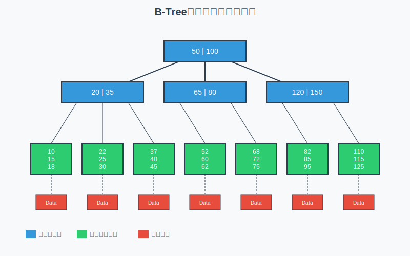
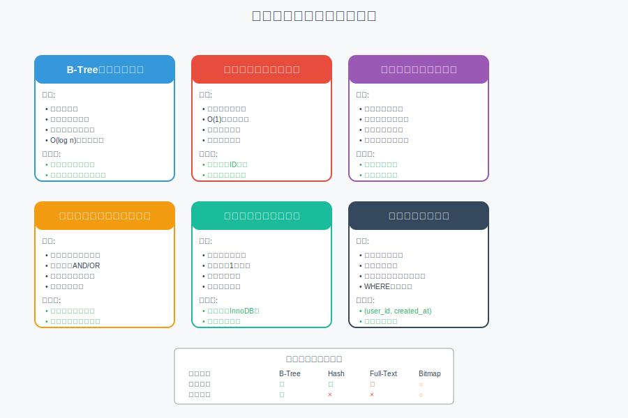
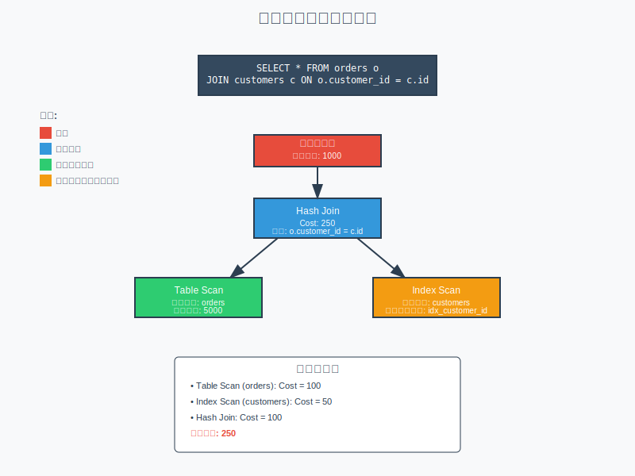
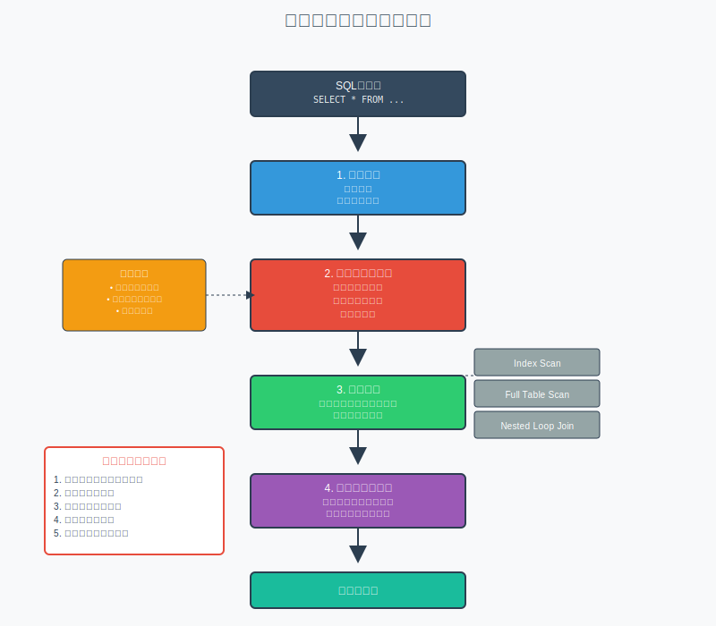

# 第7章：インデックスとクエリ最適化

## 7.1 インデックスの仕組みと種類

インデックスは、データベースの検索性能を向上させる重要な仕組みです。本の索引のように、特定のデータを素早く見つけるための道標として機能します。

### インデックスとは何か

**インデックス（Index）**とは、テーブル内のデータを高速に検索するための特別なデータ構造です。例えば、1000万件のユーザーデータから特定のメールアドレスを持つユーザーを探す場合、インデックスがなければ全データを順番に確認する必要があります（これを**フルテーブルスキャン**といいます）。しかし、メールアドレスにインデックスが設定されていれば、数回のディスクアクセスで目的のデータにたどり着けます。

### インデックスの基本概念

インデックスは、以下の2つの要素で構成されています：

1. **キー値**: インデックスが作成されたカラムの値
2. **ポインタ**: 実際のデータが格納されている物理的な位置（行ID、ページ番号など）

この構造により、データベースエンジンは以下のような流れで高速検索を実現します：
1. インデックスを参照してキー値を検索
2. 対応するポインタを取得
3. ポインタが指す位置から実データを取得

```sql
-- インデックスの作成例
CREATE INDEX idx_user_email ON users(email);
CREATE INDEX idx_order_date ON orders(order_date);
CREATE UNIQUE INDEX idx_product_code ON products(product_code);
```

### B-Treeインデックス

**B-Tree（Balanced Tree）インデックス**は、最も一般的なインデックス構造で、バランスの取れた木構造を採用しています。

#### B-Treeの仕組み

B-Treeは以下の特徴を持つデータ構造です：

- **ルートノード**: 木構造の最上位にある開始点
- **内部ノード**: 他のノードへの参照を持つ中間ノード
- **リーフノード**: 実際のデータへのポインタを持つ最下層のノード
- **バランス性**: すべてのリーフノードがルートから同じ距離にある（木の高さが一定）

この構造により、データ量が増えても検索性能の劣化を最小限に抑えられます。100万件のデータでも、通常3〜4回のノード参照で目的のデータに到達できます。



#### B-Treeインデックスの特徴

```sql
-- B-Treeインデックスが効果的なケース
-- 範囲検索
SELECT * FROM orders 
WHERE order_date BETWEEN '2024-01-01' AND '2024-12-31';

-- 前方一致検索
SELECT * FROM customers 
WHERE name LIKE 'Smith%';

-- ソート処理
SELECT * FROM products 
ORDER BY price DESC;
```

#### B-Treeインデックスの性能特性

- **検索速度：O(log n)**
  - データ量が2倍になっても、検索に必要なステップは1つ増えるだけ
  - 例：100万件→20ステップ、10億件→30ステップ程度
- **挿入・削除：O(log n)**
  - データの追加・削除時も自動的にバランスを保つ
  - ノードの分割・結合により、常に最適な構造を維持
- **範囲検索：効率的**
  - リーフノードが順序付けられているため、範囲検索（BETWEEN句など）が高速
  - 隣接するデータへの連続アクセスが可能
- **メモリ使用量：中程度**
  - データ量の10-20%程度の追加ストレージが必要
  - ノードサイズを調整することで、メモリとディスクI/Oのバランスを最適化

### ハッシュインデックス

**ハッシュインデックス**は、ハッシュ関数を使用してキー値を直接物理位置にマッピングする高速なインデックスです。

#### ハッシュインデックスの仕組み

1. **ハッシュ関数**: キー値を固定長の数値（ハッシュ値）に変換
2. **ハッシュテーブル**: ハッシュ値をインデックスとして使用し、データの位置を直接参照
3. **衝突処理**: 異なるキーが同じハッシュ値になった場合の処理（チェイン法、オープンアドレス法など）

**利点**:
- 等価検索が非常に高速（O(1)の計算量）
- メモリ効率が良い

**欠点**:
- 範囲検索ができない（ハッシュ値に順序性がないため）
- ソート済みの結果を得られない
- ハッシュ関数の選択が性能に大きく影響

#### ハッシュインデックスの使用例

```sql
-- MySQLのMemoryストレージエンジンでの例
CREATE TABLE session_data (
    session_id VARCHAR(64) PRIMARY KEY,
    user_id INT,
    data TEXT,
    INDEX idx_session USING HASH (session_id)
) ENGINE=MEMORY;

-- 等価検索（ハッシュインデックスが最も効果的）
SELECT * FROM session_data WHERE session_id = 'abc123xyz';
```

#### ハッシュインデックスの制限

```sql
-- 以下のような検索では効果がない
-- 範囲検索（使用不可）
SELECT * FROM session_data WHERE session_id > 'aaa';

-- 部分一致検索（使用不可）
SELECT * FROM session_data WHERE session_id LIKE 'abc%';

-- ソート（使用不可）
SELECT * FROM session_data ORDER BY session_id;
```

### 全文検索インデックス

**全文検索インデックス（Full-Text Index）**は、テキストデータの検索に特化したインデックスで、**転置インデックス（Inverted Index）**構造を使用します。

#### 転置インデックスの仕組み

転置インデックスは、単語から文書への逆引き辞書のような構造です：

1. **トークン化**: テキストを単語（トークン）に分解
2. **正規化**: 大文字小文字の統一、語幹抽出など
3. **インデックス作成**: 各単語がどの文書のどの位置に出現するかを記録

例：
```
文書1: "データベースの最適化は重要です"
文書2: "インデックスで最適化を実現"

転置インデックス:
"データベース" → [文書1:位置1]
"最適化" → [文書1:位置3, 文書2:位置3]
"インデックス" → [文書2:位置1]
```

この構造により、特定の単語を含む文書を瞬時に特定できます。

```sql
-- MySQL での全文検索インデックスの作成
CREATE TABLE articles (
    id INT PRIMARY KEY AUTO_INCREMENT,
    title VARCHAR(255),
    content TEXT,
    FULLTEXT idx_fulltext (title, content)
);

-- 全文検索の実行
SELECT * FROM articles 
WHERE MATCH(title, content) AGAINST('データベース 最適化' IN BOOLEAN MODE);

-- スコア付き検索
SELECT id, title, 
       MATCH(title, content) AGAINST('データベース') AS relevance
FROM articles 
WHERE MATCH(title, content) AGAINST('データベース')
ORDER BY relevance DESC;
```

### インデックスの種類と特徴の比較



## 7.2 インデックス設計の指針

効果的なインデックス設計は、データベースのパフォーマンスに大きく影響します。

### カーディナリティの考慮

**カーディナリティ（Cardinality）**とは、特定のカラムに含まれる一意な値の数を指します。これはインデックスの効果を判断する重要な指標です。

#### カーディナリティの概念

- **高カーディナリティ**: 値の種類が多い（例：ユーザーID、メールアドレス）
  - 1000万レコード中に900万種類の異なる値がある場合
  - インデックスによる絞り込み効果が高い
  
- **低カーディナリティ**: 値の種類が少ない（例：性別、都道府県）
  - 1000万レコード中に2〜50種類程度の値しかない場合
  - インデックスの効果が限定的（フルテーブルスキャンの方が速い場合もある）

```sql
-- 高カーディナリティ（効果的）
CREATE INDEX idx_user_id ON orders(user_id);      -- ユーザーIDは多様
CREATE INDEX idx_email ON users(email);           -- メールアドレスはユニーク

-- 低カーディナリティ（効果が限定的）
CREATE INDEX idx_gender ON users(gender);         -- 性別は2-3種類のみ
CREATE INDEX idx_status ON orders(status);        -- ステータスは数種類
```

### 複合インデックスの設計

**複合インデックス（Composite Index）**は、複数のカラムを組み合わせて作成するインデックスです。適切に設計すれば、単一カラムのインデックスよりも大幅な性能向上を実現できます。

#### 左端優先原則（Leftmost Prefix Rule）

複合インデックスで最も重要な概念が「左端優先原則」です。これは、複合インデックスを使用する際、インデックスの左側のカラムから順に指定する必要があるというルールです。

```sql
-- 複合インデックスの作成
CREATE INDEX idx_user_date ON orders(user_id, order_date);

-- この複合インデックスが使用されるクエリ
-- 両方のカラムを使用（最も効率的）
SELECT * FROM orders 
WHERE user_id = 100 AND order_date = '2024-01-01';

-- 左端のカラムのみ使用（インデックス使用可能）
SELECT * FROM orders WHERE user_id = 100;

-- 右端のカラムのみ使用（インデックス使用不可）
SELECT * FROM orders WHERE order_date = '2024-01-01';
```

### カバリングインデックス

**カバリングインデックス（Covering Index）**は、クエリで必要なすべてのカラムをインデックス自体に含める設計手法です。これにより、インデックスの参照だけでクエリが完結し、実テーブルへのアクセスが不要になります。

#### カバリングインデックスの仕組み

データベースは通常、以下の2段階でデータを取得します：
1. インデックスを検索して該当行を特定
2. 実テーブルから必要なデータを取得

カバリングインデックスを使用すると、ステップ2が不要になり、大幅な性能向上が期待できます。

```sql
-- カバリングインデックスの例
CREATE INDEX idx_covering ON orders(user_id, order_date, total_amount);

-- このクエリはインデックスのみで完結（高速）
SELECT user_id, order_date, total_amount 
FROM orders 
WHERE user_id = 100;

-- EXPLAINで確認
EXPLAIN SELECT user_id, order_date, total_amount 
FROM orders WHERE user_id = 100;
-- Extra: Using index と表示される
```

### インデックスの選択性

**選択性（Selectivity）**は、インデックスがどれだけ効率的にデータを絞り込めるかを示す指標です。0から1の値で表され、1に近いほど選択性が高い（より効果的）ことを意味します。

#### 選択性の計算方法

```
選択性 = 一意な値の数 / 全レコード数
```

例：
- 100万レコード中、ユーザーIDが95万種類 → 選択性 = 0.95（高い）
- 100万レコード中、ステータスが3種類 → 選択性 = 0.000003（低い）

```sql
-- 選択性の計算
SELECT 
    COUNT(DISTINCT user_id) / COUNT(*) AS user_id_selectivity,
    COUNT(DISTINCT status) / COUNT(*) AS status_selectivity
FROM orders;

-- 選択性が高いカラムを優先してインデックス化
-- user_id_selectivity: 0.95 (高い - 効果的)
-- status_selectivity: 0.003 (低い - 効果限定的)
```

## 7.3 実行計画の読み方

**実行計画（Execution Plan）**は、データベースがクエリをどのように処理するかを示すロードマップです。SQLを実行する前に、オプティマイザが最適な実行方法を決定し、その内容を実行計画として提示します。

### なぜ実行計画が重要なのか

同じ結果を得るSQLでも、実行方法によって性能は大きく異なります：
- インデックスを使うか、フルテーブルスキャンか
- どの順番でテーブルを結合するか
- どの結合アルゴリズムを使うか

実行計画を理解することで、クエリのボトルネックを特定し、最適化の方針を立てることができます。



### MySQLでの実行計画の取得

```sql
-- EXPLAINを使用した実行計画の確認
EXPLAIN SELECT o.*, c.name 
FROM orders o
JOIN customers c ON o.customer_id = c.id
WHERE o.order_date >= '2024-01-01';

-- 詳細な実行計画（MySQL 5.7以降）
EXPLAIN FORMAT=JSON 
SELECT o.*, c.name 
FROM orders o
JOIN customers c ON o.customer_id = c.id
WHERE o.order_date >= '2024-01-01';
```

### 実行計画の重要な項目

#### type（アクセスタイプ）

**type**カラムは、MySQLがテーブルにどのようにアクセスするかを示します。以下に高速な順に主要なアクセスタイプを説明します：

```sql
-- システムテーブル（最速）
EXPLAIN SELECT * FROM (SELECT 1) AS t;  -- type: system

-- const（プライマリキーまたはユニークキーでの検索）
EXPLAIN SELECT * FROM users WHERE id = 1;  -- type: const

-- eq_ref（結合時のユニークキー検索）
EXPLAIN SELECT * FROM orders o 
JOIN customers c ON o.customer_id = c.id;  -- type: eq_ref

-- ref（非ユニークインデックス検索）
EXPLAIN SELECT * FROM orders WHERE user_id = 100;  -- type: ref

-- range（範囲検索）
EXPLAIN SELECT * FROM orders 
WHERE order_date BETWEEN '2024-01-01' AND '2024-12-31';  -- type: range

-- index（インデックスフルスキャン）
EXPLAIN SELECT user_id FROM orders;  -- type: index

-- ALL（フルテーブルスキャン - 最も遅い）
EXPLAIN SELECT * FROM large_table WHERE some_column = 'value';  -- type: ALL
```

#### Extra（追加情報）

**Extra**カラムには、クエリ実行に関する重要な追加情報が表示されます：

```sql
-- Using index（カバリングインデックス使用）
EXPLAIN SELECT user_id FROM orders WHERE user_id > 100;
-- Extra: Using where; Using index

-- Using filesort（ソート処理が必要）
EXPLAIN SELECT * FROM orders ORDER BY total_amount;
-- Extra: Using filesort

-- Using temporary（一時テーブル使用）
EXPLAIN SELECT DISTINCT user_id FROM orders;
-- Extra: Using temporary

-- Using index condition（インデックスコンディションプッシュダウン）
EXPLAIN SELECT * FROM orders WHERE user_id = 100 AND status = 'completed';
-- Extra: Using index condition
```

### PostgreSQLでの実行計画

```sql
-- EXPLAIN ANALYZEで実際の実行時間も確認
EXPLAIN ANALYZE
SELECT o.*, c.name 
FROM orders o
JOIN customers c ON o.customer_id = c.id
WHERE o.order_date >= '2024-01-01';

-- バッファ使用状況も確認
EXPLAIN (ANALYZE, BUFFERS)
SELECT * FROM large_table WHERE condition = true;
```

## 7.4 クエリチューニングの手法



### インデックスの活用

クエリの書き方によって、インデックスが使われるか使われないかが決まります。以下のポイントに注意してください：

#### 関数の使用を避ける

インデックスが設定されたカラムに関数を適用すると、インデックスが使用されません。

```sql
-- 非効率なクエリ（関数使用によりインデックスが使えない）
SELECT * FROM users WHERE YEAR(created_at) = 2024;

-- 改善版（インデックスが使える）
SELECT * FROM users 
WHERE created_at >= '2024-01-01' AND created_at < '2025-01-01';

-- 非効率なクエリ（型変換によりインデックスが使えない）
SELECT * FROM users WHERE user_id = '100';  -- user_idがINT型の場合

-- 改善版（型を合わせる）
SELECT * FROM users WHERE user_id = 100;
```

### JOINの最適化

**JOIN**の最適化では、結合順序と結合アルゴリズムが重要です。

#### 結合順序の重要性

一般的に、小さいテーブルから結合を開始することで、中間結果のサイズを最小化できます。

```sql
-- 非効率なクエリ（大きなテーブルから開始）
SELECT * FROM large_orders lo
JOIN small_customers sc ON lo.customer_id = sc.id
WHERE sc.country = 'Japan';

-- 改善版（小さなテーブルから開始）
SELECT * FROM small_customers sc
JOIN large_orders lo ON sc.id = lo.customer_id
WHERE sc.country = 'Japan';

-- 結合条件にインデックスを作成
CREATE INDEX idx_customer_id ON large_orders(customer_id);
CREATE INDEX idx_country ON small_customers(country);
```

### サブクエリの最適化

**サブクエリ**は便利ですが、特に**相関サブクエリ（Correlated Subquery）**は性能問題を引き起こしやすいです。

#### 相関サブクエリの問題点

相関サブクエリは、外側クエリの各行に対してサブクエリが実行されるため、行数がN件の場合、N回サブクエリが実行されます。

```sql
-- 非効率なサブクエリ（相関サブクエリ）
SELECT * FROM orders o
WHERE total_amount > (
    SELECT AVG(total_amount) 
    FROM orders 
    WHERE customer_id = o.customer_id
);

-- 改善版（JOINとウィンドウ関数を使用）
WITH customer_avg AS (
    SELECT customer_id, AVG(total_amount) as avg_amount
    FROM orders
    GROUP BY customer_id
)
SELECT o.* FROM orders o
JOIN customer_avg ca ON o.customer_id = ca.customer_id
WHERE o.total_amount > ca.avg_amount;

-- さらに改善（ウィンドウ関数）
SELECT * FROM (
    SELECT *,
           AVG(total_amount) OVER (PARTITION BY customer_id) as avg_amount
    FROM orders
) t
WHERE total_amount > avg_amount;
```

### LIMIT句の活用

**LIMIT句**は、結果セットの行数を制限するための句です。適切に使用することで、ネットワーク転送量やメモリ使用量を削減できます。

#### ページネーションの問題と解決法

大きなOFFSET値を使用すると、データベースはOFFSET分の行を読み飛ばす必要があるため、性能が劣化します。

```sql
-- 非効率（全件取得後にアプリケーションで制限）
SELECT * FROM large_table ORDER BY created_at DESC;
-- アプリケーションで最初の10件のみ使用

-- 改善版（データベースで制限）
SELECT * FROM large_table ORDER BY created_at DESC LIMIT 10;

-- ページネーションの最適化
-- 非効率（大きなOFFSET）
SELECT * FROM large_table ORDER BY id LIMIT 10 OFFSET 10000;

-- 改善版（WHERE句で範囲指定）
SELECT * FROM large_table WHERE id > 10000 ORDER BY id LIMIT 10;
```

### 集計クエリの最適化

**集計クエリ**はデータ分析に不可欠ですが、大量データに対して実行するとパフォーマンス問題を引き起こします。

#### 事前集計の活用

頂繁に実行される集計処理については、事前に集計結果を保持するテーブルを作成することが効果的です。

```sql
-- 非効率（全件集計）
SELECT customer_id, COUNT(*) as order_count
FROM orders
GROUP BY customer_id
HAVING COUNT(*) > 10;

-- 改善版（事前集計テーブルの利用）
CREATE TABLE customer_order_stats AS
SELECT customer_id, COUNT(*) as order_count, 
       SUM(total_amount) as total_spent
FROM orders
GROUP BY customer_id;

CREATE INDEX idx_order_count ON customer_order_stats(order_count);

-- 高速な検索
SELECT * FROM customer_order_stats WHERE order_count > 10;
```

## 7.5 統計情報とオプティマイザ

### 統計情報の重要性

**オプティマイザ（Optimizer）**は、データベース内の**統計情報（Statistics）**を基に最適な実行計画を選択します。統計情報には以下のようなデータが含まれます：

- **テーブルサイズ**: 各テーブルの行数
- **カーディナリティ**: 各カラムの一意な値の数
- **データ分布**: 値の分布状況（ヒストグラム）
- **インデックス情報**: インデックスの選択性、サイズなど

これらの情報が古いまたは不正確な場合、オプティマイザは不適切な実行計画を選択し、性能が劣化する可能性があります。

```sql
-- MySQL での統計情報の更新
ANALYZE TABLE orders;
ANALYZE TABLE customers;

-- PostgreSQL での統計情報の更新
ANALYZE orders;
VACUUM ANALYZE customers;

-- 統計情報の確認（MySQL）
SELECT * FROM information_schema.statistics 
WHERE table_schema = 'your_database' AND table_name = 'orders';

-- 統計情報の確認（PostgreSQL）
SELECT schemaname, tablename, attname, n_distinct, correlation
FROM pg_stats
WHERE tablename = 'orders';
```

### ヒストグラムの活用

**ヒストグラム（Histogram）**は、カラム内のデータ分布を詳細に記録した統計情報です。特にデータが偏っている場合（例：特定の値が非常に多い）に、オプティマイザがより正確な判断を下せるようになります。

```sql
-- MySQL 8.0以降でのヒストグラム作成
ANALYZE TABLE orders UPDATE HISTOGRAM ON total_amount, order_date;

-- ヒストグラム情報の確認
SELECT * FROM information_schema.column_statistics
WHERE schema_name = 'your_database' AND table_name = 'orders';
```

### オプティマイザヒント

**オプティマイザヒント（Optimizer Hints）**は、オプティマイザの判断をオーバーライドし、特定の実行方法を強制する指示です。オプティマイザが適切な判断をできない場合に使用しますが、過度な使用は避けるべきです。

```sql
-- MySQL でのインデックスヒント
SELECT /*+ INDEX(orders idx_user_date) */ *
FROM orders
WHERE user_id = 100 AND order_date = '2024-01-01';

-- 結合順序の指定
SELECT /*+ LEADING(small_table large_table) */ *
FROM small_table
JOIN large_table ON small_table.id = large_table.foreign_id;

-- PostgreSQL でのプランナー設定
SET enable_seqscan = off;  -- フルテーブルスキャンを無効化
SELECT * FROM orders WHERE user_id = 100;
SET enable_seqscan = on;   -- 設定を戻す
```

### コストベースオプティマイザの調整

**コストベースオプティマイザ（Cost-Based Optimizer, CBO）**は、各実行方法のコストを計算し、最もコストが低いプランを選択します。コスト計算に使用されるパラメータは調整可能です。

```sql
-- MySQL のオプティマイザスイッチ
SET optimizer_switch = 'index_merge=on,index_merge_union=on';

-- コスト係数の調整（PostgreSQL）
-- ランダムアクセスコストの調整
SET random_page_cost = 2.0;  -- SSDの場合は低めに設定

-- シーケンシャルアクセスコストの調整
SET seq_page_cost = 1.0;
```

## まとめ

インデックスとクエリ最適化は、データベースパフォーマンスの要です：

1. **適切なインデックス設計**
   - カーディナリティを考慮
   - 複合インデックスの左端優先原則
   - カバリングインデックスの活用

2. **実行計画の理解**
   - EXPLAINコマンドの活用
   - アクセスタイプの確認
   - 追加情報の解釈

3. **クエリチューニング**
   - インデックスが使える条件の記述
   - 結合順序の最適化
   - サブクエリの書き換え

4. **統計情報の管理**
   - 定期的な統計情報の更新
   - ヒストグラムの活用
   - オプティマイザヒントの適切な使用

5. **継続的な監視と改善**
   - スロークエリログの分析
   - 定期的なパフォーマンステスト
   - インデックスの見直しと再構築

次の章では、トランザクションと同時実行制御について学習します。
