# 導入と前提整理

## 本講義のゴール

- RDBのスケーラビリティ・可用性・セキュリティを理解する  
- 実運用で必要となる設計の基本軸を押さえる

## 今日の論点

- **スケーラビリティ**：システムの成長に対応できるか
- **可用性**：障害が起きてもサービスを継続できるか
- **セキュリティ**：安全にデータを守れるか

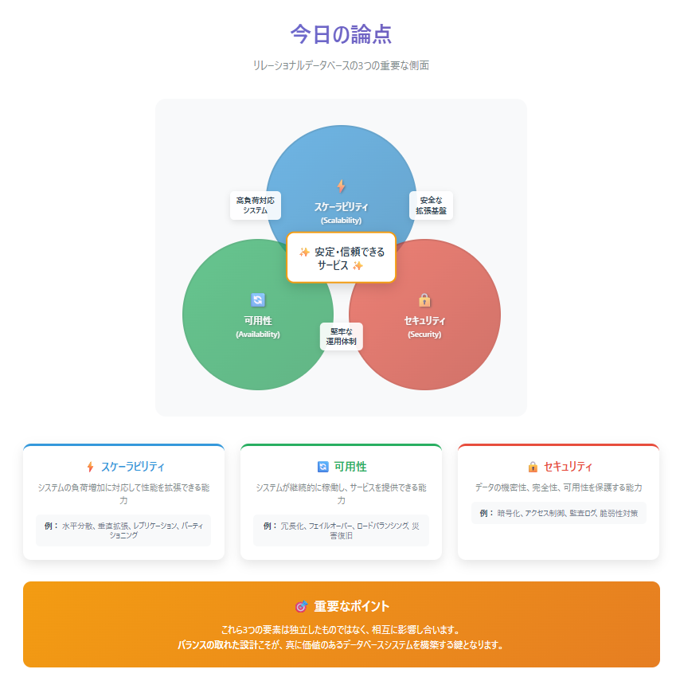

## スケーリングの考え方

### 垂直スケーリング（スケールアップ）

- サーバーのCPUやメモリなどリソースを増強
- 設計はシンプルだが、ハードウェアの限界に依存

### 水平スケーリング（スケールアウト）

- サーバー台数を増やして分散処理
- 大規模化に対応できるが、設計が複雑になる

## RPO と RTO

### RPO（Recovery Point Objective）

- **データ損失の許容範囲**  
- 障害発生時、「どの時点までのデータが戻せればよいか」

### RTO（Recovery Time Objective）

- **復旧にかけられる最大時間**  
- 障害発生から「何分以内にシステムを復旧させる必要があるか」

## 整合性レベル

- **強整合性（Strong Consistency）**  
  - 更新後、全ノードが同じデータを持つ
  - 例：銀行口座残高

- **最終的整合性（Eventual Consistency）**  
  - 一時的に不一致があっても、最終的に一致すればよい
  - 例：SNSのフォロワー数

## まとめ

- スケーラビリティ・可用性・セキュリティの3軸で考える
- 「まず単一ノードで最大限のパフォーマンス → 水平スケーリング」の順で検討
- **RPO/RTOを“数値”として定義する**ことが設計の出発点

## 自サービスのチェック

- 自分のサービスの **RPO / RTO** は言えるか？
- SLO（Service Level Objective）は定義されているか？
  - 通常運用時のサービス品質目標
  - 例：稼働率99.9%、応答時間200ms以下
  - SLA（顧客との合意）の基準となる

# パフォーマンス設計の基本

## はじめに

システムのスケーリングを考える前に、まずは**単一ノードで最大限の性能を引き出す**ことが重要です。  
不必要な分散処理や複雑な構成に頼る前に、「今ある1台」でどこまで出せるかが基本となります。

本セクションでは、RDBのパフォーマンスを最大限に引き出すための設計の基礎を確認します。

## レイテンシ予算の考え方

1リクエストあたりの応答時間には限りがあります。  
アプリケーション層・データベース層それぞれに「予算」を持つことで、ボトルネックを特定しやすくなります。

例：100ms以内にレスポンスしたい場合の内訳（目安）

| 処理内容            | 目安時間 |
|---------------------|----------|
| アプリケーション処理 | 40ms     |
| DBクエリ             | 30ms     |
| ネットワーク         | 20ms     |
| その他バッファ       | 10ms     |

**→ DBは基本的に「1クエリ＝数ms〜10ms以内」が理想**

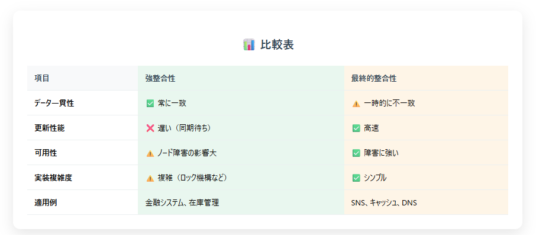

## インデックス設計の原則

インデックスは性能改善の鍵ですが、設計を誤ると逆効果になります。  
以下の3点が重要な観点です。

### 1. 選択性

- 「対象となる行数が全体のうちどれくらいか」
- 高いほどインデックスが有効（例：性別よりもユーザーID）

### 2. 複合キーの順序

- WHERE句やORDER BYに使われるカラム順に注意  
  例：`(user_id, created_at)` は `user_id` が必ずフィルターされる前提

### 3. カバリングインデックス

- **SELECT対象のカラムすべて**がインデックスに含まれていれば、テーブルアクセスが不要  
  → レイテンシ改善に大きく効く

## 典型的アンチパターン

以下のようなクエリは、パフォーマンスを著しく悪化させます。

- **N+1クエリ問題**
  - ループ内で1件ずつDBアクセス
  - → JOINまたはIN句による一括取得に変更すべき

- **汎用LIKE検索**
  - `%キーワード%` のような前方・後方一致はインデックスが効かない  
  - → 対策：全文検索エンジン or N-gram 方式

- **SELECT \***
  - 不必要なカラムまで取得してI/O量が増加  
  - → 必要なカラムだけ明示する

- **不要なJOINの多用**
  - 結合先テーブルが不要な場合はクエリ分離も検討

## パフォーマンスの可視化と継続改善

性能は「一度改善して終わり」ではなく、**常に監視しながらチューニングを続ける**ことが必要です。

### 計測の基本：`EXPLAIN` / `EXPLAIN ANALYZE`

- クエリの実行計画・コスト・スキャン方法を確認できる
- フルテーブルスキャンやインデックススキャンの有無を確認

### 慢SQL（スロークエリ）の監視

- 遅いクエリログを定期的に収集・可視化  
- 監視ツール例：
  - PostgreSQL：pg_stat_statements
  - MySQL：slow_query_log, performance_schema
  - SaaS：Datadog, NewRelic, Redashなど

## まとめ

- スケーリングに頼る前に、**インデックスとクエリの見直しで“基礎体力”を上げる**
- **選択性・複合キーの順序・カバリング**を意識したインデックス設計がカギ
- **プロファイル → 仮説 → 実験 → 再計測**のループを回すのが実務では重要

# データ分割：パーティショニング & シャーディング

## はじめに

単一テーブルや単一サーバーのスケールが限界を迎えたときに、次に考えるのが「データの分割」です。  
この章では、**パーティショニングとシャーディングの違い**、使いどころ、設計の落とし穴について整理します。

## パーティショニングの目的

パーティショニングとは、**1つの論理テーブルを複数の物理領域に分割して管理する手法**です。

主な目的は以下の3つです：

- **メンテナンス性向上**  
  - 古いパーティションだけを DROP／TRUNCATE できる  
- **クエリ効率の最適化**  
  - WHERE句でパーティションを限定すればスキャン範囲が減る（パーティション・プルーニング）  
- **運用簡略化**  
  - 日次・月次などの時間単位で切り替えることで、集計や削除の運用が容易になる

## パーティションキーの設計と注意点

### 主な方式

| 方式     | 説明                                | 主な用途例        |
|----------|-------------------------------------|-------------------|
| 時間軸   | 日付やタイムスタンプで分割          | ログ、履歴、集計系 |
| ハッシュ | 特定のカラムをハッシュして分散      | 均等分散したい場合 |
| レンジ   | 数値・日付の範囲で分割              | 年齢帯、金額帯など |
| リスト   | 明示的な値リストで分割              | 都道府県、カテゴリ |

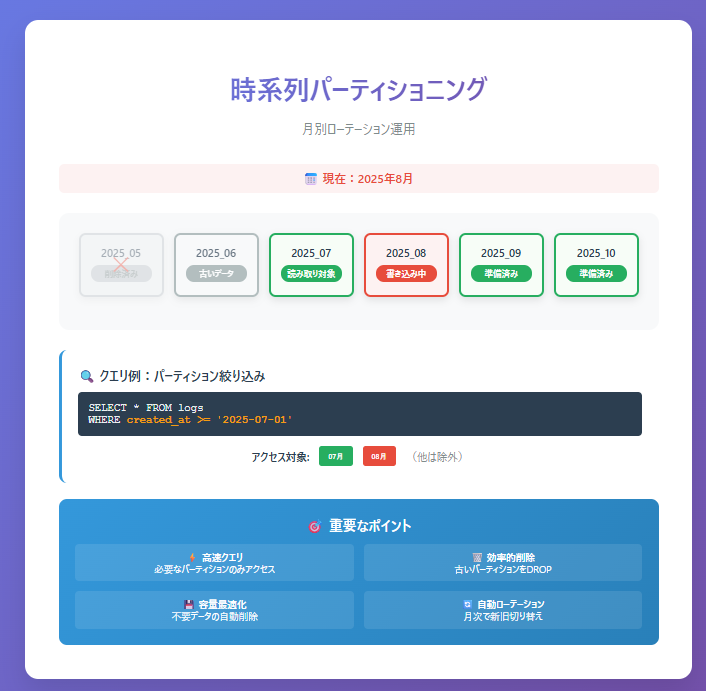

### アンチパターン：ホットパーティション

- 時間やユーザーなど、**特定のパーティションにアクセスが集中**してしまう設計は避ける  
- 例：常に「最新の1日分」だけがアクセスされると、その1パーティションに負荷集中

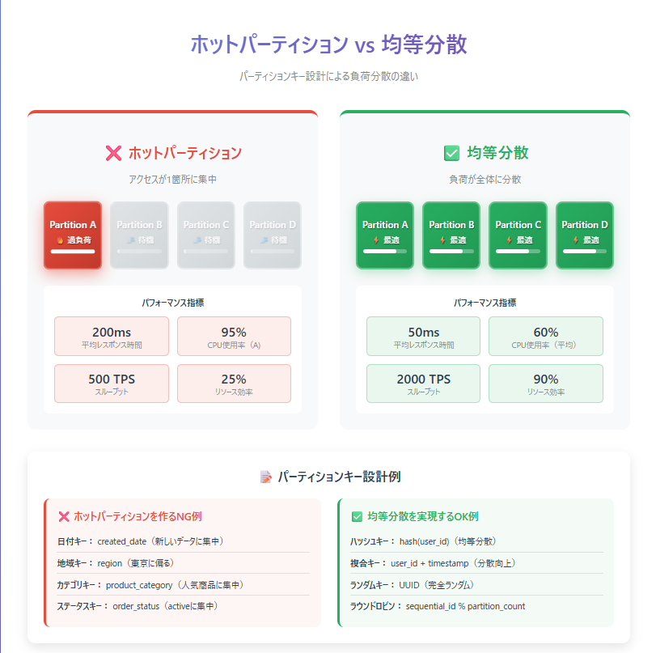

### 対策

- 複数キーの組み合わせ（例：`user_id % 10 + created_date`）
- 定期的にアクセス傾向を見て、再設計や再分割の検討

## シャーディングとは

シャーディングは、**データベース自体を分割（スケールアウト）する手法**です。

- 各シャード（= DBインスタンス）にデータの一部を配置し、負荷を分散  
- 物理的に別のサーバーやインスタンスに分かれる点がパーティショニングと異なる

### パーティショニング例（時系列）

- 月単位でテーブルを分割  
- 直近3ヶ月は残し、それ以前は順次DROP  
- クエリは `WHERE created_at BETWEEN ...` で必要なパーティションのみアクセス

### シャーディング例（ユーザーIDのハッシュ）

- `user_id % 4` でシャードA〜Dに振り分け  
- アプリ or ミドルウェアがルーティング  
- 各シャードは独立したDB（スキーマは同じ）

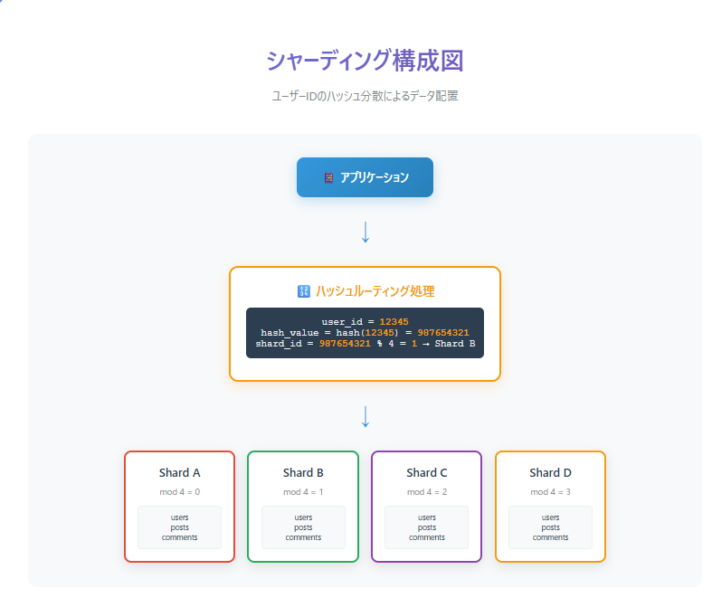

### メリット

- **スケーラビリティの大幅な向上**  
  - 各シャードが独立して処理できるため、並列化が可能

### デメリット

- **クロスシャードJOINができない or 非常に重い**  
  - JOINを避けたアプリ設計が必要になる  
- **トランザクション処理が難しい**  
  - 分散トランザクションの整合性保証コストが高い

## シャードキー選定のチェックポイント

良いシャードキーを選ぶことは、スケーラビリティと運用性に直結します。

チェックポイント：

1. **分布の均一性**
   - データ量・アクセス頻度がシャード間で偏らないか？
2. **局所性**
   - 同じユーザーやリクエスト内で複数シャードをまたがないか？
3. **再シャード容易性**
   - 将来的にシャード数を増減したときに、データ移動コストを抑えられるか？

例：

- 悪い例：ユーザーの居住地（東京に偏る）  
- 良い例：`user_id` のハッシュ（均等に分布しやすい）

## ルーティング戦略

データ分割後、アプリがどのシャードにアクセスするかを判断する「ルーティング」の仕組みが必要です。

| 方法       | 説明                                      |
|------------|-------------------------------------------|
| アプリ側   | アプリコード内でキーを使ってルート計算   |
| ミドルウェア | プロキシ層やライブラリが自動で振り分け   |

アプリ側に持たせると柔軟性があるが、実装負荷が高い  
ミドルウェア型はシンプルに見えるが、ブラックボックス化しやすい

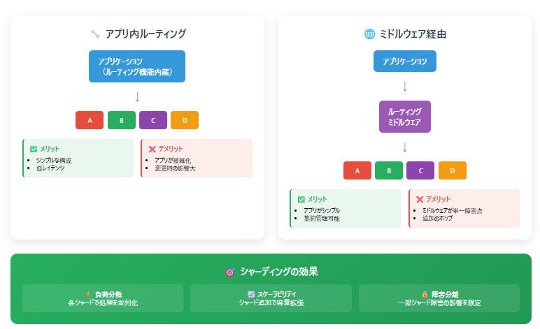

## まとめ

- **パーティショニングは「1台の中で」運用性と性能を高める方法**  
- **シャーディングは「台数を増やして」スケールさせる方法**  
- まずはパーティショニングから着手し、限界を感じたらシャーディングを検討  
- **シャードキー選定が運命を決める**

## チェックリスト

- 今のシステムにシャードまたはパーティションの必要性があるか？  
- 現在採用しているシャードキーは1行で説明できるか？  
- 将来の再シャード時にどれだけダウンタイムが出るか想定しているか？

# レプリケーションと整合性

## はじめに

この章では、**レプリケーションによるデータ整合性の課題とその回避策**について説明します。  
レプリカ構成によって可用性やスケーラビリティは高まりますが、その裏で「整合性が崩れるリスク」が生じることもあります。

まずは、レプリケーションの基本から整理します。

## 同期 vs 非同期レプリケーション

### 同期レプリケーション

- 書き込みを行うと、**すべてのレプリカに反映完了するまでACK（成功応答）を返さない**
- 常に整合性が保たれる
- ただし、**応答速度が遅くなる**可能性がある

### 非同期レプリケーション

- 書き込み後、**即ACKを返し、レプリカには非同期で反映**
- 高速でスケーラブル
- ただし、**レプリカに遅延が生じる可能性がある**

※ほとんどの商用DB（PostgreSQL、MySQL、Auroraなど）は**非同期レプリケーション**を標準としています

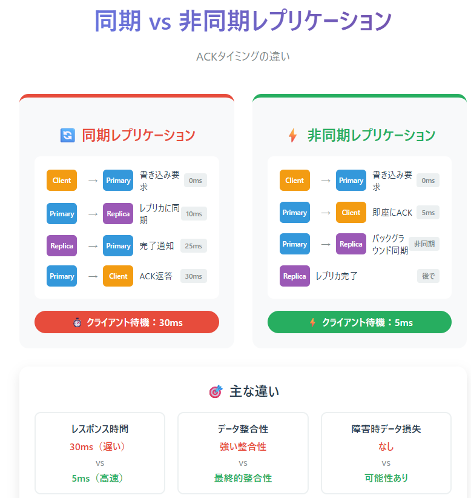

## レプリケーション遅延の実態

非同期レプリケーションでは、以下のような遅延が発生します：

- **数秒〜数十秒のラグ**が生じることもある
- レプリカ側で「バイナリログのリレー待ち」「適用処理の詰まり」が起きる
- 高負荷時やネットワーク不調時に悪化しやすい

### 代表的なメトリクス

| 指標名 | 内容例                           |
|--------|----------------------------------|
| replication_lag（PostgreSQL） | 最新のリプレイ時点との差分（秒）       |
| Seconds_Behind_Master（MySQL） | マスターとの差分秒数                  |
| Replica replay lag（Aurora） | 遅延再生中のイベント秒数               |

このようなラグは、特に「書いた直後に読みたい」場面で問題になります。

## 読み取り分離とRead-after-Write問題

可用性や負荷分散のために、読み取りをレプリカから行う設計は一般的です。  
しかし、**書き込んだ直後に読みにいくと、レプリカにはまだ反映されておらず、古いデータが返ってくる**という問題が起きます。

これを **Read-after-Write問題** と呼びます。

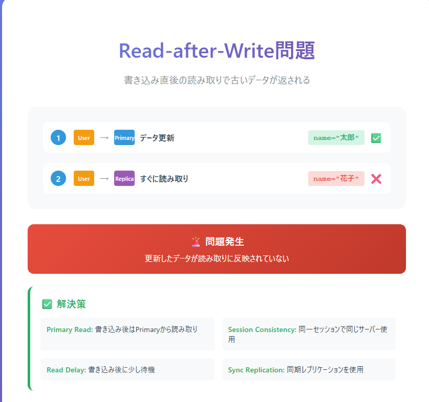

例：

- ユーザーがプロフィールを更新して、すぐに確認画面を表示したが、変更前のデータが見える
- 注文完了画面で、ステータスが「未確定」になっている

このような事象は、ユーザー体験の悪化や二重処理の原因になります。

## 整合性を担保するパターン

以下は、整合性を確保するための一般的な設計パターンです。

### セッション固定（Read Your Writes）

- 1ユーザーの処理を**必ず同じノードに固定**  
- 書き込みと直後の読み取りを同一のマスターノードで行うことで、整合性を担保

### ラグ感知＋プライマリ強制読み

- レプリカのラグが一定以上ある場合、**読み取りをプライマリに切り替える**  
- 特定操作や画面だけ強制的にマスタールートにすることも可能

### 楽観ロック／バージョン管理

- 更新時に**バージョン番号や更新日時を付与し、読み取り側でも検証**  
- 整合性が保証されないことを前提とし、衝突検出やリトライで対応する

### フェイルオーバー時のスプリットブレイン対策

- スプリットブレインとは、ネットワーク分断等で**複数のノードが「自分が正しい」と思い込む状態**
- 対策方法：
  - **投票によるマスタ選出**（3ノード以上の構成）
  - **フェンシングトークン**による排他制御
  - クラウド環境では、**マネージドDBによる自動昇格機能**を活用するのも一手

## 設計のポイント

- **整合性とスループットはトレードオフ**です。  
  - 書き込み直後の確認画面など「重要な読み取り」は、プライマリで実施すべき。
- **ラグを許容できる場面は明確に線引きすること**が、運用上非常に大切です。
- **監視とアプリ側の実装はセット**  
  - キャッシュの無効化  
  - 強制的なマスタールート選択  
  - 整合性レベル（強整合 or 最終整合）のドキュメント化

## まとめ

- 非同期レプリケーションでは、**レプリカにラグがある前提で設計**することが基本
- 書き込み直後に読みたい場面では、プライマリを強制的に使う・セッション固定などの工夫が必要
- 整合性に関する設計判断は、「性能と体験」のトレードオフ
- フェイルオーバー時の設計にも整合性確保の仕組みを組み込むこと

## チェックリスト

- 書き込み直後の読み取りがある画面は、プライマリかレプリカか、明文化されているか？
- レプリカ遅延の監視メトリクスをチームで確認しているか？
- スプリットブレイン対策やマスター昇格戦略が定義されているか？

# 可用性と復旧計画（RPO/RTO・バックアップ＆リカバリ）

## はじめに

この章では、障害や災害が発生した際にシステムをどう復旧させるか、  
そしてどこまでデータを戻せるかという「可用性と復旧計画」の基本を説明します。

ポイントは、**RPO（Recovery Point Objective）とRTO（Recovery Time Objective）を数値で決めること**です。  
これらは技術的な問題ではなく、ビジネスと合意した「約束の値」です。

## RPO と RTO の意味

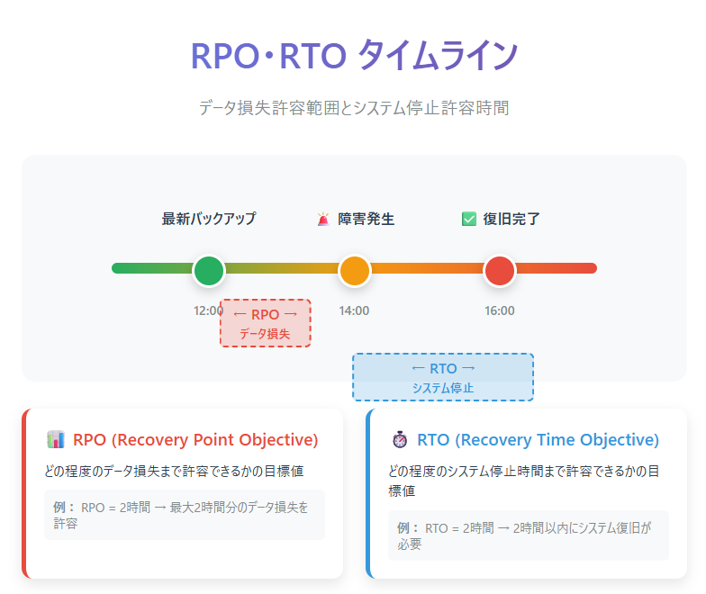

### RPO（目標復旧時点）
- **どこまでデータを戻せればよいか**を示す
- 例：RPOが5分 → 「障害発生時から5分前までのデータがあれば許容」

### RTO（目標復旧時間）
- **どれだけ早く復旧させる必要があるか**を示す
- 例：RTOが15分 → 「障害発生から15分以内にサービス再開」

RPO/RTOは、障害時の**業務影響**と**復旧コスト**のバランスを取るための指標です。

## バックアップ戦略

RPOを達成するためには、適切なバックアップ戦略が必要です。

### バックアップの種類

1. **フルバックアップ**  
   - 全データをまとめて取得
2. **増分バックアップ**  
   - 前回バックアップから変更分のみ取得
3. **差分バックアップ**  
   - 最後のフルバックアップからの変更分を取得
4. **トランザクションログ/WAL/バイナリログの保存**  
   - Point-in-Time Recovery（後述）に必須

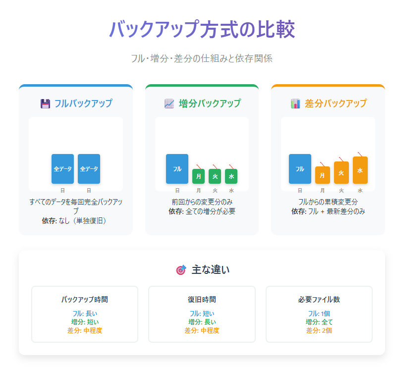

### バックアップの保存場所
- 同一リージョン内
- 異なるリージョン（災害対策用）
- オフライン/コールドストレージ（長期保管）

## リカバリ戦略

RTOを達成するためには、復旧プロセスを短縮する工夫が必要です。

### 代表的な復旧パターン
- **Point-in-Time Recovery（PITR）**  
  障害発生直前までデータを戻す  
  （フルバックアップ + ログ適用）
- **スナップショット復元**  
  直近のスナップショットを使って短時間で復旧
- **災害対策リージョン切替（DR切替）**  
  待機系システムにトラフィックを切り替える

### 復旧時間短縮のポイント
- 復旧手順を自動化（スクリプト化、ツール化）
- 復旧手順書の整備
- 年数回の復旧訓練（リストア演習）で時間計測

## 復旧計画の実践

可用性と復旧計画は「机上の設計」だけでは不十分です。  
定期的に**演習（リハーサル）**を行い、RPO/RTOを本当に満たせるかを確認します。

演習でチェックすべき項目：
- バックアップが最新か
- バックアップデータの整合性（破損していないか）
- 復旧時間が目標値以内か
- 復旧担当者が手順を理解しているか

## 設計のポイント

- RPO/RTOは**必ず数値で明文化し、関係者と合意する**  
- バックアップとリカバリは**対**で設計する（片方だけでは意味がない）
- リカバリ時間は自動化と訓練で短縮できる
- 災害対策リージョンやマルチAZ構成も検討し、可用性を高める

## まとめ

- **RPO**：どこまで戻せるか  
- **RTO**：どれだけ早く復旧できるか  
- バックアップ戦略と復旧手順はペアで設計する
- 演習で数値を確認し、改善を繰り返す

## チェックリスト

- 自サービスのRPO/RTOを数値で言えるか？
- 復旧手順書は最新か？
- 年内にPITR演習を実施したか？

# セキュリティ設計：アクセス制御／暗号化／監査ログ

## はじめに

ここからは、データベースにおけるセキュリティ設計について説明します。  
ポイントは **「事故を起こさない・起きても追える」状態にすること** です。  
そのために必要なのが、権限設計・暗号化・監査ログという三本柱です。

## 最小権限の原則

セキュリティ設計の基本は「最小権限（Least Privilege）」です。  
必要最小限の権限だけを与えることで、誤操作や不正利用のリスクを減らします。

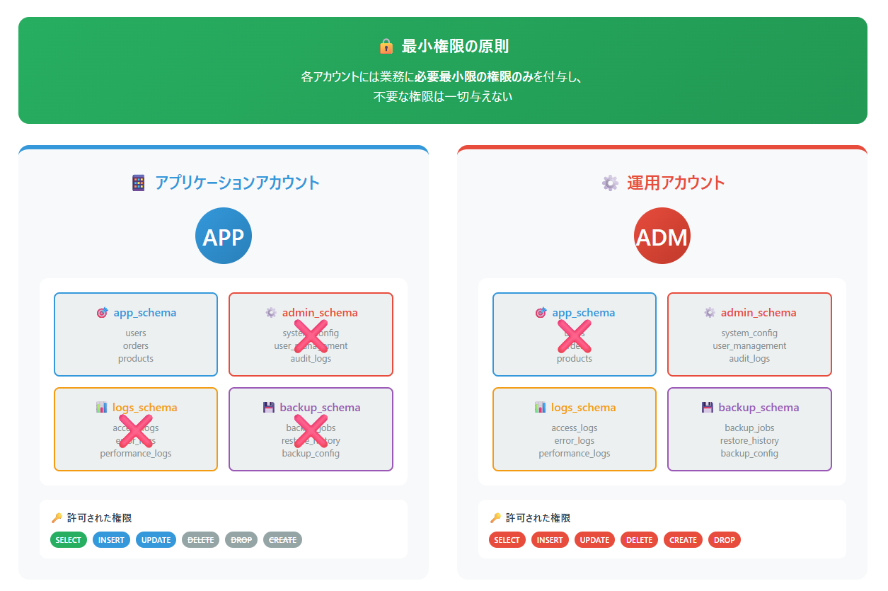

### 実践方法
- **テーブル単位の権限付与**：不要なSELECTやUPDATEを禁止
- **スキーマ分離**：アプリ用スキーマと管理スキーマを分ける
- **アプリ用アカウントと運用用アカウントの分離**：開発者や運用者が直接本番DBにフル権限で入るのを避ける

権限設計は「どの権限を与えるか」ではなく、**「どの権限を外せるか」**を意識することが重要です。

## アクセス制御の実装

権限設計に加えて、アクセス経路を制御することも不可欠です。

- **ロール設計**  
  アプリ用、監査用、管理者用など、役割に応じたロールを定義
- **接続元制限**  
  特定のサーバーやネットワークからしか接続できないようにする
- **IAMとの連携**  
  クラウド環境ではIAM認証を利用して、一時的な資格情報でDBに接続
- **秘匿情報の管理**  
  接続パスワードや秘密鍵は、VaultやKMSといった専用の仕組みで安全に管理

## 暗号化のレイヤー

暗号化は多層で考える必要があります。

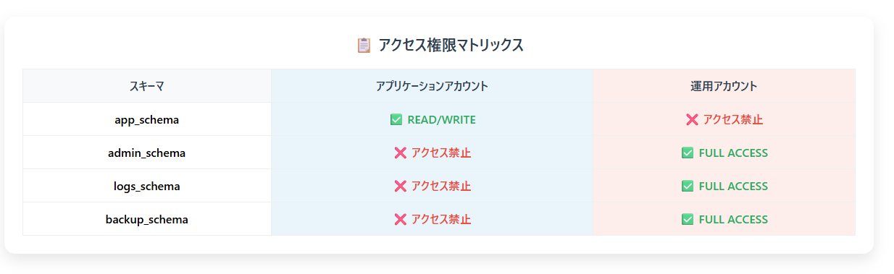

1. **通信の暗号化（TLS）**  
   クライアントとDB間の通信をTLSで保護し、中間者攻撃を防ぐ

2. **保存時の暗号化（TDE／ディスク暗号）**  
   ディスクやストレージに保存されるデータを暗号化  
   → データが盗まれても内容を直接読まれないようにする

3. **アプリレイヤでのフィールド暗号**  
   特に重要な情報（クレジットカード番号、マイナンバーなど）はフィールド単位で暗号化  
   - メリット：漏洩リスクをさらに軽減できる  
   - デメリット：検索やインデックスとの相性が悪くなる  
   - → 導入時は**検索性・運用性とのトレードオフを必ず検証**

## 監査ログ

事故や不正が起きても「追える」ようにするためには、監査ログが欠かせません。

### ログに含めるべき情報
- 誰が（ユーザー／アカウント）
- いつ
- どのテーブルにアクセスしたか
- どのデータを変更したか

### ポイント
- **改ざん耐性**：監査ログは別システムに転送し、DB管理者でも書き換えられないようにする
- **保持期間**：規制や監査要件に応じて数年単位で保管
- **可視化**：ダッシュボードや検知ルールを用意し、「人が見る運用」にする

## 脅威モデルと運用設計

セキュリティ設計は一度きりではなく、継続運用が必要です。

- **鍵ローテーション**  
  秘密鍵や認証情報を定期的に更新する
- **秘密情報の棚卸し**  
  どこに秘密情報が保存されているかを定期的に確認し、不要なものは削除
- **データマスキング**  
  特定のテーブルやカラムに対し、本番環境ではマスキングしたデータしか見せない仕組みを導入

## まとめ

- **最小権限**：アプリと運用を分け、不要な権限を削る  
- **アクセス制御**：ロール、接続元制限、IAM、秘密情報管理を組み合わせる  
- **暗号化**：通信・保存・フィールド単位で多層に守る  
- **監査ログ**：誰が何をしたかを記録し、改ざんできない形で保持する  
- **運用**：鍵ローテーションや棚卸しで継続的にセキュリティを保つ

## チェックリスト

- 本番DBの接続資格情報はVault/KMSで管理され、定期的にローテーションされているか？  
- 権限は最小限に設定されているか？アプリ用と運用用アカウントは分離されているか？  
- 監査ログは「溜めるだけ」ではなく、人が確認できる仕組みになっているか？  

# モニタリング & トラブルシューティング、マイグレーション管理

## はじめに

最後に扱うのは、**システムの健全性を保ち、変更を安全に回すための仕組み**です。  
日々の監視・トラブル対応、そしてDBスキーマ変更の管理は、実運用で避けて通れないテーマです。

## 監視の粒度

モニタリングは複数レイヤーで行う必要があります。  
粒度を分けて監視することで、問題の切り分けが容易になります。

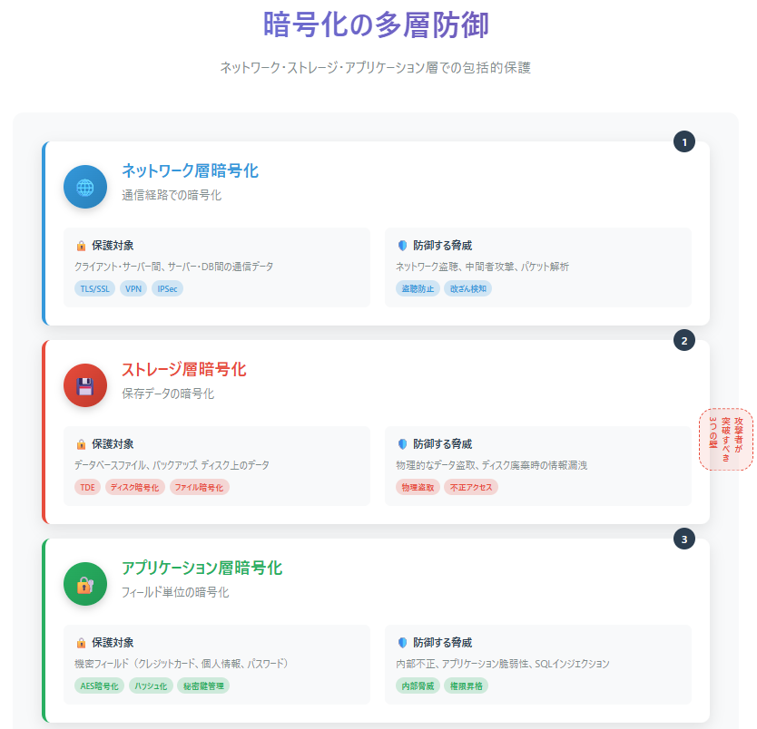

### インフラレベル
- CPU使用率
- ディスクI/O
- ネットワーク帯域

### DBレベル
- 接続数（Connection pool）
- ロックの発生状況
- クエリ遅延（スロークエリ）
- レプリケーション遅延

### アプリレベル
- エラー率（例：5xx）
- レイテンシ指標（p95, p99）
- ユーザー体験に直結するSLOメトリクス

## 障害対応フロー

障害は「起きない」のではなく「起きたときにどう対応するか」が重要です。  
フローをあらかじめ定めておくことで、対応スピードと再発防止力が高まります。

### 基本フロー

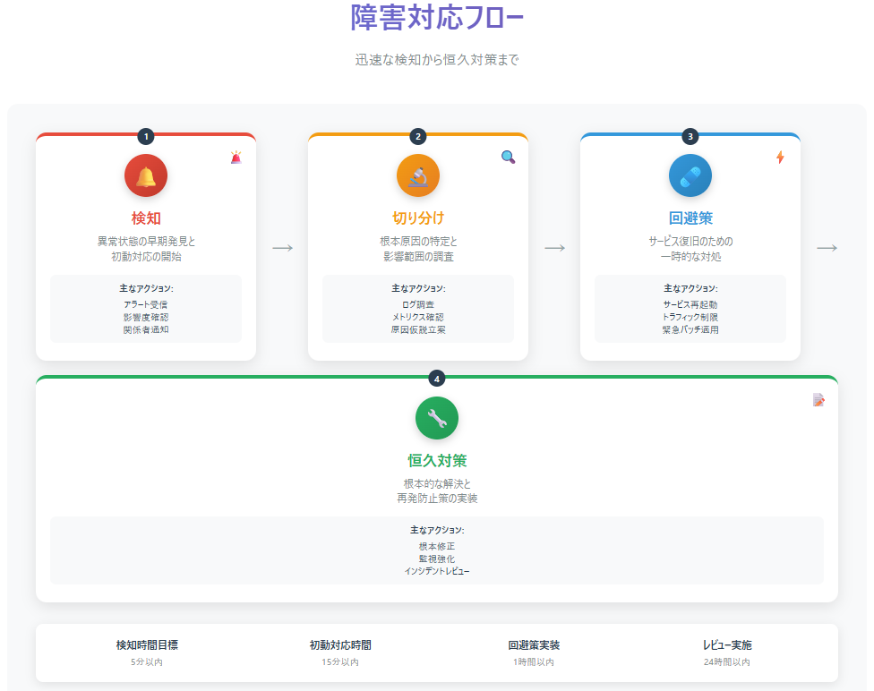

1. **検知**  
   監視アラートやユーザー報告で異常を検知
2. **切り分け**  
   クエリ問題か？インフラ障害か？アプリの不具合か？を特定
3. **回避策**  
   影響を最小化する一時対応（フェイルオーバー、リミット設定など）
4. **恒久対策**  
   障害原因を根本的に解決し、再発防止のためのレビュー（プロブレムレビュー）を実施

### ポイント
- インシデント後には「何を学んだか」を必ずドキュメントに残す
- 可観測性（ログ・メトリクス・トレース）がなければ切り分けはできない

## マイグレーション管理

DBスキーマの変更はシステムを止めるリスクが高いため、**小さく・段階的に・自動化**することが基本です。

### バージョニング
- マイグレーションツール（Flyway, Liquibaseなど）でスキーマ変更をコード化
- 誰が・いつ・何を変更したかを追跡できるようにする

### 前方互換スキーマ
- **expand → migrate → contract** の手順で安全に移行  
  - expand：新しいカラムやテーブルを追加  
  - migrate：アプリケーションを新スキーマ対応に移行  
  - contract：不要になった古いカラムや制約を削除  

### ロールバック戦略

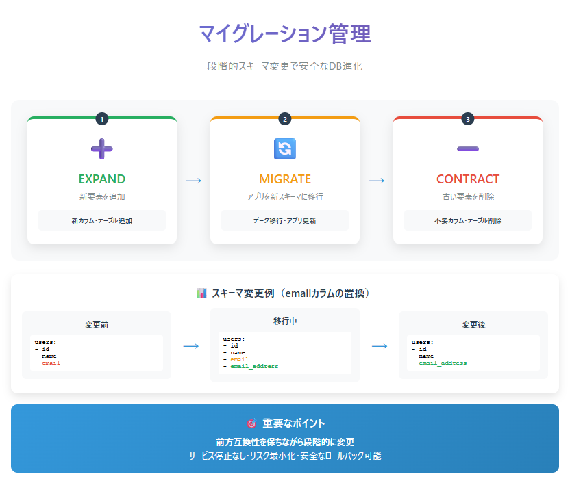

- 変更を戻す手段を事前に設計する  
- 影響範囲を把握し、データ反映手順も合わせて準備  
- 「戻せない変更」（例：カラム削除、データ削除）は特に慎重に扱う

## まとめ

- 監視はインフラ・DB・アプリの3層で粒度を分けて実施  
- 障害対応は「検知 → 切り分け → 回避策 → 恒久対策」の流れを定める  
- スキーマ変更は小さく、段階的に、前方互換性を持たせる  
- インシデント後は必ず学びを残し、ドキュメントに反映する

## チェックリスト

- スキーマ変更に自動テストが組み込まれているか？  
- expand → migrate → contract の段階移行手順をチームで共有しているか？  
- インシデント対応後にプロブレムレビューを行い、知見を蓄積しているか？  

# まとめ 

## 今日の要点

- **スケーリングは「垂直 → 水平」の順に検討**  
  まず1台で性能を出し切り、限界で分散へ  
- **整合性と性能は常にトレードオフ**  
  「どこで最終的整合を許容するか」を設計に組み込む  
- **RPO/RTOは最初に数値で決める**  
  復旧計画はビジネス要件と合意することが出発点  
- **監視と演習は日常業務の一部**  
  慢SQL監視や復旧リハーサルを定期的に行う  
- **セキュリティは三本柱**  
  最小権限・暗号化・監査ログで「事故を起こさない／起きても追える」状態に  

## 参考と次アクション

- 自サービスの **RPO/RTO・整合性要件を文章化** して共有  
- **SQL(slowクエリ)の監視** を導入／強化  
- **PITR（時点復旧）のリハーサル** を実施  