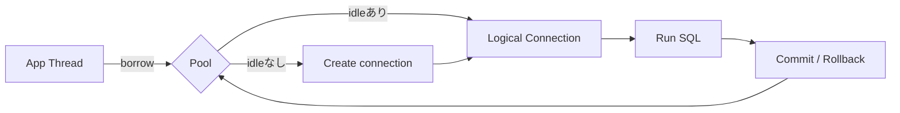
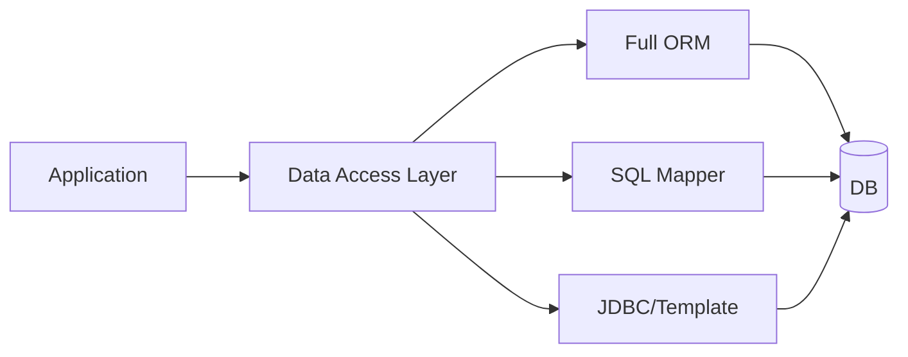
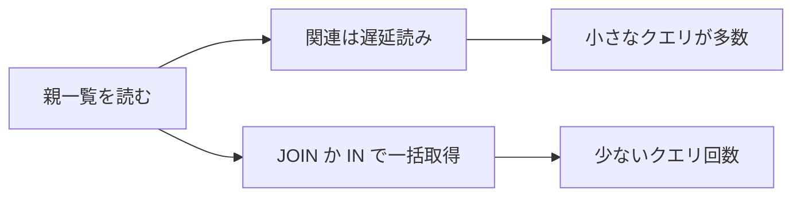
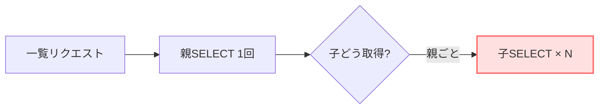
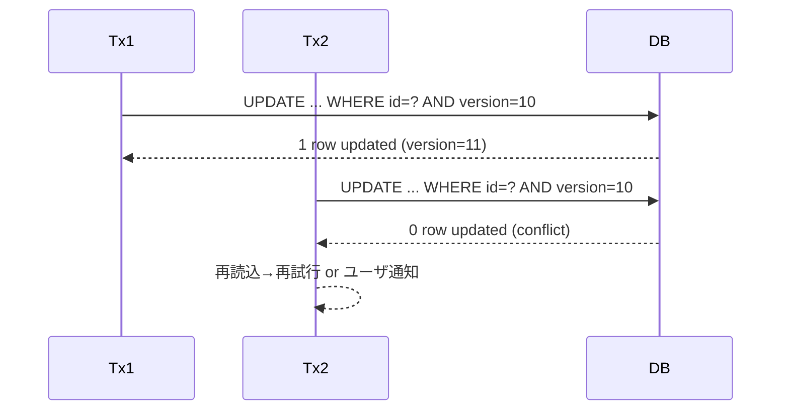
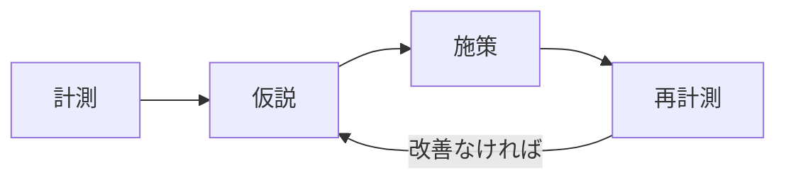

# 9. アプリケーション開発の実践（MyBatis中心）


## 9.1 接続プーリング（Connection Pooling）

### 9.1.1 接続プールとは

* **目的**：DBへの新規接続（TCP/SSLハンドシェイク、認証、セッション初期化）にはコストが高く、都度作成すると遅くて不安定になります。そこで、**物理接続（ソケット）を事前に確保**し、アプリは**論理接続（プロキシ）を借りて返す**だけにする仕組みが**接続プール**です。
* **効果**：レイテンシ低下、スループット向上、DBサーバ負荷の平準化、スパイクへの即応。

### 9.1.2 仕組み（ライフサイクル）

1. アプリのスレッドが「接続が必要」となる。
2. プールは**アイドル接続**があればそれを返す。なければ**上限内で新規作成**する。上限に達していれば**待機**。
3. 返した接続は **論理接続（プロキシ）** で、`close()`を呼ぶと **“物理接続の破棄ではなく返却”** になる。
4. バックグラウンドでプールは、

   * **アイドル監視（idleTimeout）** … 長時間使われない接続をクローズ
   * **最大寿命（maxLifetime）** … 接続を使い回し過ぎない（外部のアイドル切断と整合）
   * **健全性確認（validation/keepalive）** … 破れた接続を排除
     を行う。

> **論理接続**という言葉がポイントです。アプリは“借り物のハンドル”を使ってSQLを流し、使い終わったら**必ず返す**。この返却忘れ（リーク）が最も多い事故です。

### 9.1.3 設計の考え方（サイズ・タイムアウト・全体上限）

* **最大プールサイズ**：Littleの法則の直感を使うとよいです。

  * ざっくり：**同時DB待ち数 ≒ 到達QPS × 平均DB処理時間**（秒）＋安全係数
  * 例）50 rps × 0.05 s ≒ 2.5 → 安全に 6〜8 程度から検証
* **全体上限の把握**：`DB max_connections` を超えないよう、
  **（アプリインスタンス数 × 各インスタンスの maxPool） + 管理系ツール** を合算で管理。
* **`maxLifetime`/`idleTimeout` と外部機器**：LB/Firewall/DB側の**アイドル切断**は周期的に起きがち。**`maxLifetime` をそれより短く**設定して「一斉切断の波」を避ける。
* **`connectionTimeout`**：枯渇時にどれだけ待つか。長すぎるとスレッド滞留、短すぎると失敗が急増。**失敗時のリトライ設計**と合わせて決める。

### 9.1.4 監視・運用

* **見たいメトリクス**：active（使用中）/ idle（待機）/ 待ち行列長 / 借用時間（borrow）/ エラー率 / リサイクル頻度。
* **切り分け**：スパイクで遅い時、**プール枯渇**なのか**クエリが遅い**のかを分離して見る（スロークエリログ＋プール指標）。
* **ヘルスチェック**：過剰な `SELECT 1` は逆効果。短周期なら keepalive を間引く。

### 9.1.5 ありがちな落とし穴

* `close()`忘れによる**リーク**（長時間の`try`で返却忘れ）。
* **過大なプール**でDBを圧迫（CPU/メモリ/コンテキストスイッチ増）。
* **一斉切断**（`maxLifetime` と外部の切断タイマー不一致）。
* OSの**ファイルディスクリプタ上限**（大量接続で枯渇）。

### 9.1.6 参考図（Mermaid）



### 9.1.7 最小コード（HikariCP 設定のごく一部）

```properties
# DataSource（MySQL例）
spring.datasource.url=jdbc:mysql://localhost:3306/app?useSSL=false&characterEncoding=utf8
spring.datasource.username=app_user
spring.datasource.password=secret

# HikariCP（重要どころだけ）
spring.datasource.hikari.maximum-pool-size=20
spring.datasource.hikari.minimum-idle=10
spring.datasource.hikari.connection-timeout=30000   # 30s
spring.datasource.hikari.idle-timeout=600000        # 10m
spring.datasource.hikari.max-lifetime=1700000       # 28m20s（外部切断より短く）
```

> MyBatis はこの DataSource を利用するだけで、プール自体は Hikari 等に委譲します。

---

## 9.2 O/Rマッピングの利点と課題（全体像と選び方）

### 9.2.1 なぜ O/R マッピングが必要か

* アプリは**オブジェクト世界（クラス、参照、コレクション）**で考え、DBは**リレーショナル世界（表、行、外部キー）**でデータを持ちます。両者の**表現ギャップ**を埋め、日常の CRUD を安全・効率的に行うための抽象化が **O/R マッピング**です。
* 期待する価値はおおむね次の4つ：

  1. **生産性**：定型 CRUD・トランザクション処理の定型化/簡略化
  2. **保守性**：スキーマ変更への追従、型安全なマッピング、再利用
  3. **一貫性**：例外/Tx/接続管理の一元化
  4. **可観測性**：SQL ログや実行時のふるまいを把握しやすくする
* 抽象化の裏側では**実際の SQL が必ず流れる**ため、 **内部のクエリを意識しないと性能劣化（N+1、過剰ロード）** を招きます。

---

### 9.2.2 データアクセスの代表アプローチ（俯瞰）

| アプローチ                                   | 代表的な特徴                        | 強み                       | 注意点                                  | 向く場面                          |
| --------------------------------------- | ----------------------------- | ------------------------ | ------------------------------------ | ----------------------------- |
| **フル ORM**（Data Mapper / Active Record） | エンティティ中心、変更検知、関連ナビゲーション、キャッシュ | CRUD の生産性・整合性、一貫した Tx 管理 | 学習コスト、**N+1/過剰 EAGER** の罠、複雑集計は書きにくい | 画面 CRUD 多め、ドメイン規則が厚い、変更検知を活かす |
| **SQL マッパー**                            | SQL は明示記述、結果セットを DTO 等にマッピング  | SQL の可視性・最適化自由度、複雑集計に強い  | 設計次第でスパゲッティ化、責務分割/命名規約が必要            | レポート/集計、性能最優先、RDB 機能を活かす      |
| **手書き JDBC/テンプレート**                     | コネクション/Stmt/ResultSet を直接扱う   | 制御自由度が最大、オーバーヘッド最小       | 記述量が多い、再利用しにくい                       | 局所最適（ホットパス/特殊要件）              |
| **ハイブリッド**                              | CRUD は ORM、重い集計は SQL マッパー     | 使い分けで現実的な最適              | 境界設計が必要                              | 中〜大規模の一般的システム                 |

> 共通原則：**「チームが読める SQL」＋「必要最小データだけ取得」**。アプローチが違ってもこの原則は変わりません。

---

### 9.2.3 主要機能と設計の注意（フレームワーク非依存）

* **マッピング**：列⇔プロパティ、ネーミング規約（snake⇔camel）、型変換（日時/金額/列挙）。
* **アイデンティティマップ**：同一行→同一オブジェクトの一時キャッシュ。多重読み/不整合の制御に影響。
* **変更検知**：オブジェクト差分を UPDATE に変換。**境界（Tx/セッション）を長くしすぎると意図しない更新**の温床。
* **ロード戦略**：

  * **遅延（Lazy）**：必要時に関連読み込み。便利だが **N+1** を生みやすい。
  * **即時（Eager）**：最初から結合。取り過ぎやページング崩れに注意。
  * **画面/API 単位の断面設計**（必要列/必要関連のみ）を徹底。
* **キャッシュ**：1次（セッション）/2次（アプリ）/アプリ外（CDN等）。**無効化戦略と整合性モデル**を伴わないキャッシュはバグの温床。
* **トランザクション境界**：短く、明確に。**Web レイヤまで開きっぱなし**にしない。

---

### 9.2.4 よくある落とし穴と対策

1. **N+1 問題**：関連を親行ごとに個別取得 → **JOIN** または **IN 句の2段取得**＋アプリ側グルーピング（詳細は 9.3）。
2. **巨大グラフの EAGER ロード**：重複行・メモリ圧迫 → 画面/API ごとに **DTO/ビュー**を設計し必要最小限だけ。
3. **セッション境界の肥大化**：OSIV 的に広げると、失敗時の巻き戻りや遅延読み込みが複雑化 → **サービス層で閉じる**。
4. **SQL の散逸**：同じ意味のクエリが各所に複製 → **リポジトリ/Mapper 単位へ集約**し命名規約を統一。
5. **キャッシュ無計画**：ヒット率・整合性の検証なしで2次キャッシュを有効化 → **測定→設計→限定適用**。

---

### 9.2.5 選定の指針（どう選ぶか）

* **ドメインの複雑さ**：集約/不変条件が厚い → ORM が有利。単純集計中心 → SQL 主導。
* **クエリの性質**：ウィンドウ関数・多段集計・DB 固有最適化が必要 → SQL 主導が適合。
* **チームのスキル**：SQL/実行計画を読めるか、ORM のライフサイクルを理解しているか。
* **性能要件**：厳しいホットパスはテンプレート/JDBC直書きも検討。
* **保守運用**：変更頻度・担当者交代に耐える設計（規約、サンプル、リント/レビュー体制）。

---

### 9.2.6 図で理解する（Mermaid）

**A. データアクセス選択肢の地図**



**B. ロード戦略とクエリ回数の違い**




---

## 9.3 N+1問題とその解決（しくみの深掘り・MyBatis）

### 9.3.1 N+1 はなぜ起こるのか（物理的な理由）

* 親テーブルの一覧を**1回**で取得 → その結果の**各行**について、関連する子を**個別にSELECT**するため、合計**1 + N 回**のクエリが発行されます。
* 具体的なトリガ例：

  * **ループ内で Mapper を呼ぶ**（`for` の中で `selectByParentId`）
  * `resultMap` の `<collection select="...">` で、**親行ごとに子SELECT**を実行する設定
  * 画面/API が「親を出した後に、各行の明細を遅延取得」する作り
* 結果：DBは短時間に同型SQLを大量発行 → 往復レイテンシの積み上げ＋ロック競合の誘発。

### 9.3.2 検出方法

* アプリのSQLログに**同じSELECTが連続**して出る。
* DBの監視で**クエリ数のスパイク**／短時間クエリが**鋸歯状**に増える。
* 画面/APIの応答時間が**データ件数に比例して直線的に悪化**する。

### 9.3.3 解決アプローチ（MyBatisでの具体パターン）

**A. 1クエリJOINで一括取得（親＋子）**

* 方法：`parent LEFT JOIN child` で一括取得し、アプリ側で親子に**グルーピング**。
* 長所：クエリ1回で完了。短所：行が**重複**するため、**ページングは工夫**が必要。

**B. 2クエリ（IN句）でまとめて取得**

* 方法：

  1. 親一覧（ページング済）を取得して **親IDの集合**を得る。
  2. 子テーブルを `WHERE parent_id IN (…親ID集合…)` で**まとめて1回**取得。
  3. アプリ側で親IDをキーに**子を集約**して対応付け。
* 長所：ページングと相性良し。IDが多いときは**分割バッチ**（例：1000件ずつ）。

### 9.3.4 Mermaid 図（発生→解消）




### 9.3.5 最小コード（MyBatis）

**A. JOIN 版（重複行はアプリで折りたたむ）**

```xml
<select id="findParentWithChildJoin" parameterType="map" resultType="ParentChildRow">
  SELECT p.id AS parent_id, p.name AS parent_name,
         c.id AS child_id,  c.name AS child_name
  FROM parent p
  LEFT JOIN child c ON c.parent_id = p.id
  WHERE p.status = #{status}
  ORDER BY p.id DESC
  LIMIT #{limit} OFFSET #{offset}
</select>
```

**B. 2クエリIN句 版**

* 親一覧（ページング）

```xml
<select id="findParents" parameterType="map" resultType="ParentRow">
  SELECT id, name, status
  FROM parent
  WHERE status = #{status}
  ORDER BY id DESC
  LIMIT #{limit} OFFSET #{offset}
</select>
```

* 子をIN句で一括取得（`ids` は親IDのリスト）

```xml
<select id="findChildrenByParentIds" parameterType="list" resultType="ChildRow">
  SELECT id, parent_id, name
  FROM child
  WHERE parent_id IN
  <foreach collection="list" item="id" open="(" separator="," close=")">
    #{id}
  </foreach>
</select>
```

> 取得後、`Map<Long, List<ChildRow>>` にまとめ、親側DTOへ詰めます。

---

## 9.4 楽観的ロックと悲観的ロック（SQLで理解）

### 9.4.1 前提：アイソレーションと更新競合

* 伝統的な**隔離レベル（RC/RR/SI）**と、**同一行の同時更新**は別の話です。たとえRCでも、**更新の上書き事故**は起こり得ます。そこで**ロック戦略**が必要です。

### 9.4.2 楽観的ロック（Optimistic Locking）

* **仕組み**：対象行に `version`（または `updated_at`）カラムを持たせ、更新時に
  `WHERE id=? AND version=?` を条件に加える。**該当行が0件更新なら衝突**と判定し、**再試行**や**ユーザ通知**を行う。
* **特徴**：

  * **ロック待ちがない**ため高スループット。
  * 衝突時の**再試行ポリシー**（最大回数・指数バックオフ・Jitter）が設計上の肝。
* **向く場面**：読み取り多めで、同時更新が稀な業務。フォームの**二重送信抑止**にも有効。

**最小SQL（楽観的）**

```sql
-- 事前に SELECT で version を取得しておく
UPDATE account
   SET balance = ?, version = version + 1
 WHERE id = ? AND version = ?;
-- 更新件数=0 なら衝突 → 再読込して再試行 or ユーザ通知
```

### 9.4.3 悲観的ロック（Pessimistic Locking）

* **仕組み**：`SELECT ... FOR UPDATE` などで**行ロック**を取得し、他トランザクションを**待たせる**。
* **バリエーション**：

  * `FOR UPDATE NOWAIT`：待たずに即失敗（DB方言に注意）
  * `FOR UPDATE SKIP LOCKED`：ロック中の行をスキップして進む（ワーカー並列処理に有効）
* **注意点**：

  * **ロック順序の統一**（デッドロック回避）。
  * **短いトランザクション**でロック保持時間を最小化。
  * 適切な**タイムアウト**と**リトライ**の併用。

**最小SQL（悲観的）**

```sql
-- 1) 行をロックして取得（InnoDB/PostgreSQL）
SELECT id, balance FROM account WHERE id = ? FOR UPDATE;
-- 2) 計算して UPDATE（同一Tx内で）
UPDATE account SET balance = ? WHERE id = ?;
```

### 9.4.4 シーケンス（競合の流れ）



### 9.4.5 選び方の指針

* まずは**楽観的＋再試行**で設計し、在庫引当・重複不可予約・採番など**確実性が最優先**な箇所だけ**悲観的**にする、が現実解。

---

## 9.5 データベース設計のアンチパターン（症状→理由→代替）

> 各項目で「**症状**」「**なぜ悪い**」「**代わりに**」の3点を必ず押さえます。

### 9.5.1 EAV（なんでも縦持ち）

* 症状：`entity_id, attr_name, attr_value` の3列で何でも表現。
* なぜ悪い：JOIN/集計が過度に複雑、整合性制約が効かない、型安全性が消える。
* 代わりに：**正規化したサブテーブル**／**JSON列＋制約**／**スキーマ版管理**（DDL進化を前提に）。

### 9.5.2 過剰NULL・多用途混在テーブル

* 症状：1テーブルに異なる概念を押し込み、NULLだらけ。
* なぜ悪い：NOT NULL/UNIQUEが貼れず、インデックスも効きづらい。
* 代わりに：**用途ごとにテーブル分割**、ビューで統合。

### 9.5.3 インデックス無策/順序不適

* 症状：主キー以外の検索列にインデックス無し、複合の並びが用途に合わない。
* なぜ悪い：フルスキャンで遅い。ソート/フィルタの組合せに不一致。
* 代わりに：**ユースケースから逆算**して複合インデックスを設計（選択性→結合→ソート）。

### 9.5.4 自然キーを主キーに（メール/電話をPK）

* 症状：変更され得る値をPKに採用。
* なぜ悪い：変更・重複・再利用で地獄。FK更新も高コスト。
* 代わりに：**サロゲートキー（ID）＋一意制約**で業務上の一意性を担保。

### 9.5.5 タイムゾーン未統一（ローカル保存）

* 症状：`DATETIME` をローカル時刻で保存。
* なぜ悪い：夏時間/国際化で破綻。比較・並び替えが不正確。
* 代わりに：**UTC保存＋表示時変換**。DB/アプリ/ログで統一。

### 9.5.6 巨大BLOB直置き

* 症状：画像/PDF/動画をそのままRDB列に保存。
* なぜ悪い：バックアップ・レプリケーション・I/Oが重い。
* 代わりに：**オブジェクトストレージに外出し＋参照**（URL/キー）。

### 9.5.7 過度な正規化/過度な非正規化

* 症状：正規化し過ぎてJOIN地獄／逆に1表に詰め込みすぎ。
* なぜ悪い：前者は性能劣化、後者は整合性崩壊。
* 代わりに：**ユースケース駆動のバランス**（読み多→適度な非正規化、書き多→整合重視）。

### 9.5.8 機微情報の平文保存

* 症状：個人情報/秘密情報を平文で保持。
* なぜ悪い：漏洩時の影響が致命的、規制違反。
* 代わりに：**列暗号化/アプリ暗号化＋KMS/HSM**、最小権限、マスキング。

### 9.5.9 論理削除×一意制約の破綻

* 症状：`deleted_at` 付きで論理削除するが、一意制約に配慮がない。
* なぜ悪い：削除済レコードが残って**再登録できない**等。
* 代わりに：**部分インデックス**（有効データのみ対象）や**複合キー**（`(unique_col, deleted_flag)`）。

### 9.5.10 履歴を列追加で持つ

* 症状：`status1, status2, status3...` のように列が増殖。
* なぜ悪い：無限増殖・クエリ困難。
* 代わりに：**履歴テーブル**/イベントテーブルで時系列を正規化。

### 9.5.11 マジック値乱立（ENUM/参照表なし）

* 症状：`status=1/2/3` の意味が散逸。
* なぜ悪い：可読性・整合性低下。
* 代わりに：**ENUM/コード表＋ドキュメント**、アプリ側でも型で表現。

---

## 9.6 監視と性能チューニング（MyBatis×Hikari×DBの最小セット）

### 9.6.1 収集すべき指標

* **DB**：スロークエリログ、実行計画、ロック待ち/デッドロック統計。
* **プール**：active / idle / 待ち行列 / borrow時間 / リサイクル頻度。
* **アプリ**：1リクエスト当たりのDB時間、エラー率、タイムアウト数。

### 9.6.2 可視化と切り分け

* まず**プール指標**で枯渇を確認 → 枯渇していなければ**SQL遅延**の可能性が高い。
* スロークエリ上位の**実行計画を読む**→インデックス・結合順序・行数推定を見直し。

### 9.6.3 ガードレール

* **トランザクションタイムアウト**を設定して**長時間ロック**を排除。
* **再試行ポリシー**（回数・バックオフ・Jitter）を統一。
* **接続上限の全体管理**：インスタンス増減時に上限を再計算。

### 9.6.4 小さく回す運用ループ


