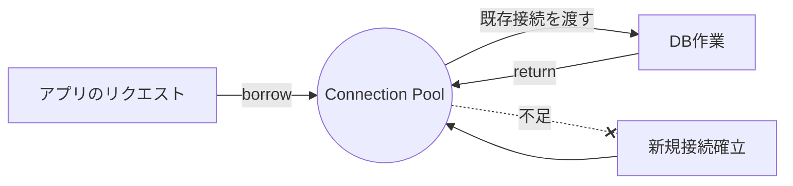

# 9. アプリケーション開発プラクティス（Database Basics 応用編）

> **この章のゴール**
>
> * アプリから安全かつ効率よく DB に接続するための基本設計を理解する。
> * ORM を“魔法の箱”にせず、仕組みと限界を把握する。
> * 有名な落とし穴（N+1、ロック、設計アンチパターン）を自力で避けられるようになる。
>
> 前章までの復習として、SQL の基本・インデックス・トランザクション・正規化などは既知として進めます。必要箇所は要点を再説明します。

---

## 9.1 接続プーリング（Connection Pooling）

### 9.1.1 なぜ必要？

アプリが DB に接続するたびに新規コネクションを張ると、**ネットワーク確立／認証／初期化**のコストが毎回かかり、負荷下で **遅延や枯渇**を招きます。接続プールは **再利用可能な接続を事前に確保**し、借りて返す（borrow/return）方式でコストを平準化します。

> たとえ 1 クエリ 5ms でも、毎回の接続確立が 20〜100ms だと体感は激増します。

#### 図：プールのイメージ



### 9.1.2 代表的な設定パラメータ（観点別）

* **サイズ**

  * `maximumPoolSize / maxPoolSize`：大きすぎると DB が悲鳴。小さすぎると待ち行列が伸びる。
  * 目安：**アプリのCPUコア数 × 2〜4**、かつ DB 側同時接続上限の **余裕内**。
* **待ち**

  * `connectionTimeout`：プールから接続を借りられない場合の待ち時間。**短すぎ→すぐ失敗**、**長すぎ→スレッド滞留**。
* **生存/検証**

  * `idleTimeout` / `maxLifetime`：長生きしすぎる接続は **NAT/Firewall に切られる**ことがある。
  * `validationQuery` / `keepaliveTime`：アイドル中でも疎通検証で**ゾンビ接続**を避ける。
* **観測**

  * メトリクス（borrow時間、使用率、待ち行列長）と**アプリ/DB の接続上限**は必ず監視。

### 9.1.3 典型的な実装例（抜粋）

**Java（Spring Boot + HikariCP）**

```properties
# application.properties
spring.datasource.hikari.maximum-pool-size=20
spring.datasource.hikari.minimum-idle=5
spring.datasource.hikari.connection-timeout=3000
spring.datasource.hikari.max-lifetime=1800000  # 30m
spring.datasource.hikari.idle-timeout=600000    # 10m
```

**Python（SQLAlchemy 2.x）**

```python
engine = create_engine(
    url, pool_size=10, max_overflow=5, pool_timeout=3, pool_recycle=1800
)
```

**Node.js（pg + generic-pool 例）**

```js
const pool = new Pool({ max: 20, idleTimeoutMillis: 10000, connectionTimeoutMillis: 3000 })
```

> **初心者ポイント**: ローカルで「プールなし」でも動きますが、本番では**必須**。まずは **小さめ**に始め、**メトリクスを見ながら調整**しましょう。

---

## 9.2 O/R マッピング（ORM）の利点と課題

### 9.2.1 利点

* **生産性**：CRUD の定型を自動化。少ないコードで高速開発。
* **保守性**：エンティティ中心のモデリングで読みやすく、型安全。
* **移植性**：抽象化により DB 差異をある程度吸収。
* **副作用管理**：トランザクション境界や変更検出（dirty checking）を活用できる。

### 9.2.2 課題（落とし穴）

* **N+1 問題**：関連を巡って暗黙の追加クエリが多発（→9.3）。
* **抽象化の漏れ**：複雑な集計・最適化は **結局 SQL が最強**。
* **方言差**：DB 固有機能（ヒント、ストアド、LOCK句等）は薄まる。
* **マイグレーション**：スキーマ変更は ORM だけに任せず **DDL/インデックス**を理解すること。

### 9.2.3 併用のコツ

* **80/20 ルール**：8割は ORM、**重い読み取りやレポートは生 SQL**（ビューモデル/DTO）で最適化。
* **ログと可視化**：SQL ログ、実行計画、遅延アラートを**開発環境から常時オン**。
* **境界の設計**：Repository/DAO 層で **クエリは見える化**。サービス層にクエリを散らさない。

---

## 9.3 N+1 問題とその解決方法

### 9.3.1 何が起きている？

> 「一覧を1回で取ったのに、各行の関連を読むたびに **追加クエリ**が走り、合計で **N+1 回**になってしまう」

**例（擬似コード）**

```pseudo
users = SELECT * FROM users LIMIT 100;        -- 1回
for user in users:
    posts = SELECT * FROM posts WHERE user_id = :id;  -- 100回
```

### 9.3.2 どう見抜く？

* **開発時ログ**：1画面での SQL 発行回数が不自然に多い。
* **APM/トレース**：同一クエリが短時間に大量発火。
* **DB 側**：同型の SELECT がスパイク。実行計画は単純でも回数で詰む。

### 9.3.3 解決パターン

* **Eager Fetch（結合で一括取得）**

  * `JOIN`／`LEFT JOIN`で**必要列のみ**に絞って一度で取得。
* **Batch Fetch / IN 句のバッチ化**

  * 関連先を `WHERE user_id IN (:ids)` でまとめて取得し、アプリ側でマップ結合。
* **二段階読み取り**

  1. 親をページング取得
  2. 親ID集合で子を一括取得 → マッピング
* **キャッシュ**

  * 参照系が多く更新が少ない箇所は二次キャッシュやアプリ内キャッシュ。
* **GraphQL/DataLoader パターン**

  * リゾルバでの**バッチ化**と**デドゥープ**。

> **注意**: Eager にしすぎて **巨大な Cartesian 結果**を作るのも逆効果。**必要な画面に必要な形**で最適化するのが原則。

---

## 9.4 楽観的ロックと悲観的ロック

### 9.4.1 ロックは“競合の制御”のため

**整合性**を守るにはトランザクション分離だけでは足りない場合があり、**同時更新の衝突**を検出・防止する仕組みが必要です。

### 9.4.2 楽観的ロック（Optimistic Locking）

* **考え方**：普段は衝突しないと“楽観視”。更新時に**バージョン**で衝突検出。
* **実装**：テーブルに `version`（または `updated_at`）列を持ち、`UPDATE ... WHERE id=? AND version=?`。更新成功で `version` を +1。
* **ユースケース**：読み取りが多く、同時更新は稀。API/SPA のフォーム編集など。
* **リトライ設計**：失敗時は**再読込→差分マージ→再送**。UIに「他の更新が入りました」通知を出す。

**例（SQL）**

```sql
UPDATE accounts
   SET balance = balance + :delta, version = version + 1
 WHERE id = :id AND version = :current_version;
-- 0行更新なら衝突（他トランザクションが先に更新）
```

**JPA の例**

```java
@Entity
class Account {
  @Id Long id;
  @Version Long version;
  BigDecimal balance;
}
```

### 9.4.3 悲観的ロック（Pessimistic Locking）

* **考え方**：衝突しそうと“悲観視”。処理中は**明示的にロック**を取り、他の更新を待たせる/弾く。
* **実装**：`SELECT ... FOR UPDATE`（書きロック）、`FOR SHARE`（読取ロック）など。PostgreSQL には `SKIP LOCKED` も。
* **ユースケース**：在庫引当、残高更新、順序保証など**整合性が最優先**のケース。
* **注意点**：

  * ロック保持時間が長いと**待ち行列/デッドロック**。
  * アプリ側タイムアウトと DB 側タイムアウトを**整合**させる。

**例（PostgreSQL）**

```sql
BEGIN;
SELECT * FROM orders WHERE status='READY' FOR UPDATE SKIP LOCKED LIMIT 1;
-- ピックした行のみを安全に処理
UPDATE orders SET status='PROCESSING' WHERE id=:id;
COMMIT;
```

> **指針**: まずは**楽観的**で設計し、必要箇所を**悲観的**に切り替えるのが一般的。

---

## 9.5 データベース設計のアンチパターン

> ここでは“初心者がやりがち”かつ**運用で苦しむ**代表例を挙げます。

* **EAV（属性値型）万能化**：列を固定せず何でも `key/value` に。検索・制約・集計が地獄。**正規化 or JSONB/生成列+索引**を吟味。
* **NULL だらけ／意味過多な列**：1列に複数意味（カンマ区切り、ステータス乱立）。**列を分ける**、マスタ参照に。
* **金額を浮動小数で保存**：`FLOAT/DOUBLE` は不可。**DECIMAL(precision, scale)** を使う。
* **時刻/タイムゾーン無視**：`TIMESTAMP WITHOUT TIME ZONE` 乱用。**UTC基準＋表示でTZ変換**。列名に `_at`、保存は**秒未満精度**も検討。
* **外部キー/一意制約なし**：アプリ頼みは**データ腐敗**の元。**DB制約を主**に、アプリは補助。
* **インデックスの貼りすぎ/貼らなすぎ**：

  * 使われない索引は**更新コスト増**。
  * クエリから**必要な索引を設計**（前章参照）。
* **巨大テーブル一枚岩**：アーカイブ/分割なしで年々重く。**日付パーティショニング**や**履歴テーブル**を検討。
* **UUID v4 乱用で書込み分散不可**：順序性が欲しい場合は **UUID v7** や **雪花ID**、DB 依存なら **IDENTITY/BIGSERIAL**＋バッファリングも検討。
* **JSON を“ごみ箱”化**：検索列は**生成列+索引**で取り出す。スキーマレス≠無秩序。
* **ソフトデリートの設計不足**：`deleted_at` 追加だけで索引/ユニーク制約を崩壊させがち。**部分索引**や **有効レコードビュー**を用意。
* **カスケード削除の乱用**：意図せぬ連鎖。**業務境界単位**で削除を設計。
* **ページング無策**：`OFFSET` 大量は遅い。**キーセットページング**（`WHERE id > ? LIMIT ?`）を検討。
* **照合順序/文字コードの混在**：ソート・比較が想定外。**DB/テーブル/列で方針を統一**。
* **監査不在**：誰がいつ何を変えたか不明。**監査テーブル**や**イベントストア**で履歴を残す。

---

## 付録A：よくある“詰まりポイント”チェックリスト

* 画面 1 回に SQL が **何回**走るか見えているか？（N+1検出）
* 遅いクエリの **実行計画**は見たか？（索引・結合順・行数推定）
* 接続プールの **サイズ/待ち時間/寿命**は根拠を持って設定したか？
* トランザクション境界は **短く**、DB ロックは **最小限**か？
* 変更頻度の高い列に **適切な索引**があるか？
* 金額・時刻・TZ・文字コードは **一貫方針**か？
* 「まず ORM で」→「重い所は生 SQL」に切り替える判断基準を持っているか？

## 付録B：学習用ミニ課題

1. **N+1 の再現と解消**：ユーザー100件＋投稿の一覧を、

   * (a) ループ取得（悪い例）
   * (b) JOIN／IN 句バッチ化（良い例）で比較。SQL 発行回数と時間を記録。
2. **楽観的ロックの実験**：`version` 列を持つテーブルで同一レコードを同時更新。衝突時の UI 表示を設計。
3. **接続プールのチューニング**：プールサイズを変えつつ負荷試験を行い、**スループット/待ち時間/エラー率**の関係を可視化。

---

> **まとめ**：
>
> * 接続プールは **“適正サイズ×監視”** が命。
> * ORM は **使い所**を見極め、**可視化とログ**でコントロール。
> * N+1 は **設計時から回避策**を入れる。
> * ロックは **楽観を基本**、必要時に悲観を選択。
> * 設計アンチパターンは **最初に回避**すると後の幸せが桁違いに増します。
