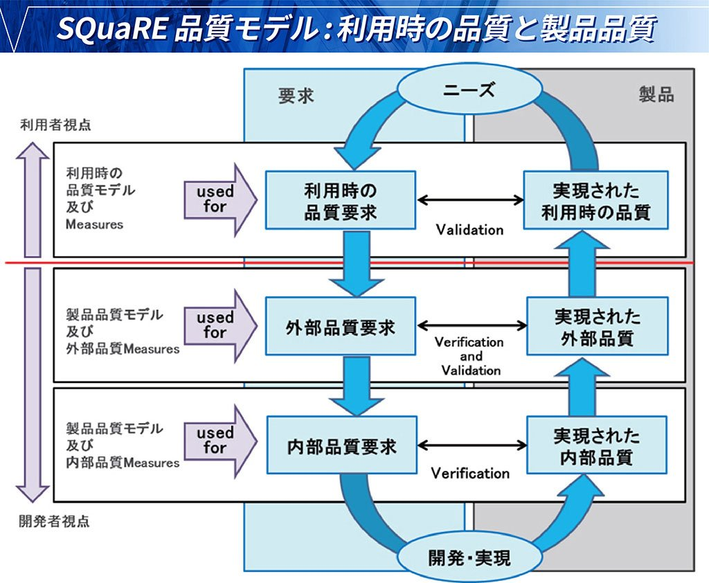
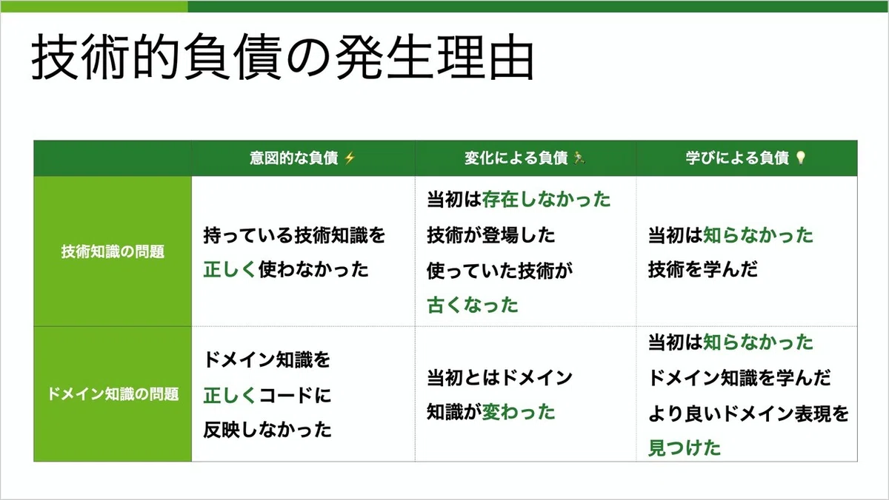
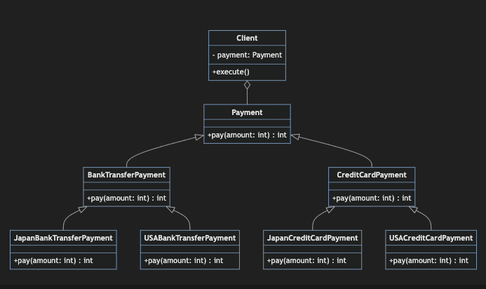
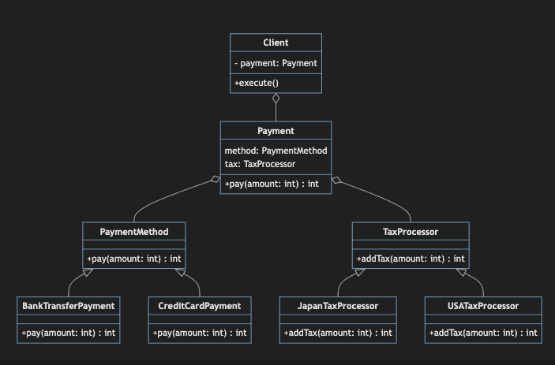

<!-- _class: lead -->

# ソフトウェアの質とデザインパターン入門

ソフトウェアの質とは何かを理解し、デザインパターンでよりよいコードを書く

---

## この講座の目的

- 前提として、ソフトウェアの質とは何かを理解する

  - 質とスピード
  - 外部品質と内部品質

- より良いコードを書くということの解像度を上げる

  - 凝集度と結合度
  - 原則と実践

- デザインパターンの基本的な概念を理解する
  - デザインパターンから実装背景がわかるようになる
  - デザインパターンを使ってよりよいコードを書くことができるようになる

---

## 目次 1 - ソフトウェアの質

1. ソフトウェアの質

   1. 質とスピード
   2. 外部品質と内部品質

1. より良いコードとは

   1. 凝集度と結合度
   1. 原則と実践

---

## 目次 2 - デザインパターン　 1

1. デザインパターンの基礎

   1. デザインパターンとは何か
   1. デザインパターンの利点と欠点
   1. GOF（Gang of Four）デザインパターンの紹介

1. 主要なデザインパターン

   1. 生成パターン
   1. 構造パターン
   1. 振る舞いパターン

---

## 目次 3 - デザインパターン　 2

3. デザインパターンの実践

   1. パターンの選択方法
   1. ハンズオン

4. モダンな開発環境におけるデザインパターン

   1. 関数型プログラミングにおけるデザインパターン
   1. アプリケーションアーキテクチャ/アーキテクチャパターン

---

## 1.1 ソフトウェアの質　 質とスピード

- QCDS のバランス

  - これらの要素はトレードオフの関係にある。本当か？

- 2 人で 10 ヶ月かかる仕事があります。10 人でやると何ヶ月で終わりますか？

  - 小学生の算数でよくありそうな問題。模範解答は`2ヶ月`
  - しかし、ソフトウェア開発ではこうはいかず、下手すれば期間はほとんど変わらない。
  - 人月の神話として知られる。[参考](https://qiita.com/hirokidaichi/items/7f7f7881acba9302301f)

- コストとスピード優先で！品質は後回しで！
  - この時失われる品質とは何？
  - 品質が失われるとどのような問題が発生するのか？

---

### 品質を表すものは多種多様

`Accessibility`,`Adaptability`,`Compatibility`,`Configurability`,`Exploitability`,`Extensibility`,`Flexibility`,`Functionality`,`Installability`,`Integrability`,`Internationalizability`,`Interoperability`,`Administrability`,`Analyzability`,`Learnability`,`Maintainability`,`Marketability`,`Maturity`,`Modifiability`,`Operability`,`Personalizability`,`Portability`,`Recoverability`,`Reliability`,`Auditability`,`Availability`,`Replaceability`,`Reusability`,`Scalability`,`Security`,`Sensitivity`,`Stability`,`Suitability`,`Supportability`,`Testability`,`Traceability`,`Calibrability`,`Changeability`,`Transactionality`,`Understandability`,`Upgradeability`,`Usability`, ... and more

---

- 「SQuaRE」モデルでは、品質は大きく「利用時の品質」と「製品品質」に分かれ、さらに製品品質は「内部品質」と「外部品質」に分かれる。



---

## 1.2 ソフトウェアの質　 外部品質と内部品質

- 外部品質

  - `正当性`, `有用性`, `効率性`など

- 内部品質

  - `保守性`, `柔軟性`, `可搬性`など

##### SQuaRE モデルにおいて、内部品質と外部品質は**原因と結果**の関係にある

```text
「ソフトウェアの品質を外部指標で特徴づける人は多い。正しいことをする、バグがない、速い、などだ。だが、それらはより深い原因の症状にすぎない。
本書で説明するソフトウェアの品質は内部品質である。内部品質を作り込んだ結果として、外部品質として定義される特性の実現に近づくことができる。内部品質は結果ではなく原因であり、良いソフトウェアが備えているべきものだ。」
『レガシーコードからの脱却』（David Scott Bernstein 著）
```

---

### 往々にしいて犠牲にされるのは内部品質

- なぜ内部品質が犠牲にされるのか？

  - 受益者は開発チーム自身であり、顧客・マネージャーに直接的な影響がない
  - スコープ・コスト・納期を動かさなくていい → 調整しなくて済むので短期的な速度が上がる

- 特に、内部品質の中でも`保守性`が犠牲にされるがち

  - モジュール性
  - 再利用性
  - 解析性 ≒ 理解容易性
  - 修正性 ≒ 変更容易性
  - 試験性 ≒ テスト容易性

- 保守性は次の開発コストに直結する

---

### 品質とスピードはトレードオフの関係ではない

- トレードオフではなく、（中長期では）正比例の関係にある

```
最高の開発者がいちばんきれい好きな開発者であることに気づいたとき、私はびっくりした。速いプログラマーは雑なプログラマーだと思っていたからだ。

だが、実際は正反対だった。私が会った中で最速のプログラマーは、コードを扱いやすいように保つことに特に注意を払っていた。

コードを書く速さとコードのきれいさに関連があると認識したあとでも、私はその2つの間の因果関係を見つけるのに時間を要した。

コードの品質を高く保っていた「にもかかわらず」速いのではない。コードの品質を高く保っていた「からこそ」速いのだ。

このことを理解したら、ソフトウェア開発に対する見方が変わった。

『レガシーコードからの脱却』（David Scott Bernstein 著）
```

---

### 保守性が悪いということ（技術的負債）

- 技術知識の問題
- ドメイン知識の問題



#### → 知識をつけることでしか保守性を上げられない

<!-- 発生する領域について、大きく２つに分けて技術知識の問題とドメイン知識の問題があります。技術知識の問題は使っている言語やフレームワーク、ライブラリ等で発生する問題です。もう一方のドメイン知識とは、プログラミングの対象の知識を指します。例えば、出前/宅配サービスを開発するためには、お店や配達員に関する知識が必要。また、ドメイン知識を正しく分析し、モデリングするスキルも必要。 -->

---

### 時間をかけるとよりよい品質が得られるのか？

> 品質は悪いと基本的に手戻りを生むので速度に跳ね返る。手戻っている時間は学びを生まない時間。品質を下げるという判断は学びの速度低下を許容するということ。
> 従来の鉄板（だと誤解されていた）だった「品質捨てて速度上げよう」は、品質は劣化すれば手戻りが発生するだけで、結局はリードタイムの増加に跳ね返るのでやめましょう。
> t-wada さんの知人

- ここでいう学びとは、仮説検証プロセスのこと
- 仮説検証プロセスを回さなければ、学びは生まれない
- どれだけ仮説検証プロセスを素早く円滑に回せるかどうかが競争力となる

---

### まとめ：　コストとスピード、 外部品質/内部品質

- 時間をかければ品質は上がるのか？

  - 品質とは？
    - 品質は外部品質と内部品質に分かれる
    - 内部品質は外部品質の原因である
    - 短期的な速度を上げるために犠牲にされるのは内部品質
  - スピードと品質はトレードオフではなく、正比例の関係にある
    - 内部品質を上げるには技術知識とドメイン知識が必要
    - 内部品質を上げるのは「知識」
    - 知識は仮説検証プロセスを円滑に回すことで得られる

---

## 2.1 より良いコードとは 凝集度と結合度

- より良いコード = （パフォーマンスがよく、）保守性が高いコード
  - モジュール性
  - 再利用性
  - 解析性 ≒ 理解容易性
  - 修正性 ≒ 変更容易性
  - 試験性 ≒ テスト容易性

これらの指標は関連しており、それぞれが他の指標に正の相関を持つ傾向にある
※ モジュール性: コードを独立した単位に分離できていること

---

## 凝集度と結合度　品質の指標

どのような状態であれば、保守性が高いと言えるのか？
モジュールの単位で考えた場合、凝集度と結合度という指標がある

- より良いモジュール： 凝集度が高い
- より良いモジュール間の関係: 結合度が低い
- より良いモジュール群: （クリーンアーキテクチャ、ドメイン駆動設計などのアプリケーションアーキテクチャに従う）

---

### 凝集度

全部で 7 つのレベル。下に行くほど凝集度が高いとされる。

- 偶発的凝集: **避けるべき**
- 論理的凝集: **できるだけ避けるべき**
- 時間的凝集: 小さく保つ
- 手続き的凝集: 小さく保つ
- 通信的凝集: 小さく保つ
- 逐次的凝集: 小さく保つ
- 機能的凝集: 理想

---

#### 偶発的凝集

- 何の関連もない要素が集められている
- 「なんかわからんがとりあえず動く」みたいな状態

```javascript
function process() {
  const data = fetchData();
  const temparature = getTemparature();
  sendPackage();
  buySomething();
}
```

---

#### 論理的凝集

- 論理的凝集
  - 論理的に似て非なるものが集められている
  - DRY 原則を誤解してやりがち

```typescript
function process(flg: boolean) {
  const data = fetchData();
  preProcess(data);
  let result;
  if (flg) {
    result = processA(data);
  } else {
    result = processB(data);
  }
  if (result.length > 0) {
    // Bでしかそこらない
    postBProcess(data);
  }
  postProcess(data);
}
```

---

#### 時間的凝集

- 時間的に近く実行される処理が集められている
  - 実行順序は関係ない
  - 例えば、月次処理、年次処理など
  - 初期化処理、終了処理など

```typescript
function init() {
  // 初期化処理
  config();
  logger();
  connectDb();
}
```

---

#### 手続き的凝集

- 順番に実行される処理が集められている
  - 例えば、データの取得、データの加工、データの保存など

```typescript
function process(id: string) {
  getData(id);
  process(data);
  save(data);
}
```

---

#### 通信的凝集

- 同じデータを使っている処理が集められている

```typescript
function process(data: any) {
  processA(data);
  processB(data);
  processC(data);
}
```

---

#### 逐次的凝集

- ある部分の出力が別の部分の入力となるような処理が集められている

```typescript
function process(data: any) {
  const resultA = processA(data);
  const resultB = processB(resultA);
  const resultC = processC(resultB);
  return resultC;
}
```

---

#### 機能的凝集

- 単一の機能を実現する処理が集められている
- 例えば: 2 点間の距離を計算する

```typescript
function calculateDistance(pointA: Point, pointB: Point): number s {
  return Math.sqrt((pointA.x - pointB.x) ** 2 + (pointA.y - pointB.y) ** 2);
}
```

---

### クソデカ関数は凝集度が低い

- 一つの関数が複数の凝集度を持っている場合、一番低い凝集度として扱う
- 凝集度が低い関数の内容を小さく保つことが大切

---

### なんでも分ければいい、というわけではない

- 関数やクラスを分割することで、凝集度を高めることができる
- 一方で関数が複数に分割されることで`認知負荷`が増えることもある
- 必要に応じて分ければいい

---

### 結合度

---

## 2.2 より良いコードとは 原則と実践

- 原則(Principal)とは？
  - 原則は追い求めるべき理想
  - 例：投資における原則は：安く買って高く売る
  - 当然達成できないこともあるので、原則を目指して努力する
- 実践(Practice)とは？
  - 実際に行うことができること
  - プラクティスにより原則の達成に近づくことができる
  - 確立された方針や方法のこと
  - 例：投資における、ドルコスト平均法

<!-- ソフトウェア開発において知っている原則は？ -->

---

### ソフトウェア開発における原則

- **SOLID 原則**
  - 単一責務の原則(Single Responsibility Principle)
  - オープン・クローズドの原則(Open/Closed Principle)
  - リスコフの置換原則(Liskov Substitution Principle)
  - インターフェース分離の原則(Interface Segregation Principle)
  - 依存性逆転の原則(Dependency Inversion Principle)
- DRY 原則(Do not Repeat Yourself)
- KISS 原則(Keep It Simple, Stupid)
- YAGNI 原則(You Aren't Gonna Need It)
- etc

<!-- ソフトウェアにおけるプラクティスにはどのようなものがあるか？ -->

---

### ソフトウェア開発におけるプラクティス

- アジャイル開発
- ペアプログラミング
- リファクタリング
- ドメイン駆動設計
- テスト駆動開発
- CI/CD
- デザインパターン
- クリーンアーキテクチャ
- etc

---

<!-- _class: tinytext -->

### easy vs simple

ソフトウェア開発の文脈において使い分けをした方がよい

- **easy**: 簡単。手間がかからない ↔︎ **difficult**: 難しい。困難。
- **simple**: 単純。複雑さが少ない ↔︎ **complex**: 複雑。入り組んでいる。

特にシンプルにするためには抽象的な考え方を用いることが重要
→『共通化』するということを考える上では、手続的内容で切り出すのではなく、まずは抽象/具体で考える

概念構造を正しく表現する

シンプルであることはコード量が少ないとは限らないし、コード量が少ないからシンプルとも限らない

---

<!-- _class: tinytext -->

(SOLID 原則を見ていく前に ②)

### 継承(inheritance)と委譲(composition)

#### 継承(inheritance)

- 既存のクラス（親クラスまたはスーパークラス）の特性を新しいクラス（子クラスまたはサブクラス）に引き継がせる

- メリット:

  - コードの再利用性が高まる
  - ポリモーフィズムを活用できる

- デメリット:

  - 強い結合を生み出す（親クラスの変更が子クラスに影響する）
  - 継承の深さが増すと、コードの理解が難しくなる

---

例：

```java
class Animal {
    void eat() {
        System.out.println("This animal eats food.");
    }
}

class Dog extends Animal {
    void bark() {
        System.out.println("The dog barks.");
    }
}
```

---

<!-- _class: tinytext -->

#### 委譲(composition)

- あるクラスが他のクラスのインスタンスを保持する

メリット:

- 柔軟性が高い（実行時に動作を変更できる）
- 低い結合度を実現できる
- 単一責任の原則を守りやすい

デメリット:

- 多くのクラスを作成する必要がある場合がある
- メソッドの委譲を手動で行う必要がある
- 継承に比べてコード量が多くなる可能性がある

---

例：

```java
class Engine {
    void start() {
        System.out.println("Engine started.");
    }
}

class Car {
    private Engine engine = new Engine();

    void start() {
        engine.start();
        System.out.println("Car is ready to go.");
    }
}
```

---

<!-- _class: tinytext -->

#### 継承と委譲の使い分け

- 「is-a」関係の場合は継承を使う
  - 例：Dog is an Animal（犬は動物である）
- 「has-a」関係の場合は委譲を使う
  - 例：Car has an Engine（車はエンジンを持っている）
- 柔軟性が必要な場合は委譲を優先する
- 動作を実行時に変更したい場合や、複数の機能を組み合わせる必要がある場合は委譲が適している
- コードの再利用性を重視する場合は継承を検討する
  - ただし、継承の深さや複雑さに注意する
- インターフェースの実装と組み合わせる
  - 継承の代わりにインターフェースを実装し、必要な機能を委譲で実現する方法もある

```java
interface Flyable {
    void fly();
}

class FlyingMechanism {
    void fly() {
        System.out.println("Flying...");
    }
}

class Bird implements Flyable {
    private FlyingMechanism flyingMechanism = new FlyingMechanism();

    public void fly() {
        flyingMechanism.fly();
    }
}
```

---

<!-- _class: tinytext -->

### 単一責務の原則(Single Responsibility Principle)

#### 意図すること

- クラスは単一の責任のみを持つべきである
- クラスを変更する理由は 1 つだけである

#### メリット

- コードの理解性と保守性が向上する
- 変更の影響範囲が限定される
- ユニットテストが書きやすくなる
- 再利用性が高まる

#### デメリット

- 過度に適用すると、クラス数が増えすぎ複雑度が増す可能性がある
- 全体像の把握が難しくなる可能性がある

---

<!-- _class: tinytext -->

悪い例

```java
class UserManager {
    public void addUser(User user) {
        // ユーザーをデータベースに追加する処理
    }

    public void sendWelcomeEmail(User user) {
        // ユーザーに歓迎メールを送信する処理
    }

    public void generateUserReport() {
        // ユーザーレポートを生成する処理
    }
}
```

---

<!-- _class: tinytext -->

良い例

```java
class User {
    private String name;
    private String email;

    public User(String name, String email) {
        this.name = name;
        this.email = email;
    }
}

class UserRepository {
    public void addUser(User user) {
        // ユーザーをデータベースに追加する処理
    }
}

class UserEmailService {
    public void sendWelcomeEmail(User user) {
        // ユーザーに歓迎メールを送信する処理
    }
}

class UserReportGenerator {
    public void generateUserReport(User user) {
    }
}

public class Main {
    public static void main(String[] args) {
        User user = new User("John Doe", "john@example.com");

        UserRepository userRepository = new UserRepository().addUser(user);
        EmailService emailService = new UserEmailService().sendWelcomeEmail(user);
        ReportGenerator reportGenerator = new ReportGenerator().generateUserReport();
    }
}
```

---

<!-- _class: tinytext -->

### オープン・クローズドの原則(Open/Closed Principle)

#### 意図すること

- ソフトウェアのエンティティ（クラス、モジュール、関数など）は**拡張に対して開かれていて、修正に対して閉じていなければならない**

#### メリット

- 既存のコードを変更せずに機能追加ができる
- カプセル化が促進され、コードの再利用性・可読性が向上する

#### デメリット

- インターフェース等の実装が増え、コード量は増加がち
- 抽象度が上がるため、理解が難しくなる可能性がある
  - これはあるべき姿を正しく反映しているため、学習により解決されべきもの
- 過剰設計になる可能性がある(オーバーエンジニアリング)
  - 最初から適用するのではなく、必要に応じて適用する（TDD など）

---

<!-- _class: tinytext -->

悪い例

```java
class Rectangle {
    double width;
    double height;

    public Rectangle(double width, double height) {
        this.width = width;
        this.height = height;
    }
}

class Circle {
    double radius;

    public Circle(double radius) {
        this.radius = radius;
    }
}

class AreaCalculator {
    public double calculateArea(Object shape) {
        if (shape instanceof Rectangle) {
            Rectangle rectangle = (Rectangle) shape;
            return rectangle.width * rectangle.height;
        } else if (shape instanceof Circle) {
            Circle circle = (Circle) shape;
            return Math.PI * circle.radius * circle.radius;
        }
        throw new IllegalArgumentException("Unsupported shape");
    }
}
```

---

<!-- _class: tinytext -->

いい例

```java
interface Shape {
    double calculateArea();
}

class Rectangle implements Shape {
    private double width;
    private double height;

    public Rectangle(double width, double height) {
        this.width = width;
        this.height = height;
    }

    @Override
    public double calculateArea() {
        return width * height;
    }
}

class Circle implements Shape {
    private double radius;

    public Circle(double radius) {
        this.radius = radius;
    }

    @Override
    public double calculateArea() {
        return Math.PI * radius * radius;
    }
}

class AreaCalculator {
    public double calculateArea(Shape shape) {
        return shape.calculateArea();
    }
}

// 新しい図形を追加する場合
class Triangle implements Shape {
    private double base;
    private double height;

    public Triangle(double base, double height) {
        this.base = base;
        this.height = height;
    }

    @Override
    public double calculateArea() {
        return 0.5 * base * height;
    }
}

```

---

<!-- _class: tinytext -->

### リスコフの置換原則(Liskov Substitution Principle)

#### 意図すること

- プログラムの振る舞いを変えることなく、サブタイプのオブジェクトでスーパータイプのオブジェクトを置き換えられるべきである

#### メリット

- 型の一貫性が保たれ、予測可能な動作が保証される
- ポリモーフィズムを効果的に活用できる
- コードの再利用性と拡張性が向上する

#### デメリット

- 継承関係の設計が複雑になる可能性がある
- 完全な置換可能性を保証するのが難しい場合がある

---

<!-- _class: tinytext -->

悪い例

```java
class Rectangle {
    protected int width;
    protected int height;

    public void setWidth(int width) {
        this.width = width;
    }

    public void setHeight(int height) {
        this.height = height;
    }

    public int getArea() {
        return width * height;
    }
}

class Square extends Rectangle {
    @Override
    public void setWidth(int width) {
        this.width = width;
        this.height = width;
    }

    @Override
    public void setHeight(int height) {
        this.width = height;
        this.height = height;
    }
}

// 使用例
public class Main {
    public static void main(String[] args) {
        Rectangle rectangle = new Square();
        rectangle.setWidth(5);
        rectangle.setHeight(4);
        System.out.println(rectangle.getArea()); // 期待値: 20、実際の出力: 16
    }
}
```

---

<!-- _class: tinytext -->

いい例

```java
interface Shape {
    int getArea();
}

class Rectangle implements Shape {
    protected int width;
    protected int height;

    public Rectangle(int width, int height) {
        this.width = width;
        this.height = height;
    }

    public int getArea() {
        return width * height;
    }
}

class Square implements Shape {
    private int side;

    public Square(int side) {
        this.side = side;
    }

    public int getArea() {
        return side * side;
    }
}

// 使用例
public class Main {
    public static void main(String[] args) {
        Shape rectangle = new Rectangle(5, 4);
        Shape square = new Square(5);

        System.out.println("Rectangle area: " + rectangle.getArea()); // 出力: 20
        System.out.println("Square area: " + square.getArea()); // 出力: 25
    }
}

```

---

<!-- _class: tinytext -->

### インターフェース分離の原則(Interface Segregation Principle)

#### 意図すること

- クライアントは自分が使用しないメソッドに依存させられるべきではない

#### メリット

- クライアントが必要なメソッドのみに依存するため、結合度が低下する
- インターフェースが小さくなり、実装・テストが容易になる
- 柔軟性と再利用性が向上する

#### デメリット

- インターフェースの数が増加し、管理が複雑になる可能性がある
- 過度に適用すると、細かすぎるインターフェースが生まれる可能性がある
- 関連する機能が複数のインターフェースに分散し、全体像の把握が難しくなる可能性がある

---

<!-- _class: tinytext -->

悪い例

```java

interface Worker {
    void work();
    void eat();
    void sleep();
}

class Human implements Worker {
    public void work() {
        System.out.println("Human is working");
    }
    public void eat() {
        System.out.println("Human is eating");
    }
    public void sleep() {
        System.out.println("Human is sleeping");
    }
}

class Robot implements Worker {
    public void work() {
        System.out.println("Robot is working");
    }
    public void eat() {
        // ロボットは食べない
        throw new UnsupportedOperationException();
    }
    public void sleep() {
        // ロボットは眠らない
        throw new UnsupportedOperationException();
    }
}

```

---

<!-- _class: tinytext -->

いい例

```java
interface Workable {
    void work();
}

interface Eatable {
    void eat();
}

interface Sleepable {
    void sleep();
}

class Human implements Workable, Eatable, Sleepable {
    public void work() {
        System.out.println("Human is working");
    }
    public void eat() {
        System.out.println("Human is eating");
    }
    public void sleep() {
        System.out.println("Human is sleeping");
    }
}

class Robot implements Workable {
    public void work() {
        System.out.println("Robot is working");
    }
}

// 使用例
public class Main {
    public static void main(String[] args) {
        Workable human = new Human();
        Workable robot = new Robot();

        human.work(); // 出力: Human is working
        robot.work(); // 出力: Robot is working

        if (human instanceof Eatable) {
            ((Eatable) human).eat(); // 出力: Human is eating
        }

        if (human instanceof Sleepable) {
            ((Sleepable) human).sleep(); // 出力: Human is sleeping
        }
    }
}

```

---

<!-- _class: tinytext -->

### 依存性逆転の原則(Dependency Inversion Principle)

#### 意図すること

- 上位モジュールは下位モジュールに依存すべきではない。両方とも抽象に依存すべきである。
- 抽象は詳細に依存すべきではない。詳細が抽象に依存すべきである。

#### メリット

- 高レベルモジュールと低レベルモジュールの結合度が低下する
- システムの柔軟性と再利用性が向上する
- テストが容易になる

#### デメリット

- 抽象度が上がるため、理解が難しくなる可能性がある
- インターフェースや抽象クラスの数が増え、コード量が増加する
- 過度に適用すると、不必要な抽象化層が生まれる可能性がある

---

<!-- _class: tinytext -->

悪い例

```java
class LightBulb {
    public void turnOn() {
        System.out.println("LightBulb: Bulb turned on...");
    }

    public void turnOff() {
        System.out.println("LightBulb: Bulb turned off...");
    }
}

class ElectricPowerSwitch {
    private LightBulb bulb;
    private boolean on;

    public ElectricPowerSwitch(LightBulb bulb) {
        this.bulb = bulb;
        this.on = false;
    }

    public boolean isOn() {
        return this.on;
    }

    public void press() {
        if (this.on) {
            bulb.turnOff();
            this.on = false;
        } else {
            bulb.turnOn();
            this.on = true;
        }
    }
}

```

---

<!-- _class: tinytext -->

<style>
  .two-column {
    display: flex;
    width: 100%;
  }
  .two-column > div {
    flex: 1;
  }
</style>

いい例

<div class="two-column">
  <div>

```java
interface Switchable {
    void turnOn();
    void turnOff();
}

class LightBulb implements Switchable {
    public void turnOn() {
        System.out.println("LightBulb: Bulb turned on...");
    }

    public void turnOff() {
        System.out.println("LightBulb: Bulb turned off...");
    }
}

class Fan implements Switchable {
    public void turnOn() {
        System.out.println("Fan: Fan started rotating...");
    }

    public void turnOff() {
        System.out.println("Fan: Fan stopped rotating...");
    }
}

class ElectricPowerSwitch {
    private Switchable device;
    private boolean on;

    public ElectricPowerSwitch(Switchable device) {
        this.device = device;
        this.on = false;
    }

    public boolean isOn() {
        return this.on;
    }

    public void press() {
        if (this.on) {
            device.turnOff();
            this.on = false;
        } else {
            device.turnOn();
            this.on = true;
        }
    }
}


```

  </div>
  <div>

```java

// 使用例
public class Main {
    public static void main(String[] args) {
        Switchable bulb = new LightBulb();
        ElectricPowerSwitch bulbPowerSwitch = new ElectricPowerSwitch(bulb);
        bulbPowerSwitch.press();
        bulbPowerSwitch.press();

        Switchable fan = new Fan();
        ElectricPowerSwitch fanPowerSwitch = new ElectricPowerSwitch(fan);
        fanPowerSwitch.press();
        fanPowerSwitch.press();
    }
}


```

  </div>
</div>

---

## 2. デザインパターン

---

## 2.1 デザインパターンとは何か

#### 2.1.1 デザインパターンとは？

- ソフトウェア設計において頻繁に発生する問題に対する再利用可能な解決策
- 既存の問題に対する解決策を再利用するためのガイドライン
- ソフトウェアの設計におけるベストプラクティス
- GoF のパターン以外にもさまざまなパターンが存在

---

<!-- _class: tinytext -->

## 2.1.2 デザインパターンのメリットとデメリット

#### メリット

- 内部品質向上：凝集度が高く、結合度が低いコードを書くための指針
- 共通言語: パターン名を使用することで意図が明確になる

#### デメリット

- 学習曲線: パターンの理解と適切な使用には時間と経験が必要
- 過剰適用: 不適切な状況でのパターン適用が複雑性を増す可能性
- パフォーマンスへの影響: 一部のパターンは、オーバーヘッドを生む可能性

#### パターンを通して学ぶ

- 問題の概念化をし、認識することができるようになる
- 抽象化の正しい使い方、ハイレベルな概念を理解する
- よりよいカプセル化の方法
- SOLID 原則への理解と適用方法

<!-- オブジェクトの差異がインスタンス化の話として扱える時には、 異なる種類の全てのオブジェクトを同じ方法で使える、というこ とをパターンは示す
インスタンス化によってオブジェクト間の違いを隠す方が簡単な ことがよくある
使用と生成を分離することが重要 -->
<!--
        - パターンは、私たちがインターフェースをデザインし、集約を好 み、バリエーションをカプセル化するのを助ける
        - このことは最初は重要でないかもしれないが、新しい要件によっ てバリエーションの組み合わせが増えることは、コード品質の低下につながる
        - パターンを適用することは、カプセル化すること、問題に対して オープン・クローズドであることを助けるため、新しいバリエーションはデザインを毀損せずにすむ -->

---

## 2.1.3 　 GOF（Gang of Four）デザインパターンの紹介

GoF(Gang of Four)：「デザインパターン 要素再利用のためのオブジェクト指向ソフトウェアの基本原則」
Erich Gamma, Richard Helm, Ralph Johnson, John Vlissides の 4 人による著書

- 23 のデザインパターンを提案。以下の 3 つのカテゴリに分類される
  - 生成パターン: オブジェクトの生成に関するパターン
  - 構造パターン: オブジェクトの構造に関するパターン
  - 振る舞いパターン: オブジェクト間の相互作用に関するパターン

---

<!-- _class: tinytext -->

#### 2.2.1 生成パターン

オブジェクトの作成メカニズムに関するパターン

- **Singleton**
- **Factory Method**
- Abstract Factory
- Builder
- Prototype

---

<!-- _class: tinytext -->

#### 2.2.2 構造パターン

クラスやオブジェクトの構成に関するパターン

- Adapter
- **Bridge**
- Composite
- **Decorator**
- **Facade**
- Flyweight
- Proxy

---

<!-- _class: tinytext -->

#### 2.2.3 　振る舞いパターン

オブジェクト間の相互作用や責任の分配に関するパターン

- Chain of Responsibility
- Command
- Interpreter
- **Iterator**
- Mediator
- Memento
- Observer
- **State**
- **Strategy**
- **Template Method**
- Visitor

---

### 2.3 デザインパターンの実装

---

<!-- _class: tinytext -->

### 2.3.1 パターンの選択方法

解決すべき設計上の問題や課題を認識する

- 概念の構造をクラス図やシーケンス図で表現する
- バリエーションを見つける

画一的な方法はない

- 問題に応じて適切なパターンを選択する
- パターンが意図することを理解し、問題を解決するパターンを選択する
- 複数の問題に対して、複数のパターンを組み合わせることもある

> - Design to interfaces
> - Prefer object aggregation over class inheritance
> - Find what should be variable in your design and encapsulate the concept that varies
>   GoF(Gang of Four)：「デザインパターン 要素再利用のためのオブジェクト指向ソフトウェアの基本原則」

- GoF のアドバイス

  - インターフェースをデザインする
  - クラス継承(inheritance)よりもオブジェクト集約(aggregation)を好む
  - デザインの中で変化する概念をカプセル化する

---

<!-- _class: tinytext -->

### 2.3.1 パターンの選択方法　（続き）

TDD をうまく用いる

- red-green-refactor サイクル
- テストを書き、実装し、リファクタリングの段階でパターンを適用する
- テスト自体もリファクタリングの対象になりうる
- テスタビリティがよりよいモジュールの指針になる

コアドメインに対して適用する

- 開発に費やせるコストは有限なため、価値の高い箇所に適用することを意識する

必ずしもパターンを使う必要はない

- パターンはあくまでガイドラインであり、必ずしも適用する必要はない
- 問題とパターン適用による解決方法を認識することで普段の設計に活かすことができる

---

### 2.3.2 ハンズオン

ここから、デザインパターンの意図とそれぞれのケースについてデザインパターン適用前、適用後の例を見ていきます。
それぞれデザインパターンによって適用されたコードに対して変更を加え、メリットを実感しましょう

---

### Strategy Pattern

カテゴリ: 振る舞いパターン

#### 意図

- アルゴリズムをカプセル化し、それらを交換可能にする。クライアントから独立して交換可能にする

#### ケーススタディ

シナリオ: 決済システムで、複数の決済方法（クレジットカード、銀行振込など）をサポートし、国ごとに異なる税計算をサポートする必要がある。どのような実装が可能か。

---

<!-- _class: tinytext -->

実装例 1: switch-case 文を使った実装

```java
class Client {
  public void execute() {
    swith (method) {
      case 'credit' :
        // creditカードの支払い
        // 国ごとの税計算分岐
        break;
      case 'bankTransfer' :
        // 銀行振込
        // 国ごとの税計算分岐
        break;
      default:
        // throw error
    }
  }
}
```

- 実装が簡単
- 再利用ができない
- 分岐漏れによるバグを引き起こす可能性がある
- カプセル化されておらず、見渡しが悪い（パラメータの依存関係が不明瞭）

---

<!-- _class: tinytext -->

実装例 2: 継承を使った実装



- pay メソッドが統一されている
- カプセル化がなされている
- バリエーションの追加に対して指数関数的にクラスを追加する必要がある（クラス爆発）

---

<!-- _class: tinytext -->

実装例 3: Strategy パターンを使った実装



- バリエーションが増えても、単一の新しいクラスを追加するだけでよい
- オープン・クローズドの原則に適合している

---

<!-- _class: tinytext -->

### 演習 1

path: `java-practice/strategy/src/test/java/org/example/practice1/PaymentProcessor1Test.java`

決済システムで、複数の決済方法（クレジットカード、銀行振込など）をサポートした、PaymentProcessor クラスの実装があります。

**問題 1.1**:　`PaymentProcessor1Test.java`のコードの実行を確認し、サンプルコードを確認してください。

**問題 1.2**: 仕様変更として、以下のような手数料計算ロジックを追加してください。

- 仕様
  - クレジットカードの場合: 5% の手数料
  - 銀行振込の場合: 300 円 の手数料
- テストコード`PaymentProcessor2WithFeeTest`は追加済みです。テストが通るように実装を行ってください。

**問題 1.3**: 仕様変更として、BTC 決済を追加してください。

- 仕様
  - 1BTC は 1000 円とします。
  - 手数料は 1BTC とします。
  - テストコード`PaymentProcessor3AddBTCTest`は追加済みです。テストが通るように実装を行ってください。

---

<!-- _class: tinytext -->

### 演習 2

path: `java-practice/strategy/src/test/java/org/example/practice2/NotificationTest.java`

**問題 2.1**: 通知機能を strategy パターンを使って実装してください。

- 仕様

  - SMS、メール、プッシュ通知の 3 つの通知方法をサポートする

- テストコードは追加済みです。テストが通るように実装を行ってください。

---

### Template Method Pattern

カテゴリ: 振る舞いパターン

#### 意図

- アルゴリズムの骨格を定義し、サブクラスでその一部を再定義する

---

### 演習 1

path: `java-practice/templateMethod/src/test/java/org/example/practice1/PaymentProcessor1Test.java`

決済システムで、複数の決済方法（クレジットカード、銀行振込など）をサポートした、PaymentProcessor クラスの実装があります。

**問題 1.1**: `PaymentProcessor1Test.java`のコードの実行を確認し、サンプルコードを確認してください。

**問題 1.2**: 仕様変更として、支払い手段として BTC 決済を追加してください。

- 仕様
  - 1BTC は 1000 円とします。
  - 手数料は 1BTC とします。
  - テストコード`PaymentProcessor3AddBTCTest`は追加済みです。テストが通るように実装を行ってください。

---

## 深く理解するための問いかけ

- BTC のバリエーションは支払い手段として正しいだろうか？

  - BTC は支払い手段として別だが、同時に通貨としては別物である
    - 支払い時には両替レートを考慮する必要がある
  - 支払い手段と通貨は別のバリエーションたり得る
  - 現状の仕様に対する実装としては問題ない

- 支払い通貨として USD のバリエーションを追加する場合にはどうなるか？

  - 通貨両替を行うクラスを定義し、Strategy として別クラスに定義する
  - Template Method および Strategy Pattern を組み合わる

- 税計算などのさらに新しいバリエーションが追加される場合は？

- 支払い方法ごとに必要なアカウント情報を取得・利用するには？

  - クレジットカードなら、カード番号・有効期限・セキュリティコード
  - 銀行振込なら、銀行名・支店名・口座番号・名義人名

- など

---

### State Pattern

カテゴリ: 振る舞いパターン

#### 意図

- オブジェクトの内部状態が変化したときに、その振る舞いを変える

---

### Bridge Pattern

カテゴリ: 構造パターン

#### 意図

- 実装と抽象を分離し、それらを独立に変更できるようにする

---

### Factory method

カテゴリ: 生成パターン

#### 意図

- インスタンス生成のためのインターフェースを定義し、サブクラスで生成するインスタンスを決定する

---
