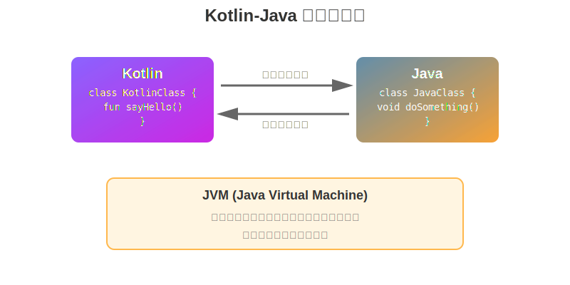
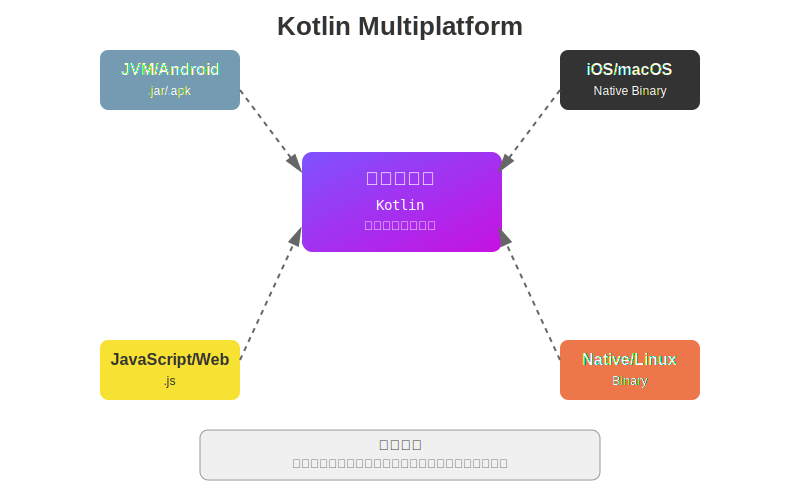

# 第1章：Kotlinとは - Javaエンジニアが知るべき基礎知識

## 1.1 KotlinとJavaの関係性

### JVM上で動作する仕組み

Kotlinは、Javaと同様にJVM（Java Virtual Machine）上で動作するプログラミング言語です。KotlinコンパイラはKotlinソースコードをJavaバイトコードにコンパイルし、これによりJavaプラットフォーム上で実行可能になります。

```kotlin
// Kotlinコード
fun main() {
    println("Hello, Kotlin!")
}
```

上記のKotlinコードは、以下のようなJavaバイトコードにコンパイルされます：

```
// バイトコード（概念的な表現）
public static void main(String[] args) {
    System.out.println("Hello, Kotlin!");
}
```

### 100% Javaとの相互運用性

KotlinはJavaとの完全な相互運用性を提供します。これは以下を意味します：

1. **JavaコードからKotlinを呼び出せる**
```java
// Javaコード
public class JavaClass {
    public void useKotlinCode() {
        KotlinClass kotlin = new KotlinClass();
        kotlin.sayHello();
    }
}
```

2. **KotlinコードからJavaを呼び出せる**
```kotlin
// Kotlinコード
class KotlinClass {
    fun useJavaCode() {
        val javaClass = JavaClass()
        javaClass.doSomething()
    }
}
```

### バイトコードレベルでの互換性

KotlinとJavaは同じバイトコードにコンパイルされるため、以下の利点があります：

- **既存のJavaライブラリをそのまま使用可能**
- **同一プロジェクト内でJavaとKotlinを混在可能**
- **段階的な移行が可能**



## 1.2 Kotlinが隆盛した背景

### Javaの課題とKotlinの解決アプローチ

#### ボイラープレートコードの削減

**Javaの課題：**
```java
// Java - 冗長なGetter/Setter
public class Person {
    private String name;
    private int age;

    public Person(String name, int age) {
        this.name = name;
        this.age = age;
    }

    public String getName() { return name; }
    public void setName(String name) { this.name = name; }
    public int getAge() { return age; }
    public void setAge(int age) { this.age = age; }
}
```

**Kotlinの解決：**
```kotlin
// Kotlin - データクラスで簡潔に
data class Person(var name: String, var age: Int)
```

#### Null安全性の言語レベルでの保証

**Javaの課題：**
```java
// Java - NullPointerExceptionのリスク
String name = null;
int length = name.length(); // NullPointerException!
```

**Kotlinの解決：**
```kotlin
// Kotlin - コンパイル時にnullチェック
var name: String? = null
val length = name?.length // 安全なnull処理
```

#### 関数型プログラミング機能の充実

**Javaの課題（Java 8以前）：**
```java
// Java 7 - 冗長な匿名クラス
List<Integer> numbers = Arrays.asList(1, 2, 3, 4, 5);
List<Integer> doubled = new ArrayList<>();
for (Integer n : numbers) {
    if (n > 2) {
        doubled.add(n * 2);
    }
}
```

**Kotlinの解決：**
```kotlin
// Kotlin - 関数型スタイル
val numbers = listOf(1, 2, 3, 4, 5)
val doubled = numbers.filter { it > 2 }.map { it * 2 }
```

### Google AndroidのKotlinファースト宣言（2017年）

2017年のGoogle I/Oで、GoogleはAndroid開発においてKotlinを第一級言語として正式サポートすることを発表しました。

**影響：**
- Android開発者の急速なKotlin採用
- Android公式ドキュメントのKotlin優先化
- 新しいAndroid APIのKotlin最適化

### サーバーサイド開発での採用拡大

#### Spring Framework 5.0でのKotlin正式サポート

Spring Framework 5.0以降、Kotlinが正式にサポートされ、以下の機能が追加されました：

```kotlin
// Spring BootとKotlinの組み合わせ
@RestController
class UserController(private val userService: UserService) {

    @GetMapping("/users/{id}")
    fun getUser(@PathVariable id: Long) =
        userService.findById(id) ?: throw UserNotFoundException()
}
```

#### マイクロサービスアーキテクチャとの親和性

Kotlinの特徴がマイクロサービス開発に適しています：
- **簡潔性**: サービスのコード量削減
- **Null安全性**: サービス間通信の信頼性向上
- **コルーチン**: 非同期処理の簡潔な実装

### JetBrainsによる継続的な言語改善

JetBrainsは定期的にKotlinをアップデートし、新機能を追加しています：

| バージョン | 主な新機能 |
|----------|----------|
| 1.1 | コルーチン（実験的） |
| 1.3 | コルーチン正式版 |
| 1.4 | SAM変換の改善 |
| 1.5 | Sealed interfaceサポート |
| 1.6 | 型推論の改善 |

### Kotlin Multiplatformによる新たな可能性

Kotlin Multiplatformにより、一つのコードベースから複数のプラットフォーム向けにコンパイル可能：



## 1.3 Javaエンジニアから見たKotlinのメリット

### 学習曲線が緩やか（Javaの知識を活かせる）

Javaエンジニアは既存の知識を活かしながらKotlinを学習できます：

```kotlin
// Javaと似た構文
class Calculator {
    fun add(a: Int, b: Int): Int {
        return a + b
    }

    fun multiply(a: Int, b: Int): Int {
        return a * b
    }
}
```

**Javaの知識が活きる領域：**
- クラス・インターフェースの概念
- 例外処理
- コレクションフレームワーク
- スレッド・並行処理の基礎

### 段階的な移行が可能

既存のJavaプロジェクトに段階的にKotlinを導入できます：

**推奨される移行ステップ：**

1. **テストコードから始める**
```kotlin
// KotlinでのJUnitテスト
class CalculatorTest {
    @Test
    fun testAddition() {
        val calc = Calculator()
        assertEquals(5, calc.add(2, 3))
    }
}
```

2. **新機能をKotlinで実装**
3. **既存コードを徐々にリファクタリング**

### IDEサポートの充実

IntelliJ IDEAおよびAndroid Studioで優れたサポート：

**主な機能：**
- Java→Kotlin自動変換
- リファクタリング支援
- コード補完
- デバッグサポート
- パフォーマンスプロファイリング

### コミュニティの成長と企業採用事例

**採用企業の例：**
- **Netflix**: バックエンドサービスの一部
- **Uber**: Android アプリケーション
- **Pinterest**: Android開発
- **Square**: 決済システム
- **Gradle**: ビルドシステムのDSL

**活発なコミュニティ：**
- KotlinConf（年次カンファレンス）
- Kotlin User Groups（世界各地）
- オープンソースプロジェクトの増加
- Stack Overflowでの活発な質疑応答

## まとめ

本章では、Javaエンジニアの視点からKotlinの基礎知識を学びました：

✅ **KotlinはJVMで動作し、Javaと100%相互運用可能**
✅ **Javaの課題を解決する現代的な言語機能**
✅ **GoogleやJetBrainsの強力なサポート**
✅ **段階的な移行が可能で、学習曲線が緩やか**

次章では、Kotlinの基本構文とJavaとの違いについて詳しく見ていきます。

## 演習問題

1. あなたの既存のJavaプロジェクトにKotlinファイルを1つ追加し、簡単な"Hello, Kotlin!"プログラムを実行してみましょう。

2. JavaクラスからKotlinクラスを呼び出し、KotlinクラスからJavaクラスを呼び出すサンプルを作成してください。

3. 既存のJava POJOクラスをKotlinのdata classに変換してみましょう。