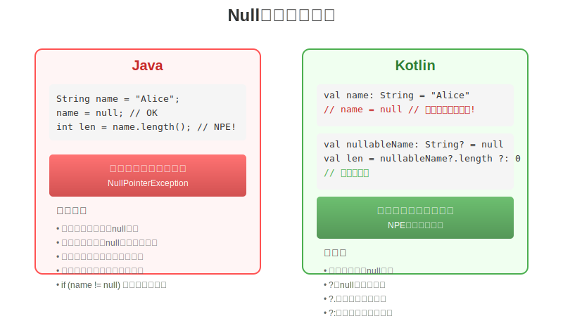
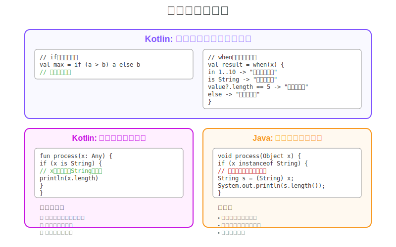

# 第2章：基本構文 - Javaとの違いを理解する

## 2.1 変数と定数

### varとvalの使い分け

Kotlinでは、変数宣言に`var`（variable）と`val`（value）の2つのキーワードを使用します。

#### val - 読み取り専用（推奨）

```kotlin
val name: String = "Kotlin"
// name = "Java" // コンパイルエラー: Val cannot be reassigned
```

**Javaとの比較：**

```java
// Java
final String name = "Kotlin";
```

#### var - 可変変数

```kotlin
var count: Int = 0
count = 1  // OK: 再代入可能
```

**Javaとの比較：**

```java
// Java
int count = 0;
count = 1;  // OK
```

### 型推論の仕組み

Kotlinは強力な型推論機能を持っており、多くの場合、型を明示的に指定する必要がありません。

```kotlin
// 型推論あり
val message = "Hello, World!"  // String型と推論
val number = 42                // Int型と推論
val pi = 3.14                  // Double型と推論

// 明示的な型指定（必要な場合）
val explicitDouble: Double = 42.0
```

**Javaとの比較：**

```java
// Java 10以降（var使用）
var message = "Hello, World!";
var number = 42;

// Java 9以前
String message = "Hello, World!";
int number = 42;
```

### NullableとNon-nullable

KotlinはNull安全性を言語レベルで保証します。

#### Non-nullable型（デフォルト）

```kotlin
var name: String = "Kotlin"
// name = null  // コンパイルエラー: Null can not be a value of a non-null type
```

#### Nullable型（?を付ける）

```kotlin
var name: String? = "Kotlin"
name = null  // OK

// Nullableな変数へのアクセス
val length = name?.length  // 安全呼び出し
val lengthOrZero = name?.length ?: 0  // エルビス演算子
```

**Javaとの比較：**

```java
// Java - すべての参照型がnull可能
String name = "Kotlin";
name = null;  // コンパイル可能（実行時にNPEのリスク）

// Java 8以降のOptional使用
Optional<String> optionalName = Optional.of("Kotlin");
```



## 2.2 基本的なデータ型

### プリミティブ型の扱い

Kotlinではプリミティブ型とラッパー型の区別がありません。コンパイラが最適化を行います。

```kotlin
val intValue: Int = 42
val longValue: Long = 123L
val floatValue: Float = 3.14f
val doubleValue: Double = 3.14159
val byteValue: Byte = 127
val shortValue: Short = 32767
val booleanValue: Boolean = true
val charValue: Char = 'A'
```

**Javaとの比較：**

```java
// Java - プリミティブ型とラッパー型の区別
int intValue = 42;           // プリミティブ
Integer intWrapper = 42;     // ラッパー

// 自動ボクシング/アンボクシング
Integer boxed = intValue;    // ボクシング
int unboxed = intWrapper;    // アンボクシング
```

### 文字列テンプレート

Kotlinは文字列内で変数や式を簡単に埋め込むことができます。

```kotlin
val name = "Kotlin"
val version = 1.8
val message = "Welcome to $name $version!"  // 変数の埋め込み

val calculation = "2 + 3 = ${2 + 3}"  // 式の埋め込み

// 複数行文字列
val multiline = """
    |Kotlin Features:
    |  - Type inference
    |  - Null safety
    |  - Extension functions
""".trimMargin()
```

**Javaとの比較：**

```java
// Java
String name = "Kotlin";
double version = 1.8;
String message = "Welcome to " + name + " " + version + "!";

// Java 15以降のテキストブロック
String multiline = """
    Kotlin Features:
      - Type inference
      - Null safety
      - Extension functions
    """;
```

### 配列とコレクション

#### 配列

```kotlin
// 配列の作成
val numbers = arrayOf(1, 2, 3, 4, 5)
val strings = arrayOfNulls<String>(5)

// プリミティブ型専用の配列
val intArray = intArrayOf(1, 2, 3)
val doubleArray = doubleArrayOf(1.0, 2.0, 3.0)

// 配列へのアクセス
val first = numbers[0]
numbers[0] = 10
```

#### コレクション

```kotlin
// リスト
val immutableList = listOf(1, 2, 3)  // 読み取り専用
val mutableList = mutableListOf(1, 2, 3)  // 可変

// セット
val immutableSet = setOf("A", "B", "C")
val mutableSet = mutableSetOf("A", "B", "C")

// マップ
val immutableMap = mapOf("key1" to "value1", "key2" to "value2")
val mutableMap = mutableMapOf("key1" to "value1")
```

**Javaとの比較：**

```java
// Java
List<Integer> immutableList = List.of(1, 2, 3);  // Java 9+
List<Integer> mutableList = new ArrayList<>(Arrays.asList(1, 2, 3));

Set<String> immutableSet = Set.of("A", "B", "C");  // Java 9+
Set<String> mutableSet = new HashSet<>(Arrays.asList("A", "B", "C"));

Map<String, String> immutableMap = Map.of("key1", "value1");  // Java 9+
Map<String, String> mutableMap = new HashMap<>();
mutableMap.put("key1", "value1");
```

## 2.3 制御構文の進化

### if式とwhen式

#### if式

Kotlinでは`if`は式として値を返すことができます。

```kotlin
// 式として使用
val max = if (a > b) a else b

// 複数行のif式
val message = if (score >= 90) {
    println("Excellent!")
    "Grade A"
} else if (score >= 80) {
    println("Good!")
    "Grade B"
} else {
    println("Keep trying!")
    "Grade C"
}
```

**Javaとの比較：**

```java
// Java - 三項演算子
int max = (a > b) ? a : b;

// Java - if文（式ではない）
String message;
if (score >= 90) {
    System.out.println("Excellent!");
    message = "Grade A";
} else if (score >= 80) {
    System.out.println("Good!");
    message = "Grade B";
} else {
    System.out.println("Keep trying!");
    message = "Grade C";
}
```

#### when式

`when`式はJavaの`switch`文より強力で柔軟です。

```kotlin
// 基本的な使い方
val result = when (x) {
    1 -> "one"
    2 -> "two"
    3, 4 -> "three or four"
    in 5..10 -> "five to ten"
    !in 11..20 -> "not between 11 and 20"
    is String -> "it's a string"
    else -> "unknown"
}

// 引数なしのwhen（if-else chainの代替）
val description = when {
    temperature < 0 -> "freezing"
    temperature < 20 -> "cold"
    temperature < 30 -> "warm"
    else -> "hot"
}
```

**Javaとの比較：**

```java
// Java 14以降のswitch式
String result = switch (x) {
    case 1 -> "one";
    case 2 -> "two";
    case 3, 4 -> "three or four";
    default -> "unknown";
};

// Java 13以前
String result;
switch (x) {
    case 1:
        result = "one";
        break;
    case 2:
        result = "two";
        break;
    default:
        result = "unknown";
}
```

### forループとrange

```kotlin
// 範囲を使ったループ
for (i in 1..10) {
    println(i)  // 1から10まで（両端含む）
}

// untilを使用（終端を含まない）
for (i in 0 until 10) {
    println(i)  // 0から9まで
}

// 逆順
for (i in 10 downTo 1) {
    println(i)  // 10から1まで
}

// ステップ指定
for (i in 0..10 step 2) {
    println(i)  // 0, 2, 4, 6, 8, 10
}

// コレクションのイテレーション
val list = listOf("A", "B", "C")
for (item in list) {
    println(item)
}

// インデックス付きイテレーション
for ((index, value) in list.withIndex()) {
    println("$index: $value")
}
```

**Javaとの比較：**

```java
// Java
for (int i = 1; i <= 10; i++) {
    System.out.println(i);
}

// 拡張for文
List<String> list = List.of("A", "B", "C");
for (String item : list) {
    System.out.println(item);
}

// インデックス付き（手動）
for (int i = 0; i < list.size(); i++) {
    System.out.println(i + ": " + list.get(i));
}
```

### スマートキャスト

Kotlinは型チェック後に自動的にキャストを行います。

```kotlin
fun describe(x: Any): String {
    return when (x) {
        is String -> "String of length ${x.length}"  // 自動的にStringにキャスト
        is Int -> "Integer: ${x * 2}"  // 自動的にIntにキャスト
        is List<*> -> "List of size ${x.size}"  // 自動的にListにキャスト
        else -> "Unknown"
    }
}

// if文でのスマートキャスト
fun processValue(value: Any?) {
    if (value != null && value is String) {
        // ここでvalueは自動的にStringとして扱われる
        println(value.uppercase())
    }
}
```

**Javaとの比較：**

```java
// Java - 明示的なキャストが必要
public String describe(Object x) {
    if (x instanceof String) {
        String s = (String) x;  // 明示的なキャスト
        return "String of length " + s.length();
    } else if (x instanceof Integer) {
        Integer i = (Integer) x;  // 明示的なキャスト
        return "Integer: " + (i * 2);
    }
    return "Unknown";
}

// Java 14以降のpattern matching
if (x instanceof String s) {
    return "String of length " + s.length();
}
```



## まとめ

本章では、Kotlinの基本構文とJavaとの違いについて学びました：

✅ **val/varによる明確な可変性の宣言**
✅ **強力な型推論とNull安全性**
✅ **文字列テンプレートによる簡潔な文字列処理**
✅ **if/whenが式として値を返せる**
✅ **スマートキャストによる安全で簡潔なコード**

これらの機能により、Kotlinではより簡潔で安全なコードを書くことができます。

## 演習問題

1. 以下のJavaコードをKotlinに変換してください：

```java
public class Person {
    private String name;
    private Integer age;

    public Person(String name, Integer age) {
        this.name = name;
        this.age = age;
    }

    public String getDescription() {
        if (age == null) {
            return name + " (age unknown)";
        } else if (age < 18) {
            return name + " is a minor";
        } else {
            return name + " is an adult";
        }
    }
}
```

2. when式を使って、曜日（1-7）を受け取り、平日/週末を判定する関数を作成してください。

3. 1から100までの数値で、3の倍数の時は"Fizz"、5の倍数の時は"Buzz"、両方の倍数の時は"FizzBuzz"を出力するプログラムをKotlinで作成してください。