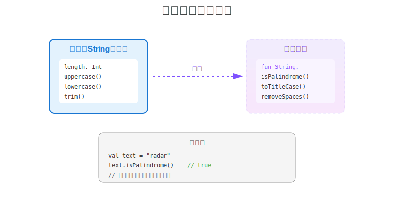
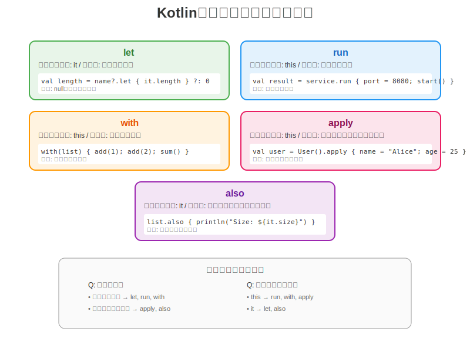

# 第3章：関数とラムダ式 - より表現力豊かなコードへ

## 3.1 関数の定義

### 基本的な関数定義

Kotlinの関数定義はJavaよりも柔軟で簡潔です。

```kotlin
// 基本的な関数
fun greet(name: String): String {
    return "Hello, $name!"
}

// 単一式関数（式本体）
fun add(a: Int, b: Int): Int = a + b

// さらに型推論を使って簡潔に
fun multiply(a: Int, b: Int) = a * b  // 戻り値の型は推論される

// Unit型（voidに相当）を返す関数
fun printMessage(message: String) {
    println(message)
}
```

**Javaとの比較：**

```java
// Java
public String greet(String name) {
    return "Hello, " + name + "!";
}

public int add(int a, int b) {
    return a + b;
}

public void printMessage(String message) {
    System.out.println(message);
}
```

### デフォルト引数と名前付き引数

Kotlinはデフォルト引数と名前付き引数をサポートし、オーバーロードの必要性を減らします。

```kotlin
// デフォルト引数
fun createUser(
    name: String,
    email: String,
    role: String = "user",
    isActive: Boolean = true
): User {
    return User(name, email, role, isActive)
}

// 使用例
val user1 = createUser("Alice", "alice@example.com")  // デフォルト値使用
val user2 = createUser("Bob", "bob@example.com", "admin")
val user3 = createUser(
    name = "Charlie",
    email = "charlie@example.com",
    isActive = false,  // 名前付き引数で特定の引数だけ変更
    role = "moderator"
)
```

**Javaとの比較：**

```java
// Java - オーバーロードが必要
public User createUser(String name, String email) {
    return createUser(name, email, "user", true);
}

public User createUser(String name, String email, String role) {
    return createUser(name, email, role, true);
}

public User createUser(String name, String email, String role, boolean isActive) {
    return new User(name, email, role, isActive);
}
```

### 拡張関数の威力

拡張関数により、既存のクラスに新しいメソッドを追加できます（実際にはクラスを変更しません）。

```kotlin
// String クラスに拡張関数を追加
fun String.isPalindrome(): Boolean {
    return this == this.reversed()
}

// 使用例
val result = "radar".isPalindrome()  // true

// コレクションの拡張関数
fun <T> List<T>.secondOrNull(): T? {
    return if (this.size >= 2) this[1] else null
}

// カスタムクラスへの拡張
fun User.fullInfo(): String {
    return "$name ($email) - Role: $role"
}

// スコープ付き拡張関数
class StringUtils {
    fun String.toTitleCase(): String {
        return this.split(" ").joinToString(" ") { word ->
            word.lowercase().replaceFirstChar { it.uppercase() }
        }
    }
}
```

**Javaとの比較：**

```java
// Java - ユーティリティクラスとして実装
public class StringUtils {
    public static boolean isPalindrome(String str) {
        return str.equals(new StringBuilder(str).reverse().toString());
    }
}

// 使用時
boolean result = StringUtils.isPalindrome("radar");
```



## 3.2 高階関数とラムダ式

### ラムダ式の基本

Kotlinのラムダ式はJava 8のラムダよりも柔軟で強力です。

```kotlin
// 基本的なラムダ式
val sum = { a: Int, b: Int -> a + b }
val result = sum(5, 3)  // 8

// 型推論を活用
val numbers = listOf(1, 2, 3, 4, 5)
val doubled = numbers.map { it * 2 }  // itは暗黙の引数

// 複数行のラムダ
val processString = { str: String ->
    val trimmed = str.trim()
    val uppercased = trimmed.uppercase()
    uppercased.replace(" ", "_")
}
```

### Java 8のラムダとの比較

```java
// Java 8
List<Integer> numbers = Arrays.asList(1, 2, 3, 4, 5);
List<Integer> doubled = numbers.stream()
    .map(n -> n * 2)
    .collect(Collectors.toList());

// 複数行のラムダ
Function<String, String> processString = str -> {
    String trimmed = str.trim();
    String uppercased = trimmed.toUpperCase();
    return uppercased.replace(" ", "_");
};
```

### 高階関数

高階関数は関数を引数として受け取ったり、関数を返したりする関数です。

```kotlin
// 関数を引数に取る高階関数
fun operateOnNumbers(
    a: Int,
    b: Int,
    operation: (Int, Int) -> Int
): Int {
    return operation(a, b)
}

// 使用例
val sum = operateOnNumbers(5, 3) { x, y -> x + y }  // 8
val product = operateOnNumbers(5, 3) { x, y -> x * y }  // 15

// 関数を返す高階関数
fun createMultiplier(factor: Int): (Int) -> Int {
    return { number -> number * factor }
}

val triple = createMultiplier(3)
val result = triple(10)  // 30

// より実践的な例：条件付きフィルタリング
fun <T> List<T>.filterWhen(
    condition: Boolean,
    predicate: (T) -> Boolean
): List<T> {
    return if (condition) this.filter(predicate) else this
}

val users = listOf(User("Alice", 25), User("Bob", 30))
val filtered = users.filterWhen(onlyAdults) { it.age >= 18 }
```

### スコープ関数（let, run, with, apply, also）

Kotlinの特徴的な高階関数として、スコープ関数があります。

```kotlin
// let - null チェックと変換
val name: String? = "Kotlin"
val length = name?.let {
    println("Name is $it")
    it.length  // 最後の式が戻り値
} ?: 0

// run - オブジェクトの設定と結果の計算
val result = StringBuilder().run {
    append("Hello")
    append(" ")
    append("World")
    toString()  // 戻り値
}

// with - 複数のメソッド呼び出し
val numbers = mutableListOf(1, 2, 3)
val stats = with(numbers) {
    val sum = sum()
    val average = sum.toDouble() / size
    "Sum: $sum, Average: $average"
}

// apply - オブジェクトの初期化
val user = User().apply {
    name = "Alice"
    email = "alice@example.com"
    age = 25
}

// also - 副作用の実行
val processedList = listOf(1, 2, 3)
    .map { it * 2 }
    .also { println("Doubled: $it") }
    .filter { it > 2 }
    .also { println("Filtered: $it") }
```

**スコープ関数の選択ガイド：**

| 関数 | コンテキスト | 戻り値 | 使用場面 |
|------|------------|--------|---------|
| let | it | ラムダの結果 | null チェック、変換 |
| run | this | ラムダの結果 | 初期化と計算 |
| with | this | ラムダの結果 | 複数操作の集約 |
| apply | this | コンテキストオブジェクト | オブジェクト設定 |
| also | it | コンテキストオブジェクト | 副作用、デバッグ |



## 3.3 インライン関数

### パフォーマンスの最適化

インライン関数はコンパイル時に呼び出し元に展開され、ラムダのオーバーヘッドを削減します。

```kotlin
// インライン関数の定義
inline fun measureTime(block: () -> Unit): Long {
    val start = System.currentTimeMillis()
    block()
    return System.currentTimeMillis() - start
}

// 使用例
val time = measureTime {
    // この処理は関数呼び出しではなく
    // 直接インライン展開される
    Thread.sleep(1000)
}

// コレクション操作のインライン化
inline fun <T> List<T>.customForEach(action: (T) -> Unit) {
    for (element in this) {
        action(element)
    }
}

// noinline修飾子
inline fun processData(
    inline process: () -> Unit,
    noinline callback: () -> Unit  // この引数はインライン化されない
) {
    process()
    saveCallback(callback)  // 関数を保存できる
}
```

### reified型パラメータ

インライン関数では、実行時に型情報を保持できる`reified`修飾子を使用できます。

```kotlin
// reifiedを使った型チェック
inline fun <reified T> isInstance(value: Any): Boolean {
    return value is T
}

// 使用例
val result1 = isInstance<String>("hello")  // true
val result2 = isInstance<Int>("hello")     // false

// より実践的な例：JSON パース
inline fun <reified T> String.parseJson(): T {
    // Gsonなどのライブラリを使用
    return Gson().fromJson(this, T::class.java)
}

val user: User = jsonString.parseJson()

// Javaでは型消去のため不可能
// Java
public <T> boolean isInstance(Object value) {
    // T.class は使用できない！型消去のため
    return false;
}
```

### クロスインライン

ラムダ内から非ローカルリターンを可能にします。

```kotlin
inline fun runWithLogging(crossinline block: () -> Unit) {
    println("開始")
    try {
        block()
    } finally {
        println("終了")
    }
}

fun processItems(items: List<String>) {
    runWithLogging {
        items.forEach { item ->
            if (item.isEmpty()) {
                return@forEach  // ローカルリターン
            }
            println(item)
        }
    }
}
```

## 実践的なサンプル

### 関数型プログラミングスタイルのデータ処理

```kotlin
data class Transaction(
    val id: String,
    val amount: Double,
    val category: String,
    val date: LocalDate
)

// 関数型スタイルでの集計処理
fun analyzeTransactions(transactions: List<Transaction>) {
    transactions
        .filter { it.amount > 0 }
        .groupBy { it.category }
        .mapValues { (_, transactions) ->
            transactions.sumOf { it.amount }
        }
        .entries
        .sortedByDescending { it.value }
        .take(5)
        .forEachIndexed { index, entry ->
            println("${index + 1}. ${entry.key}: ¥${entry.value}")
        }
}

// カスタムDSL風の記述
fun transaction(init: Transaction.Builder.() -> Unit): Transaction {
    val builder = Transaction.Builder()
    builder.init()
    return builder.build()
}

val newTransaction = transaction {
    id = "TRX001"
    amount = 1500.0
    category = "Food"
    date = LocalDate.now()
}
```

## まとめ

本章では、Kotlinの関数とラムダ式の強力な機能について学びました：

✅ **デフォルト引数と名前付き引数による柔軟な関数定義**
✅ **拡張関数による既存クラスの機能拡張**
✅ **高階関数とラムダ式による関数型プログラミング**
✅ **スコープ関数による簡潔なコード記述**
✅ **インライン関数とreified型パラメータによる最適化**

これらの機能により、Javaよりも表現力豊かで簡潔なコードを書くことができます。

## 演習問題

1. 以下のJavaコードをKotlinの拡張関数を使って書き直してください：

```java
public class StringUtils {
    public static String capitalize(String str) {
        if (str == null || str.isEmpty()) return str;
        return str.substring(0, 1).toUpperCase() + str.substring(1);
    }
}
```

2. スコープ関数を使って、以下の処理を簡潔に書き直してください：

```kotlin
val list = mutableListOf<Int>()
list.add(1)
list.add(2)
list.add(3)
println(list)
val sum = list.sum()
```

3. 高階関数を使って、リトライロジックを実装してください：

```kotlin
fun <T> retry(times: Int, block: () -> T): T {
    // 実装してください
}
```