# 4. 具体的なセキュリティ脆弱性と対策

### はじめに

本章では OAuth（Open Authorization）および OIDC（OpenID Connect）における代表的な脆弱性と対策について解説します。

## 4.1 　 OAuth（Open Authorization）および OIDC（OpenID Connect）におけるセキュリティリスク

認証・認可プロトコルとして広く利用されているこれらの仕組みには、CSRF 攻撃、リダイレクト攻撃、クロスサイトスクリプティング、認可コードインジェクション等のセキュリティリスクが存在します。
これらの脆弱性を理解し、state パラメータや PKCE、nonce などの適切な対策を実装することで、より安全な認証・認可システムを構築することができます。

また、

## 4.1.0 CSRF(Cross-Stie-Request-forgery)

CSRF 攻撃とはすばり、悪意のある Web サイトが、ユーザーが知らないうちに別の Web サイトに対して不正なリクエストを送信させる攻撃手法です！

以下は典型的な攻撃の 1 例になります。

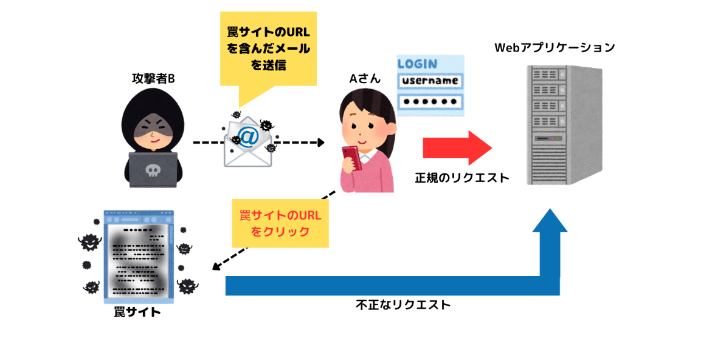

A さんは、自身の預金残高を確認しようと銀行の Web アプリへログインし、そのままログアウトをせずサイトを離れました。その後、攻撃者 B からメールで送られてきた「罠のサイト」の URL をクリックし、アクセスしてしまいます。

この罠サイトは、「攻撃対象の Web アプリケーション（今回は銀行サイト）に不正なリクエストを送信すること」を目的として、攻撃者 B が事前に作成したものです。

A さんが銀行の Web アプリにログインした状態でこの罠サイトにアクセスしたことで、銀行の Web アプリに不正なリクエストが自動送信され、A さんの口座から攻撃者 B の口座へ、意図せず 10 万円が振り込まれてしまいました。

このように CSRF 攻撃では、サービスにログイン中のユーザーに対し、攻撃者の意図にそったリクエストを実行させることができてしまいます。

そのほかの、よくある被害として、Ｘの利用者がツイートされた罠リンクを踏んでしまい、自分のアカウントで勝手にスパムのツイートがされるようになる、というものがあります。それ以外にも、自分のショッピングサイトのアカウントで勝手に物が購入されていたり、勝手にパスワードやメールアドレスが変更されていたりというような被害が起こる可能性があります。

## 4.1.1 OAuth2.0 の CSRF

続いて、OAuth2.0 での CSRF についてです。
OAuth2.0 における CSRF 攻撃とは、攻撃の標的となったユーザに攻撃者のリソースを処理させる権限を与えることです。

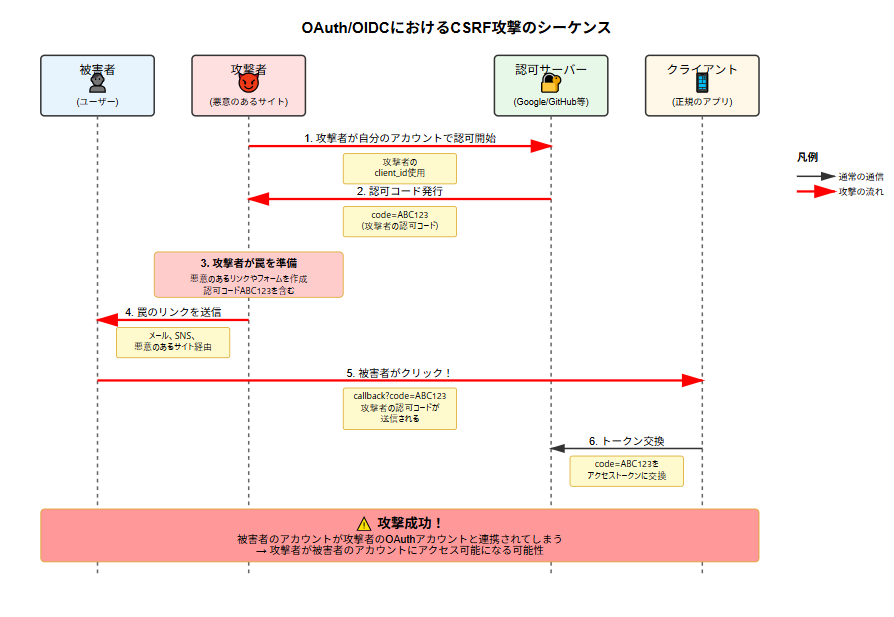

このシーケンス図では、OAuth/OIDC における CSRF 攻撃の流れを示しています。

**攻撃の仕組みを簡単に説明すると：**

1. **攻撃者が準備**：攻撃者は自分のアカウントで OAuth 認証を開始し、認可コードを取得します

2. **罠を仕掛ける**：攻撃者は取得した認可コードを含む悪意のあるリンクを作成します

3. **被害者を誘導**：メールや SNS、悪意のある Web サイトなどを通じて、被害者にリンクをクリックさせます

4. **認可コードの悪用**：被害者がリンクをクリックすると、攻撃者の認可コードがクライアントアプリケーションに送信されます

5. **アカウントの紐付け**：クライアントアプリは、被害者のセッションで攻撃者の認可コードを処理し、結果として被害者のアカウントが攻撃者の OAuth アカウントと紐付けられてしまいます

**なぜ危険なのか：**

- 被害者のアカウントに攻撃者がアクセスできるようになる可能性があります
- 被害者の個人情報が漏洩する恐れがあります
- 被害者になりすまして不正な操作を行われる可能性があります

この攻撃は、OAuth の認可フローにおいて「state」パラメータなどの検証が不十分な場合に成功します。

## 4.1.2 CSRF 攻撃の防止　'state'パラメータ

state パラメータにより、正当なフローで開始された OAuth 認証のみを受け入れることができ、CSRF 攻撃を防げます。
以下はそのシーケンスになります。

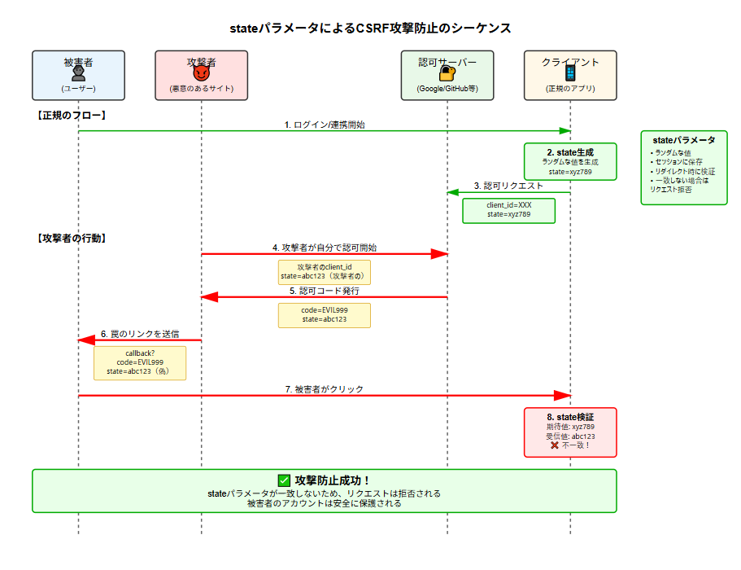

**重要なポイント：**

1. **state 生成**：クライアントアプリは認可リクエストを開始する際、ランダムな値（state）を生成し、セッションに保存します

2. **state の送信**：認可サーバーへのリクエストに state パラメータを含めます

3. **state の返却**：認可サーバーは、リダイレクト時に受け取った state をそのまま返します

4. **state 検証**：クライアントアプリは返ってきた state と、セッションに保存していた state を比較します

5. **攻撃の防止**：
   - 攻撃者は被害者のセッションに保存されている state の値を知ることができません
   - 攻撃者が送信する state は被害者のセッションの state と一致しないため、検証で弾かれます
   - これにより、CSRF 攻撃を防ぐことができます

**なぜ効果的なのか：**

- state は予測不可能なランダムな値
- セッションごとに異なる値が生成される
- 攻撃者は正しい state の値を推測できない
- 正規のフローでのみ、正しい state が維持される

## 4.2.0 リダイレクト攻撃

リダイレクト攻撃とは、ユーザーを意図しない悪意のあるウェブサイトに誘導するサイバー攻撃の一種です。

### 主な手法

**オープンリダイレクト攻撃**

- 正規のウェブサイトのリダイレクト機能を悪用
- URL パラメータを操作して、ユーザーを悪意のあるサイトへ転送
- 例：`https://example.com/redirect?url=http://malicious-site.com`

**リダイレクトチェーン攻撃**

- 複数のリダイレクトを連鎖させて最終的に悪意のあるサイトへ誘導
- 検出を困難にするため、複数の中間サイトを経由

### 攻撃の目的

攻撃者がリダイレクト攻撃を行う主な目的には以下があります：

- **フィッシング詐欺** - 偽のログインページに誘導し、認証情報を盗む
- **マルウェア配布** - 悪意のあるソフトウェアをダウンロードさせる
- **個人情報の窃取** - 偽のフォームで個人情報を入力させる
- **広告詐欺** - 不正な広告収入を得る

## 4.2.1 OAuth/OIDC のリダイレクト攻撃

攻撃者が redirect_uri パラメータを改ざんして、認可コードやアクセストークンを自分のサイトに誘導する攻撃です。


**リダイレクト攻撃の仕組み：**

- 攻撃者が正規の OAuth 認可 URL の`redirect_uri`パラメータを自分のサイトに改ざん
- 被害者がそのリンクをクリックして認証すると、認可コードが攻撃者のサイトに送信される
- 攻撃者はその認可コードを使って被害者のアカウントにアクセスできる

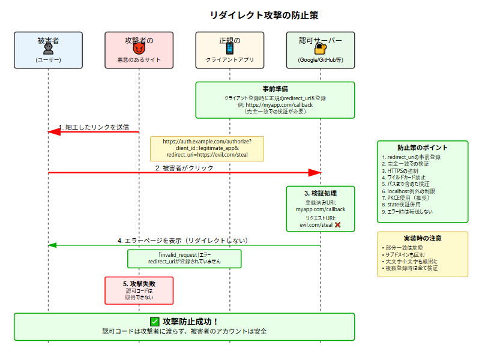

**防止策のポイント：**

1. **事前登録**：クライアント登録時に許可する redirect_uri を事前に登録
2. **厳密な検証**：認可サーバーは受信した redirect_uri が登録済みのものと完全一致するか検証
3. **エラー処理**：不正な redirect_uri の場合は、リダイレクトせずにエラーページを表示

この対策により、攻撃者が認可コードを窃取することを防ぎ、ユーザーのアカウントを保護できます。

## 4.3.0 クロスサイトスクリプティング攻撃

攻撃者が悪意のあるスクリプトを正規の Web サイトに注入し、他のユーザーのブラウザで実行させる攻撃です。

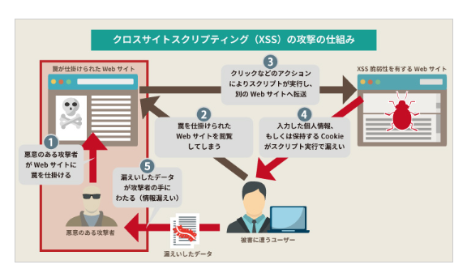

悪意のある攻撃者が Web サイトに罠を仕掛ける
罠を仕掛けられた Web サイトをユーザーが閲覧
ユーザーによるクリックなどのアクションによりスクリプトが実行し、別の Web サイトへ転送
入力した個人情報、もしくは保持する Cookie がスクリプト実行で漏えい
漏えいしたデータが攻撃者の手にわたる（情報漏えい）
図 1 のような順序を経て、ユーザーの個人情報が漏えい、あるいは Cookie が盗まれ、セッションの乗っ取りなどが可能となってしまいます。

## 4.3.1 OAuth/OIDC のクロスサイトスクリプティング

**アクセストークンの窃取**

- JavaScript からアクセス可能な場所（localStorage、sessionStorage など）にトークンが保存されている場合、XSS によって盗取される可能性

**認可コードの窃取**

- 認可フロー中に認可コードが URL に含まれる際、XSS によって傍受される危険性

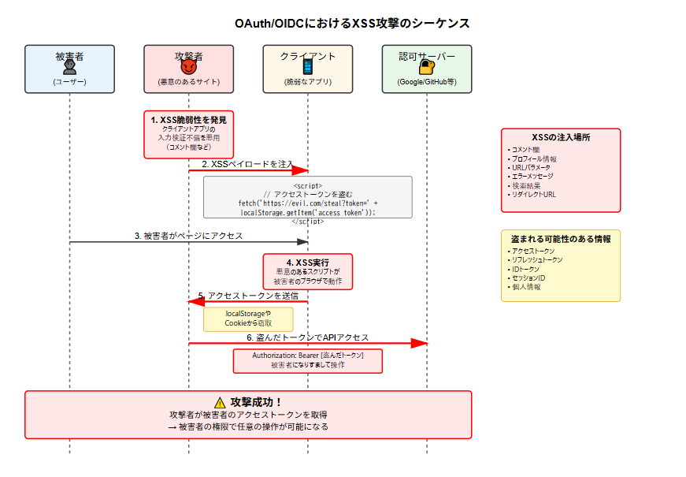

OAuth/OIDC における XSS 攻撃のシーケンス図を作成します。次に、XSS 攻撃を防止するシーケンス図を作成します。OAuth/OIDC における XSS 攻撃のシーケンス図と防止策のシーケンス図を作成しました。

**XSS 攻撃の仕組み：**

- 攻撃者がクライアントアプリケーションの入力検証の不備を悪用
- 悪意のある JavaScript コードを注入（コメント欄、プロフィール、URL パラメータなど）
- 被害者がページを閲覧すると、スクリプトが実行される
- localStorage や Cookie からアクセストークンを盗み、攻撃者のサーバーに送信

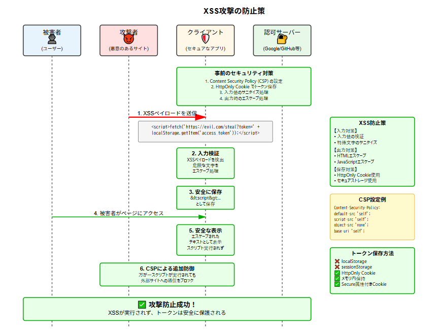

**防止策のポイント：**

1. **入力検証とサニタイズ**

   - すべての入力値を検証
   - 危険な文字（`<`, `>`, `"`, `'`など）をエスケープ

2. **出力時のエスケープ**

   - HTML コンテキストでの適切なエスケープ
   - JavaScript コンテキストでの適切なエスケープ

3. **Content Security Policy (CSP)**

   - インラインスクリプトの実行を禁止
   - 外部サイトへの通信を制限

4. **トークンの安全な保存**
   - HttpOnly 属性付き Cookie を使用（JavaScript からアクセス不可）
   - Secure 属性で HTTPS 通信のみに制限
   - localStorage や sessionStorage は避ける

これらの対策を組み合わせることで、XSS 攻撃から OAuth/OIDC のトークンを保護し、ユーザーのアカウントを安全に守ることができます。

## 4.4.0 認可コードインジェクション攻撃と PKCE の重要性

**認可コードインジェクション攻撃とは：**

攻撃者が正規ユーザーの認可コードを横取りし、それを使って不正にアクセストークンを取得します

**攻撃の仕組み：**

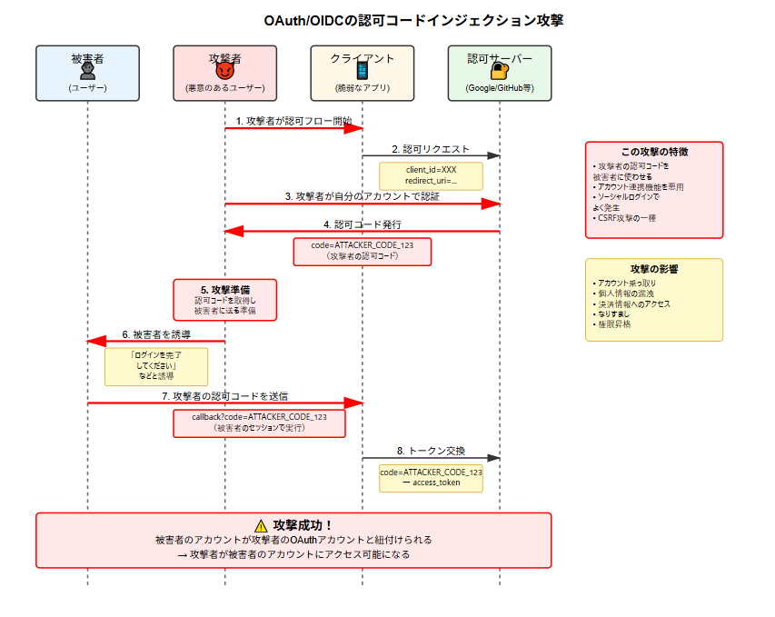

- 攻撃者が自分のアカウントで認可フローを実行し、認可コードを取得
- その認可コードを被害者に使わせることで、被害者のアカウントを攻撃者の OAuth アカウントと紐付ける
- アカウント連携機能やソーシャルログイン機能を悪用する攻撃

**防止策の重要ポイント：**

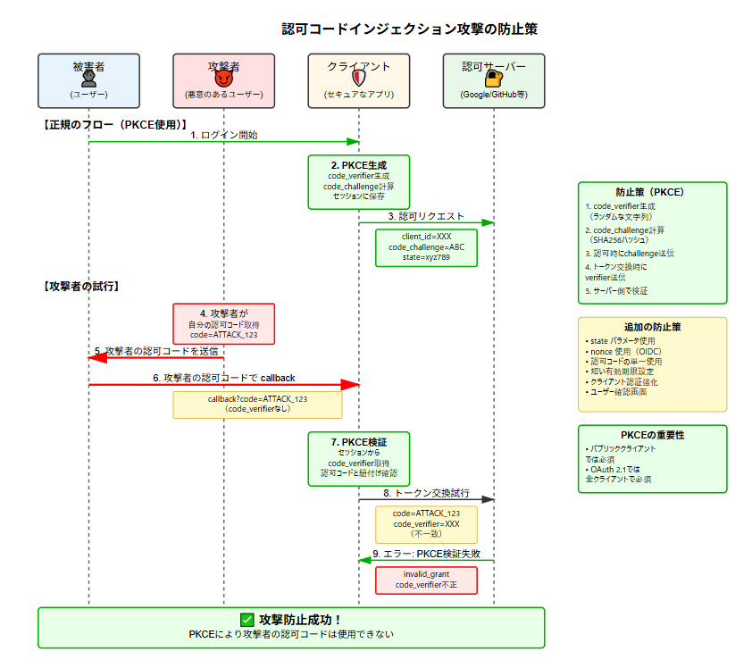

1. **PKCE（Proof Key for Code Exchange）の使用**

   - `code_verifier`：クライアント側で生成するランダムな文字列
   - `code_challenge`：code_verifier の SHA256 ハッシュ値
   - 認可リクエスト時に challenge を送信し、トークン交換時に verifier で検証
   - 攻撃者は verifier を知らないため、盗んだ認可コードを使えない

2. **state パラメータの併用**

   - CSRF 対策として、ランダムな値をセッションに保存
   - リダイレクト時に検証することで、正規のフローを保証

3. **その他の対策**
   - 認可コードの単一使用（一度使われたら無効化）
   - 短い有効期限（通常 10 分以内）
   - クライアント認証の強化
   - ユーザー確認画面の表示

**なぜ PKCE が効果的なのか：**

- 認可コードと code_verifier が紐付いているため、正しい verifier なしではトークン交換できない
- 攻撃者は被害者のセッションの code_verifier を知ることができない
- OAuth 2.1 では全てのクライアントで PKCE が必須となる予定

これらの対策により、認可コードインジェクション攻撃を防ぎ、ユーザーのアカウントを安全に保護できます。

## 4.5.0 リプレイ攻撃

### 一般的なリプレイ攻撃

リプレイ攻撃は、正規の通信データを攻撃者が傍受・記録し、後でそのデータをそのまま再送信することで、正規ユーザーになりすます攻撃手法です。

### 基本的な仕組み

1. **傍受**: 攻撃者が正規の通信を盗聴
2. **記録**: 認証情報やトランザクションデータを保存
3. **再送信**: 記録したデータを後で再利用
4. **なりすまし**: システムは正規の通信と判断してしまう

### 一般的な例

- **ネットワーク認証**: ログイン時の認証パケットを再送信
- **金融取引**: 送金リクエストを複製して再実行
- **アクセスカード**: RFID カードの信号を記録・再生
- **ワンタイムパスワード**: 有効期限内の OTP を素早く再利用

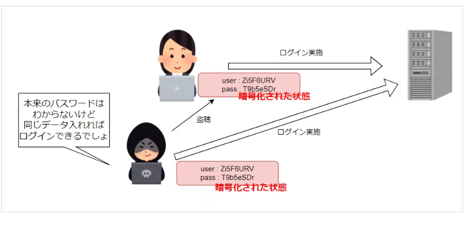

## 4.5.1 OAuth/OIDC におけるリプレイ攻撃

正規ユーザーの認証で発行されたトークンやコードを攻撃者が盗み取り、それをそのまま再利用することで、正規ユーザーになりすましてリソースにアクセスする攻撃

**リプレイ攻撃の仕組み：**

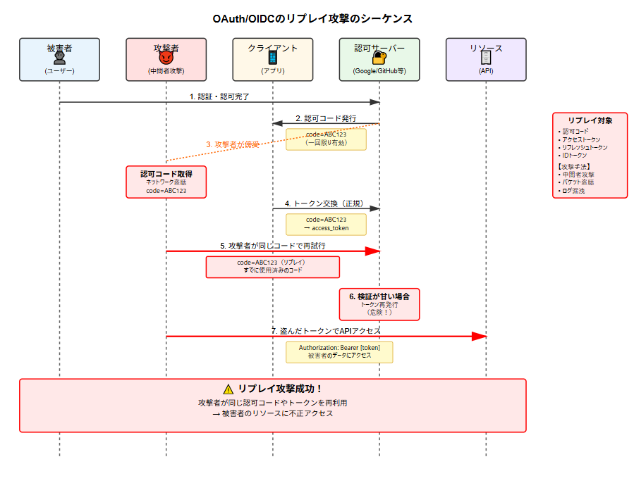

- 攻撃者が中間者攻撃やネットワーク盗聴により、認可コードやトークンを傍受
- 傍受した認可コードやトークンを再利用（リプレイ）して、不正アクセスを試みる
- 検証が甘い場合、同じ認可コードやトークンで複数回アクセスできてしまう

**防止策の重要ポイント：**

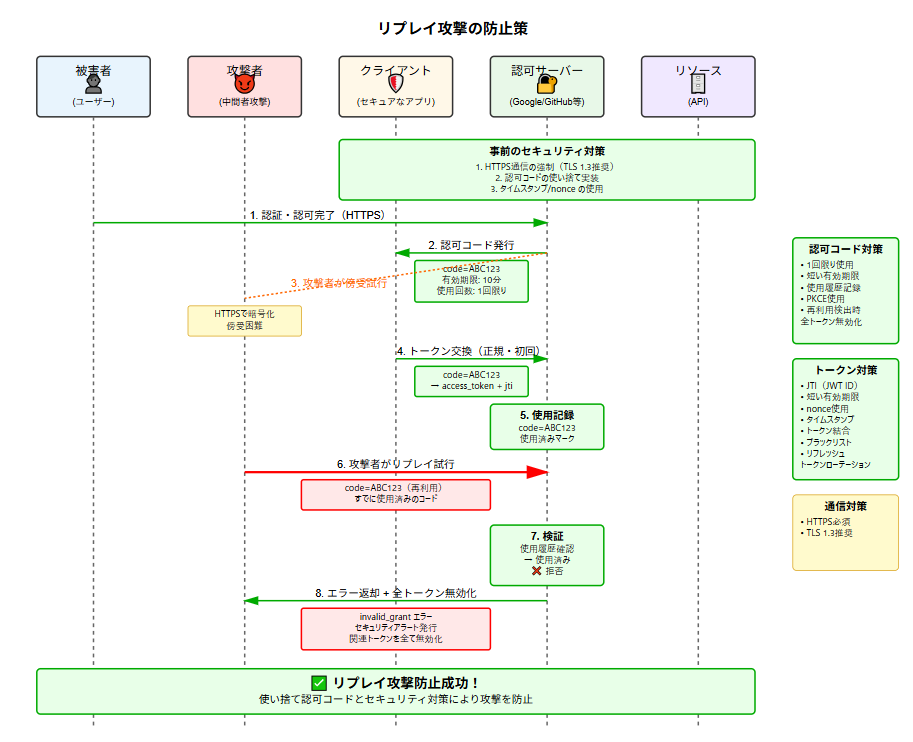

**nonce によるリプレイ攻撃防止の仕組み：**

1. **nonce（Number used once）の生成**

   - クライアントが認可リクエスト前にランダムな値を生成
   - 暗号学的に安全な乱数生成器を使用（最低 128 ビット）
   - セッションに保存して後で検証に使用

2. **認可フローでの nonce 送信**

   - 認可リクエストに nonce パラメータとして含める
   - OIDC プロバイダーはこの nonce を ID トークンに含めて返却

3. **ID トークン受信時の検証**

   - ID トークン内の nonce クレームを抽出
   - セッションに保存していた nonce と比較
   - 一致した場合のみ、正規のトークンとして受け入れる

4. **なぜ攻撃を防げるのか**
   - 攻撃者が盗んだ ID トークンには nonce が含まれているが、攻撃者のセッションには対応する nonce が存在しない
   - nonce は一回限りの使用なので、再利用を検出できる
   - セッションとトークンの紐付けにより、異なるコンテキストでの使用を防ぐ

**nonce の重要な特性：**

- **一意性**：各認可リクエストで新しい値を生成
- **予測不可能性**：暗号学的に安全な乱数を使用
- **セッション紐付け**：クライアント側のセッションと関連付け
- **検証可能性**：ID トークンに含まれて返却される

PKCE の重要性と実装について、これまでの攻撃パターンを踏まえて詳しく説明します。

## 4.6.0 PKCE の重要性

### 1. 複数の攻撃を同時に防御

**PKCE（Proof Key for Code Exchange）は、これまで見てきた多くの攻撃を効果的に防ぎます：**

- **認可コードインジェクション攻撃**：攻撃者の認可コードは対応する code_verifier がないため使用不可
- **リダイレクト攻撃**：認可コードが盗まれても、code_verifier なしではトークン交換不可
- **リプレイ攻撃**：認可コードと code_verifier のペアが必要なため、単純な再送では攻撃不可
- **中間者攻撃**：code_verifier はクライアントのみが知る秘密情報

### 2. パブリッククライアントの保護

**特に重要なのは、クライアントシークレットを安全に保存できない環境：**

- SPA アプリケーション
- モバイルアプリ
- デスクトップアプリ

これらの環境では、PKCE が事実上唯一の効果的な保護手段です。

### 3. OAuth 2.1 での必須化

OAuth 2.1 では、**すべてのクライアント**で PKCE が必須となります。これは、その効果が広く認められた結果です。

### PKCE の実装方法 基本的な流れ

```
1. code_verifier生成（クライアント）
   ↓
2. code_challenge計算（クライアント）
   ↓
3. 認可リクエスト送信（code_challengeを含む）
   ↓
4. 認可コード受信
   ↓
5. トークン交換（code_verifierを含む）
   ↓
6. サーバー側で検証
```

### 実装の詳細

#### 1. code_verifier の生成

```javascript
// 暗号学的に安全な乱数生成（43-128文字）
function generateCodeVerifier() {
  const array = new Uint8Array(32);
  crypto.getRandomValues(array);
  return base64UrlEncode(array);
}

function base64UrlEncode(array) {
  return btoa(String.fromCharCode.apply(null, array))
    .replace(/\+/g, "-")
    .replace(/\//g, "_")
    .replace(/=/g, "");
}
```

#### 2. code_challenge の計算

```javascript
// SHA256ハッシュを計算してBase64URL エンコード
async function generateCodeChallenge(verifier) {
  const encoder = new TextEncoder();
  const data = encoder.encode(verifier);
  const hash = await crypto.subtle.digest("SHA-256", data);
  return base64UrlEncode(new Uint8Array(hash));
}
```

#### 3. 認可リクエスト

```javascript
// 認可エンドポイントへのリクエスト
const authUrl = new URL("https://auth.example.com/authorize");
authUrl.searchParams.append("client_id", CLIENT_ID);
authUrl.searchParams.append("redirect_uri", REDIRECT_URI);
authUrl.searchParams.append("response_type", "code");
authUrl.searchParams.append("scope", "openid profile");
authUrl.searchParams.append("state", generateState());
authUrl.searchParams.append("nonce", generateNonce());
authUrl.searchParams.append("code_challenge", codeChallenge);
authUrl.searchParams.append("code_challenge_method", "S256");

// code_verifierはセッションストレージに保存
sessionStorage.setItem("code_verifier", codeVerifier);

window.location.href = authUrl.toString();
```

#### 4. トークン交換

```javascript
// コールバック受信後のトークン交換
async function exchangeCodeForToken(code) {
  const codeVerifier = sessionStorage.getItem("code_verifier");

  const response = await fetch("https://auth.example.com/token", {
    method: "POST",
    headers: {
      "Content-Type": "application/x-www-form-urlencoded",
    },
    body: new URLSearchParams({
      grant_type: "authorization_code",
      code: code,
      redirect_uri: REDIRECT_URI,
      client_id: CLIENT_ID,
      code_verifier: codeVerifier, // PKCEの重要部分
    }),
  });

  // code_verifierをセッションから削除（セキュリティ）
  sessionStorage.removeItem("code_verifier");

  return response.json();
}
```

### セキュリティ上の注意点

#### 1. code_verifier の保存

```javascript
// ❌ 悪い例：グローバル変数
let codeVerifier = generateCodeVerifier();

// ✅ 良い例：セッションストレージ（タブごとに独立）
sessionStorage.setItem("code_verifier", codeVerifier);

// ❌ 避けるべき：localStorage（永続化される）
// localStorage.setItem('code_verifier', codeVerifier);
```

#### 2. エラーハンドリング

```javascript
async function handleCallback() {
  const params = new URLSearchParams(window.location.search);

  // エラーチェック
  if (params.get("error")) {
    console.error("認可エラー:", params.get("error_description"));
    return;
  }

  // state検証（CSRF対策）
  const state = params.get("state");
  const savedState = sessionStorage.getItem("oauth_state");
  if (state !== savedState) {
    console.error("state不一致：CSRF攻撃の可能性");
    return;
  }

  // code_verifierの存在確認
  const codeVerifier = sessionStorage.getItem("code_verifier");
  if (!codeVerifier) {
    console.error("code_verifierが見つかりません");
    return;
  }

  // トークン交換
  const code = params.get("code");
  await exchangeCodeForToken(code);
}
```

### サーバー側の実装

```python
# 認可サーバー側の検証例
def verify_pkce(code, code_verifier):
    # 保存されているcode_challengeを取得
    stored_challenge = get_stored_challenge(code)

    # code_verifierからcode_challengeを計算
    calculated_challenge = base64url_encode(
        hashlib.sha256(code_verifier.encode()).digest()
    )

    # 一致確認
    if not constant_time_compare(stored_challenge, calculated_challenge):
        raise InvalidGrantError("Invalid code_verifier")

    return True
```

### PKCE とその他の対策の組み合わせ

```javascript
// 完全なセキュアな実装例
class SecureOAuthClient {
  constructor(config) {
    this.config = config;
  }

  async startAuthFlow() {
    // 1. PKCE準備
    const codeVerifier = this.generateCodeVerifier();
    const codeChallenge = await this.generateCodeChallenge(codeVerifier);

    // 2. CSRF対策（state）
    const state = this.generateSecureRandom();

    // 3. リプレイ攻撃対策（nonce）
    const nonce = this.generateSecureRandom();

    // セッションに保存
    const sessionData = {
      codeVerifier,
      state,
      nonce,
      timestamp: Date.now(), // タイムアウト用
    };
    sessionStorage.setItem("oauth_session", JSON.stringify(sessionData));

    // 認可リクエスト構築
    const authUrl = this.buildAuthUrl({
      code_challenge: codeChallenge,
      code_challenge_method: "S256",
      state: state,
      nonce: nonce,
    });

    window.location.href = authUrl;
  }

  async handleCallback(callbackUrl) {
    const params = new URLSearchParams(callbackUrl.search);
    const sessionData = JSON.parse(sessionStorage.getItem("oauth_session"));

    // タイムアウトチェック（10分）
    if (Date.now() - sessionData.timestamp > 600000) {
      throw new Error("認証タイムアウト");
    }

    // 各種検証
    this.verifyState(params.get("state"), sessionData.state);

    // トークン交換
    const tokens = await this.exchangeCode(
      params.get("code"),
      sessionData.codeVerifier
    );

    // IDトークンのnonce検証
    this.verifyIdToken(tokens.id_token, sessionData.nonce);

    // クリーンアップ
    sessionStorage.removeItem("oauth_session");

    return tokens;
  }
}
```

### PKCE の重要性まとめ

PKCE は、OAuth/OIDC の多くの攻撃ベクトルを効果的に防ぐ重要なセキュリティ機能です。特に：

1. **実装が比較的簡単**：クライアント側での乱数生成とハッシュ計算のみ
2. **後方互換性**：PKCE に対応していないサーバーでも動作可能
3. **多層防御**：state、nonce と組み合わせることで、より強固なセキュリティを実現

すべての新規実装では、クライアントの種類に関わらず PKCE を実装することを強く推奨します。

## 4.7.0 OAuth/OIDC の代表的な脆弱性と対策まとめ

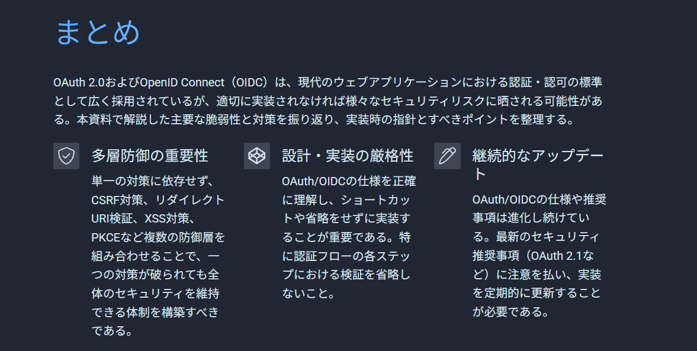
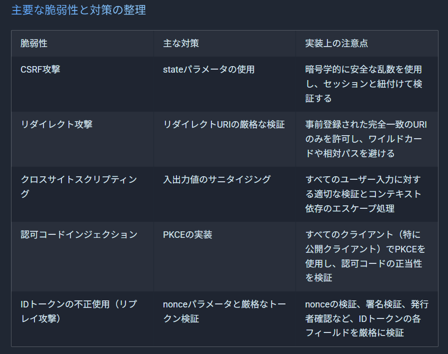

## 4.8 モバイルアプリケーション特有のセキュリティ課題

**モバイルアプリは「パブリッククライアント」環境**

- **配布バイナリは解析可能** → リバースエンジニアリングでクライアントシークレット露出
- **アプリ間通信が脆弱** → カスタム URL スキームは他アプリが偽装可能
- **実行環境が制御不能** → root 化端末、デバッガ接続、メモリダンプのリスク

**結果：サーバーサイドの認証フローが適用不可**
→ PKCE 等のパブリッククライアント向け対策が必須

## 4.8.1 モバイルアプリケーション特有のセキュリティ課題

モバイルアプリケーションの OAuth/OIDC 最重要課題について、Web アプリケーションとの比較を通じて解説します。

## 🔴 **クライアントの信頼性**（最重要）

### 概要

モバイルアプリは配布時点で全てのコードが公開されるため、クライアントシークレットを安全に保持できません。一方、Web アプリケーションはサーバー側でシークレットを管理できるため、この問題は発生しません。

### 対策

PKCE を必ず実装し、クライアントシークレットの代わりに動的に生成される code_verifier と code_challenge を使用します。これにより、認証フローごとに異なる秘密情報を使用でき、静的なシークレットの埋め込みが不要になります。

### モバイルアプリの脆弱性

```kotlin
// APKファイルから簡単に抽出可能
class OAuthConfig {
    companion object {
        const val CLIENT_SECRET = "my-secret-key" // 全ユーザーに露出
    }
}
```

### Web アプリの安全な実装

```java
// サーバーサイドでのみシークレットを使用
@RestController
public class OAuthController {
    @Value("${oauth.client-secret}")
    private String clientSecret; // 環境変数から取得

    @PostMapping("/oauth/token")
    public TokenResponse exchangeCode(@RequestBody CodeRequest request) {
        // clientSecretはサーバー内でのみ使用
        return oauthService.exchangeCode(request.getCode(), clientSecret);
    }
}
```

### PKCE による解決

```kotlin
class PKCEOAuthFlow {
    fun startAuthorization(): AuthRequest {
        val codeVerifier = generateSecureRandom(128)
        val codeChallenge = sha256(codeVerifier).toBase64Url()

        // code_verifierはローカルに保存、code_challengeのみ送信
        secureStorage.saveCodeVerifier(codeVerifier)

        return AuthRequest(
            clientId = CLIENT_ID, // シークレット不要
            codeChallenge = codeChallenge,
            codeChallengeMethod = "S256"
        )
    }
}
```

---

## 🔴 **実行環境の制御**（最重要）

### 概要

モバイルアプリはユーザーのデバイス上で実行され、Root 化やデバッガー接続などの脅威に晒されます。Web アプリはブラウザのサンドボックス内で保護されるため、この種の攻撃への耐性が高いです。

### 対策

Root/Jailbreak 検出、デバッガー検出、アプリ改ざん検出を実装し、脅威を検出した場合は機密機能を制限します。完全なブロックよりも、リスクレベルに応じた段階的な制限を推奨します。

### モバイルアプリの脅威検出

```kotlin
class SecurityManager {
    fun performSecurityChecks(): SecurityStatus {
        return SecurityStatus(
            isRooted = detectRoot(),
            isDebugged = detectDebugger(),
            isTampered = detectTampering()
        )
    }

    private fun detectRoot(): Boolean {
        val rootIndicators = listOf(
            "/system/app/Superuser.apk",
            "/sbin/su",
            "/system/bin/su"
        )
        return rootIndicators.any { File(it).exists() }
    }
}
```

### Web アプリのセキュリティモデル

```java
// ブラウザが自動的に以下を適用
// - Same-Origin Policy
// - Content Security Policy
// - XSS保護

@Configuration
public class SecurityConfig {
    @Bean
    public SecurityFilterChain filterChain(HttpSecurity http) {
        return http
            .headers(headers -> headers
                .contentSecurityPolicy("default-src 'self'")
                .frameOptions().deny()
            )
            .build();
    }
}
```

---

## 🟡 **リダイレクトメカニズム**（重要）

### 概要

モバイルアプリのカスタム URL スキームは、どのアプリでも同じスキームを登録できるため、認可コードの横取りリスクがあります。Web アプリは、HTTPS とドメイン所有権により保護されています。

### 対策

App Links（Android）や Universal Links（iOS）を使用し、HTTPS ベースのリダイレクトを実装します。これにより、ドメイン所有権の検証が行われ、なりすましアプリによる認可コードの横取りを防げます。

### カスタム URL スキームの問題

```kotlin
// AndroidManifest.xml
// 問題：他のアプリも "myapp://" を登録可能
<intent-filter>
    <data android:scheme="myapp" android:host="oauth" />
</intent-filter>
```

### App Links による解決

```kotlin
// AndroidManifest.xml
<intent-filter android:autoVerify="true">
    <data
        android:scheme="https"
        android:host="myapp.com"
        android:pathPrefix="/oauth/callback" />
</intent-filter>

// サーバー側での検証ファイル（/.well-known/assetlinks.json）が必要
```

---

## 🟡 **ストレージセキュリティ**（重要）

### 概要

モバイルアプリはトークンを永続的に保存する必要があり、物理的アクセスやバックアップ経由での漏洩リスクがあります。Web アプリはセッション限定の保存で十分なため、リスクが限定的です。

### 対策

OS 提供のセキュアストレージ（Android: EncryptedSharedPreferences、iOS: Keychain）を使用し、バックアップからの除外設定を行います。可能であればバイオメトリクス認証と組み合わせて追加の保護層を設けます。

### モバイルアプリのセキュアストレージ

```kotlin
class SecureTokenStorage(private val context: Context) {
    private val masterKey = MasterKey.Builder(context)
        .setKeyScheme(MasterKey.KeyScheme.AES256_GCM)
        .build()

    private val encryptedPrefs = EncryptedSharedPreferences.create(
        context,
        "oauth_tokens",
        masterKey,
        EncryptedSharedPreferences.PrefKeyEncryptionScheme.AES256_SIV,
        EncryptedSharedPreferences.PrefValueEncryptionScheme.AES256_GCM
    )

    fun saveToken(token: String) {
        encryptedPrefs.edit()
            .putString("access_token", token)
            .apply()
    }
}
```

### Web アプリのシンプルな管理

```java
@Component
public class TokenManager {
    // HttpOnlyクッキーで保護
    public void saveToken(HttpServletResponse response, String token) {
        Cookie cookie = new Cookie("access_token", token);
        cookie.setHttpOnly(true);
        cookie.setSecure(true);
        cookie.setPath("/");
        cookie.setMaxAge(3600); // 1時間
        response.addCookie(cookie);
    }
}
```

---

## 🟡 **ネットワークセキュリティ**（重要）

### 概要

モバイルアプリは様々なネットワーク環境で使用され、中間者攻撃のリスクが高いため、証明書ピンニングなどの追加対策が必要です。Web アプリはブラウザが証明書検証を自動的に行います。

### 対策

証明書ピンニングを実装し、信頼する証明書を明示的に指定します。複数の証明書ハッシュを登録して証明書ローテーションに対応し、TLS 1.2 以上の使用を強制します。

### 証明書ピンニングの実装

```kotlin
class NetworkSecurityConfig {
    fun createSecureClient(): OkHttpClient {
        val certificatePinner = CertificatePinner.Builder()
            .add("api.example.com", "sha256/AAAAAAAAAAAAAAAAAAAAAAAAAAAAAAAAAAAAAAAAAAA=")
            .add("api.example.com", "sha256/BBBBBBBBBBBBBBBBBBBBBBBBBBBBBBBBBBBBBBBBBBB=") // バックアップ
            .build()

        return OkHttpClient.Builder()
            .certificatePinner(certificatePinner)
            .build()
    }
}
```

### Web アプリの自動保護

```java
@Configuration
public class WebSecurityConfig {
    // ブラウザが以下を自動実行：
    // - 証明書チェーン検証
    // - HSTS適用
    // - Mixed Content防止

    @Bean
    public RestTemplate restTemplate() {
        // 標準的なHTTPS通信で十分
        return new RestTemplate();
    }
}
```

これらの課題に対する理解と適切な実装により、モバイルアプリケーションでも安全な OAuth/OIDC フローを実現できます。

## 4.9 OIDC/OAuth におけるフィッシング耐性とフィッシング耐性認証の概要

OAuth/OIDC の従来のセキュリティ対策（PKCE、state、nonce）は認証フローの安全性を高めますが、パスワード入力時のフィッシングは防げません。フィッシング耐性認証は、WebAuthn/FIDO2(パスキーなど) のような技術を用いて、認証情報自体が盗まれない仕組みを提供し、IdP レベルでフィッシングを技術的に不可能にします。

## なぜ従来の対策では防げないのか

PKCE は Authorization Code の横取りを防ぎ、state は CSRF 攻撃を防ぎますが、これらは全て「認証後」のトークン交換プロセスを保護する技術です。最初の認証段階でユーザーがフィッシングサイトにパスワードを入力してしまえば、その後の OAuth/OIDC フローが正常に動作しても意味がありません。

## リアルタイムフィッシングの脅威

最新のフィッシング攻撃は、ユーザーの入力をリアルタイムで正規サイトに転送する「Man-in-the-Middle 型」です。偽サイトが本物そっくりで、MFA コードも即座に転送されるため、ユーザーは気づかずに認証を完了してしまいます。この攻撃では、全ての従来型セキュリティ対策が正常に機能したまま、攻撃者がアクセスを獲得できます。

## WebAuthn/FIDO2（パスキー）の有用性

パスキーは公開鍵暗号方式を使用し、秘密鍵はデバイスから出ません。最も重要なのは、認証時にブラウザが自動的にドメインを検証することです。フィッシングサイトでは異なるドメインとして認識されるため、パスキーが存在せず認証自体が不可能になります。ユーザーが入力する情報がないため、盗む対象が存在せず、フィッシングを根本的に防げます。

## 4.9.1 なぜ従来の対策ではフィッシングを防げないのか

## なぜ従来の対策では防げないのか

従来の対策は「認証後」のセキュリティに焦点を当てており、「認証時」の脆弱性が残っています。

```
[従来のOAuth/OIDCフロー]

ユーザー ──┐
           ↓ ①パスワード入力（ここが無防備！）
      フィッシングサイト
           ↓ ②盗んだ認証情報を転送
        正規のIdP
           ↓ ③正規の認証成功
      Authorization Code
           ↓ ④PKCE検証（正常動作）
      アクセストークン取得

※ PKCE/state/nonceは③以降を保護するが、①は防げない
```

### 各対策の保護範囲

```
認証フロー:  [ログイン] → [認証] → [Code交換] → [Token発行]
               ↑           ↑         ↑           ↑
              ❌無防備    ❌無防備   ✅PKCE     ✅state/nonce
```

## リアルタイムフィッシングの脅威

最新の攻撃は「リバースプロキシ型」で、ユーザーと正規サイトの間に入り込みます。

```
[リアルタイムフィッシング攻撃]

ユーザー ←──────────→ 攻撃者のプロキシ ←──────────→ 正規サイト
   │                      │                    │
   │ ①ログイン画面表示    │ 本物の画面を取得   │
   │←─────────────────────┤←───────────────────┤
   │                      │                    │
   │ ②認証情報入力        │                    │
   ├─────────────────────→│ ③即座に転送      │
   │                      ├───────────────────→│
   │                      │                    │
   │ ④MFAコード要求       │                    │ ⑤MFA要求
   │←─────────────────────┤←───────────────────┤
   │                      │                    │
   │ ⑥MFAコード入力       │ ⑦30秒以内に転送   │
   ├─────────────────────→├───────────────────→│
   │                      │                    │
   │                      │ ⑧セッション確立    │
   │                      │ 攻撃者がアクセス権 │
```

### 実際の攻撃コード例

```javascript
// 攻撃者のプロキシサーバー
app.post("/login", async (req, res) => {
  // ユーザーの認証情報を受け取る
  const { username, password } = req.body;

  // 正規サイトに即座に転送
  const realResponse = await fetch("https://real-site.com/login", {
    method: "POST",
    body: JSON.stringify({ username, password }),
  });

  // MFA要求をユーザーに中継
  if (realResponse.status === "mfa_required") {
    res.send("MFAコードを入力してください");
    // 攻撃者はセッションを保持
  }
});
```

## WebAuthn/FIDO2（パスキー）の有用性

パスキーは認証の仕組みを根本的に変え、フィッシングを技術的に不可能にします。

### 1. ドメイン自動検証の仕組み

```javascript
// パスキー認証時の内部動作
const credential = await navigator.credentials.get({
  publicKey: {
    challenge: serverChallenge,
    rpId: "example.com",  // 正規サイトのドメイン
  }
});

// ブラウザが自動的に生成する署名データ
{
  signature: "...",
  authenticatorData: {
    rpIdHash: SHA256("example.com"),  // ドメインのハッシュ値
    flags: "...",
    signCount: 123
  },
  clientDataJSON: {
    type: "webauthn.get",
    challenge: "...",
    origin: "https://example.com",  // 現在のサイトのオリジン
    crossOrigin: false
  }
}
```

### 2. フィッシングサイトでの認証失敗

```
[正規サイト: example.com]
┌─────────────────┐
│ パスキーで認証   │
│ ✅ 成功         │
└─────────────────┘
         ↓
   rpIdHash一致
         ↓
    認証完了


[偽サイト: examp1e.com]
┌─────────────────┐
│ パスキーで認証   │
│ ❌ 失敗         │
└─────────────────┘
         ↓
  「このサイトに
   登録された
   パスキーは
   ありません」
```

### 3. 認証フローの比較

```
[従来の認証]
ユーザー → パスワード入力 → 送信 → サーバー検証
           ↑ ここで盗まれる

[パスキー認証]
ユーザー → 生体認証 → ブラウザが署名生成 → サーバー検証
           ↑            ↑
      ローカル完結   ドメイン自動検証
      （盗めない）   （偽装不可能）
```

### パスキーの多層防御

```
┌────────────────────────────────┐
│         パスキーの防御層         │
├────────────────────────────────┤
│ 1. 秘密鍵がデバイスから出ない   │
│ 2. ドメインが自動検証される     │
│ 3. 毎回異なるチャレンジ使用     │
│ 4. ユーザーが入力する情報なし   │
└────────────────────────────────┘
         ↓
    フィッシング不可能
```

この仕組みにより、たとえ完璧な偽サイトを作っても、パスキーは動作せず、攻撃者は認証情報を入手できません。

## 4.9.2 パスキーがフィッシングを防げる理由とその一例

## パスキーがフィッシングを技術的に不可能にする理由

パスキーがフィッシングを防げる核心は、**認証情報がドメインに強く紐付けられており、ブラウザがこれを自動的に検証する**という点にあります。

### 登録時の仕組み

パスキーを登録する際、以下のような処理が行われます：

1. **ドメイン固有の鍵ペア生成**

   - ユーザーが`https://example.com`でパスキーを登録すると、認証器（デバイス）は`example.com`専用の公開鍵・秘密鍵ペアを生成します
   - この鍵ペアは`example.com`というドメイン名と不可分に結びついています

2. **Relying Party ID（rpId）の記録**
   - 認証器は「この秘密鍵は`example.com`でのみ使用可能」という情報を内部に保存します
   - これは後から変更できない、改ざん不可能な形で記録されます

### 認証時の自動検証プロセス

フィッシングサイト（`https://examp1e.com`）でパスキー認証を試みた場合：

1. **ブラウザの介入**

   - ブラウザは現在アクセスしているサイトのドメイン（`examp1e.com`）を認識します
   - この情報は JavaScript から改ざんできません（ブラウザが管理）

2. **認証器への問い合わせ**

   - ブラウザは認証器に「`examp1e.com`用のパスキーはあるか？」と問い合わせます
   - 認証器は保存されているパスキーを検索しますが、`example.com`用のパスキーしか存在しません

3. **不一致の検出**
   - `examp1e.com` ≠ `example.com`のため、該当するパスキーが見つかりません
   - 結果として「このサイトに登録されたパスキーはありません」というメッセージが表示されます

### なぜ回避できないのか

この仕組みが強力な理由は、**すべての検証がユーザーの操作を介さずに自動的に行われる**ためです：

**従来の認証との決定的な違い**

- パスワード：ユーザーが手動で入力するため、偽サイトでも入力してしまう
- パスキー：ブラウザと認証器が自動でドメインを検証し、不一致なら動作しない

**技術的な回避不可能性**

1. 攻撃者は偽サイトのドメインを正規サイトと同一にできない（DNS の仕組み上不可能）
2. ブラウザが取得するオリジン情報は改ざんできない（ブラウザのセキュリティモデル）
3. 認証器に保存されたドメイン情報は外部から変更できない（ハードウェアレベルの保護）

### 具体例での説明

例えば、Google アカウントでパスキーを使用している場合：

**正規サイト（`accounts.google.com`）でのログイン**

1. ブラウザ：「現在のドメインは`accounts.google.com`です」
2. 認証器：「`accounts.google.com`用のパスキーが見つかりました」
3. ユーザー：指紋認証などで本人確認
4. 結果：ログイン成功

**フィッシングサイト（`accounts-google.com`）でのログイン試行**

1. ブラウザ：「現在のドメインは`accounts-google.com`です」
2. 認証器：「`accounts-google.com`用のパスキーは登録されていません」
3. 結果：「このサイトに登録されたパスキーはありません」と表示
4. ログイン不可能（ユーザーが望んでも実行できない）

このように、パスキーは「ユーザーの判断」に依存せず、「技術的な仕組み」によってフィッシングを防ぐため、どんなに巧妙な偽サイトでも認証が成功することはありません。これが「フィッシングを技術的に不可能にする」という意味です。

## 4.10 トークンの安全な保管と更新戦略

### OAuth/OIDC におけるトークンの安全な保管と更新戦略

OAuth/OIDC では、Access Token、Refresh Token、ID Token という 3 種類のトークンを扱います。これらのトークンは機密性が高く、漏洩すると不正アクセスの原因となるため、アプリケーションタイプに応じた適切な保管方法と、有効期限に基づく更新戦略が重要です。基本原則は「最小権限の原則」と「Defense in Depth（多層防御）」で、トークンの保管場所、暗号化、ローテーション、監視を組み合わせて安全性を確保します。

### トークンの種類と特性

```
┌─────────────────┬──────────────┬─────────────────┬──────────────┐
│  トークン種別    │    用途      │   有効期限      │  機密性      │
├─────────────────┼──────────────┼─────────────────┼──────────────┤
│ Access Token    │ API アクセス  │ 短期(15分-1時間) │ 高（要保護）  │
│ Refresh Token   │ 更新用       │ 長期(日-月単位)  │ 最高（厳重）  │
│ ID Token       │ 認証情報     │ 短期(5分-1時間)  │ 中（検証用）  │
└─────────────────┴──────────────┴─────────────────┴──────────────┘
```

### アプリケーションタイプ別の保管戦略

#### 1. **SPA の場合**

SPA（Single Page Application）では、XSS 攻撃のリスクが高いため、localStorage/sessionStorage の使用は避け、メモリ内保管または Service Worker を活用します。Refresh Token は保持せず、短期の Access Token のみを扱うことが推奨されます。

```javascript
// ❌ 非推奨：localStorage/sessionStorage
localStorage.setItem('access_token', token); // XSS脆弱性

// ✅ 推奨：メモリ内保管
class TokenManager {
  private accessToken: string | null = null;

  setToken(token: string) {
    this.accessToken = token;
  }

  getToken(): string | null {
    return this.accessToken;
  }
}

// ✅ より安全：Service Worker + IndexedDB
// Service Worker内でトークンを管理し、XSSから保護
self.addEventListener('fetch', (event) => {
  if (event.request.url.includes('/api/')) {
    event.respondWith(
      addAuthHeader(event.request)
    );
  }
});
```

#### 2. **モバイルアプリの場合**

モバイルアプリでは、OS が提供するセキュアストレージ（iOS の Keychain、Android の EncryptedSharedPreferences）を使用し、デバイス固有の暗号化機能を活用してトークンを保護します。

```swift
// iOS: Keychain Services
let keychain = Keychain(service: "com.example.app")
keychain["access_token"] = accessToken
keychain["refresh_token"] = refreshToken // 暗号化して保存

// Android: EncryptedSharedPreferences
val sharedPrefs = EncryptedSharedPreferences.create(
    "secret_tokens",
    masterKey,
    context,
    EncryptedSharedPreferences.PrefKeyEncryptionScheme.AES256_SIV,
    EncryptedSharedPreferences.PrefValueEncryptionScheme.AES256_GCM
)
```

#### 3. **サーバーサイドアプリの場合**

サーバーサイドアプリでは、セッション管理システム（Redis 等）にトークンを保管し、Refresh Token は追加の暗号化層を適用します。クライアントには最小限の情報（セッション ID）のみを渡します。

```javascript
// セッションベースの管理
app.post("/callback", async (req, res) => {
  const tokens = await exchangeCodeForTokens(req.query.code);

  // セッションに保存（Redis推奨）
  req.session.tokens = {
    access_token: tokens.access_token,
    refresh_token: tokens.refresh_token,
    expires_at: Date.now() + tokens.expires_in * 1000,
  };

  // Refresh Tokenは追加で暗号化
  const encryptedRefresh = encrypt(tokens.refresh_token);
  await redis.set(`refresh:${req.session.id}`, encryptedRefresh);
});
```

### トークン更新戦略

#### 1. **プロアクティブ更新（推奨）**

プロアクティブ更新は、トークンの有効期限が切れる前に自動的に更新を行う戦略です。一般的に有効期限の 80%経過時点で更新処理を開始し、API コールの失敗を未然に防ぎます。ユーザーエクスペリエンスを損なわない最も推奨される方法です。

```javascript
class TokenRefreshManager {
  private refreshTimer: NodeJS.Timeout | null = null;

  scheduleRefresh(expiresIn: number) {
    // 有効期限の80%経過時点で更新
    const refreshTime = expiresIn * 0.8 * 1000;

    this.refreshTimer = setTimeout(async () => {
      try {
        await this.refreshAccessToken();
      } catch (error) {
        // リトライロジック
        this.retryRefresh();
      }
    }, refreshTime);
  }

  async refreshAccessToken() {
    const response = await fetch('/oauth/token', {
      method: 'POST',
      body: new URLSearchParams({
        grant_type: 'refresh_token',
        refresh_token: this.getRefreshToken(),
        client_id: CLIENT_ID
      })
    });

    const newTokens = await response.json();
    this.updateTokens(newTokens);
    this.scheduleRefresh(newTokens.expires_in);
  }
}
```

#### 2. **リアクティブ更新とリトライ**

リアクティブ更新は、API コールが 401 エラーで失敗した時点でトークンを更新する戦略です。HTTP インターセプターを使用して自動的にリトライを行い、ユーザーには透過的に処理します。ネットワーク効率は良いが、初回の失敗が発生する点がデメリットです。

```javascript
// APIクライアントのインターセプター実装
const apiClient = axios.create();

apiClient.interceptors.response.use(
  (response) => response,
  async (error) => {
    const originalRequest = error.config;

    if (error.response?.status === 401 && !originalRequest._retry) {
      originalRequest._retry = true;

      try {
        await tokenManager.refreshAccessToken();
        originalRequest.headers.Authorization = `Bearer ${tokenManager.getAccessToken()}`;
        return apiClient(originalRequest);
      } catch (refreshError) {
        // リフレッシュ失敗 → 再ログイン
        redirectToLogin();
        return Promise.reject(refreshError);
      }
    }

    return Promise.reject(error);
  }
);
```

### セキュリティベストプラクティス

#### 1. **Token Binding（DPoP）の実装**

DPoP（Demonstrating Proof of Possession）は、トークンを特定のクライアントにバインドすることで、トークンが盗まれても他者が使用できないようにする仕組みです。各 API リクエストに署名付きの証明を添付します。

```javascript
// DPoP (Demonstrating Proof of Possession)
class DPoPManager {
  private privateKey: CryptoKey;

  async createDPoPProof(method: string, url: string) {
    const header = {
      typ: "dpop+jwt",
      alg: "ES256",
      jwk: await this.getPublicKeyJwk()
    };

    const payload = {
      jti: generateUUID(),
      htm: method,
      htu: url,
      iat: Math.floor(Date.now() / 1000)
    };

    return await this.signJWT(header, payload);
  }
}
```

#### 2. **Refresh Token Rotation**

Refresh Token Rotation は、Refresh Token を使用するたびに新しい Refresh Token を発行し、古いものを無効化する仕組みです。トークンの漏洩時の被害を最小限に抑えます。

```javascript
// Refresh Token使用時に新しいRefresh Tokenを発行
app.post("/token/refresh", async (req, res) => {
  const { refresh_token } = req.body;

  // 既存のRefresh Tokenを検証
  const tokenData = await validateRefreshToken(refresh_token);

  // 新しいトークンセットを生成
  const newTokens = {
    access_token: generateAccessToken(tokenData.sub),
    refresh_token: generateRefreshToken(), // 新しいRefresh Token
    expires_in: 3600,
  };

  // 古いRefresh Tokenを無効化
  await revokeRefreshToken(refresh_token);

  res.json(newTokens);
});
```

#### 3. **トークンの暗号化と完全性保護**

JWE（JSON Web Encryption）を使用してトークンを暗号化し、転送中や保存時の機密性を確保します。署名による改ざん検知と組み合わせて使用します。

```javascript
// JWE (JSON Web Encryption) を使用した保護
const encryptedToken = await jose
  .EncryptJWT({
    access_token: token,
  })
  .setProtectedHeader({ alg: "RSA-OAEP", enc: "A256GCM" })
  .setIssuedAt()
  .setExpirationTime("2h")
  .encrypt(publicKey);
```

### 監視とセキュリティ対策

```javascript
// トークン使用状況の監視
class TokenAuditLogger {
  logTokenUsage(tokenId: string, action: string) {
    const entry = {
      tokenId,
      action,
      timestamp: new Date(),
      ip: getClientIP(),
      userAgent: getUserAgent(),
    };

    // 異常検知
    if (this.detectAnomalous(entry)) {
      this.revokeToken(tokenId);
      this.alertSecurityTeam(entry);
    }
  }
}
```

これらの戦略を組み合わせることで、トークンの安全性を確保しながら、ユーザーエクスペリエンスを損なわない認証システムを構築できます。

## 4.11 OAuth/OIDC のセキュリティヘッダーの適切な設定

### 概要

OAuth/OIDC を実装する際は、セキュリティヘッダーの適切な設定が重要です。これらのヘッダーは、XSS、クリックジャッキング、中間者攻撃などの脅威から保護し、認証フローの安全性を高めます。IdP（認証プロバイダー）、リソースサーバー、クライアントアプリケーションそれぞれで設定すべきヘッダーが異なります。

### 必須セキュリティヘッダー

#### 1. **Content-Security-Policy (CSP)**

CSP は、XSS 攻撃を防ぐ最も重要なヘッダーです。OAuth/OIDC では特に、認証ページとトークンを扱うページで厳格な設定が必要です。

```properties
# application.properties での設定例
security.headers.csp=default-src 'self'; script-src 'self' 'nonce-{random}'; style-src 'self' 'nonce-{random}'; img-src 'self' data: https:; font-src 'self'; connect-src 'self'; frame-ancestors 'none'; form-action 'self'; base-uri 'self';
```

```java
// 動的にnonceを生成する実装例
@Component
public class CSPNonceFilter implements Filter {

    @Override
    public void doFilter(ServletRequest request, ServletResponse response,
                        FilterChain chain) throws IOException, ServletException {
        HttpServletResponse httpResponse = (HttpServletResponse) response;
        HttpServletRequest httpRequest = (HttpServletRequest) request;

        // Nonce生成
        String nonce = generateNonce();
        httpRequest.setAttribute("cspNonce", nonce);

        // CSPヘッダー設定
        String cspHeader = String.format(
            "script-src 'self' 'nonce-%s'; style-src 'self' 'nonce-%s';",
            nonce, nonce
        );
        httpResponse.setHeader("Content-Security-Policy", cspHeader);

        chain.doFilter(request, response);
    }

    private String generateNonce() {
        byte[] nonceBytes = new byte[16];
        new SecureRandom().nextBytes(nonceBytes);
        return Base64.getEncoder().encodeToString(nonceBytes);
    }
}
```

#### 2. **X-Frame-Options / frame-ancestors**

クリックジャッキング攻撃を防ぐため、認証ページは iframe 内での表示を禁止すべきです。

```java
// Spring Securityでの設定
@Configuration
@EnableWebSecurity
public class SecurityConfig {

    @Bean
    public SecurityFilterChain filterChain(HttpSecurity http) throws Exception {
        http.headers(headers -> headers
            .frameOptions(frameOptions -> frameOptions.deny())
            .contentSecurityPolicy(csp -> csp
                .policyDirectives("frame-ancestors 'none'")
            )
        );
        return http.build();
    }
}
```

#### 3. **Strict-Transport-Security (HSTS)**

HTTPS の使用を強制し、中間者攻撃を防ぎます。OAuth/OIDC では必須です。

```java
// HSTSヘッダーの設定
@Configuration
public class HSTSConfig {

    @Bean
    public FilterRegistrationBean<HSTSFilter> hstsFilter() {
        FilterRegistrationBean<HSTSFilter> registration =
            new FilterRegistrationBean<>();
        registration.setFilter(new HSTSFilter());
        registration.addUrlPatterns("/*");
        return registration;
    }
}

public class HSTSFilter implements Filter {

    @Override
    public void doFilter(ServletRequest request, ServletResponse response,
                        FilterChain chain) throws IOException, ServletException {
        HttpServletResponse httpResponse = (HttpServletResponse) response;
        httpResponse.setHeader("Strict-Transport-Security",
            "max-age=63072000; includeSubDomains; preload");
        chain.doFilter(request, response);
    }
}
```

### OAuth/OIDC 固有のヘッダー設定

#### 1. **Referrer-Policy**

認証フローでの情報漏洩を防ぐため、リファラー情報を適切に制御します。

```java
// 認証サーバー用の設定
@Component
public class ReferrerPolicyInterceptor implements HandlerInterceptor {

    @Override
    public boolean preHandle(HttpServletRequest request,
                           HttpServletResponse response,
                           Object handler) {
        // 認証サーバー：厳格な設定
        response.setHeader("Referrer-Policy", "no-referrer");
        return true;
    }
}

// リソースサーバー用の設定
@Configuration
public class ResourceServerConfig {

    @Bean
    public FilterRegistrationBean<ReferrerPolicyFilter> referrerPolicyFilter() {
        FilterRegistrationBean<ReferrerPolicyFilter> registration =
            new FilterRegistrationBean<>();
        registration.setFilter(new ReferrerPolicyFilter("same-origin"));
        registration.addUrlPatterns("/api/*");
        return registration;
    }
}
```

#### 2. **Cache-Control**

トークンや認証情報を含むレスポンスのキャッシュを防ぎます。

```java
// トークンエンドポイント
@RestController
@RequestMapping("/oauth")
public class TokenController {

    @PostMapping("/token")
    public ResponseEntity<TokenResponse> issueToken(
            @RequestBody TokenRequest request,
            HttpServletResponse response) {

        // キャッシュ無効化ヘッダー
        response.setHeader("Cache-Control",
            "no-store, no-cache, must-revalidate, private");
        response.setHeader("Pragma", "no-cache");
        response.setHeader("Expires", "0");

        // トークン発行処理
        TokenResponse tokenResponse = tokenService.issueToken(request);
        return ResponseEntity.ok(tokenResponse);
    }
}

// 認証ページ
@Controller
public class AuthorizationController {

    @GetMapping("/oauth/authorize")
    public String showAuthorizationPage(HttpServletResponse response) {
        response.setHeader("Cache-Control", "no-store, must-revalidate");
        response.setHeader("Pragma", "no-cache");
        return "authorize";
    }
}
```

### エンドポイント別の設定例

OAuth/OIDC の各エンドポイントは異なるセキュリティ要件を持つため、それぞれに最適化されたヘッダー設定が必要です。認証エンドポイントはユーザーインタラクションがあるため XSS 対策を重視し、トークンエンドポイントは API としての保護を優先します。

#### 1. **認証エンドポイント（/authorize）**

認証エンドポイントは、ユーザーがログイン情報を入力する最も重要なページです。XSS、クリックジャッキング、キャッシュ攻撃すべてに対する防御が必要です。

```java
@Component
public class AuthorizationEndpointSecurityHeaders {

    public void applyHeaders(HttpServletResponse response, String nonce) {
        Map<String, String> headers = new HashMap<>();

        headers.put("Content-Security-Policy",
            String.format(
                "default-src 'self'; " +
                "script-src 'self' 'nonce-%s'; " +
                "frame-ancestors 'none'; " +
                "form-action 'self'", nonce
            ));
        headers.put("X-Frame-Options", "DENY");
        headers.put("X-Content-Type-Options", "nosniff");
        headers.put("X-XSS-Protection", "1; mode=block");
        headers.put("Referrer-Policy", "no-referrer");
        headers.put("Cache-Control", "no-store, no-cache, must-revalidate");
        headers.put("Strict-Transport-Security",
            "max-age=31536000; includeSubDomains");

        headers.forEach(response::setHeader);
    }
}
```

#### 2. **トークンエンドポイント（/token）**

トークンエンドポイントは、機密性の高いトークンを扱う API エンドポイントです。レスポンスのキャッシュを完全に無効化し、コンテンツタイプを厳密に指定します。

```java
@Component
public class TokenEndpointSecurityHeaders {

    public void applyHeaders(HttpServletResponse response) {
        response.setContentType("application/json;charset=UTF-8");
        response.setHeader("Cache-Control", "no-store");
        response.setHeader("Pragma", "no-cache");
        response.setHeader("X-Content-Type-Options", "nosniff");
        response.setHeader("X-Frame-Options", "DENY");
        response.setHeader("Content-Security-Policy",
            "default-src 'none'; frame-ancestors 'none'");
        response.setHeader("Strict-Transport-Security",
            "max-age=31536000; includeSubDomains");
    }
}
```

#### 3. **UserInfo エンドポイント**

UserInfo エンドポイントは、個人情報を返すため、プライバシー保護とキャッシュ制御が重要です。参照元情報の漏洩も防ぐ必要があります。

```java
@Component
public class UserInfoEndpointSecurityHeaders {

    public void applyHeaders(HttpServletResponse response) {
        response.setContentType("application/json;charset=UTF-8");
        response.setHeader("Cache-Control", "no-store, private");
        response.setHeader("X-Content-Type-Options", "nosniff");
        response.setHeader("X-Frame-Options", "DENY");
        response.setHeader("Content-Security-Policy", "default-src 'none'");
        response.setHeader("Referrer-Policy", "no-referrer");
    }
}
```

### CORS 設定（クロスオリジン対応）

SPA などで OAuth/OIDC を使用する場合、適切な CORS 設定が必要です。

```java
@Configuration
public class CorsConfig {

    @Bean
    public CorsConfigurationSource corsConfigurationSource() {
        CorsConfiguration configuration = new CorsConfiguration();

        // 許可するオリジン
        configuration.setAllowedOrigins(Arrays.asList(
            "https://app.example.com",
            "https://spa.example.com"
        ));

        // 認証情報を含むリクエストを許可
        configuration.setAllowCredentials(true);

        // 許可するHTTPメソッド
        configuration.setAllowedMethods(Arrays.asList("GET", "POST"));

        // 許可するヘッダー
        configuration.setAllowedHeaders(Arrays.asList(
            "Content-Type",
            "Authorization"
        ));

        // 公開するヘッダー
        configuration.setExposedHeaders(Arrays.asList("X-Total-Count"));

        // プリフライトリクエストのキャッシュ時間
        configuration.setMaxAge(86400L);

        UrlBasedCorsConfigurationSource source =
            new UrlBasedCorsConfigurationSource();
        source.registerCorsConfiguration("/oauth/**", configuration);

        return source;
    }
}

// トークンエンドポイント用の厳密な制御
@RestController
@CrossOrigin(
    origins = {"https://app.example.com"},
    methods = {RequestMethod.POST},
    allowCredentials = "true"
)
public class TokenEndpoint {
    // 実装
}
```

### 実装時のベストプラクティス

セキュリティヘッダーの実装では、一貫性、保守性、テスト可能性を確保することが重要です。インターセプターパターンを使用した一元管理、自動テストによる検証、環境別の柔軟な設定が推奨されます。

#### 1. **インターセプターによる一元管理**

セキュリティヘッダーをインターセプターで一元管理することで、設定の重複を避け、メンテナンス性を向上させます。エンドポイント別の細かい制御も可能にします。

```java
@Component
public class SecurityHeadersInterceptor implements HandlerInterceptor {

    private final SecurityHeadersConfig config;

    public SecurityHeadersInterceptor(SecurityHeadersConfig config) {
        this.config = config;
    }

    @Override
    public boolean preHandle(HttpServletRequest request,
                           HttpServletResponse response,
                           Object handler) {
        // 基本的なセキュリティヘッダー
        Map<String, String> baseHeaders = new HashMap<>();
        baseHeaders.put("X-Content-Type-Options", "nosniff");
        baseHeaders.put("X-Frame-Options", "DENY");
        baseHeaders.put("X-XSS-Protection", "1; mode=block");
        baseHeaders.put("Strict-Transport-Security",
            "max-age=31536000; includeSubDomains");

        // エンドポイント別の追加設定
        Map<String, String> endpointHeaders =
            getEndpointSpecificHeaders(request.getRequestURI());

        // ヘッダー適用
        baseHeaders.forEach(response::setHeader);
        endpointHeaders.forEach(response::setHeader);

        return true;
    }

    private Map<String, String> getEndpointSpecificHeaders(String path) {
        Map<String, String> headers = new HashMap<>();

        if (path.startsWith("/oauth/authorize")) {
            headers.put("Cache-Control", "no-store, no-cache, must-revalidate");
            headers.put("Referrer-Policy", "no-referrer");
        }
        // 他のエンドポイント設定...

        return headers;
    }
}

@Configuration
public class WebMvcConfig implements WebMvcConfigurer {

    @Autowired
    private SecurityHeadersInterceptor securityHeadersInterceptor;

    @Override
    public void addInterceptors(InterceptorRegistry registry) {
        registry.addInterceptor(securityHeadersInterceptor)
                .addPathPatterns("/**");
    }
}
```

#### 2. **セキュリティヘッダーの検証**

自動テストでセキュリティヘッダーの設定を検証することで、リグレッションを防ぎ、セキュリティ要件の継続的な遵守を保証します。

```java
@SpringBootTest
@AutoConfigureMockMvc
public class SecurityHeadersTest {

    @Autowired
    private MockMvc mockMvc;

    @Test
    public void testTokenEndpointHeaders() throws Exception {
        mockMvc.perform(post("/oauth/token")
                .contentType(MediaType.APPLICATION_JSON)
                .content("{\"grant_type\":\"authorization_code\"}"))
                .andExpect(header().string("Cache-Control", "no-store"))
                .andExpect(header().string("X-Frame-Options", "DENY"))
                .andExpect(header().string("Content-Security-Policy",
                    containsString("frame-ancestors 'none'")));
    }

    @Test
    public void testAuthorizationEndpointHeaders() throws Exception {
        mockMvc.perform(get("/oauth/authorize")
                .param("client_id", "test-client"))
                .andExpect(header().exists("X-Content-Type-Options"))
                .andExpect(header().string("Referrer-Policy", "no-referrer"));
    }
}
```

#### 3. **環境別の設定**

開発環境と本番環境で異なるセキュリティ要件に対応するため、プロファイルを使用した柔軟な設定管理を行います。開発時の利便性と本番環境のセキュリティを両立させます。

```java
@Component
@ConfigurationProperties(prefix = "security.headers")
public class SecurityHeadersConfig {

    private String hsts;
    private String csp;

    // getter/setter
}

// application-prod.yml
security:
  headers:
    hsts: "max-age=63072000; includeSubDomains; preload"
    csp: "default-src 'self'; script-src 'self'"

// application-dev.yml
security:
  headers:
    hsts: "max-age=3600"
    csp: "default-src 'self' 'unsafe-inline'"  # 開発時は緩和

@Configuration
@Profile("prod")
public class ProductionSecurityConfig {
    // 本番環境用の厳格な設定
}

@Configuration
@Profile("dev")
public class DevelopmentSecurityConfig {
    // 開発環境用の緩和された設定
}
```

これらのセキュリティヘッダーを適切に設定することで、OAuth/OIDC の実装における多層防御を実現し、様々な攻撃から保護することができます。定期的なセキュリティ監査と、最新の脅威に対応した設定の更新も重要です。

## 4.12 実際に発生したセキュリティインシデントのケーススタディ

### 概要

OAuth/OIDC は広く採用されている認証・認可の標準ですが、実装の不備や設定ミスにより、多くのセキュリティインシデントが発生しています。これらの事例から学ぶことで、同様の脆弱性を防ぐことができます。本章では、実際に発生した重要なインシデントを影響の大きさ順に分析し、その原因と対策を解説します。

### 1. Facebook OAuth 脆弱性（2018 年）- 5,000 万人のアクセストークン流出

#### インシデントの概要

2018 年 9 月、Facebook で約 5,000 万人のユーザーのアクセストークンが流出する大規模なセキュリティ侵害が発生しました。この事件が起きた根本原因は、「View As」機能の実装時に 3 つの異なるバグが複合的に作用したことでした。開発チームが機能追加を急ぐあまり、セキュリティレビューが不十分だったこと、そして異なる機能間の相互作用を十分にテストしていなかったことが重なり、攻撃者に悪用される隙を与えてしまいました。

この脆弱性を防ぐには、**すべての特権機能に対する厳格な権限チェック**、**トークンのスコープ制限**、**異なる権限レベルのセッション分離**が必要でした。また、コードレビューとセキュリティテストを開発プロセスに組み込むことで、このような複合的な脆弱性を事前に発見できた可能性があります。

#### 技術的な詳細

```java
// 脆弱性のあった実装（概念）
@GetMapping("/view-as/{userId}")
public ModelAndView viewAsUser(@PathVariable String userId,
                               HttpSession session) {
    // ❌ 権限チェックが不十分
    User targetUser = userService.findById(userId);

    // ❌ 元のセッションを保持したまま新しいトークンを発行
    String accessToken = oauthService.generateAccessToken(targetUser);
    session.setAttribute("view_as_token", accessToken);

    return new ModelAndView("profile", "user", targetUser);
}

// 正しい実装
@GetMapping("/view-as/{userId}")
public ModelAndView viewAsUserSecure(@PathVariable String userId,
                                    @AuthenticationPrincipal User currentUser,
                                    HttpSession session) {
    // ✅ 権限チェック
    if (!currentUser.hasRole("ADMIN")) {
        throw new AccessDeniedException("管理者権限が必要です");
    }

    // ✅ 読み取り専用のトークンを生成
    String readOnlyToken = oauthService.generateReadOnlyToken(userId);

    // ✅ 有効期限を短く設定
    session.setAttribute("view_as_token", readOnlyToken);
    session.setMaxInactiveInterval(300); // 5分

    return new ModelAndView("profile_readonly", "userId", userId);
}
```

#### 学んだ教訓と対策

1. **最小権限の原則**: 特殊な機能には制限されたスコープのトークンを使用
2. **セッション管理**: 異なる権限レベルのセッションを混在させない
3. **監査ログ**: すべてのトークン発行を記録し、異常を検知

### 2. GitHub OAuth App の悪用（2022 年）- 大規模なサプライチェーン攻撃

#### インシデントの概要

2022 年 4 月、攻撃者が GitHub の OAuth 認証フローを悪用し、正規に見える OAuth アプリを作成して、開発者の個人アクセストークンを窃取しました。この攻撃が成功した主な理由は、**ユーザーの心理的な脆弱性**と**OAuth アプリの審査プロセスの不備**でした。

攻撃者は「Heroku」や「Travis CI」といった信頼されているサービス名を巧妙に模倣し、開発者が日常的に使用するツールとの統合を装いました。GitHub の OAuth アプリ登録プロセスでは、アプリ名の重複チェックや類似性チェックが不十分で、紛らわしい名前のアプリを簡単に作成できる状態でした。

この攻撃を防ぐには、**OAuth アプリの厳格な審査プロセス**、**ユーザーへの明確な警告表示**、**過剰な権限要求の自動検出**が必要でした。また、ユーザー教育も重要で、権限要求画面を注意深く確認する習慣の徹底が求められます。

#### 攻撃の仕組み

```java
// 攻撃者が作成した悪意のあるOAuthアプリ
@Controller
public class MaliciousOAuthApp {

    // 正規のアプリを装った認証リクエスト
    @GetMapping("/authorize")
    public String initiateOAuth() {
        String authUrl = "https://github.com/login/oauth/authorize?" +
            "client_id=malicious_app_id&" +
            "scope=repo,user,admin:org&" +  // ❌ 過剰な権限要求
            "redirect_uri=https://evil-site.com/callback";

        return "redirect:" + authUrl;
    }

    // トークンを窃取するコールバック
    @GetMapping("/callback")
    public String handleCallback(@RequestParam String code) {
        // アクセストークンを取得
        TokenResponse token = exchangeCodeForToken(code);

        // 攻撃者のサーバーに送信
        sendToAttackerServer(token.getAccessToken());

        // ユーザーには正常に見せかける
        return "redirect:/success";
    }
}
```

#### 防御策の実装

```java
// GitHubのOAuth統合を安全に実装
@Component
public class GitHubOAuthSecurityService {

    // 信頼できるアプリのホワイトリスト
    private static final Set<String> TRUSTED_APP_IDS = Set.of(
        "official_heroku_app_id",
        "official_travis_app_id"
    );

    public void validateOAuthApp(String clientId, Set<String> requestedScopes) {
        // アプリの検証
        if (!TRUSTED_APP_IDS.contains(clientId)) {
            // ユーザーに警告を表示
            throw new UntrustedAppException(
                "このアプリは検証されていません。権限を確認してください。"
            );
        }

        // スコープの検証
        validateScopes(requestedScopes);
    }

    private void validateScopes(Set<String> scopes) {
        Set<String> dangerousScopes = Set.of("admin:org", "delete_repo");

        if (!Collections.disjoint(scopes, dangerousScopes)) {
            throw new ExcessiveScopeException(
                "このアプリが要求している権限は過剰です"
            );
        }
    }
}
```

### 3. Slack OAuth 実装の脆弱性（2020 年）- リダイレクト URI の検証不備

#### インシデントの概要

2020 年、複数の Slack 統合アプリで、リダイレクト URI の検証が不適切だったため、認可コードを攻撃者のサイトに送信できる脆弱性が発見されました。この問題が発生した根本原因は、**開発者の OAuth 仕様の理解不足**と**利便性を優先した実装**でした。

多くの開発者が、ユーザビリティを重視するあまり、リダイレクト URI の部分一致や正規表現での検証を実装していました。また、開発環境とプロダクション環境で異なる URI を使用する必要があったため、柔軟な検証ロジックを採用してしまったケースも多く見られました。

この脆弱性を防ぐには、**リダイレクト URI の完全一致検証**、**事前登録制の徹底**、**開発者向けの明確なセキュリティガイドライン**が必要でした。OAuth 仕様では完全一致検証が推奨されており、この基本原則を守ることが重要です。

#### 脆弱な実装

```java
// ❌ 脆弱な実装
@PostMapping("/oauth/authorize")
public String authorize(@RequestParam String redirectUri,
                       @RequestParam String clientId) {
    // 部分一致での検証（危険）
    if (redirectUri.contains("slack.com")) {
        String code = generateAuthorizationCode();
        return "redirect:" + redirectUri + "?code=" + code;
    }
    throw new InvalidRedirectUriException();
}

// 攻撃例: https://evil.com/slack.com/callback
```

#### 安全な実装

```java
@Component
public class RedirectUriValidator {

    private final Map<String, Set<String>> clientRedirectUris = new HashMap<>();

    @PostConstruct
    public void init() {
        // クライアントごとに許可されたURIを事前登録
        clientRedirectUris.put("client_123", Set.of(
            "https://app.slack.com/oauth/callback",
            "https://app.slack.com/oauth/v2/callback"
        ));
    }

    public void validateRedirectUri(String clientId, String redirectUri) {
        Set<String> allowedUris = clientRedirectUris.get(clientId);

        if (allowedUris == null || !allowedUris.contains(redirectUri)) {
            logger.warn("不正なリダイレクトURI: {} for client: {}",
                       redirectUri, clientId);
            throw new InvalidRedirectUriException(
                "登録されていないリダイレクトURIです"
            );
        }
    }

    @PostMapping("/oauth/authorize")
    public String authorizeSecure(@RequestParam String redirectUri,
                                 @RequestParam String clientId,
                                 @RequestParam String state) {
        // ✅ 完全一致での検証
        validateRedirectUri(clientId, redirectUri);

        // ✅ stateパラメータの検証
        validateState(state);

        String code = generateAuthorizationCode();
        return String.format("redirect:%s?code=%s&state=%s",
                           redirectUri, code, state);
    }
}
```

### 4. Microsoft OAuth 実装の脆弱性（2019 年）- nonce 検証の不備

#### インシデントの概要

Microsoft OIDC の一部の実装で、nonce パラメータの検証が適切に行われていなかったため、リプレイ攻撃が可能な状態になっていました。この脆弱性が生じた原因は、**実装の簡略化**と**セキュリティパラメータの重要性に対する認識不足**でした。

開発者は、nonce が「存在すればよい」という誤った理解をしており、値の検証を省略していました。また、パフォーマンスへの懸念から、nonce の保存と照合処理を簡略化したケースも見られました。さらに、テスト環境では問題が顕在化しにくく、本番環境でのみ悪用可能な状態になっていました。

この問題を防ぐには、**OIDC 仕様の完全な理解**、**セキュリティパラメータの厳格な検証**、**包括的なセキュリティテスト**が必要でした。nonce はリプレイ攻撃を防ぐ重要な要素であり、その検証を省略することは重大なセキュリティリスクとなります。

#### 問題のあった実装

```java
// ❌ nonceの検証が不完全
public class TokenValidator {

    public boolean validateIdToken(String idToken, String expectedNonce) {
        try {
            DecodedJWT jwt = JWT.decode(idToken);

            // nonceの存在チェックのみ（値の検証なし）
            if (jwt.getClaim("nonce") != null) {
                return true;  // ❌ 危険
            }
        } catch (Exception e) {
            return false;
        }
        return false;
    }
}
```

#### 正しい実装

```java
@Component
public class SecureTokenValidator {

    private final Cache<String, String> nonceCache;

    public SecureTokenValidator() {
        this.nonceCache = Caffeine.newBuilder()
            .expireAfterWrite(10, TimeUnit.MINUTES)
            .maximumSize(10000)
            .build();
    }

    public String generateNonce(String sessionId) {
        String nonce = UUID.randomUUID().toString();
        nonceCache.put(sessionId, nonce);
        return nonce;
    }

    public boolean validateIdToken(String idToken, String sessionId) {
        try {
            DecodedJWT jwt = JWT.decode(idToken);
            String tokenNonce = jwt.getClaim("nonce").asString();
            String expectedNonce = nonceCache.getIfPresent(sessionId);

            if (expectedNonce == null) {
                logger.error("Nonceが見つかりません: sessionId={}", sessionId);
                return false;
            }

            // ✅ 値の完全一致を検証
            if (!MessageDigest.isEqual(
                    tokenNonce.getBytes(StandardCharsets.UTF_8),
                    expectedNonce.getBytes(StandardCharsets.UTF_8))) {
                logger.error("Nonceが一致しません");
                return false;
            }

            // ✅ 使用済みnonceを削除（リプレイ攻撃を防ぐ）
            nonceCache.invalidate(sessionId);

            return true;

        } catch (Exception e) {
            logger.error("トークン検証エラー", e);
            return false;
        }
    }
}
```

## 5. 総合的な対策とベストプラクティス

### セキュリティ監査の実装

OAuth/OIDC の運用では、すべての認証・認可イベントをリアルタイムで監視し、異常なパターンを早期に検出することが重要です。短時間での大量トークン発行、過剰な権限要求、通常と異なるアクセスパターンなどを自動的に検出し、セキュリティチームに即座にアラートを送る仕組みが必要です。

```java
@Component
@Slf4j
public class OAuthSecurityAuditor {

    private final MetricRegistry metrics;
    private final AlertService alertService;
    private final Cache<String, AtomicInteger> tokenCountCache;

    public OAuthSecurityAuditor() {
        this.tokenCountCache = Caffeine.newBuilder()
            .expireAfterWrite(5, TimeUnit.MINUTES)
            .build();
    }

    @EventListener
    public void handleOAuthEvent(OAuthEvent event) {
        // すべてのOAuthイベントを記録
        log.info("OAuth Event: type={}, clientId={}, userId={}, scope={}, ip={}",
                event.getType(), event.getClientId(),
                event.getUserId(), event.getScope(), event.getIpAddress());

        // 異常なパターンを検出
        detectAnomalies(event);

        // メトリクスを更新
        updateMetrics(event);
    }

    private void detectAnomalies(OAuthEvent event) {
        // 短時間での大量トークン発行を検出
        if (event.getType() == OAuthEventType.TOKEN_ISSUED) {
            String key = event.getClientId() + ":" + event.getUserId();
            AtomicInteger count = tokenCountCache.get(key, k -> new AtomicInteger(0));
            int currentCount = count.incrementAndGet();

            if (currentCount > 10) {
                alertService.sendHighPriorityAlert(
                    "異常なトークン発行を検出",
                    String.format("Client: %s, User: %s, Count: %d",
                        event.getClientId(), event.getUserId(), currentCount)
                );
            }
        }

        // 過剰な権限要求を検出
        if (containsDangerousScopes(event.getScope())) {
            alertService.sendSecurityAlert(
                "危険なスコープ要求",
                String.format("Client: %s, Scopes: %s",
                    event.getClientId(), event.getScope())
            );
        }

        // 地理的に異常なアクセスを検出
        detectGeographicalAnomalies(event);
    }

    private boolean containsDangerousScopes(Set<String> scopes) {
        Set<String> dangerousScopes = Set.of(
            "admin:org", "delete_repo", "admin:gpg_key", "admin:public_key"
        );
        return !Collections.disjoint(scopes, dangerousScopes);
    }
}
```

### 定期的なセキュリティレビュー

自動化されたセキュリティスキャンを定期的に実行し、設定の不備、異常な動作パターン、期限切れトークンなどを検出・修正します。これにより、時間の経過とともに蓄積される潜在的なセキュリティリスクを継続的に排除し、システムの健全性を維持します。

```java
@Component
@Slf4j
public class OAuthSecurityScanner {

    private final TokenRepository tokenRepository;
    private final ClientRepository clientRepository;
    private final SecurityReportService reportService;
    private final OAuthConfiguration oauthConfig;

    @Scheduled(cron = "0 0 2 * * ?") // 毎日午前2時
    public void performSecurityScan() {
        log.info("セキュリティスキャンを開始します");

        try {
            // 1. 期限切れトークンのクリーンアップ
            int cleaned = cleanupExpiredTokens();
            log.info("{}個の期限切れトークンを削除しました", cleaned);

            // 2. 異常なクライアント動作の検出
            List<SuspiciousClient> suspicious = detectSuspiciousClients();
            if (!suspicious.isEmpty()) {
                alertService.notifySuspiciousClients(suspicious);
            }

            // 3. 設定の検証
            validateSecurityConfiguration();

            // 4. 未使用クライアントの検出
            detectInactiveClients();

            // 5. レポート生成
            SecurityReport report = generateSecurityReport();
            reportService.sendReport(report);

        } catch (Exception e) {
            log.error("セキュリティスキャン中にエラーが発生しました", e);
            alertService.sendOperationalAlert("セキュリティスキャン失敗", e.getMessage());
        }
    }

    private void validateSecurityConfiguration() {
        List<String> issues = new ArrayList<>();

        // PKCE必須の確認
        if (!oauthConfig.isPkceRequired()) {
            issues.add("PKCEが無効になっています - 有効化を推奨");
        }

        // HTTPSの確認
        if (!oauthConfig.isHttpsRequired()) {
            issues.add("HTTPSが必須ではありません - セキュリティリスク");
        }

        // トークン有効期限の確認
        if (oauthConfig.getAccessTokenLifetime() > 3600) {
            issues.add("アクセストークンの有効期限が長すぎます: " +
                      oauthConfig.getAccessTokenLifetime() + "秒");
        }

        // Refresh Token Rotationの確認
        if (!oauthConfig.isRefreshTokenRotationEnabled()) {
            issues.add("Refresh Token Rotationが無効です");
        }

        if (!issues.isEmpty()) {
            alertService.sendConfigurationAlert(
                "セキュリティ設定の問題を検出",
                String.join("\n", issues)
            );
        }
    }

    private List<SuspiciousClient> detectSuspiciousClients() {
        List<SuspiciousClient> suspiciousClients = new ArrayList<>();

        clientRepository.findAll().forEach(client -> {
            // 過去24時間のアクティビティを分析
            ClientActivity activity = analyzeClientActivity(client.getId());

            // 異常なトークン発行レート
            if (activity.getTokenIssuanceRate() > 1000) {
                suspiciousClients.add(new SuspiciousClient(
                    client, "異常に高いトークン発行レート: " +
                    activity.getTokenIssuanceRate()
                ));
            }

            // 失敗率が高い
            if (activity.getFailureRate() > 0.5) {
                suspiciousClients.add(new SuspiciousClient(
                    client, "高い認証失敗率: " +
                    String.format("%.2f%%", activity.getFailureRate() * 100)
                ));
            }
        });

        return suspiciousClients;
    }
}
```

### 包括的なエラーハンドリング

OAuth/OIDC のエラーハンドリングでは、セキュリティと使いやすさのバランスが重要です。攻撃者に有用な情報を提供しないよう、エラーメッセージは意図的に曖昧にしつつ、正当なユーザーには問題解決の手がかりを提供する必要があります。

```java
@ControllerAdvice
@Slf4j
public class OAuthErrorHandler {

    private final ErrorMetrics errorMetrics;

    @ExceptionHandler(InvalidClientException.class)
    public ResponseEntity<ErrorResponse> handleInvalidClient(
            InvalidClientException e, HttpServletRequest request) {

        // セキュリティログに詳細を記録
        log.warn("無効なクライアント: clientId={}, ip={}, userAgent={}",
                e.getClientId(), getClientIp(request),
                request.getHeader("User-Agent"));

        // メトリクスを更新
        errorMetrics.incrementInvalidClientError(e.getClientId());

        // クライアントには曖昧なエラーを返す
        return ResponseEntity.status(HttpStatus.UNAUTHORIZED)
            .body(new ErrorResponse("invalid_client",
                "クライアント認証に失敗しました"));
    }

    @ExceptionHandler(InvalidScopeException.class)
    public ResponseEntity<ErrorResponse> handleInvalidScope(
            InvalidScopeException e) {

        log.info("無効なスコープ要求: requestedScopes={}, clientId={}",
                e.getRequestedScopes(), e.getClientId());

        // 要求されたスコープは返さない（情報漏洩防止）
        return ResponseEntity.status(HttpStatus.BAD_REQUEST)
            .body(new ErrorResponse("invalid_scope",
                "要求されたスコープは許可されていません"));
    }

    @ExceptionHandler(TokenExpiredException.class)
    public ResponseEntity<ErrorResponse> handleTokenExpired(
            TokenExpiredException e) {

        // トークンの有効期限切れは通常の動作なので、infoレベル
        log.info("トークン期限切れ: tokenId={}", e.getTokenId());

        return ResponseEntity.status(HttpStatus.UNAUTHORIZED)
            .body(new ErrorResponse("invalid_token",
                "トークンの有効期限が切れています"));
    }

    @ExceptionHandler(Exception.class)
    public ResponseEntity<ErrorResponse> handleUnexpectedError(
            Exception e, HttpServletRequest request) {

        // 予期しないエラーは詳細にログを残す
        String errorId = UUID.randomUUID().toString();
        log.error("予期しないエラー: errorId={}, path={}, method={}",
                errorId, request.getRequestURI(),
                request.getMethod(), e);

        // アラートを送信
        alertService.sendErrorAlert(
            "OAuth処理中の予期しないエラー",
            errorId, e
        );

        // クライアントには最小限の情報のみ
        return ResponseEntity.status(HttpStatus.INTERNAL_SERVER_ERROR)
            .body(new ErrorResponse("server_error",
                "一時的なエラーが発生しました。エラーID: " + errorId));
    }
}
```

これらの総合的な対策を実装することで、OAuth/OIDC システムの安全性を大幅に向上させることができます。重要なのは、これらの対策を継続的に運用し、新たな脅威に対応して更新し続けることです。
