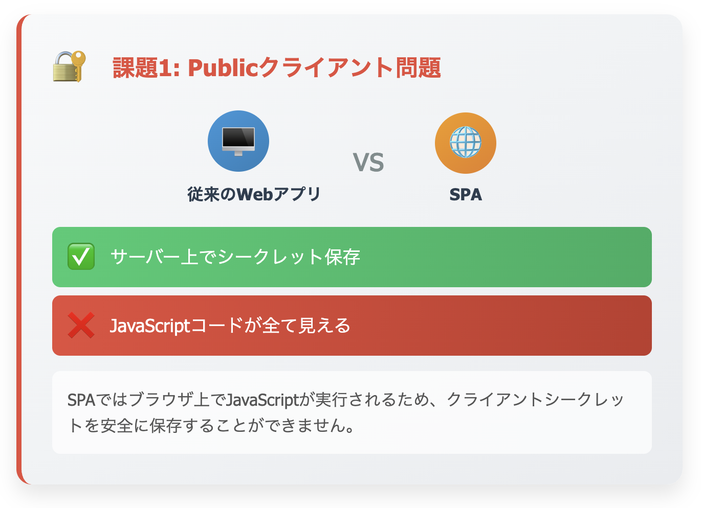
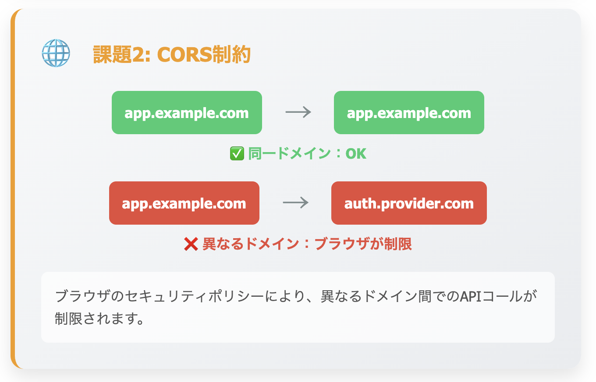
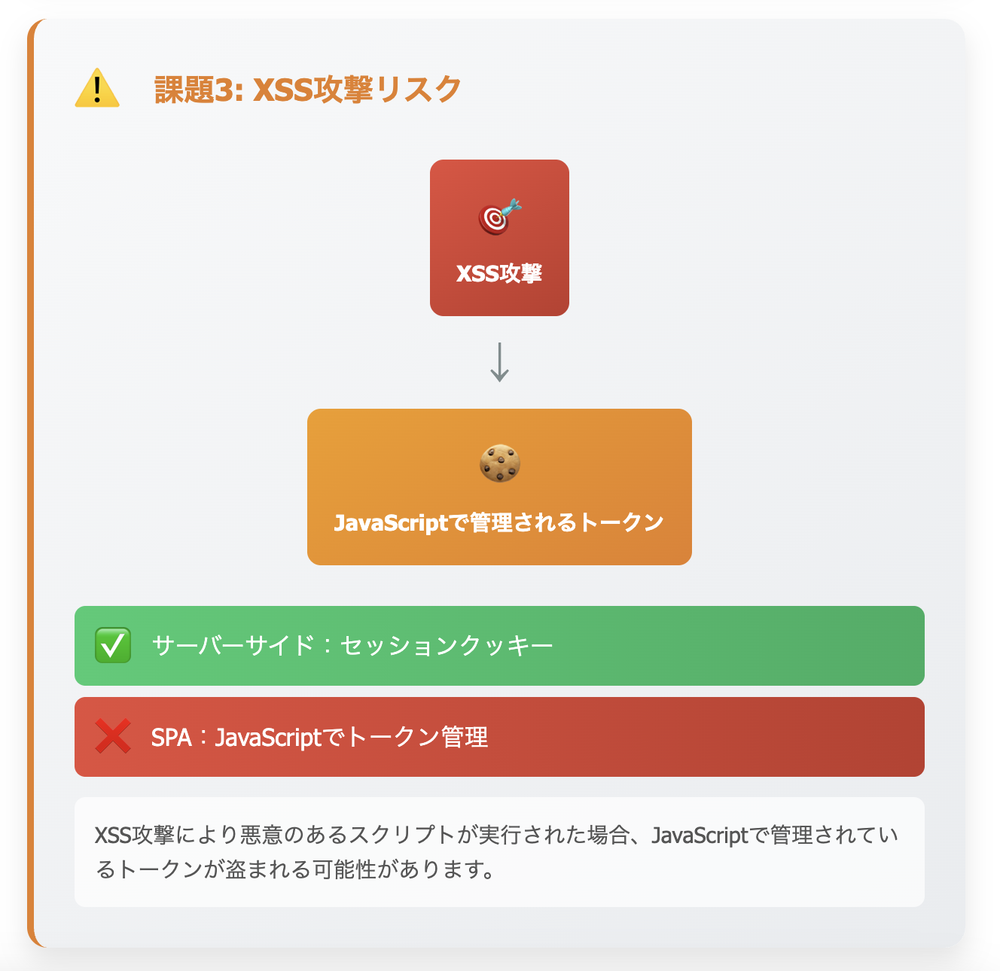

# 5. 実践的な実装パターン

## はじめに

### なぜOAuth/OIDCの概要
- **認証** (Authentication): ユーザーが本人であることの確認
- **認可** (Authorization): リソースへのアクセス権限の管理
- **現代的な課題**: SPA、モバイル、マイクロサービス環境での複雑性

---

## 5.1. SPAアプリケーションでの実装

### SPAの認証における3つの課題

#### 🔐 課題1: Publicクライアント問題

```
従来のWebアプリ：サーバー上でシークレット保存 ✅
SPA：JavaScriptコードが全て見える ❌
```

#### 🌐 課題2: CORS制約

```
同一ドメイン：制限なし ✅
異なるドメイン：ブラウザが制限 ❌
```

#### ⚠️ 課題3: XSS攻撃リスク

```
サーバーサイド：セッションクッキー ✅
SPA：JavaScriptでトークン管理 ❌
```

### 解決策：Authorization Code Flow with PKCE

#### 🔄 PKCEフローの全体像
```
1. ユーザー → [認証画面を開く] → 認証プロバイダー
2. 認証プロバイダー → [認証完了] → ユーザー
3. ユーザー → [認可コード] → SPAアプリ
4. SPAアプリ → [コード + 証明] → 認証プロバイダー
5. 認証プロバイダー → [アクセストークン] → SPAアプリ
```

#### 🛡️ PKCEのセキュリティ仕組み
```
Step 1: ランダムな「秘密の文字列」を生成
Step 2: 秘密の文字列を「ハッシュ化」
Step 3: ハッシュ化された値を認証プロバイダーに送信
Step 4: 認可コードと一緒に「元の秘密の文字列」を送信
Step 5: 認証プロバイダーがハッシュを照合して検証
```

**なぜ安全？**
- 認可コードだけ盗まれても「秘密の文字列」がないとトークン取得不可
- 秘密の文字列はSPAアプリのメモリにのみ存在

### トークン保存戦略の比較

#### 📊 保存方法の比較表
| 保存場所 | セキュリティ | 永続性 | 推奨度 |
|---------|-------------|--------|--------|
| **メモリ** | 🟢 高い | 🔴 ページリロードで消失 | ⭐⭐⭐ |
| **HttpOnly Cookie** | 🟢 高い | 🟢 永続 | ⭐⭐⭐ |
| **localStorage** | 🔴 低い | 🟢 永続 | ❌ |
| **sessionStorage** | 🟡 中程度 | 🟡 タブ閉じるまで | 🔺 |

#### 💡 推奨パターン
**メモリ保存 + 自動リフレッシュ**
- トークンはJavaScript変数に保存
- ページリロード時は自動的に再認証
- XSS攻撃からの保護が最強

### 実装責任の分離

#### 🎯 フロントエンド担当
- ✅ 認証フロー実装
- ✅ トークン取得・管理
- ✅ API呼び出し時のトークン付与
- ✅ ユーザーセッション管理

#### 🏗️ バックエンド担当
- ✅ トークン検証
- ✅ スコープベースの認可
- ✅ リソース保護

---

## 5.2. バックエンドAPIの保護

### JWT検証の仕組み

#### 🔍 JWTの構造
```
JWT = ヘッダー.ペイロード.署名
ヘッダー：{"alg":"RS256","kid":"abc123"}
ペイロード：{"sub":"user123","scope":"read write"}
署名：暗号化された検証データ
```

#### 🔐 検証プロセス
```
1. トークンをヘッダー・ペイロード・署名に分解
2. ヘッダーからkid（鍵ID）を取得
3. JWKS（公開鍵セット）からkidの公開鍵を取得
4. 公開鍵で署名を検証
5. audience、issuer、有効期限をチェック
```

### スコープベース認可システム

#### 📋 スコープ設計例
```
profile          → ユーザー情報の読み取り
users:read       → ユーザー一覧の取得
users:write      → ユーザー情報の更新
users:delete     → ユーザーの削除
admin            → 管理者権限（全ての操作）
```

#### 🎛️ エンドポイント保護マトリックス
| エンドポイント | 必要スコープ | 説明 |
|--------------|-------------|------|
| `GET /profile` | `profile` | 自分の情報 |
| `GET /users` | `users:read` | 一覧取得 |
| `POST /users` | `users:write` | 新規作成 |
| `DELETE /users/:id` | `users:delete` | 削除 |
| `GET /admin/*` | `admin` | 管理機能 |

### エラーハンドリング戦略

#### 🚨 エラータイプと対処法
```
TokenExpiredError
→ HTTP 401 + リフレッシュトークン使用を促す

JsonWebTokenError  
→ HTTP 401 + 再ログインを促す

InsufficientScope
→ HTTP 403 + 必要な権限を通知

MissingToken
→ HTTP 401 + 認証が必要と通知
```

---

## 5.3. モバイルアプリケーションでの実装

### モバイル認証の特殊性

#### 📱 Webとの違い
| 項目 | Web | モバイル |
|------|-----|----------|
| **ブラウザ** | 内蔵ブラウザ | システムブラウザ |
| **リダイレクト** | URL遷移 | Deep Link |
| **トークン保存** | メモリ/Cookie | セキュアストレージ |
| **セッション** | タブ単位 | アプリ単位 |

### iOS実装パターン

#### 🍎 AuthenticationServices活用
```
認証フロー：
1. ASWebAuthenticationSession起動
2. Safariで認証画面表示
3. 認証完了でカスタムURLスキームでアプリに戻る
4. 認可コードを抽出してトークン交換
```

#### 🔐 Keychain活用
```
Keychainの利点：
✅ アプリ削除後も保持
✅ TouchID/FaceIDと連携
✅ 他アプリからアクセス不可
✅ ハードウェア暗号化
```

### Android実装パターン

#### 🤖 Chrome Custom Tabs活用
```
認証フロー：
1. Chrome Custom Tabs起動
2. ネイティブブラウザで認証
3. Intent Filterでアプリに戻る
4. 認可コードを処理
```

#### 🛡️ EncryptedSharedPreferences活用
```
暗号化ストレージの利点：
✅ AES暗号化自動適用
✅ Android Keystoreと統合
✅ 既存SharedPreferencesと同じAPI
✅ マスターキー管理自動化
```

### モバイル特有の考慮点

#### 🔄 バックグラウンド処理
```
課題：アプリがバックグラウンドに移行中のトークン管理
対策：
- アプリ状態監視
- バックグラウンド移行時の有効期限チェック
- フォアグラウンド復帰時の自動リフレッシュ
```

#### 🔗 Deep Linkセキュリティ
```
リスク：悪意のあるアプリからの偽の認証結果
対策：
- state パラメータでの検証強化
- カスタムURLスキームの一意性確保
- 認証結果の厳密な検証
```

---

## 5.4. マイクロサービスアーキテクチャでの運用

### Service Meshパターン

#### 🕸️ 統一認証アーキテクチャ
```
外部リクエスト → API Gateway → Service Mesh → 各マイクロサービス
                     ↓           ↓
                  JWT検証    追加検証・認可
```

#### 🎯 Istio実装パターン
```
RequestAuthentication：JWT検証ルール定義
- 発行者（issuer）検証
- 署名検証
- 有効期限チェック

AuthorizationPolicy：認可ルール定義  
- スコープベース制御
- パス別アクセス制御
- HTTPメソッド別制御
```

### Token Relayパターン

#### 🔄 トークン転送フロー
```
1. クライアント → API Gateway（JWTトークン付き）
2. API Gateway → トークン検証
3. API Gateway → 後続サービス（トークン + ユーザー情報ヘッダー）
4. 各サービス → ヘッダー情報でビジネスロジック実行
```

#### 💡 利点
- 各サービスでのJWT検証処理が不要
- 一元的なセキュリティポリシー管理
- 言語・フレームワークに依存しない

### Service-to-Service認証

#### 🤝 Client Credentials Flow
```
サービスA → 認証サーバー：「サービスBにアクセスしたい」
認証サーバー → サービスA：「専用トークン発行」
サービスA → サービスB：「専用トークンでAPI呼び出し」
```

#### 📊 スコープ設計例
```
service:users:read    → ユーザーサービス読み取り
service:orders:write  → 注文サービス書き込み
service:payments:all  → 決済サービス全権限
internal:monitoring   → 内部監視用
```

---

## 5.5. トークン管理戦略

### リフレッシュ戦略

#### ⏰ トークンライフサイクル
```
アクセストークン：15分〜1時間（短期）
→ APIアクセス用、頻繁に使用

リフレッシュトークン：数日〜数ヶ月（長期）  
→ アクセストークン更新用、限定的使用
```

#### 🔄 自動リフレッシュフロー
```
1. API呼び出し前：アクセストークン有効期限チェック
2. 期限切れ検出：リフレッシュトークンで新しいトークン取得
3. 新トークン保存：古いトークンを新しいものに置換
4. API呼び出し継続：ユーザーは更新を意識しない
```

### トークンローテーション

#### 🔐 Refresh Token Rotation
```
従来の方式：
リフレッシュトークンを繰り返し使用 → セキュリティリスク

ローテーション方式：
使用したリフレッシュトークンは即座に無効化
→ 新しいリフレッシュトークンを同時発行
```

#### 🛡️ セキュリティ効果
- リフレッシュトークン漏洩時の被害最小化
- 不正使用の早期検出
- トークン乗っ取り攻撃の防止

---

## 5.6. セキュリティリスクと回避策

### ❌ 危険な実装パターン

#### 🚫 Implicit Flow（非推奨）
```
なぜ危険？
- URLフラグメントでトークン露出
- ブラウザ履歴に残存
- リフレッシュトークンなし
```

#### 🚫 平文ローカルストレージ
```
なぜ危険？
- XSS攻撃で簡単に盗取
- ブラウザ拡張からアクセス可能
- 永続化でリスク継続
```

#### 🚫 HTTP通信
```
なぜ危険？
- 通信経路での傍受可能
- 中間者攻撃のリスク
- トークン平文送信
```

### ✅ 推奨セキュリティ対策

#### 🛡️ 基本対策
```
✅ PKCE + Authorization Code Flow使用
✅ HTTPS通信の徹底
✅ 適切なトークン保存（メモリ/HttpOnly Cookie）
✅ 適切なCORS設定
✅ CSP（Content Security Policy）実装
```

#### 🔍 監視・検知対策
```
✅ 異常なトークン使用パターンの検知
✅ 複数デバイスからの同時アクセス監視
✅ 地理的に離れた場所からのアクセス警告
✅ トークン有効期限の適切な設定
```

---

## まとめ

### 実装責任マトリックス

| 責任領域 | フロントエンド | バックエンド | インフラ | モバイル |
|---------|-------------|------------|----------|----------|
| **認証フロー** | ⭐ | - | - | ⭐ |
| **トークン検証** | - | ⭐ | ⭐ | - |
| **API認可** | - | ⭐ | - | - |
| **トークン保存** | ⭐ | - | - | ⭐ |
| **セッション管理** | ⭐ | ⭐ | - | ⭐ |
| **監視・ログ** | - | ⭐ | ⭐ | - |

### チーム連携の成功要因

#### 🎯 設計段階での合意
- 認証フロー選択の全員合意
- トークン形式・エラーハンドリング仕様統一
- セキュリティ要件の明確化

#### 🔧 開発段階での連携
- モックサーバー・テスト環境整備
- 統合テストでの認証フロー検証
- 定期的なセキュリティレビュー

#### 📊 運用段階での監視
- ログ形式統一による監視強化
- 認証関連メトリクスの収集
- インシデント対応手順の整備

### 知識共有のベストプラクティス

#### 📚 文書化
- **実装パターン集**：チーム共通のリファレンス
- **セキュリティチェックリスト**：レビュー時の基準
- **トラブルシューティングガイド**：問題解決の手順

#### 🤝 コミュニケーション
- **定期勉強会**：最新動向とベストプラクティス共有
- **コードレビュー**：セキュリティ観点での相互チェック
- **実装サンプル**：新メンバー向けの学習材料

---

## 参考資料

- [OAuth 2.1 Draft](https://datatracker.ietf.org/doc/draft-ietf-oauth-v2-1/)
- [OpenID Connect Core](https://openid.net/specs/openid-connect-core-1_0.html)
- [RFC 7636: PKCE](https://tools.ietf.org/html/rfc7636)
- [OAuth 2.0 Security Best Practices](https://tools.ietf.org/html/draft-ietf-oauth-security-topics)

