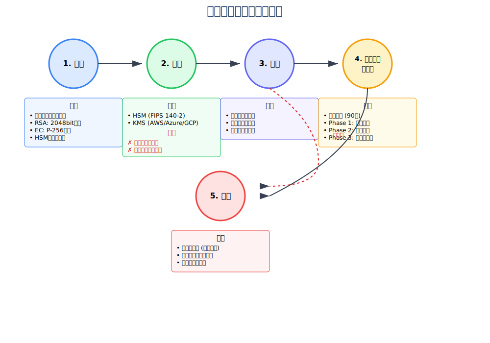

# 6. FAPI (Financial-grade API)

## 1. FAPIとは

FAPI (Financial-grade API) は、金融サービス向けに設計された高度なセキュリティプロファイルです。OAuth 2.0とOpenID Connectの上に構築され、金融取引に必要な厳格なセキュリティ要件を満たすための技術仕様を定義しています。

### 主な特徴
- **高度なセキュリティ**: 金融取引レベルのセキュリティ保証
- **標準準拠**: OAuth 2.0/OpenID Connectとの完全な互換性
- **実装の明確性**: 曖昧さを排除した具体的な実装要件
- **相互運用性**: グローバルな金融エコシステムでの相互運用

### FAPIの位置づけ
```
アプリケーションレイヤー
    ↓
[ FAPI Security Profile ]
    ↓
[ OpenID Connect ]
    ↓
[ OAuth 2.0 ]
    ↓
トランスポートレイヤー (TLS)
```

## 2. 構成要素

FAPIは3つの主要な構成要素から成り立っています：

### 2.1 Security Profile（セキュリティプロファイル）
OAuth 2.0とOpenID Connectの具体的な実装要件を定義する技術仕様。必須機能、推奨機能、オプション機能を明確に区別し、実装の曖昧さを排除します。

### 2.2 Attacker Model（攻撃者モデル）
想定される攻撃者の能力と攻撃シナリオを定義。各攻撃に対する具体的な防御策を示し、セキュリティ設計の根拠を提供します。

### 2.3 Implementation Advice（実装アドバイス）
実装者向けのベストプラクティスとガイダンス。一般的な実装ミスの回避方法や、パフォーマンスとセキュリティのバランスに関する指針を提供します。

## 3. セキュリティプロファイル

### 3.1 FAPI 1.0 プロファイル

FAPI 1.0は、用途に応じて2つのプロファイルを定義しています：

#### プロファイル比較マトリックス

| 機能カテゴリ | 要件 | Baseline (Read-Only) | Advanced (Read-Write) |
|------------|------|---------------------|---------------------|
| **基本要件** |
| TLSバージョン | | TLS 1.2以上 (必須) | TLS 1.2以上 (必須) |
| クライアント認証 | | 方式は実装依存 | MTLS or Private Key JWT (必須) |
| **PKCE** |
| PKCEサポート | | S256 (必須) | S256 (必須) |
| Plainメソッド | | 禁止 | 禁止 |
| **認可要求** |
| State パラメータ | | 必須 | 必須 |
| Nonce パラメータ | | 必須 (OIDC) | 必須 (OIDC) |
| リダイレクトURI | | 完全一致 (必須) | 完全一致 (必須) |
| JAR (JWT Request) | | オプション | 必須 |
| Request URI | | オプション | 推奨 |
| **認可応答** |
| JARM (JWT Response) | | 非対応 | 必須 |
| Response Mode | | query/fragment | JWT |
| **トークン** |
| 送信者制約 | | 非対応 | MTLS (必須) |
| トークン有効期限 | | 実装依存 | 短期間推奨 |
| Refresh Token | | オプション | 送信者制約付き |
| **その他** |
| PAR | | オプション | 推奨 |
| CIBA | | 非対応 | オプション |
| 用途 | | 参照系API | 更新系API |

### 3.2 FAPI 2.0 プロファイル

FAPI 2.0は、プロファイルを統一し、より柔軟な実装オプションを提供：

#### FAPI 2.0 要件マトリックス

| 機能カテゴリ | 要件 | ステータス | 備考 |
|------------|------|----------|-----|
| **必須要件** |
| PAR | Pushed Authorization Request | 必須 | 全ての認可要求で使用 |
| PKCE | S256 | 必須 | Plainは禁止 |
| 送信者制約 | MTLS or DPoP | 必須 | いずれか一方を選択 |
| JAR | JWT Secured Request | 必須 | 署名必須、暗号化は推奨 |
| **推奨要件** |
| JARM | JWT Secured Response | 推奨 | 高セキュリティ環境で推奨 |
| RAR | Rich Authorization Request | 推奨 | 詳細な権限管理 |
| Grant Management | | 推奨 | 認可の管理API |
| **オプション要件** |
| CIBA | Client Initiated Backchannel | オプション | デカップルドフロー |
| Lodging Intent | | オプション | 事前意図登録 |

### 3.3 セキュリティプロファイルの選択フロー

```
スタート
    ↓
APIの用途は？
    ├─ 読み取り専用
    │   ├─ 個人情報含む → FAPI 1.0 Baseline
    │   └─ 公開情報のみ → OAuth 2.0で十分
    └─ 読み書き可能
        ├─ 金融取引あり → FAPI 1.0 Advanced or FAPI 2.0
        └─ 設定変更のみ → FAPI 1.0 Baseline検討
```

## 4. 攻撃者モデル

### 4.1 攻撃者の分類と能力

#### A1: ネットワーク攻撃者
**能力**:
- ネットワークトラフィックの盗聴・記録
- DNSの改ざん、なりすまし
- 中間者攻撃（MITM）の実行
- パケットの遅延・順序変更

**攻撃シナリオ**:
```
[ユーザー] ---(1)認証情報---> [攻撃者] ---(2)改ざん---> [サーバー]
              ↑                    |
              +---(3)偽レスポンス---+
```

**FAPI対策**:
- TLS 1.2以上の必須化
- 証明書ピンニング
- HSTS (HTTP Strict Transport Security)

#### A2: Web攻撃者
**能力**:
- 悪意のあるWebサイトの運営
- ユーザーのブラウザ上でのJavaScript実行
- フィッシングサイトの構築
- ソーシャルエンジニアリング

**攻撃シナリオ**:
```
正規サイト: auth.bank.com
攻撃サイト: auth-bank.com (類似ドメイン)
    ↓
[ユーザー] → [攻撃サイト] → 認証情報窃取
    ↓
[攻撃者] → [正規サイト] → 不正アクセス
```

**FAPI対策**:
- State/Nonceによるセッション固定攻撃対策
- PKCEによる認可コード横取り対策
- 厳密なリダイレクトURI検証

#### A3: アプリケーション攻撃者
**能力**:
- 悪意のあるOAuth/OIDCクライアントの作成
- 正規クライアントになりすまし
- 脆弱なクライアントの悪用
- クライアント認証情報の窃取

**攻撃パターン**:
```
1. 動的クライアント登録の悪用
   攻撃者 → 登録API → 悪意のあるリダイレクトURI登録

2. クライアント認証情報の漏洩
   Public Client → Secret漏洩 → なりすまし

3. 認可範囲の拡大
   最小権限 → 権限昇格攻撃 → 過剰な権限取得
```

**FAPI対策**:
- 動的登録の無効化または制限
- Confidential Clientの必須化
- クライアント認証の強化（MTLS、Private Key JWT）

### 4.2 具体的な攻撃シナリオと対策

#### シナリオ1: 認可コード横取り攻撃

```
攻撃フロー:
1. [ユーザー] → [正規Client] → 認可リクエスト
2. [認可サーバー] → リダイレクト → [攻撃者のサイト]
3. [攻撃者] → 認可コード取得 → [トークンエンドポイント]
4. [攻撃者] → アクセストークン取得 → 不正アクセス

FAPI対策:
- PKCE (S256) 必須
- リダイレクトURIの完全一致検証
- 認可コードの一回限り使用
- 短い有効期限（60秒以内）
```

#### シナリオ2: トークンリプレイ攻撃

```
攻撃フロー:
1. [正規ユーザー] → Bearer Token → [API]
2. [攻撃者] → トークン盗聴
3. [攻撃者] → 盗んだToken → [API] → 不正アクセス

FAPI対策:
- 送信者制約（Sender Constrained Token）
  - MTLS: クライアント証明書とトークンの紐付け
  - DPoP: 暗号的証明によるトークン保護
```

#### シナリオ3: 認可要求改ざん攻撃

```
攻撃フロー:
1. [Client] → 認可リクエスト → [攻撃者]
2. [攻撃者] → パラメータ改ざん（scope拡大など）
3. [攻撃者] → 改ざんリクエスト → [認可サーバー]

FAPI対策:
- JAR (JWT Secured Authorization Request)
- リクエストオブジェクトの署名検証
- PAR (バックチャンネル送信)
```

### 4.3 攻撃者モデルに基づく脅威分析

```
脅威マトリックス:
                    A1(Network) A2(Web) A3(App)
認証情報の盗聴         高        中      低
セッション固定         中        高      中
認可コード横取り       中        高      高
トークン不正使用       高        中      高
リクエスト改ざん       高        中      中
```

## 5. 実装アドバイス

### 5.1 PAR (Pushed Authorization Request) の実装フロー

PARは認可リクエストをバックチャンネルで事前に送信することで、セキュリティを強化する仕組みです。


**PARの利点**:
- **リクエストサイズ制限の回避**: URLパラメータの代わりにPOSTボディを使用
- **リクエストの完全性保証**: JARによる署名でパラメータ改ざんを防止
- **機密情報の保護**: フロントチャネルで機密情報を露出しない

### 5.2 MTLS (Mutual TLS) の実装フロー

MTLSは、クライアントとサーバー間で相互にTLS証明書を検証する仕組みです。


**MTLSのセキュリティ効果**:
- **トークン盗用防止**: トークンと証明書が紐付けられ、証明書なしでは使用不可
- **中間者攻撃対策**: 相互認証により、なりすましを防止
- **強力な認証**: 証明書ベースの認証は、パスワードより安全

### 5.3 DPoP (Demonstration of Proof of Possession) の実装フロー

DPoPは、公開鍵暗号を使用してトークンの所有を証明する仕組みです。


**DPoPの特徴**:
- **動的な証明**: リクエストごとに新しい証明を生成
- **柔軟性**: MTLSと異なり、証明書インフラが不要
- **前方秘匿性**: 秘密鍵が漏洩しても、過去のトークンは保護される

### 5.4 JARM (JWT Secured Authorization Response Mode) の実装フロー

JARMは認可レスポンスをJWTとして署名・暗号化する仕組みです。


**JARMの利点**:
- **改ざん防止**: 署名により認可レスポンスの完全性を保証
- **機密性保護**: 暗号化により認可コードを秘匿
- **発行元確認**: issクレームで認可サーバーのなりすましを防止

### 5.5 実装時のベストプラクティス

#### セキュリティ設計の原則


#### 鍵管理のベストプラクティス



### 5.6 監視とアラート

#### 監視アーキテクチャ


監視項目の詳細
==============

1. 認証・認可メトリクス
   ├─ 認証リクエスト率: 1000req/min以下
   ├─ 認証成功率: 90%以上
   ├─ 認証失敗率: 10%以下（連続失敗でアラート）
   └─ トークン発行率: 正常範囲内

2. パフォーマンスメトリクス
   ├─ API応答時間: p95 < 500ms
   ├─ トークン検証時間: p95 < 100ms
   ├─ データベース応答時間: p95 < 50ms
   └─ エラー率: 1%以下

3. セキュリティメトリクス
   ├─ 不正アクセス試行
   ├─ 異常なトラフィックパターン
   ├─ 証明書の有効期限
   └─ 鍵使用回数

4. アラート設定
   Critical（即時対応）
   ├─ 認証システム停止
   ├─ データ漏洩の疑い
   └─ 大規模な不正アクセス

   High（1時間以内）
   ├─ 認証失敗率急上昇
   ├─ パフォーマンス劣化
   └─ 証明書期限切れ接近

   Medium（24時間以内）
   ├─ 異常トラフィック検知
   └─ リソース使用率上昇

   Low（計画的対応）
   ├─ 定期メンテナンス
   └─ アップデート通知
```

## 6. FAPIと各国標準の補完的関係

### 6.1 Open Banking UK との関係

Open Banking UKは、FAPIをベースに英国市場向けの追加要件を定義しています：

#### 技術スタック
```
Open Banking UK Standards
         ↓
    FAPI 1.0 Advanced
         ↓
    OpenID Connect
         ↓
      OAuth 2.0
```

#### 追加要件
- **Customer Experience Guidelines**: ユーザー体験の標準化
- **Operational Guidelines**: 運用要件とSLA
- **Read/Write Data Standards**: APIペイロードの標準化
- **Directory Standards**: 参加者の登録と管理

### 6.2 全銀協オープンAPI仕様との関係

全銀協のオープンAPI仕様は、FAPIを日本の金融環境に適応させたものです：

#### 実装レベル
```
レベル1（参照系API）
├── FAPI 1.0 Baseline準拠
├── 読み取り専用アクセス
└── 残高照会、取引明細照会

レベル2（更新系API）
├── FAPI 1.0 Advanced準拠
├── 更新・決済機能
└── 振込、振替、定期預金
```

#### 日本特有の要件
- 文字エンコーディング（UTF-8）の明確化
- 日本語エラーメッセージの標準化
- 金融規制（銀行法、資金決済法）への準拠
- 全銀フォーマットとの互換性

### 6.3 グローバル相互運用性

```
         FAPI (Global Standard)
              ↓
    ┌─────────┼─────────┐
    ↓         ↓         ↓
UK Open   全銀協API   EU PSD2
Banking               Standards
    ↓         ↓         ↓
 UK Banks  JP Banks  EU Banks
    └─────────┴─────────┘
              ↓
    Cross-border Interoperability
```

## 7. 今後の展望

### 7.1 技術的進化
- **FAPI 2.0の普及**: シンプルで実装しやすい統一プロファイル
- **新認証技術の統合**: WebAuthn、パスキーとの連携
- **分散型ID**: Verifiable Credentialsの活用
- **量子耐性暗号**: ポスト量子暗号への移行準備

### 7.2 ビジネス展開
- **オープンファイナンス**: 銀行以外の金融サービスへの拡大
- **組込み金融**: 非金融サービスへのAPI組込み
- **国際標準化**: ISO/IECでの標準化推進
- **新興市場**: アジア・アフリカでの採用加速

## まとめ

FAPIは金融グレードのセキュリティを実現するための包括的なフレームワークです：

1. **強固なセキュリティ**: 多層防御による高度な保護
2. **標準準拠**: OAuth 2.0/OIDCとの完全な互換性
3. **実装の柔軟性**: ユースケースに応じた選択
4. **将来性**: 継続的な進化と改善

金融APIを実装する際は、FAPIの採用を強く推奨します。セキュリティプロファイル、攻撃者モデル、実装アドバイスの3つの構成要素を理解し、適切に実装することで、安全で信頼性の高い金融サービスを提供できます。