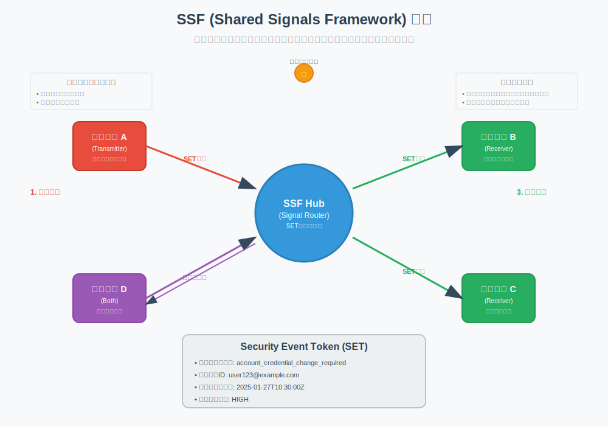
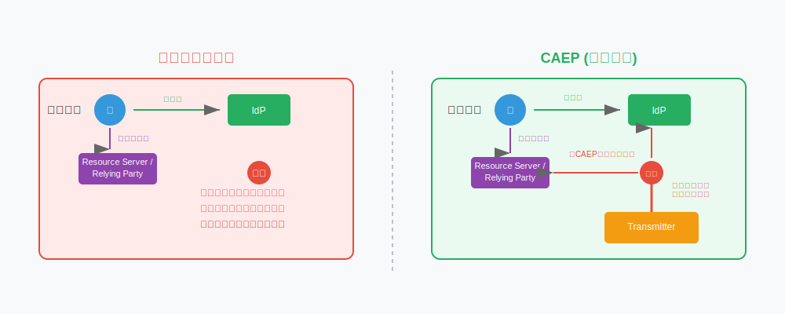
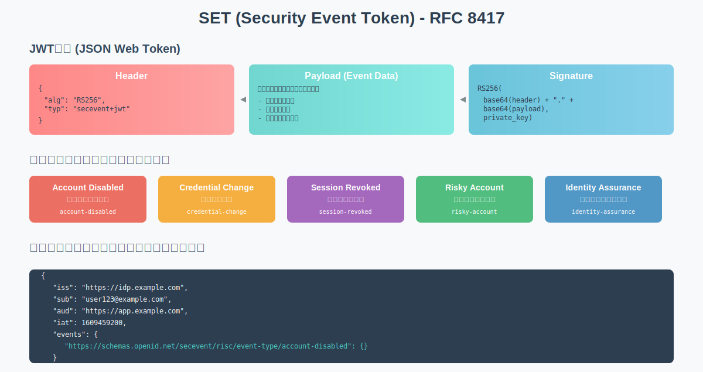

# 8. Shared Signals Framework (SSF)と関連標準

## 8.1. はじめに：セキュリティイベント共有の重要性

今日の複雑なIT環境において、セキュリティイベントは単一のシステムやサービス内で完結することは稀です。ユーザーアカウントの侵害、デバイスの紛失、不正なアクセス試行など、あるサービスで検知されたセキュリティイベントは、他の連携サービスにも影響を及ぼす可能性があります。

従来、これらの情報は各サービス間で十分に共有されておらず、以下のような課題がありました。

- **対応の遅延**: あるサービスでアカウントが侵害されても、他のサービスがその情報を知るまでに時間がかかり、被害が拡大する可能性があります。
- **ユーザーエクスペリエンスの低下**: 各サービスが個別にリスク評価を行うため、ユーザーは何度も追加の認証を求められることがあります。
- **運用コストの増大**: 各サービスが独自にセキュリティ対策を講じる必要があり、全体としての運用コストが増加します。

Shared Signals Framework (SSF) は、これらの課題を解決するために、**セキュリティイベント情報を標準化された方法でリアルタイムに共有するためのフレームワーク**です。これにより、エコシステム全体で迅速かつ協調的なセキュリティ対応を実現し、ユーザーエクスペリエンスを向上させることを目指します。

## 8.2. Shared Signals Framework (SSF) の概要

SSFは、OpenID Foundation内のワーキンググループで標準化が進められています。主な目的は、サービスプロバイダー間でセキュリティ関連の「シグナル」を交換するための標準的な方法を定義することです。





## 基本概要

| 項目 | CAEP | RISC |
|------|------|------|
| **正式名称** | Continuous Access Evaluation Protocol / Profile | Risk Incident Sharing and Coordination |
| **主な目的** | セッションレベルの継続的アクセス評価 | アカウントレベルのリスクインシデント共有 |

## 基本的な違い

| 項目 | CAEP | RISC |
|------|------|------|
| **対象範囲** | **セッション関連**のイベント | **アカウント関連**のイベント |
| **イベントの性質** | リアルタイム、継続的評価 | リスクベース、インシデント対応 |
| **頻度** | 高頻度（セッション中の変化を監視） | 低頻度（重要なセキュリティイベント時） |
| **緊急性** | 通常の運用内でのリアルタイム対応 | 緊急性の高いセキュリティインシデント（911スタイル） |
| **対象期間** | アクティブセッション中 | アカウント全体のライフサイクル |

## イベント構造の違い

| 項目 | CAEP | RISC |
|------|------|------|
| **共通クレーム** | **4つの標準オプショナルクレーム**:<br/>• `initiating_entity` (誰がイベントを起動したか)<br/>• `reason_admin` (管理者向け説明)<br/>• `reason_user` (ユーザー向け説明)<br/>• `event_timestamp` | **共通クレームなし**<br/>各イベントタイプ固有のクレームのみ |
| **イベント固有クレーム** | 上記4つの共通クレーム + イベント固有クレーム | イベントタイプごとに完全に独自のクレーム |
| **sub_id使用** | 必須（SSF標準に従う） | 必須（SSF標準に従う） |

## 具体的なイベントタイプ

### CAEPの主要イベント

| イベントタイプ | 説明 | 用途 |
|---------------|------|------|
| **Session Revoked** | セッションが無効化された | セッション終了の通知 |
| **Token Claims Change** | トークンのクレームが変更された | 権限やロールの動的変更 |
| **Device Compliance Change** | デバイスのコンプライアンス状態変更 | デバイス管理システム連携 |
| **Assurance Level Change** | 認証保証レベルの変更 | セキュリティレベル調整 |

### RISCの主要イベント

| イベントタイプ | 説明 | 用途 |
|---------------|------|------|
| **Account Credential Change Required** | 認証情報の変更が必要 | パスワード強制変更等 |
| **Account Purged** | アカウントが削除された | アカウント完全削除通知 |
| **Account Disabled** | アカウントが無効化された | 一時的無効化通知 |
| **Account Enabled** | アカウントが有効化された | 再有効化通知 |
| **Identifier Changed** | アカウント識別子が変更された | ユーザーID/メール変更等 |
| **Identifier Recycled** | 識別子が再利用された | セキュリティ確認用 |
| **Credential Compromise** | 認証情報が漏洩した | 緊急セキュリティ対応 |
| **Opt In/Out** | RISCイベント交換への参加/離脱 | プライバシー制御 |
| **Recovery Activated** | 復旧フローが開始された | アカウント復旧プロセス |
| **Recovery Information Changed** | 復旧情報が変更された | 復旧メール変更等 |

## 技術的実装の違い

| 項目 | CAEP | RISC |
|------|------|------|
| **メッセージング特性** | 高頻度、リアルタイム配信 | 低頻度、重要時のみ配信 |
| **レスポンス時間** | 即座〜15分以内（通常は即座） | 事件対応時間に依存 |
| **データ永続性** | セッション期間中 | アカウント存続期間中 |

## 使用ケース・シナリオ

### CAEPの典型的シナリオ

| シナリオ | 説明 |
|----------|------|
| **位置変更** | ユーザーが通常と異なる場所からアクセス開始 |
| **デバイス変更** | 新しいデバイスからのアクセス |
| **権限変更** | 管理者がユーザーの権限をリアルタイムで変更 |
| **コンプライアンス変更** | デバイスがコンプライアンス非準拠になった |
| **ネットワーク変更** | VPN接続/切断、ネットワーク変更 |

### RISCの典型的シナリオ

| シナリオ | 説明 |
|----------|------|
| **アカウント侵害** | アカウントが不正アクセスされた |
| **大規模データ漏洩** | 外部の漏洩でパスワードが流出 |
| **従業員退職** | 従業員のアカウント無効化 |
| **部署異動** | 組織内でのアカウント移動 |
| **復旧プロセス** | アカウント復旧手続き開始 |


## 選択指針

### CAEPが適している場合
- リアルタイムでのアクセス制御が必要
- セッション中の動的な権限変更が必要
- 継続的な信頼評価を実装したい
- 高頻度の状態変更を扱う

### RISCが適している場合
- セキュリティインシデント対応が主目的
- アカウントレベルの重要な変更を管理
- 組織間でのリスク情報共有が必要
- 低頻度だが重要なイベントを扱う  

## 8.3. 具体的なユースケース：エンドユーザー向けサービスでのSSF活用

SSFが実際にどのように役立つのか、エンドユーザー向けのオンラインサービスを例に見てみましょう。

CAEPとRISCイベントの実践的な活用例について、具体的なシナリオベースで解説いたします。

### 8.3.1. 🎯 CAEPイベントの実践的活用例

#### 1. Just-in-Time Authorization（動的権限付与）

カスタマーサポートでの事例：サポート担当者Janeが特定の顧客ケースにアサインされた時、CAEPの「token claims change」イベントでその顧客IDへのアクセス権限を動的に付与し、ケース完了時に権限を自動削除

**具体的フロー：**
```
1. サポートチケットシステム: 顧客A の問題をJaneにアサイン
2. CAEP送信: "token-claims-change" イベント
   - subject: Jane のユーザーID
   - 追加権限: customer_id="A" への read-write アクセス
3. 各連携システム: Janeに顧客Aのデータアクセス権限を付与
4. ケース完了時: 再度 "token-claims-change" で権限削除
```

#### 2. リアルタイム地理的アクセス制御

**シナリオ：** 営業担当が出張先からアクセスする場合

```
1. 通常: 東京オフィスからアクセス（低リスク）
2. CAEP検知: 突然シンガポールからアクセス開始
3. "assurance-level-change" イベント送信
   - 認証レベルを "高リスク" に変更
4. 連携システム: 追加認証要求（MFA強制）
5. 安全確認後: 認証レベルを "通常" に戻す
```

#### 3. Microsoft Teams/SharePointでの協働制御

**シナリオ：** 複数ユーザーでのドキュメント共同編集中の動的制御

```
1. 部門Aのメンバーがドキュメント編集中
2. 組織変更: 部門Aの機密レベルが "社外秘" に変更
3. CAEP "device-compliance-change": 
   - 個人デバイスは "non-compliant" に分類
4. 即座に個人デバイスユーザーのアクセス無効化
5. 会社デバイスユーザーのみ編集継続可能
```

### 8.3.2. 🚨 RISCイベントの実践的活用例

#### 1. Google Cross-Account Protection連携

**シナリオ：** 従業員のGoogleアカウントが侵害された場合

```
1. Google検知: 従業員Bobのアカウントに不正アクセス
2. Google→企業IdP: RISC "credential-compromise" イベント送信
   - subject: Bob のメールアドレス
   - event: 認証情報漏洩の可能性
3. 企業システム自動対応:
   - 全社システムからBobのセッション強制終了
   - パスワード強制変更要求
   - 一時的アカウント無効化
4. セキュリティチーム通知: インシデント調査開始
```

#### 2. 大規模データ漏洩対応

**シナリオ：** 外部サービスでパスワードリスト漏洩が発覚

```
1. セキュリティベンダー検知: 大手サービスでパスワード漏洩
2. 影響調査: 自社従業員100名が同じパスワード使用の可能性
3. RISC一括送信: "account-credential-change-required"
   - 対象: 影響可能性のある100名
   - 要求: 即座のパスワード変更
4. 自動対応:
   - 対象者の全セッション無効化
   - パスワード変更画面へ強制リダイレクト
   - 変更完了まで全システムアクセス禁止
```

#### 3. 従業員ライフサイクル管理

**シナリオ：** 従業員の退職・異動プロセス

```
退職時:
1. HR システム: 退職手続き完了
2. RISC送信: "account-disabled" → "account-purged"
3. 連携システム: 全サービスからアカウント削除

異動時:
1. HR システム: 部署異動（営業→経理）
2. RISC送信: "identifier-changed" (部署情報更新)
3. 連携システム: 
   - 営業システムアクセス削除
   - 経理システムアクセス追加
```

### 8.3.3. 🔄 CAEP + RISC 組み合わせ活用例

#### 1. 高度なZero Trustアーキテクチャ

**シナリオ：** 包括的セキュリティ監視システム

```
【平常時 - CAEP継続監視】
- 位置変更監視
- デバイス状態監視  
- ネットワーク変更監視
- 権限動的調整

【インシデント発生 - RISC緊急対応】
- アカウント侵害検知
- 認証情報漏洩対応
- アカウント無効化
- 復旧プロセス管理

【連携効果】
RISC→CAEP: インシデント後の継続監視強化
CAEP→RISC: 異常パターン検知時のインシデント発報
```

#### 2. 高度な特権アクセス管理（PAM, Privileged Access Management）

**シナリオ：** システム管理者の特権アクセス制御

```
【通常運用 - CAEP】
1. 管理者がメンテナンス作業申請
2. "token-claims-change": 2時間限定の特権付与
3. 位置・デバイス・ネットワーク継続監視
4. 異常検知時: 即座に特権無効化

【セキュリティインシデント - RISC】
1. 管理者アカウント侵害の疑い
2. "credential-compromise": 全特権アカウント強制無効化
3. "account-credential-change-required": パスワード強制変更
4. インシデント調査完了まで特権アクセス全面停止

【復旧プロセス - RISC + CAEP】
1. RISC "recovery-activated": 復旧プロセス開始
2. CAEP継続監視: 復旧後の行動パターン監視
3. 段階的権限復旧: CAEPで動的に権限レベル調整
```

#### 3. SCIMイベントとの三位一体運用（SCIM, System for Cross-domain Identity Management）

**シナリオ：** プロビジョニング・セッション・リスク の統合管理

```
【新入社員オンボーディング】
1. SCIM Events: アカウント作成・権限プロビジョニング
2. CAEP開始: 初回ログイン時の継続監視
3. RISC待機: セキュリティインシデント対応準備

【異常検知時の連携】
1. CAEP検知: 異常な行動パターン
2. RISC送信: "credential-compromise" 疑い
3. SCIM Events: 関連権限の一時削除
4. 調査後: 段階的復旧（SCIM→CAEP→RISC解除）

【退職時の完全削除】
1. RISC: "account-disabled" → "account-purged"
2. CAEP: 全セッション即座無効化
3. SCIM Events: 全システムからプロビジョニング削除
```

このように、CAEPとRISCは単独でも強力ですが、組み合わせることで現代的なZero Trustセキュリティアーキテクチャの中核を形成し、リアルタイムでの継続的セキュリティ評価と動的な対応を可能にします。

## 8.4. セキュリティイベントの種類と構造 (SET)

CAEPとRISCで共有されるセキュリティイベントは、**SET (Security Event Token)** と呼ばれるJWT (JSON Web Token) 形式のトークンで表現されます。



SETには、以下のような情報が含まれます。

Security Event Token（SET）の具体例を、CAEPとRISCに分けて詳しく解説します。Security Event Token（SET）の具体的な例を、CAEPとRISCに分けて詳しく解説します。

### 8.4.1. 🔐 SETの基本構造

SETはJWT（JSON Web Token）形式で、オプションで署名・暗号化が可能です。

#### JWTヘッダー
```json
{
  "alg": "RS256",
  "kid": "2023-06-key-id", 
  "typ": "secevent+jwt"
}
```

### 8.4.2. 🟢 CAEPイベントの例

CAEPイベントには4つの共通オプショナルクレームがあります：

#### 1. Session Revoked（セッション無効化）

```json
{
  "iss": "https://idp.example.com",
  "jti": "756E69717565-206964656E746966696572",
  "iat": 1702448550,
  "aud": "client_app_12345",
  "sub_id": {
    "format": "iss_sub",
    "iss": "https://idp.example.com", 
    "sub": "user_12345"
  },
  "events": {
    "https://schemas.openid.net/secevent/caep/event-type/session-revoked": {
      "initiating_entity": "policy",
      "reason_admin": {
        "en": "Landspeed Policy Violation: C076E82F"
      },
      "reason_user": {
        "en": "Access attempt from multiple regions detected"
      },
      "event_timestamp": 1702448550,
      "subject": {
        "format": "iss_sub",
        "iss": "https://idp.example.com",
        "sub": "user_12345"
      }
    }
  }
}
```

#### 2. Device Compliance Change（デバイスコンプライアンス変更）

```json
{
  "iss": "https://mdm.company.com",
  "jti": "compliance-change-98765",
  "iat": 1702448550,
  "aud": "hr_app_client",
  "sub_id": {
    "format": "opaque",
    "id": "device_abc123"
  },
  "events": {
    "https://schemas.openid.net/secevent/caep/event-type/device-compliance-change": {
      "initiating_entity": "system",
      "reason_admin": {
        "en": "Device failed security scan: missing updates"
      },
      "reason_user": {
        "en": "Your device needs security updates"
      },
      "event_timestamp": 1702448550,
      "previous_status": "compliant",
      "current_status": "not-compliant",
      "subject": {
        "format": "opaque", 
        "id": "device_abc123"
      }
    }
  }
}
```

#### 3. Token Claims Change（トークンクレーム変更）

```json
{
  "iss": "https://hr.company.com",
  "jti": "role-change-54321",
  "iat": 1702448550,
  "aud": ["app1_client", "app2_client"],
  "sub_id": {
    "format": "email",
    "email": "alice@company.com"
  },
  "events": {
    "https://schemas.openid.net/secevent/caep/event-type/token-claims-change": {
      "initiating_entity": "admin",
      "reason_admin": {
        "en": "Department transfer: Sales to Engineering"
      },
      "reason_user": {
        "en": "Your department has been updated"
      },
      "event_timestamp": 1702448550,
      "claims": {
        "department": "engineering",
        "role": "senior_developer",
        "manager": "bob@company.com"
      },
      "subject": {
        "format": "email",
        "email": "alice@company.com"
      }
    }
  }
}
```

### 8.4.3. 🔴 RISCイベントの例

RISCイベントには共通クレームがなく、各イベントタイプごとに独自のクレーム構造を持ちます。

#### 1. Credential Compromise（認証情報漏洩）

```json
{
  "iss": "https://security.vendor.com",
  "jti": "credential-breach-789",
  "iat": 1702448550,
  "aud": "company_sso_client",
  "sub_id": {
    "format": "email",
    "email": "john@company.com"
  },
  "events": {
    "https://schemas.openid.net/secevent/risc/event-type/credential-compromise": {
      "event_timestamp": 1702448550,
      "credential_type": "password",
      "confidence_level": "high",
      "breach_source": "third_party_database",
      "subject": {
        "format": "email",
        "email": "john@company.com"
      }
    }
  }
}
```

#### 2. Account Disabled（アカウント無効化）

Login.govの実装例：

```json
{
  "iss": "https://idp.company.com",
  "jti": "account-disable-456",
  "iat": 1702448550,
  "aud": "connected_apps",
  "sub_id": {
    "format": "iss_sub",
    "iss": "https://idp.company.com",
    "sub": "employee_789"
  },
  "events": {
    "https://schemas.openid.net/secevent/risc/event-type/account-disabled": {
      "reason": "employment_termination",
      "occurred_at": 1702448550,
      "subject": {
        "format": "iss_sub",
        "iss": "https://idp.company.com", 
        "sub": "employee_789"
      }
    }
  }
}
```

#### 3. Identifier Changed（識別子変更）

Oktaの実装例：

```json
{
  "iss": "https://hr.company.com",
  "jti": "email-change-123",
  "iat": 1702448550,
  "aud": "all_company_apps",
  "sub_id": {
    "format": "iss_sub",
    "iss": "https://hr.company.com",
    "sub": "emp_98765"
  },
  "events": {
    "https://schemas.openid.net/secevent/risc/event-type/identifier-changed": {
      "event_timestamp": 1702448550,
      "new-value": "alice.smith@company.com",
      "old-value": "alice.jones@company.com", 
      "identifier_type": "email",
      "subject": {
        "format": "iss_sub",
        "iss": "https://hr.company.com",
        "sub": "emp_98765"
      }
    }
  }
}
```

#### 4. Recovery Activated（復旧プロセス開始）

```json
{
  "iss": "https://security.company.com",
  "jti": "recovery-init-111",
  "iat": 1702448550,
  "aud": "security_team_dashboard",
  "sub_id": {
    "format": "phone",
    "phone_number": "+1-555-123-4567"
  },
  "events": {
    "https://schemas.openid.net/secevent/risc/event-type/recovery-activated": {
      "recovery_type": "password_reset",
      "recovery_method": "sms_verification",
      "initiated_by": "user",
      "subject": {
        "format": "phone", 
        "phone_number": "+1-555-123-4567"
      }
    }
  }
}
```

### 8.4.4. 🔍 重要なポイント

#### 共通要素
- **typ**: `"secevent+jwt"`固定
- **iss**: Transmitterの識別子
- **jti**: 一意のイベント識別子
- **aud**: Receiverの識別子
- **sub_id**: SSFで必須のトップレベルサブジェクト識別子

#### CAEPの特徴
- **4つの共通クレーム**: `initiating_entity`, `reason_admin`, `reason_user`, `event_timestamp`
- **リアルタイム性**: セッション変更の即座通知
- **ユーザー向けメッセージ**: `reason_user`でエンドユーザーへの説明

#### RISCの特徴
- **イベント固有構造**: 各イベントタイプが独自のクレーム定義
- **重要度の高さ**: アカウント・セキュリティの重大変更
- **調査・対応用**: セキュリティインシデント対応に特化

これらのSETは、システムログイベントとして記録され、適切なアクションが実行されることで、リアルタイムなセキュリティ対応を実現しています。

## 8.5. リアルタイムセキュリティ対応への応用

SSF、CAEP、RISCを活用することで、以下のようなリアルタイムセキュリティ対応が実現可能になります。

- **侵害アカウントの即時無効化**: あるサービスでアカウント侵害が検知された場合、連携する全てのサービスで該当アカウントのセッションを即座に無効化し、被害の拡大を最小限に抑える。
- **動的なアクセス制御**: ユーザーのデバイスがセキュリティポリシーを満たさなくなった場合（例: MDMからの通知）、機密情報へのアクセスを制限したり、追加の認証を要求したりする。
- **ユーザーへの迅速な通知と対応促進**: アカウントに関する不審なアクティビティが検知された場合、ユーザーに即座に通知し、パスワード変更や二要素認証の設定を促す。
- **フィッシング攻撃への対策**: フィッシングサイトへのログイン試行が検知された場合、その情報を共有し、他のサービスでの同様の攻撃を防ぐ。
- **ユーザーエクスペリエンスの向上**: リスクレベルに応じて認証要求を調整することで、不要な認証ステップを削減し、利便性を損なわずにセキュリティを確保する。例えば、信頼できるデバイスからのアクセスや、低リスクな操作に対しては、追加認証を省略する。

## 8.6. 他のセキュリティ技術との連携・比較

SSFは、既存のセキュリティ技術やコンセプトと連携することで、その効果をさらに高めることができます。

### 8.6.1. 従来のセッション管理との違い

従来のセッション管理では、アクセストークンの有効期限を短く設定したり、RPが定期的にIdPにトークンの有効性を問い合わせる（ポーリング）といった方法が取られてきました。

- **ポーリングの限界**: ポーリング間隔が長いと、トークンが失効してから実際にアクセスが拒否されるまでにタイムラグが生じます。間隔を短くすると、IdPへの負荷が増大します。
- **SSF (プッシュ型通知) の利点**: SSFはイベント発生時にIdPからRPへ即座に通知（プッシュ）するため、ほぼリアルタイムでの対応が可能です。これにより、セキュリティの向上とシステム負荷の軽減を両立できます。

## 8.7. SSF導入のメリットと課題

### 8.7.1. メリット

- **インシデント対応の迅速化**: セキュリティイベントのリアルタイム共有により、侵害の影響範囲特定や封じ込めまでの時間を大幅に短縮できます。
- **ユーザーエクスペリエンスの向上**: リスクベースの動的なアクセス制御により、ユーザーは不必要な認証ステップから解放され、利便性が向上します。
- **セキュリティ運用コストの削減**: イベント共有と対応の自動化により、手動での調査や対応にかかる工数を削減できます。
- **エコシステム全体のセキュリティ強化**: 参加するサービスプロバイダーが増えるほど、共有される情報の価値が高まり、エコシステム全体のセキュリティレベルが向上します。
- **標準化による相互運用性**: 標準化されたプロトコルを利用するため、異なるベンダーの製品やサービス間でも連携が容易になります。

### 8.7.2. 課題・考慮点

- **標準への対応状況と普及**: SSFに対応したIdP、RP、セキュリティ製品はまだ発展途上であり、エコシステム全体での普及には時間がかかる可能性があります。
- **設定・運用の複雑さ**: 共有するイベントの種類、連携先、通知ポリシーなどを適切に設定・管理するには、専門的な知識や体制が必要となる場合があります。
- **プライバシーへの配慮**: 共有されるイベント情報には機微な情報が含まれる可能性があるため、適切な同意管理、データの最小化、匿名化などのプライバシー保護措置が不可欠です。
- **エコシステム全体の協力と信頼**: SSFの効果を最大限に発揮するには、多くのサービスプロバイダーが積極的に参加し、信頼できる情報を共有する文化を醸成する必要があります。誤った情報や悪意のある情報が共有されるリスクも考慮しなければなりません。
- **イベントの解釈と対応の一貫性**: 受信したイベントをどのように解釈し、どのような対応を取るかについては、各サービスプロバイダー間である程度の一貫性が求められます。

## 8.8. 今後の展望と期待

SSFはまだ新しい技術ですが、その将来性は非常に大きいと考えられます。

- **対応製品・サービスの拡大**: 主要なIdPベンダーや大手サービスプロバイダーが対応を進めており、今後さらに多くの製品・サービスでの採用が期待されます。
- **より多様なシグナルの活用**: 現在定義されているイベントタイプに加え、IoTデバイスのセキュリティ状態、ユーザーの生体認証情報に関するシグナルなど、より多様な情報が共有されるようになる可能性があります。
- **AI/機械学習との連携強化**: AIや機械学習を用いて、大量のセキュリティシグナルからより高度な脅威インテリジェンスを抽出し、予測的なセキュリティ対策や自動化されたインシデントレスポンスの精度向上が期待されます。
- **業界標準としての定着**: 金融業界におけるFAPIのように、特定の業界やユースケースにおいてSSFの利用が標準となる可能性があります。
- **クロスドメインでの連携**: 企業内システムだけでなく、異なる組織間や業界間でのセキュリティ情報共有が進むことで、より広範なサイバー攻撃への耐性が向上することが期待されます。


## 8.9. まとめ

Shared Signals Framework (SSF) は、CAEPやRISCといったプロトコルを通じて、セキュリティイベント情報を標準化された方法で共有するための重要な取り組みです。これにより、企業や組織は、サイバー攻撃に対してより迅速かつ効果的に対応し、エコシステム全体のセキュリティレベルを向上させることができます。

導入にはいくつかの課題も伴いますが、それを乗り越えることで得られるメリットは大きく、今後のデジタル社会におけるセキュリティ基盤の一つとして発展していくことが期待されます。

---

## 8.10. 質疑応答（想定される質問と回答例）

**Q1: SSFの標準化についての情報はどこで追えばいいですか？**
A1: SSFの標準化は、主にOpenID Foundation内のShared Signals and Events (SSE) Working Groupで行われています。以下の情報を参考にすると良いでしょう。

* **OpenID Foundationのウェブサイト**: SSEワーキンググループのページやメーリングリストで、最新のドラフト仕様や議論の状況を確認できます。(例: [https://openid.net/wg/sse/](https://openid.net/wg/sse/))
* **IETF (Internet Engineering Task Force)**: 関連するプロトコル (例: SECEVENT) の一部はIETFでも議論されることがあります。IETFのメーリングリストやドラフトも参考になります。
* **関連カンファレンスやイベント**: Identiverse、OpenID Workshop、IETFミーティングなど、アイデンティティ関連のカンファレンスで最新情報が発表されることがあります。

**Q2: 具体的にどの製品やサービスがSSFに対応していますか？**  
A2: OpenID Foundationのウェブサイトや、各IdPベンダー（例: Okta, Ping Identity, Microsoft Azure ADなど）のドキュメントで最新の対応状況を確認できます。まだ新しいフレームワークであるため、対応製品は順次拡大している状況です。

**Q3: 中小企業でもSSFを導入するメリットはありますか？ また、導入のハードルは？**  
A3: メリットはあります。特にクラウドサービスを多用している場合、サービス間の連携セキュリティを強化できます。導入のハードルとしては、対応するIdPやサービスを利用しているか、専門知識を持つ人材がいるかなどが挙げられます。まずは利用しているSaaSプロバイダーがSSFに対応しているか確認することから始めると良いでしょう。

**Q4: SSFを導入しない場合、どのようなリスクが考えられますか？**  
A4: アカウント侵害が発生した際に、その情報が他の連携サービスに迅速に伝わらず、被害が拡大するリスクがあります。また、ユーザーは各サービスで個別にリスク評価されるため、過剰な認証を求められるなどUXが悪化する可能性も考えられます。

**Q5: SSFで共有される情報によって、プライバシーが侵害される懸念はありませんか？**  
A5: その懸念はあります。そのため、SSFの仕様では、共有する情報を必要最小限にすること、イベントの購読・配信に関してユーザーの同意を得ることなどが考慮されています。運用にあたっては、プライバシーポリシーを明確にし、適切なデータ管理を行うことが重要です。

**Q6: SSFと既存のAPIセキュリティ（例：APIキー、OAuthスコープ）との違いは何ですか？**  
A6: APIキーやOAuthスコープは、主に「誰が何にアクセスできるか」という静的な認可を制御します。一方SSFは、認可された後のセッションやアカウントの状態変化といった「動的なセキュリティイベント」をリアルタイムに共有し、継続的なアクセス評価を可能にする点で異なります。これらは補完関係にあり、組み合わせて利用することでより強固なセキュリティを実現できます。