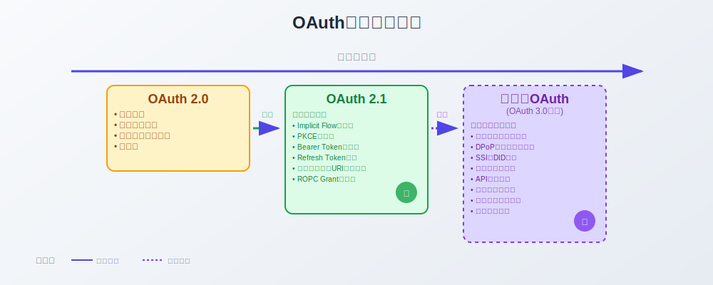
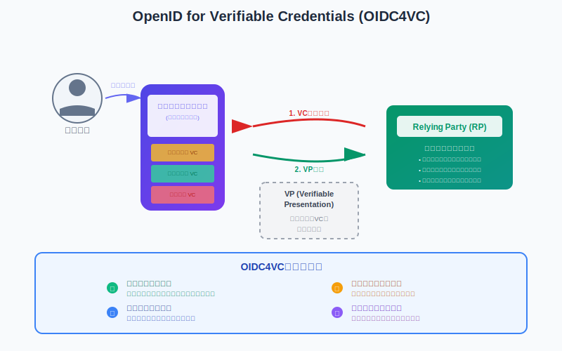
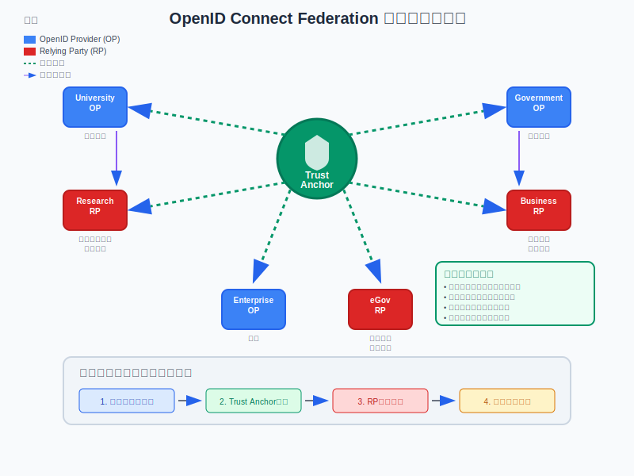

# 9. 将来の方向性

本セクションでは、OAuthおよびOpenID Connect (OIDC) の将来的な展望と、関連する技術動向について解説します。これらの技術が今後どのように進化し、私たちのデジタルアイデンティティとセキュリティにどのような影響を与えるのかを見ていきましょう。

## 9.1 OAuth 2.1/3.0 の展望



### OAuth 2.1

OAuth 2.0 は広く普及しましたが、その仕様にはいくつかの曖昧さやセキュリティ上の懸念点が指摘されてきました。OAuth 2.1 は、これらの課題に対処し、ベストプラクティスを統合することを目的としています。

- **主な変更点・推奨事項:**
    - **Implicit Flow の非推奨:** SPA (Single Page Application) におけるセキュリティリスクのため、Authorization Code Flow with PKCE (Proof Key for Code Exchange) の利用が強く推奨されます。
    - **Resource Owner Password Credentials Grant の非推奨:** パスワードを直接クライアントに渡すことのリスクのため。
    - **Bearer Token の取り扱い:** より厳格なセキュリティ要件（HTTPS必須など）。
    - **リダイレクトURIの完全一致:** 部分一致による脆弱性を排除。
    - **PKCEの必須化 (Public Clients):** ネイティブアプリやSPAなど、クライアントシークレットを安全に保持できないクライアントに対してPKCEを必須とします。
    - **Refresh Token のローテーション推奨:** 漏洩時のリスクを低減するため、リフレッシュトークン使用時に新しいリフレッシュトークンを発行する方式が推奨されます。

OAuth 2.1 は、既存の OAuth 2.0 の実装をより安全かつシンプルにすることを目指しており、多くの認可サーバーが既に対応を進めています。

### OAuth 3.0 (または次世代OAuth) の展望

OAuth 3.0という名称はまだ正式に確定しておらず、「次世代OAuth」や関連するプロトコル群として議論が進んでいます。明確な仕様策定には至っていませんが、OAuth 2.0/2.1の経験と新たなユースケースを踏まえ、より根本的な改善を目指す動きがあります。

- **背景と目的:**
    - OAuth 2.0 の複雑さや長年の運用で明らかになった課題（例: 拡張仕様の乱立、同意管理の粒度の粗さなど）を解決する。
    - プライバシー保護の強化、より高度なセキュリティ要件への対応。
    - 開発者体験の向上、よりシンプルで安全なプロトコルの実現。
- **GNAP (Grant Negotiation and Authorization Protocol) との関連:**
    - IETFのワーキンググループでは、OAuth 2.0 の後継として **GNAP** というプロトコルが議論されていました。GNAPは、より柔軟な権限の委任、クライアントと認可サーバー間の対話的なやり取り、強力なセキュリティ機能などを目指していました。
    - GNAPのワーキンググループは2023年10月に結論に達し、その成果は将来のOAuthの進化に影響を与える可能性がありますが、GNAP自体が「OAuth 3.0」としてそのままリリースされるわけではないようです。議論されたコンセプトやアイデアが、今後のOAuth関連仕様に取り込まれていくと考えられます。
- **予想されるテーマと方向性 (GNAPの議論なども参考に):**
    - **より高度なセキュリティ:**
        - DPoP (Demonstration of Proof-of-Possession at the Application Layer) のような送信者制約付きトークンの標準化・推奨強化。
        - 量子コンピュータ耐性暗号の導入検討。
    - **分散環境・SSIとの連携強化:**
        - DID (Decentralized Identifiers) や Verifiable Credentials (VC) との親和性を高め、ユーザーが自身のアイデンティティ情報をより細かく制御できる仕組みのサポート。
    - **同意管理の進化 (Fine-grained Consent):**
        - ユーザーがリソースへのアクセス許可をより詳細かつ動的に管理できる仕組み。単なるスコープだけでなく、リソースの種類や操作、期間などを細かく指定できるような方向性。
        - トランザクション認可 (特定のアクションや取引に対する都度認可) のサポート強化。
    - **APIエコノミーの進化への追従:**
        - マイクロサービスアーキテクチャ、IoTデバイス、AI連携など、多様な環境での利用を想定した柔軟性と拡張性の向上。
        - クライアントとリソースサーバー間のより直接的なやり取りや、複雑な委任シナリオへの対応。
    - **開発者体験の向上:**
        - プロトコルの簡素化、設定の複雑さの軽減。
        - より明確で一貫性のある仕様。
    - **プライバシー強化:**
        - 最小開示の原則に基づいた情報連携。
        - 選択的開示や匿名クレデンシャルのサポート。

OAuthの次世代標準は、これまでのOAuthの成功を基盤としつつ、より安全で、プライバシーを尊重し、多様なユースケースに対応できる柔軟なフレームワークを目指すものとなるでしょう。標準化にはまだ時間がかかる見込みですが、関連技術の動向を注視していくことが重要です。

## 9.2 OIDCの展望

OIDCは、認証プロトコルとしての地位を確立しつつ、さらなる進化を遂げようとしています。特に、より信頼性の高い本人確認手法との連携、検証可能な資格情報の活用、そして大規模な信頼基盤の構築といった方向性が注目されます。

### 9.2.1. eKYC & Identity Assurance (IDA)

#### 概要
eKYC (electronic Know Your Customer) は、オンラインで完結する本人確認手続きのことです。一方、Identity Assurance (IDA) は、提示されたアイデンティティ情報が確かにその本人に属し、かつその情報が正確であることを示す信頼性の度合いや、その保証の枠組みを指します。金融サービスや行政手続きなど、高い信頼性が求められる場面で重要となります。  
ID TokenやUserInfoエンドポイントで、要求してきたクライアントに対して身元確認情報を返すための標準規格です

IdPのメタデータ
```json
{
  "verified_claims_supported": true,
  "trust_frameworks_supported": ["eidas", "jpki"],
  "evidence_supported": ["document", "electronic_signature"],
  "verified_claims": ["given_name", "family_name", "birthdate"]
}
```

クライアントは身元情報を要求する場合、リクエストに以下のような内容を追加します
```json
{
  "userinfo": {
    "verified_claims": {
      "verification": {
        "trust_framework": null  // または {"value": "jpki"}など
      },
      "claims": {
        "given_name": null,
        "family_name": null,
        "birthdate": null
      }
    }
  }
}
```

レスポンス例
```json
{
  "verified_claims": {
    "verification": {
      "trust_framework": "eidas", // eidas:EU規則に基づく電子身分証明, nist_800_63a:アメリカNISTの標準, de_aml:ドイツのマネロン対策法準拠, jpki:日本の公的個人認証サービス
      "time": "2024-01-15T10:30:00Z",
      "verification_process": "abc123-def456"
    },
    "claims": {
      "given_name": "太郎",
      "family_name": "山田",
      "birthdate": "1990-01-01"
    }
  }
}
```

#### 現状と課題
多くの国や地域でeKYCの導入が進んでいますが、その手法や法的要件は様々です。国際的な相互運用性や、多様なeKYC手段とアイデンティティ保証レベルの標準的な紐付けが課題となっています。また、ユーザーが自身のどのレベルのアイデンティティ情報を、どのサービスに提供するかをコントロールできる仕組みも求められています。

#### OIDCとIDAの連携の展望
OIDCは、ユーザー認証の事実をRPに伝えるプロトコルですが、その認証がどの程度の信頼性を持つか（Identity Assurance Level: IALやAuthentication Assurance Level: AAL）を連携させる動きが加速すると予想されます。
- **クレームによる保証レベルの伝達:** IDトークン内の`acr` (Authentication Context Class Reference) クレームや、新たに定義されるクレームを用いて、実行された認証の保証レベル（例: NIST SP 800-63で定義されるIAL/AAL）をRPに通知する。
- **eKYC結果の連携:** OIDCフローの中で、eKYCプロバイダーによる本人確認結果（例: 確認済みであるという事実、有効期限など）を安全にRPへ連携する仕組みの標準化。これにより、RPはユーザーの身元保証レベルを把握し、リスクに応じたサービス提供が可能になります。
- **FAPIとの連携深化:** Financial-grade API (FAPI) のような高セキュリティが求められるプロファイルにおいて、より厳格な本人確認と保証レベルの連携が必須となり、OIDCがその基盤技術として活用されます。
- **ユーザー同意の強化:** ユーザーが自身のeKYC情報や保証レベルを、どのRPに、どの範囲で開示するかをきめ細かく制御できる同意管理機能との連携が進むでしょう。

将来的には、OIDCを通じて提供されるID情報が、公的個人認証や民間の厳格な本人確認サービスとシームレスに連携し、ユーザーは一度の信頼できる本人確認プロセスを経ることで、様々なサービスでその保証レベルを活用できるようになることが期待されます。

### 9.2.2. OpenID for Verifiable Credentials (OIDC4VC)

#### 概要
OpenID for Verifiable Credentials (OIDC4VC) は、**「スマホのWalletアプリ等に入ったデジタル資格証（VC, Verifiable Credentials）を、暗号学的署名により真正性を保証しつつ、Relying Partyに提示・検証するための標準規格」** 仕様です。 VCは、デジタル化された運転免許証、卒業証明書、従業員証など、特定の属性や資格を暗号学的に検証可能な形で表現したものです。

#### 現状とOIDC仕様
OIDC4VCの仕様策定はOpenID Foundationで進められており、既存のOIDCの認証フローを拡張する形で定義されています。主な流れとして、RPがユーザーに対して特定のVCの提示を要求し、ユーザーは自身のデジタルウォレットなどから該当するVCを選択し、VP (Verifiable Presentation: VCとその所有者証明などを含む提示用のデータ形式) としてRPに提出します。RPはVPを検証することで、ユーザーの属性を確認します。

#### フロー

1. RP（Verifier）がVC情報の提示を要求
2. WalletアプリがVPを返す
3. RPがVPを検証する



#### 展望とユースケース
OIDC4VCは、自己主権型アイデンティティ (SSI) のエコシステムと従来のOIDCベースのWebサービスとの橋渡しをする技術として非常に重要です。
- **オンラインでの属性証明の簡素化と信頼性向上:** ユーザーは、必要な情報だけを選択的開示の原則に則って提示でき、RPは検証可能な形で属性を取得できます。例えば、年齢確認、学歴証明、会員資格の証明などがオンラインで完結します。
- **物理的なカードや書類のデジタル化と携帯:** 運転免許証、保険証、社員証などをVCとしてスマートフォン内のウォレットで管理し、必要に応じてOIDC4VCを通じて提示するユースケースが期待されます。
- **プライバシー保護の強化:** VCの選択的開示機能と組み合わせることで、ユーザーは必要最小限の情報のみをRPに開示できます。
- **クロスボーダーでの資格証明:** 標準化されたVCとOIDC4VCにより、国境を越えた資格やスキルの証明が容易になる可能性があります。

将来的には、より多くの種類のVCが発行され、それらを安全に管理・提示するためのウォレットアプリが普及し、OIDC4VCを通じて様々なオンラインサービスでVCが活用される世界が広がることが期待されます。

### 9.2.3. Federation (OpenID Connect Federation, OpenID Federation 1.0)

#### 概要
OpenID Connect Federation (OpenID Federation 1.0) は、多数のOpenIDプロバイダー (OP) とリライングパーティ (RP) が参加する大規模な環境において、それらの間で信頼関係を動的かつ安全に構築・管理するための仕様です。 事前にすべてのOPとRP間で直接的な信頼設定を行うことなく、信頼できる第三者（トラストアンカー）を介した信頼の連鎖 (Chain of Trust) によって、フェデレーション参加者間の信頼を確立します。

#### 現状とOIDC仕様
OIDC Federationの仕様はOpenID Foundationによって策定されています。 この仕様では、各エンティティ (OPやRP) が自身のメタデータを公開し、そのメタデータがフェデレーション内の他のエンティティやトラストアンカーによって署名されることで、信頼性が担保されます。RPはOPのメタデータを取得し、その署名を検証することで、そのOPが信頼できるフェデレーションのメンバーであることを確認できます。



#### 展望とユースケース
OIDC Federationは、特に参加組織が多数にのぼる場合や、組織間の関係性が動的に変化するような大規模環境でのアイデンティティ連携において強力なソリューションとなります。
- **学術・研究機関間の連携 (学術認証フェデレーション):** 例えば、大学や研究機関が参加する学術認証フェデレーション (例: 日本の学認) では、各機関のOP/RPがOIDC Federationの仕組みを通じて相互に信頼しあい、学生や研究者が所属機関のアカウントで他機関のリソースにアクセスできるようになります。
- **大規模B2B、B2Cプラットフォーム:** 多数の企業やサービスプロバイダーが参加するECプラットフォームやビジネス連携基盤において、新規参加者のオンボーディングや信頼関係の管理を効率化できます。
- **政府機関間のID連携 (eGovernment):** 国や地方自治体が提供する複数の電子政府サービス間で、安全かつ効率的にユーザー認証情報を連携させる基盤として活用できます。
- **グローバルなアイデンティティ連携:** 国境を越えたサービス連携において、異なる国のIdPやサービスプロバイダー間での信頼関係構築を促進します。

将来的には、OIDC Federationが標準的な信頼フレームワークとして普及することで、よりオープンで相互運用性の高いデジタルアイデンティティエコシステムの実現が期待されます。これにより、ユーザーはより多くのサービス間で自身のアイデンティティを安全かつ容易に利用できるようになるでしょう。

## 9.3 連携型IDと自己主権型ID(SSI)

デジタルアイデンティティの管理と利用方法は、技術の進化とともに変化しています。ここでは主要なモデルである連携型IDと自己主権型ID、そして自己主権型IDを実現する上で重要な分散型IDについて解説し、それらがOIDCとどのように関連するのかを見ていきます。

### 9.3.1 デジタルアイデンティティモデルの概観

- **連携型ID (Federated Identity):**
    - **概要:** 一つの認証情報（例: Googleアカウント、Facebookアカウント、企業の社内アカウント）を使って、複数の異なるサービスにログインできる仕組みです。IDプロバイダー (IdP) がユーザー認証を一元的に行い、その結果をサービスプロバイダー (SP) に連携します。
    - **現状:** 現在最も広く普及しているモデルです。多くのウェブサイトやアプリケーションで「Googleでログイン」「Appleでサインイン」といった形で利用されています。SAMLやOpenID Connectが代表的なプロトコルです。
    - **特徴:** 利便性が高い反面、IdPへの信頼集中や、IdPによるユーザートラッキングの可能性といった課題も指摘されます。OIDCは、この連携型IDを実現するための主要なプロトコルの一つです。
- **自己主権型ID (Self-Sovereign Identity - SSI):**
    - **概要:** 個人が自身のデジタルアイデンティティ情報を完全にコントロールし、どの情報を誰に、いつ、どのように開示するかを自分で決定できるという概念・思想です。特定の組織やプラットフォームに依存せず、ユーザーが自身のデータの「主権」を持ちます。
    - **現状:** まだ発展途上の段階ですが、プライバシー保護やデータポータビリティの観点から非常に注目されています。実現のための技術として、後述する分散型ID (DID) や検証可能なクレデンシャル (VC) が用いられます。
    - **特徴:** プライバシーの大幅な向上、検閲耐性、ベンダーロックインからの解放などが期待されます。一方で、鍵管理の責任がユーザー自身にかかる、エコシステムの成熟が必要などの課題があります。SSIの文脈でも、OIDCの考え方やプロトコルの一部が応用される可能性があります。例えば、DID認証やVCの交換フローにおいて、OIDCの拡張として実装されるケースが研究されています (例: SIOP - Self-Issued OpenID Provider)。

### 9.3.2 分散型ID (DID) の基礎とOIDCとの関係

自己主権型ID (SSI) を実現するためのコア技術の一つが分散型ID (DID) です。これは、ユーザーが自身のアイデンティティ情報をより直接的にコントロールするための新しいアプローチを提供し、OIDCとの連携によってその可能性を大きく広げます。

- **分散型ID (Decentralized Identifier - DID) とは:**
    - DIDは、特定の会社や組織に頼らず、自分で管理できるデジタルな身分証明書のようなものです。これは、従来の運転免許証やSNSアカウントのように特定の組織が情報を一元管理するモデルとは異なり、特定の管理者に依存せず、個人が自身のアイデンティティ情報をコントロールする「自己主権型」を目指す仕組みです。
    - DIDそのものは、`did:example:123456789abcdefghi` のような、世界でユニークな識別子の形式をとります。重要なのは、このDID自体には、名前、住所、年齢といった具体的な個人情報は直接含まれないことです。あくまで、それらの情報に紐づけるための識別子として機能します。
    - **DIDの主な特徴:**
        - **永続性:** 基本的に一度作成されたDIDは永続的に利用できます。
        - **解決可能性:** DIDを解決することで、そのDIDに関連する情報（DIDドキュメント）を取得できます。
        - **暗号学的検証可能性:** DIDの所有者は、暗号技術を用いてDIDの制御を証明できます。
        - **分散性:** 特定の中央集権的な発行機関や登録機関に依存しません。これは多くの場合、ブロックチェーン技術などを基盤とすることで、特定の管理者がいなくても情報の信頼性を担保しようとするものです。ブロックチェーンは、DIDが「確かに存在し、その基本情報がこれである」ということを、特定の管理者に頼らずに証明するための「信頼の基盤」を提供します。

- **DIDを支える主要な技術要素:**
    - **DIDメソッド (DID Method):**
        - DIDがどのように生成され、どこに記録され（例: ブロックチェーンの種類など）、どのように解決（情報を参照）され、どのように更新・無効化されるか、といった技術的なルールや手順を定めた仕様です。DIDの最初の部分（例: `did:example:`）が、どのDIDメソッドに基づいているかを示します。`did:ethr`（イーサリアム利用）、`did:ion`（ビットコインベースのネットワーク利用）、`did:web`（既存ウェブドメイン利用）など、多様なDIDメソッドが存在します。
    - **DIDドキュメント (DID Document):**
        - 特定のDIDに関連付けられた情報（メタデータ）を記述した、通常はJSON形式のファイルです。DIDを「解決」すると、このDIDドキュメントが得られます。
        - 主な内容として、DIDの所有者であることを証明したり、安全な通信チャネルを確立したりするための**公開鍵**、DIDの所有者がどのように自分自身を認証するかを定義する**認証方法**、そしてDIDの持ち主とやり取りするための**サービスエンドポイント**（例: メッセージングサービス、VC発行サービスのURLなど）などが含まれます。DIDの持ち主がどのように識別され、信頼関係を築き、相互作用できるかについての「説明書」や「設定ファイル」のような役割を果たします。
    - **検証可能なクレデンシャル (VC: Verifiable Credential):**
        - ある主体（発行者 Issuer）が、別の主体（所有者 Holder、多くはユーザー自身）に関する何らかの記述（クレーム Claim）を表明し、それにデジタル署名を施した、改ざん検知可能なデジタルデータのセットです。例えば、「Aさんは20歳以上です」「Bさんは〇〇大学を卒業しました」といった具体的な情報がクレームにあたります。
        - VCは、発行者の情報、所有者の情報、発行日・有効期限、そして発行者のデジタル署名などから構成されます。このデジタル署名により、VCを受け取った側（検証者 Verifier）は、そのVCが本物であり、改ざんされていないことを確認できます。
        - ユーザーは、どのVCを誰に、いつ提示するかを自分で選択でき（所有者によるコントロール）、例えば年齢確認の際に、免許証全体を見せる代わりに「20歳以上である」というVCだけを提示する、といったプライバシーに配慮した情報開示（選択的開示）が可能です。
    - **検証可能なプレゼンテーション (VP: Verifiable Presentation):**
        - VCの所有者が、一つまたは複数のVCを選択し、それを検証者（相手）に対して提示する際に使われるデータ形式です。単にVCをそのまま渡すのではなく、VPという「パッケージ」にして渡すイメージです。
        - VPには、提示されるVCそのものに加え、提示の文脈や、提示者がそのVCの正当な所有者であり、意図して提示していることを示すための所有者によるデジタル署名が含まれることがあります。

- **DIDの作成とVCの管理:**
    - 一般的に、ユーザーはスマートフォンアプリやブラウザ拡張機能として提供される専用の「デジタルウォレット」を用いてDIDを作成・管理します。これらのウォレットは、利用者専用の「秘密鍵」と「公開鍵」のペアを生成・保管し、この秘密鍵をユーザー自身が管理する「ノンカストディアル（非管理的）」な設計が主流です。ウォレットアプリの提供者でさえ秘密鍵にはアクセスできず、ユーザーの自己主権性を高めます。
    - VCは、大学や企業、行政機関といった信頼できる発行機関に申請し、発行されたものを自身のDIDウォレットで受け取り、安全に保管します。

- **DIDとOIDCの連携:**
  DIDとOIDCは、互いに補完し合い、ユーザー中心のアイデンティティ管理と安全な情報連携をさらに進化させる可能性を秘めています。
    1.  **DIDをOIDCのユーザー識別子として利用:**
        従来のOIDCでは、IdPが発行するユーザーID (`sub` クレームなど) が用いられますが、これをユーザーが管理するDIDに置き換えることで、特定のIdPへの依存を減らし、アイデンティティのポータビリティを高めることができます。
    2.  **Self-Issued OpenID Provider (SIOP):**
        ユーザー自身が、自身のDIDとデジタルウォレットを用いてIdPとして振る舞うモデルです。`Self-Issued OpenID Provider v2 (SIOPv2)` のような仕様では、ユーザーは自身のデバイス（ウォレット）から直接RPに対して認証を行い、多くの場合、VCの形で属性情報を提供します。これは、従来のIdP中心のモデルから、ユーザーエージェント（ウォレット）中心のモデルへのシフトを示唆します。
    3.  **OpenID Connect for Verifiable Presentations (OIDC4VP) / OpenID Connect for Verifiable Credentials (OIDC4VC):**
        これらの仕様は、OIDCのフローの中でVCを安全かつ標準的な方法でRPに提示・交換するための枠組みを定義します。RPはOIDCリクエストの中で必要なVCの種類を要求し、ユーザーは自身のウォレットから該当するVCを選択してOIDC4VPの形式でRPに提示します。これにより、OIDCの既存の認証フローに、検証可能な属性情報の連携をシームレスに組み込むことができます。例えば、ログイン時に年齢確認が必要なサービスに対し、OIDCの認証と同時に「成人である」というVCをOIDC4VPを通じて提示する、といったことが可能になります。
    4.  **OIDCプロバイダーによるDID/VCサポート:**
        既存のOIDCプロバイダーが、ユーザーのDIDを管理したり、VCを発行・検証する機能を提供することも考えられます。これにより、ユーザーは慣れ親しんだIdPのインターフェースを通じて、新しい分散型ID技術の恩恵を受けることができるようになるかもしれません。

- **DID/SSIのメリットと課題:**
    - **メリット:** プライバシー向上（自分の情報を誰にどこまで開示するかを自分でコントロールできる）、セキュリティ向上（情報が一箇所に集中しないため、大規模情報漏洩のリスクを低減）、利便性向上（複数のサービスで同じDIDを利用できる可能性）、そして自分のデジタルアイデンティティを自分で所有し、管理する自己主権性の確立が挙げられます。
    - **現状の課題:** まだ新しい技術であり、普及や標準化は発展途上です。一般ユーザーが簡単に利用できるサービスやインフラはまだ少なく、ユーザー自身による秘密鍵の管理責任も重要な考慮事項となります。

**現状のまとめとOIDCとの関わり:**

現在は連携型IDが主流であり、OIDCはその中核を担うプロトコルです。しかし、個人のプライバシーとデータコントロールへの意識の高まりから、自己主権型IDの考え方が広がりつつあり、その実現技術として分散型ID、検証可能なクレデンシャル、そしてそれらを扱うウォレット技術の研究開発と実用化が進んでいます。これらは必ずしも対立するものではなく、OIDCのフレームワークを拡張し、DID/VCを活用するアプローチ (SIOP、OIDC4VP/OIDC4VCなど) によって、よりユーザー中心で、信頼性とプライバシー保護を両立させた新しいアイデンティティ連携の形が模索されています。DIDとOIDCの統合は、ユーザーが自身のアイデンティティ情報を真にコントロールし、より安全でプライバシーを尊重したオンラインインタラクションを実現するための重要なステップと言えるでしょう。

|   |   |   |
|---|---|---|
|**特徴**|**連携型ID (Federated Identity)**|**自己主権型ID (Self-Sovereign Identity: SSI)**|
|**ID管理主体**|IDプロバイダー (IdP) (例: Google, Facebook, 企業AD)|個人|
|**データ管理**|IdPが一元的に管理|個人が自身のデバイスや分散型ストレージで管理|
|**依存性**|特定のIdPに依存|特定のIdPに依存しない (ポータビリティが高い)|
|**プライバシー**|IdPがユーザー情報を追跡可能|ユーザーが情報開示を細かく制御 (選択的開示)|
|**主な技術**|SAML, OpenID Connect|DID (分散型識別子), VC (検証可能なクレデンシャル), ブロックチェーン/分散台帳技術|
|**メリット**|シングルサインオンによる利便性、既存インフラとの親和性|プライバシー保護強化、データ自己管理、検閲耐性|
|**課題**|IdPへの信頼集中、プライバシー懸念、ベンダーロックイン|技術の複雑さ、普及度、エコシステムの未成熟、キー管理の責任|


## 9.4 プライバシー強化の取り組み

OAuth/OIDCの普及に伴い、ユーザートラッキングやプロファイリングへの懸念も指摘されています。これに対応するため、プライバシーを強化する技術や考え方が進化しています。

- **最小権限の原則の徹底:**
    - クライアントが必要とするスコープのみを要求し、ユーザーに明確に提示する。
    - IdPは、要求されたスコープ以上の情報を返さない。
- **選択的開示 (Selective Disclosure):**
    - ユーザーが、IdPからRP (Relying Party) へ渡す属性情報を細かく選択・制御できる仕組み。
    - VC (検証可能なクレデンシャル) と組み合わせることで、必要な情報だけを暗号学的に証明して開示することが可能になります (例: 年齢が20歳以上であることの証明のみを開示し、具体的な生年月日は開示しない)。
- **Pairwise Pseudonymous Identifiers (PPID):**
    - RPごとに異なるユーザー識別子 (`sub` クレーム) を発行することで、異なるサービス間でのユーザー追跡を困難にする。OIDCの標準機能の一つ。
- **トークン設計におけるプライバシー:**
    - IDトークンやアクセストークンに含める情報を最小限にする。
    - トークンの内容を暗号化する (例: JWE - JSON Web Encryption)。
- **ブラウザのプライバシー保護機能との協調:**
    - ITP (Intelligent Tracking Prevention) や SameSite Cookie属性など、ブラウザ側のトラッキング防止機能がOAuth/OIDCフローに影響を与える場合があり、これらに対応した実装が求められます。
- **匿名クレデンシャル / ゼロ知識証明:**
    - 特定の属性を持つことを、その属性値自体を明かすことなく証明する技術。まだ研究開発段階のものも多いですが、究極的なプライバシー保護技術として期待されています。

## 9.5 新たなセキュリティ脅威と対策

技術の進化とともに、新たなセキュリティ脅威も出現しています。OAuth/OIDCに関連する近年の脅威と対策の方向性は以下の通りです。

- **サプライチェーン攻撃:**
    - OAuth/OIDCライブラリやIdP自体が攻撃対象となるリスク。
        - OAuth/OIDCライブラリ自体の改ざん
        - 利用しているIdP（Identity Provider）が侵害される、あるいはIdPの提供するSDKやコンポーネントの問題
    - 対策:
        - 信頼できるライブラリの利用
        - 定期的な脆弱性スキャン
        - IdPのセキュリティ評価
        - 具体的な手法
            - ソフトウェア部品表 (SBOM: Software Bill of Materials) の活用
            - コード署名とバイナリ検証
            - 開発プロセスのセキュリティ強化 (DevSecOps)
            - ベンダーリスク管理の徹底
            - アクセス制御の最小化と監視
            - インシデント対応計画の準備
- **同意フィッシング (Consent Phishing / Consent Grant Attack):**
    - ユーザーを騙して悪意のあるアプリケーションに広範な権限 (スコープ) を与えさせる攻撃。
    - 対策:
        - ユーザーへの啓発、不審なアプリの権限要求に対する警告。
        - IdP側でのアプリ検証強化、異常な権限要求の検知。
        - スコープの最小化と詳細な説明。
- **OAuthクライアントのなりすまし:**
    - 特にPublic Client (ネイティブアプリ、SPA) において、悪意のあるアプリが正規のクライアントになりすますリスク。
    - 対策: PKCEの必須化、App Attestation (アプリの正当性検証)。
- **高度なリダイレクト攻撃:**
    - `redirect_uri` の検証不備を突く巧妙な攻撃。
    - 対策: `redirect_uri` の完全一致検証の徹底、OpenID Connect Dynamic Client Registrationにおける `redirect_uris` の事前登録。
- **AIを利用した攻撃:**
    - AIを用いたフィッシングメールの高度化、認証情報の推測、脆弱性の自動探索など。
    - 対策: 多要素認証 (MFA) の強化、AIによる異常検知システムの導入、継続的なセキュリティ監視。
- **量子コンピュータによる暗号解読リスク:**
    - 将来的に、現在の公開鍵暗号が量子コンピュータによって解読される可能性。
    - 対策: PQC (Post-Quantum Cryptography) / 耐量子計算機暗号への移行準備。OAuth/OIDCプロトコル自体も将来的に対応が必要になる可能性があります。

これらの脅威に対しては、多層防御の考え方に基づき、技術的対策、運用体制、ユーザー教育を組み合わせた包括的なアプローチが求められます。

## 9.6 ゼロトラストアーキテクチャとの関連性

ゼロトラストは、「決して信頼せず、常に検証する (Never Trust, Always Verify)」という原則に基づいたセキュリティモデルです。従来の境界型防御モデルとは異なり、ネットワークの内外を問わず、すべてのアクセス要求を信頼できないものとして扱います。

OAuth/OIDCは、ゼロトラストアーキテクチャを実現するための重要な構成要素となります。

- **強力な認証基盤:**
    - OIDCは、ユーザーやデバイスを強力に認証するための標準プロトコルを提供します。MFA (多要素認証) やパスキー認証との連携により、認証強度を高めることができます。
- **動的なアクセスポリシー:**
    - OAuthのスコープやクレームを活用し、ユーザーの属性、デバイスの状態、リソースの機微度などに基づいて、動的かつきめ細やかなアクセスコントロールを実現します。
- **継続的なアクセス評価 (Continuous Access Evaluation):**
    - Shared Signals Framework (SSF) や CAEP (Continuous Access Evaluation Protocol) と連携することで、一度発行されたアクセストークンの有効性を継続的に評価し、リスクが検知された場合にリアルタイムでアクセスを無効化できます。
- **APIセキュリティ:**
    - ゼロトラスト環境では、マイクロサービス間の通信を含むすべてのAPIアクセスが検証対象となります。OAuthは、APIアクセス保護の標準的な仕組みを提供します。
- **ID中心のセキュリティ:**
    - ゼロトラストは、ネットワーク境界ではなくアイデンティティをセキュリティの新たな境界と捉えます。OIDCによる確実なアイデンティティ確認は、このモデルの中核をなします。

**連携のポイント:**

- **Policy Decision Point (PDP) / Policy Enforcement Point (PEP):** OAuth/OIDCで得られた認証・認可情報をPDP/PEPに連携し、アクセス可否を決定・強制します。
- **デバイス認証:** ユーザーだけでなく、アクセス元のデバイスの信頼性も検証対象となります。デバイス認証の結果をOIDCのクレームに含めるなどの連携が考えられます。
- **コンテキストベースのアクセス制御:** 時間、場所、デバイスのセキュリティ状態、ユーザーの振る舞いなど、様々なコンテキスト情報を考慮してアクセス権限を動的に調整します。

OAuth/OIDCとゼロトラストアーキテクチャを組み合わせることで、より堅牢で柔軟なセキュリティ体制を構築し、現代の複雑なIT環境における脅威に対応することが可能になります。

以上が、OAuth/OIDCの将来の方向性に関する概要です。これらの技術動向を注視し、今後のシステム設計やセキュリティ対策に活かしていくことが重要です。

## 9.7 まとめ

本章では、OAuthおよびOpenID Connect (OIDC) が今後どのように進化し、私たちのデジタルアイデンティティとセキュリティに影響を与えるか、その将来の方向性について多角的に考察しました。

- **OAuthの進化 (OAuth 2.1/3.0):**
    - OAuth 2.1では、既存のOAuth 2.0のベストプラクティスが統合され、より安全でシンプルなプロトコルへと洗練されます。
    - 次世代OAuth (旧GNAPなどの議論を含む) は、セキュリティ、プライバシー、同意管理、開発者体験の向上をさらに追求し、分散型技術や新たなユースケースへの対応を目指しています。

- **OIDCの展望:**
    - **eKYC & Identity Assurance (IDA)** との連携により、OIDCは単なる認証プロトコルから、より信頼性の高い本人確認とアイデンティティ保証レベルを伝達する役割を担うようになります。
    - **OpenID for Verifiable Credentials (OIDC4VC)** は、検証可能な資格情報 (VC) をOIDCの枠組みで安全に活用する道を開き、ユーザーが自身の属性をより細かく制御しつつ、オンラインで信頼性の高い証明を行うことを可能にします。これは自己主権型アイデンティティ (SSI) の普及に貢献します。
    - **OpenID Connect Federation** は、大規模で複雑な環境下においても、動的かつ安全な信頼関係の構築を可能にし、より広範なシングルサインオン (SSO) やID連携エコシステムの実現を後押しします。

- **アイデンティティモデルの進化:**
    - 従来の連携型IDに加え、ユーザーが自身のデータを完全にコントロールする**自己主権型ID (SSI)** の概念が重要性を増しています。**分散型識別子 (DID)** やVCといった技術がOIDCと融合し、よりユーザー中心のアイデンティティ管理へと向かいます。

- **プライバシーとセキュリティの継続的な強化:**
    - **プライバシー強化技術** (最小権限、選択的開示、PPIDなど) の導入が進み、ユーザーのデータ保護がより一層重視されます。
    - 同時に、同意フィッシング、AIを利用した攻撃、サプライチェーンリスクといった**新たなセキュリティ脅威**への対策も進化し続け、多層防御の考え方が不可欠となります。

- **ゼロトラストアーキテクチャとの親和性:**
    - 「決して信頼せず、常に検証する」という**ゼロトラスト**の原則において、OIDC/OAuthは強力な認証基盤、動的なアクセスポリシー、継続的なアクセス評価を実現するための核心技術として、その重要性を増していきます。

総じて、OAuthおよびOIDCは、技術的な進化と社会的な要請に応えながら、今後もデジタルアイデンティティとセキュリティの中核を担うプロトコルとして発展を続けるでしょう。これらの技術は、より安全で、プライバシーが尊重され、利便性の高いデジタル社会を実現するための基盤として、ますます不可欠な存在となっていくことが期待されます。開発者としては、これらの新しい動向を常にキャッチアップし、セキュアで使いやすいサービス設計に活かしていくことが求められます。